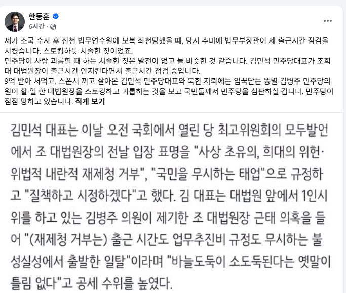
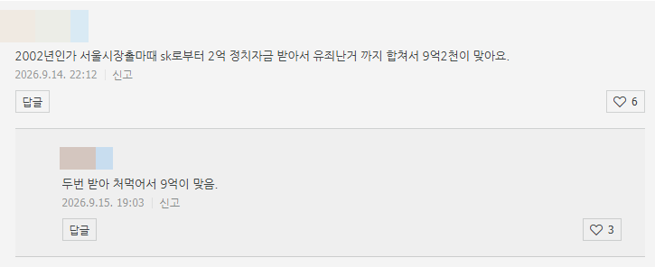
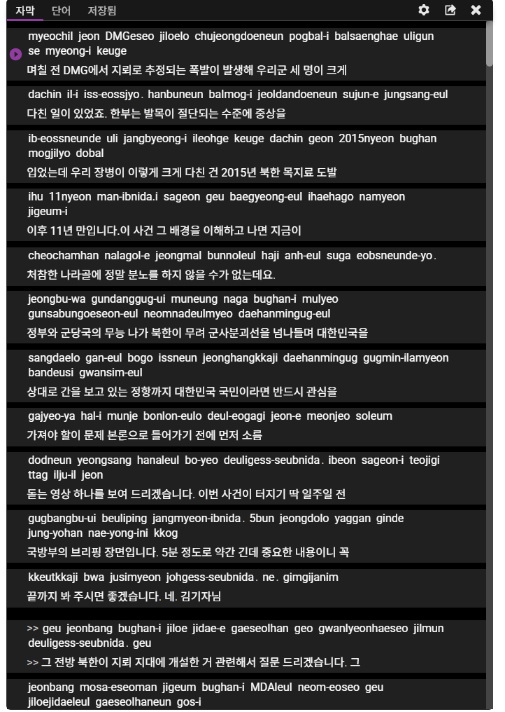

# 트래픽 블로그 2차 전직 하는 방법
**Date:** 21시간 전
**Category:** 스냅
**Original URL:** https://blog.naver.com/xpfkwh56/224421510323
---

1. **색깔 겁나 쌘 언론사** 하나를 고릅니다

​

넉넉히 하루 잡고, **헤드라인 카피만** 구경합니다

​

**\* 본문은 읽지 않아도 됩니다**

**​**

2. 중간은 없어요, 무조건 반정부/친정부

둘 중 하나를 **확실하게** 고르는 것이 중요함

​

정치 어젠더는 **주로?** 페북 중심으로 돌아갑니다

​

**\* 페북 자체가 연령대가 꽤 있는 걸로 보입니다**

**​**

​

3. 지금 보수 트래픽 효자는 이 분입니다

​

4. 보고 계시면서, 무슨 말이든 나오면

보고 있다가 블로그에다가 **중계** 하세요

​

제목 쓰는 방법은 다음과 같은 느낌입니다

​

**\* 헤드라인 카피 뽑는 문법과 똑같습니다**

​

*김민석 9억 받아 처먹고 스폰서 끼고 살았다는데 .. 한동훈 일침*

*김병주 대법원장 스토킹에 한동훈 "국민들이 심판할 것" 맹폭*

*민주당 대표가 감히 대법원장 출근시간을 점검?*

​

그리고 페북에 있는 내용 **고대로** 받아쓰기 한 다음에,

본인 코멘트 적당히 짧게 달아서 올리면 됩니다

​

예시가 불가피하게 투박한데, 정치 뉴스들

헤드 **계속** 보고 있으시면 감이 오실 것 임요

​

내가 정치 관심 없어서 뭐라고 쓸지 모르겠다? ,,

​

​

그럼 그 화제를 다루고 있는 사람들이

실제로 쓰고 있는 어휘를 찾아냅니다

​

딱히 아는 분은 아니고, 저도 방금 한동훈 으로

검색해서 나온 블로그 뒤져서 나온 타이틀 인데,

​

뭐라고 설명 하지 않아도,

대개 블로그 첫 화면만 들어가도

​

그 **'분위기'** 를 그냥 아실 겁니다

​

​

댓글 몇 개 읽으면 **'여론'** 이 읽힙니다

**​**

**\* 전체 여론이 아니고, 특정 사안에 대해**

**지지하고 있는 판세 정도만 읽으면 됩니다**

**​**

5. 이렇게 글을 50개 정도 쌓습니다

​

각 정당 유력 정치인들,

발언력 있는 사람들

위주로 돌리면 금방 채웁니다

​

**\* 정치/시사 뉴스는 쉬지 않고 나옴**

​

6. 블로그 통계 페이지 들어가면,

**99% 확률로** 40대 이상 남성층 나옵니다

​

부모님 네이버 블로그 계정 하나 만드시고,

낚시, 등산, 골프, 정치 포스팅만 **계속** 누르세요

​

제 경험상, 시간은 별로 안 중요했습니다

​

<https://www.youtube.com/@wonjaewoo>

[**호밀밭의 우원재**

글쓰는 우원재의 유튜브 채널입니다. 언론과 정계에서 일해왔습니다. 세상 돌아가는 일들을 비평합니다. 문의 & 제보 : wonjae.w@gmail.com

www.youtube.com](https://www.youtube.com/@wonjaewoo)

​

7. 그리고 **'그랬던'** 구글 계정으로

유튜브 들어가면 이제 이런 것 나옵니다

​

**\* 겁나 많음 ,,**

**​**

​

구글 자동자막 그대로 다운 받으시고,

​

**\* 영한 혼용한 이유는 AI 가 잘 읽으라고**

​

각 진영 스피커들이 하는 이야기 취합해서,

콘텐츠 찍어내시면 됩니다

​

**8. 이렇게 하라고 하는 이유**

​

1) 대부분의 이슈블, 뉴스블 같은 곳들은

천장이 낮거나 문제가 됩니다

​

제일 큰 문제가 **'네이버 정책'** 부분 인데,

​

2차 가공 콘텐츠를 어려운 말로,

**애그리게이션** 콘텐츠라고 부릅니다

​

이게 계속 모니터링 해보시면 되는데,

뿌리기만 하면 글이 1만개 2만개 쌓여도

​

하루 투데이는 **많아야** 3천, 5천 따리에요

​

그거라도 되면 좋은데, 하꼬 블로그로 돌리면

나중에 정책 걸려서 블로그 노출이 죽습니다

​

**\* 10개 이상 확인함**

​

죽는 이유는, 제 뇌피셜이지만

블로그에 포스팅은 많은데

​

실제 조회수로 이어지지 않고

발행량만 많으면 필터에 걸리는 것이

**​**

**가장 주요한** 원인으로 보입니다

​

이걸 해결하려면 확산이 잘 나와야 하고,

무엇보다 **'보이스'** 가 있어야 됩니다

​

2) 이슈만 쫓는 AI 속보

블로그들이 죽는 이유가 뭘까요?

​

**'논조'** 가 없다는 것이 문젭니다

​

모든 콘텐츠들이 다 프레임이 없으니까

양 측을 균형있고 매끄럽게 서술하고,

​

독자 입장에선 **'읽을 이유'** 가 없고,

봇 입장에선 **'스팸 문서'** 취급을 해요

​

**\* 제 생각에는 유대감 욕구로 읽는 것 같음**

**​**

근데 보통 사람들이 자기 정견은 있어도

그걸 막 대놓고 떠들 이유는 없고,

​

솔찌 맨날 밥 먹고 이거만 보는 사람 아니면

무슨 일이 났는지, 알빠 관심도 없는데

​

위 방식대로 하면 내가 정치/사회 **관심 없어도**

하나 붙들고 계속 트래픽 뽑는 것이 가능합니다

**​**

주의할 점은 **'가짜 뉴스'** 면 안 됩니다

​

**\* 기초적 사실관계가 아예 틀려버리면 안 됨**

**​**

안전하게 하시고 싶으시면 쏘는 족족,

미리 다 캡쳐 하시고 원문 잡아 두세요

**​**

**9. 정리**

​

1) 영향력 강하고 세일즈 되는

유력 정치인 고르고, 말 옮기세요

​

2) 중계 콘텐츠 쌓이면 논조 잡으세요

3) 논조 잡고나면 확장 하세요

​

2번 까지는 제가 해봤는데,

몇 천블 **순식간에** 갑니다

​

**\* 그리고 정치 소재는 타 카테고리 대비**

**이례적일 정도로 확산이 빠릅니다**

**​**

**아마 어른들이 지인들한테 보내거나,**

**단톡방 같은 곳에 뿌리는 걸로 보입니다**

**​**

3번은 제가 케이스 위주로 본건데,

​

저렇게 정치/사회 블로그로 시작 했다가

나중가면 **부동산 위주로** 가는 경우가 많습니다

​

피차 붙들고 있으면 경제

얘길 할 수 밖에 없기 때문에,

​

**기본 체급을 들고 시작할 수 있어요**

**​**

경제/비즈 블 운영하고 싶으면

정치/사회로 시작해서 전직 하세요

​

그게 쌩 경제/비즈 보다 효율적 임