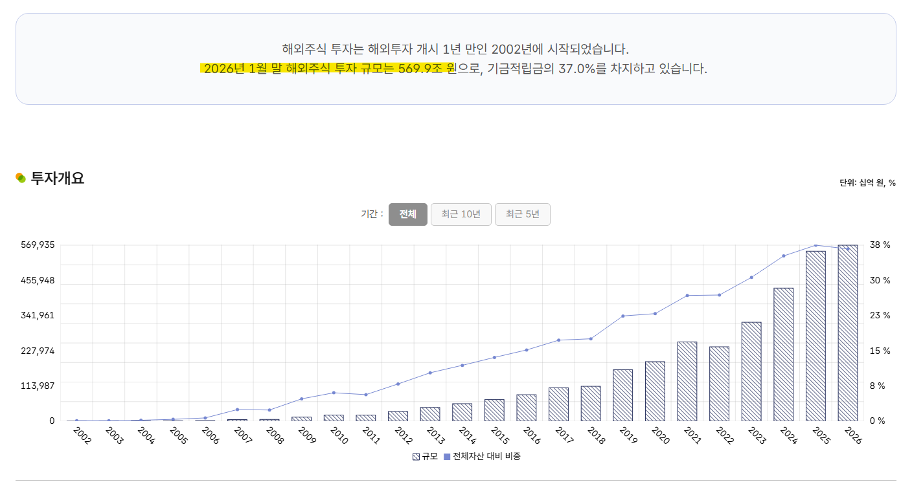

# 환율과 블라그 경제학
**Date:** 21시간 전
**Category:** 다이어리
**Original URL:** https://blog.naver.com/xpfkwh56/224268674036
---

<https://www.bok.or.kr/portal/bbs/B0000347/view.do?nttId=10095828&menuNo=201106>

[**외화자금시장에 달러는 많은데 환율은 왜 오르는 것일까?**

최근 외환시장에서는 ‘풍요 속의 빈곤’처럼 언뜻 이해하기 어려운 현상이 나타나고 있다. 외화를 빌리거나 빌려주는 시장(외화자금시장)에서는 싼 이자에라도 빌려주려는 주체들이 많아 달러가 풍부한 상황이다. 이에 반해 달러를 직접 사고파는 시장(현물환시장)에서는 달러를 팔려 하지 않고 사려고만 해서 원/달러 환율이 오르고(달러 값의 상승) 잘 떨어지지 않는다. 금융시장에서는 일반적으로 돈을 빌리기가 어려울 때를 위기라 하고 유동성이 메말랐다고 표현한다. 그러니 달러자금이 풍부해 싼 이자로 빌리기 쉬운 지금을 외환시장의 위기라고 부르기는 ...

www.bok.or.kr](https://www.bok.or.kr/portal/bbs/B0000347/view.do?nttId=10095828&menuNo=201106)

<https://www.bok.or.kr/portal/bbs/B0000347/view.do?nttId=10095936&searchCnd=1&searchKwd=&depth2=201106&depth=201106&pageUnit=10&pageIndex=1&programType=newsData&menuNo=201106&oldMenuNo=201106>

[**최근 유동성 및 환율 상황에 대한 오해와 사실**

원화 유동성이 과도하게 늘어 환율이 상승했다는 주장을 객관적으로 평가해 볼 필요 지난해 말 이후 원/달러 환율이 1,400원대 중후반으로 높아진 가운데 일각에서는 국내 유동성(M2)이 과도하게 늘어 원화 가치가 하락하였다는 주장을 지속적으로 제기하고 있다. 하지만 이 같은 주장은 실제 데이터와 현실에 부합하지 않는 것으로 여러 경로를 통해 확대 재생산되고 있으며 합리적이지 않은 환율 절하 기대를 촉발하는 부작용이 크기 때문에 이를 바로잡을 필요가 있다고 판단된다. 이하에서는 통화량 및 환율과 관련한 이러한 주장을 크게 네 가지 이....

www.bok.or.kr](https://www.bok.or.kr/portal/bbs/B0000347/view.do?nttId=10095936&searchCnd=1&searchKwd=&depth2=201106&depth=201106&pageUnit=10&pageIndex=1&programType=newsData&menuNo=201106&oldMenuNo=201106)

**​**

**1. 한은 오피셜 자료**

​

https://fund.nps.or.kr/oprtprcn/ivsmprcn/getOHED0005M0.do?menuId=MN24000618

​

**2. 국민연금 해외 주식 투자 규모**

​

<https://snapshot.bok.or.kr/dashboard/B2>

[**한국은행 금융·경제 스냅샷**

외채 및 외환보유액 외환보유액 현황 즐겨찾기 그래프 확대 데이터 다운로드 이미지 저장 주 : 1) IMF포지션은 회원국이 출자금 납입, 융자 등으로 보유하게 되는 관련 청구권 2) 외환은 유가증권(국채, 정부기관채, 회사채, 자산유동화증권 등)과 예치금 자료 : ECOS 단기외채비중 및 단기외채비율 즐겨찾기 그래프 확대 데이터 다운로드 이미지 저장 주 : 1) 단기외채비중은 단기외채/대외채무×100 2) 단기외채비율은 단기외채/외환보유액×100 자료 : ECOS 대외채권 및 장단기 대외채무 즐겨찾기 그래프 확대 데이터 다운로드 이미...

snapshot.bok.or.kr](https://snapshot.bok.or.kr/dashboard/B2)

​

**3. 외환 보유액**

​

<https://www.chosun.com/economy/money/2026/01/27/UQ6OZU2MMRCKVEJXOOYF476524/>

[**한은 통화정책국장 “돈 풀어서 환율 올랐다고? 경제 이해 못해서 하는 말”**

한은 통화정책국장 돈 풀어서 환율 올랐다고 경제 이해 못해서 하는 말 조선일보 머니 최창호 한국은행 통화정책국장 해외 증권 투자 확대가 원인

www.chosun.com](https://www.chosun.com/economy/money/2026/01/27/UQ6OZU2MMRCKVEJXOOYF476524/)

​

**4.** **최창호 한국은행 통화정책국장**

​

<https://news.einfomax.co.kr/news/articleView.html?idxno=4409416>

[**신현송 "환율은 재정확대만으로 움직이지 않는다"…정책 프레임 드러나 - 연합인포맥스**

신현송 한국은행 총재 후보자가 환율은 재정 확대만으로 결정되는 변수가 아니라 외환시장 수급과 글로벌 금융 여건의 영향을 함께 받는다는 인식을 밝히면서 향후 환율 대응 정책 프레임의 윤곽이 드러나고 있다...

news.einfomax.co.kr](https://news.einfomax.co.kr/news/articleView.html?idxno=4409416)

​

**5.** **신현송 한국은행 총재(진) 시절**

​

6. 결론

​

1) 환율 오르면 나라 망하냐?

​

망할 수도 있음

​

2) 그럼 지금 우리가 그 상황이냐?

​

아님

​

​

마음을 열고 잘 ,, 보면 ,,

의외로 별 차이 없는 얘기임