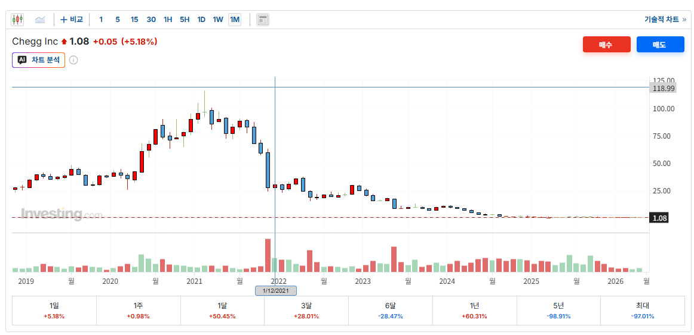
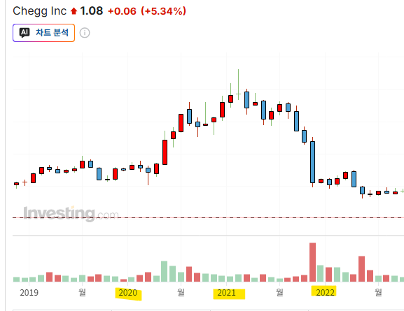
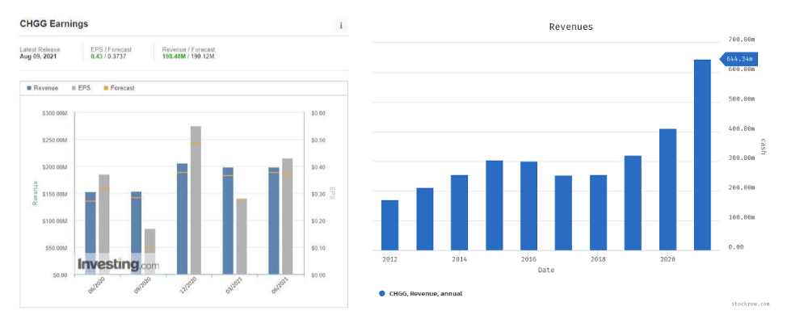
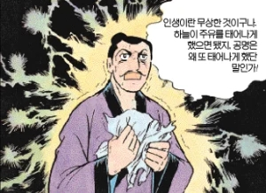
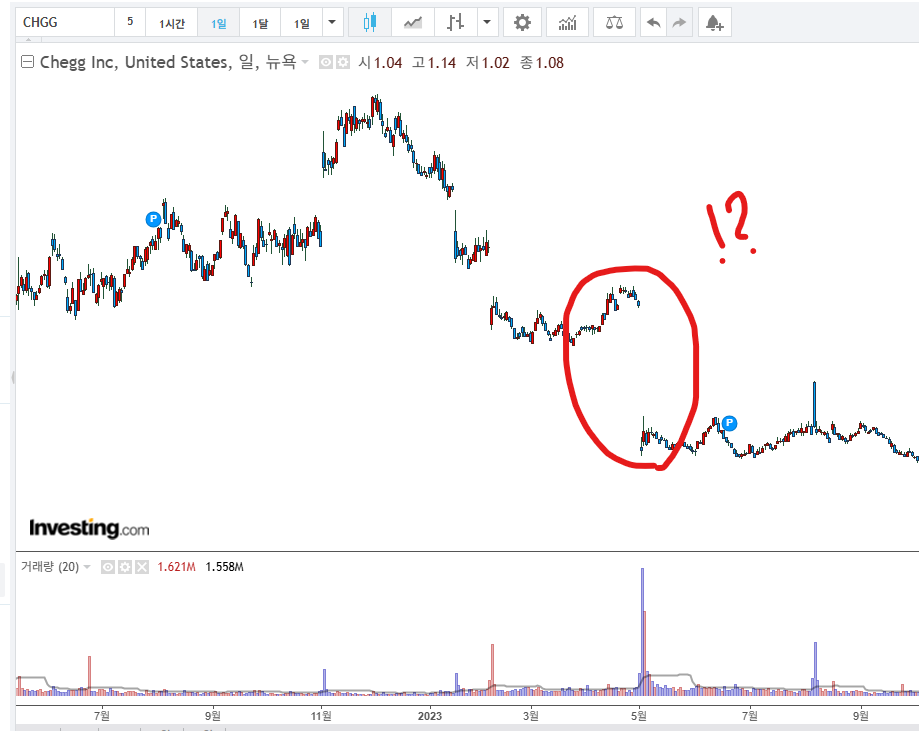
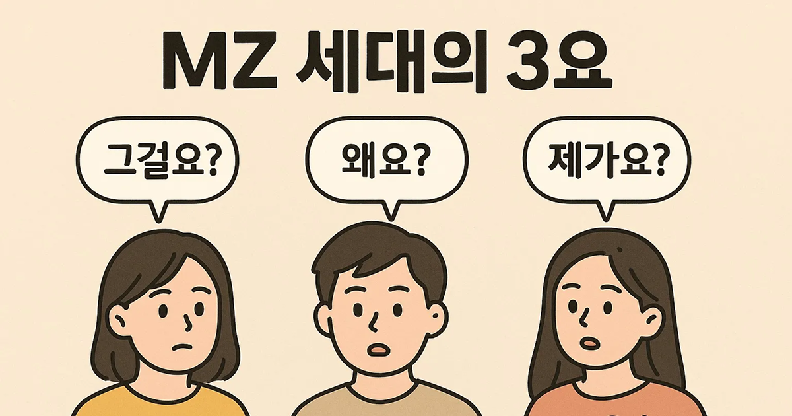
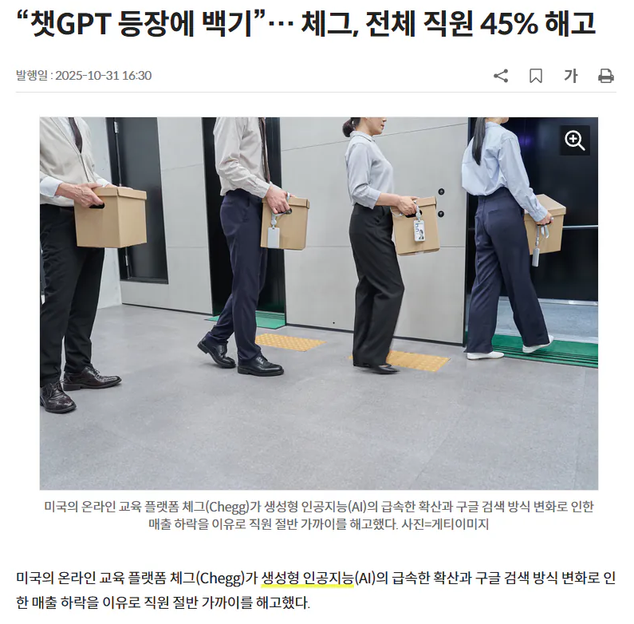
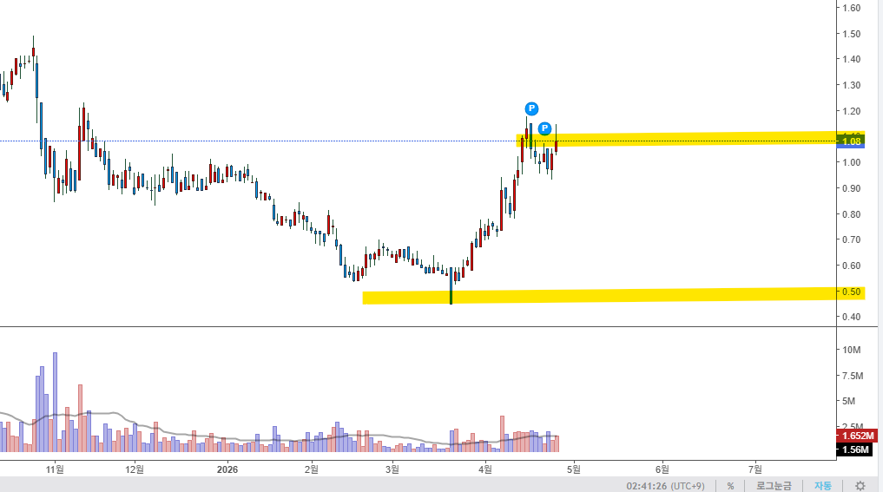
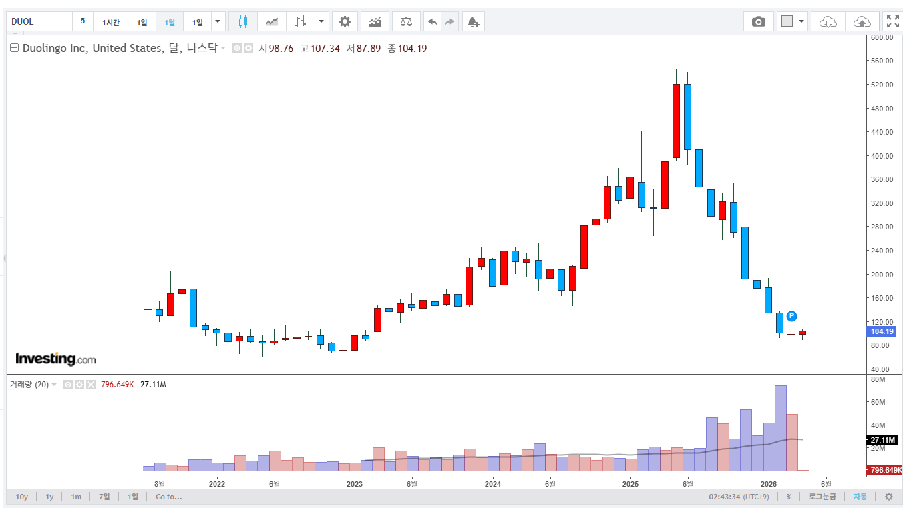
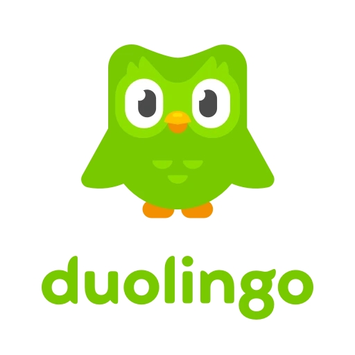

# AI 가 작살낸 기업
**Date:** 22시간 전
**Category:** 다이어리
**Original URL:** https://blog.naver.com/xpfkwh56/224267428484
---

​

1. Hoxy 몽골 광산에서 이차전지

필수재 라도 가져오겠다고 했는지

​

싶은, 이 회사의 이름은 chegg

​

현재는 고점 기준 **99%** 가 빠졌음

​

무슨 일이 있었길래,

대체 이 난리가 난 걸까?

​

<https://www.chegg.com/about/what-we-do/>

[**What We Do - Chegg**

What We Do We put students first Millions of people all around the world learn with Chegg. No matter the goal, level, or style, Chegg helps learners learn with confidence. We provide 24/7 on-demand support, and our personalized learning assistant leverages the power of artificial intelligence (“AI”)...

www.chegg.com](https://www.chegg.com/about/what-we-do/)

​

알아듣기 난해한 설명이지만,

사업내용을 간단히 정리하면

​

교재를 디지털화 해서 대여하고,

​

공부하다가 모르는 부분이 있으면

전문가들에게 질문할 수 있는

구독 서비스를 파는 교육 회사 임

​

지나고 보면, 씹스캠

과부 제조기로 보이지만

​

불과 20-22년 당시에만 해도

전도유망한 평가를 받았는데,

​

​

코로나 기점으로, 비대면 교육이

특수를 타며 크게 주목받은 기업임

​

여기나 미국이나

**'교육'** 이라는 테마 특성상,

​

생활비는 아껴도 교육비는

안 아끼니까 미래가 좋을 것이다

라고 평가하는 사람이 많았음

​

​

단지 비전만 있는 것도 아니었는데,

체그의 마진율은 **'66%'** 에 달했고,

​

21년 기준 전년 동기 매출액은

**30%**, 영업이익은 **21%** 증가함

​

벨류에이션이 **쪼-끔** 높긴 했지만,

​

1) 시장 점유율이 높고,

2) 마땅한 대체재가 없고,

3) 서비스 전환 비용이 있고,

​

4) 꾸준히 돈을 벌고 있으며,

5) 한탕 기업도 아니고,

6) 성장까지 견조한데다가,

​

7) 본업 내팽개치고, 갑자기

딴 길에 관심 보이지도 않고,

​

8) 사업 모델도 이해하기 쉽고,

9) 실제 이용자 피드백도 좋은 등,

​

**'좋은 회사니까 당연히 비싸지'**

가 적용될 수 있는 기업에 속했음

​

2. 문제는, 22년에 GPT 가 나옴

​

​

투자자들도 코로나 이후에,

​

기존보다 어느 정도 정체될 것이라

짐작하긴 했지만 GPT 같은

**대재앙** 이 있을 줄은 알 수 없었음

​

학생들은 질문이 있으면 그냥

지피티에다가 딸깍 물어봤었고,

​

굳이 체그에 **돈을 낼 필요도**,

**이용할 필요도** 없어지게 된 것임

​

부자는 3대도 간다는 말이 있듯이,

​

최악의 업황에서도 그 와중에 체그를

꾸준히 쓰는 힙스터들이 있긴 했는데

​

**\* 요즘 시대에 블로그 하는 우리들처럼**

​

​

23년에 CEO가 직접 체그 쓸 필요 있음?

GPT 쓰면 답변 잘 나오는데, 라는 취지의

​

무슨 생각인지 알 수 없는 실언을 하면서

**-50% 갭떡락** 을 맞는 악재까지 겪는 등,

​

꾸준히 전망은 나빠지고만 있었음

​

존버는 이긴다고 생각했던 사람들이나,

무한 물타기 전략을 사용했던 사람이면

​

하늘이, 세상이 그저 야속했을 것임

​

아예 손 놓고 있던 것만은 아니고,

​

자기들이 기존에 갖고 있던

학습 데이터를 바탕으로

AI 시대를 대응한다고 했는데,

​

**\* 우리가 가진 교육 도메인 데이터를**

**빅테크에서 사거나, 요긴하게 쓸 것!**

**​**

**​**

체그가 만만히 대응하기엔

시대의 격량이 너무 높았고,

​

수집되는 데이터의 양과 질 모두,

빅테크 AI 가 압도적이었기 때문에

​

​

3년 만에 전 직원의 45%를 해고,

그렇게 사양길로 접어들게 되었음

​

저점 대비 +100%

​

지금은 **'야수의 주식'**,

**'사나이들의 진검승부'**

​

같은 종목이라 보면 됨

​

​

비슷한 기업으로는,

​

​

예전에 한참 광고 많이 나오던

**듀오링고** 라는 기업이 있는데

​

외국어 공부를 쉽고, 편하게

그리고 이 경우는 **'심지어'**

​

인공지능 빅데이터 기술을 써서,

효과적으로 할 수 있게 하는 쪽임

​

**그럼 얘네는 어쩌다 저리 된 걸까?**

​

<https://youtube.com/shorts/mJW95qIn9CI?si=NbPvzyjizPivOZO2>

​

**위에 있는 영상에 나오는 아쟈씨는**

**실제로 영어, 일본어를 하지 않았음**

​

> 전부 AI 로 다국어 더빙을 한 것임

​

그리고 이건 **'무려'**,

**'2년 전 기술'** 임

​

유료도 아니고, **'무료'** 기술임

​

<https://www.heygen.com/ko-kr>

[**무료 AI 동영상 생성기: AI로 놀라운 동영상을 제작하세요**

HeyGen으로 당신의 아이디어를 AI 영상으로 만들어 보세요. 텍스트, 이미지 또는 오디오를 입력하면 내레이션, 자막, 시각 요소, 애니메이션이 모두 포함된 완성형 영상을 손쉽게 제작할 수 있습니다.

www.heygen.com](https://www.heygen.com/ko-kr)

​

해당 서비스를 똑같이 써보고 싶으면

위 사이트에 들어가서 시도 해보면 됨

​

**3. 결론**

​

1) 주식판 클리셰 멘트 믿지 마라

열에 아홉은 **입맛대로** 고른 문구들임

​

2) 적어도, **'교육'** 파트 정도는

그리고 최근 들어 **'디자인'** 쪽은

전망이 좀 어두워졌다고 봐도 됨

​

**\* 개인적으로는 사진관 이나**

**스튜디오도 얼마나 갈까? 싶음**

**​**

사족이지만, 중국 시장 기준으로

​

생성형 AI 영상 기술을 갖고 있는

개인들이 **기존의 광고 시장 파이** 를

무섭게 갉아먹고 있는 상태인데,

​

**\* 이미 기술은 평준화 된 시점이고,**

**누가 더 빨리, 싸게 뽑냐로 재편 중**

**​**

컴퓨터만 어느 정도 만질 수 있으면

​

유럽 풀 로케이션 광고를 1/10 가격?

1/100 가격에 찍을 수 있기 때문에

​

이거도 차마 경쟁이 안 되는 상태임