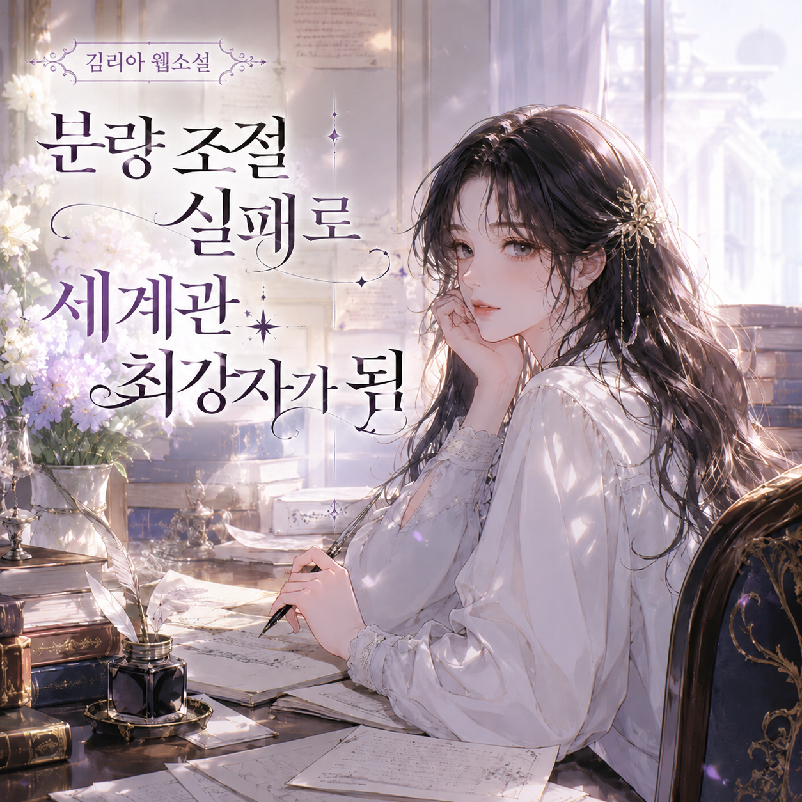

# 분량 조절 실패로 세계관 최강자가 됨
**Date:** 22시간 전
**Category:** 행운과 재능
**Original URL:** https://blog.naver.com/xpfkwh56/224311274811
---

​

한 여자가 맨체스터에서 런던으로 가는 기차에 타고 있었다.

​

하필 운이 없게도 기차가 무려 네 시간이나 연착됐다.

​

꼼짝없이 갇힌 그 지루한 시간, 그녀의 머릿 속에 번뜩 영감이 떠올랐다.

​

자기가 마법사인 줄도 모르는, 안경을 쓴 소년의 이야기.

​

기억을 놓치지 않으려고 했지만 하필 그 순간에 펜이 없었다.

​

빌려서 적으면 좋았으련만 수줍음이 많아 누구에게 말도 꺼낼 수 없었다. 그래서 그녀는 그냥 기차에 있는 시간 내내, 머릿속으로 그 이야기를 상상하고 또 상상했다.

​

펜이 없어 적지 못한 덕에, 오히려 그 세계가 머릿속에서 더 생생하게 자라났다.

​

그날 새벽부터 그녀는 글을 쓰기 시작한다.

​

하지만 이 작은 공상이 한 권의 책이 되기까지는, 그 뒤로도 무려 7년이라는 길고 긴 시간이 필요했다.

​

마법사 소년의 이야기를 적어보겠다고 구상한 바로 그 해, 그녀의 어머니가 다발성 경화증으로 세상을 떠났다.

​

그녀는 깊은 상실감을 느꼈다. 새 출발을 하고 싶었던 그녀는 포르투갈로 건너가 영어를 가르쳤고, 거기서 결혼해 딸 제시카를 낳았다.

​

하지만 안타깝게도 그녀의 결혼 생활은 짧게 끝난다.

​

3년 뒤, 그녀는 갓난 딸을 안고 영국에 돌아왔다. 직업도 없고, 돈도 없었다.

​

정부 지원금으로 겨우 딸과 입에 풀칠을 했고, 심각한 우울증에 시달렸다.

​

남부럽지 않은 명문대를 나온 그녀가, 불과 서른도 안 된 나이에 이혼한 무직의 싱글맘이 된 채로 정부 지원금에 기대 사는 처지가 되었다.

​

가난한 싱글맘은 잠든 아기 곁에서 한 줄씩 이야기를 적어 내려갔다.

​

마침내 원고가 완성되었지만, 그 뒤가 진짜 시작이었다.

​

출판사들은 아이들이 읽기엔 너무 길다는 이유로 번번이 거절했다.

​

한 곳, 두 곳, 무려 열두 곳의 출판사가 이렇게 말했다.

​

아동책은 돈이 안 된다, 팔기 어려울 것 같다, 너무 길다.

​

무명의 가난한 싱글맘이 쓴 장편 판타지 소설은, 아무도 거들떠보지 않았다.

​

그녀가 가진 거라곤 두툼한 원고 뭉치, 그거 하나뿐이었다.

​

마침내 열세 번째. 블룸즈버리라는 작은 출판사가 손을 내밀었다.

​

출판사 편집자가 원고를 여덟 살짜리 딸에게 보여줬는데, 그 아이가 첫 장을 읽고 즉각 문장에 빠져 들었다.

​

단 한 명, 그 어린 독자의 반응이 결정적인 계기가 되었다.

​

다만 출판사는 남자 아이들이 여성 작가의 책은 안 읽을 것이라며, 그녀에게 본명 조앤 대신 이니셜을 쓰라고 했다.

​

중간 이름이 없던 그녀는 할머니 이름 캐슬린에서 K를 빌려와 J.K. 롤링이 됐다.

​

1997년, 해리 포터와 마법사의 돌이 세상에 나왔다. 출판이 확정되었을 때, 편집자는 롤링의 딱한 사정을 알고, 아동책으로는 먹고살기 힘드니 다른 직업을 구해보는 것이 좋다고 충고했다고 한다.

​

결과는?

​

해리 포터가 어린왕자보다 많이 팔린 책이 될 줄은, 아무도 몰랐다.

​

그로부터 10년 뒤, 롤링은 하버드 대학 졸업식 연설에 섰다.

​

주제는 실패가 준 혜택.

​

롤링은 말했다. 오늘 자신을 있게 만든 것은, 실패가 비본질적인 것을 걷어내 주었기 때문이라고.

​

모든 게 무너지자, 이제 더 이상 자신이 아닌 다른 무언가인 척할 필요가 없어졌다고.

​

남들에게 어떻게 보일까, 무엇을 더 가져야 할까 하는 온갖 곁가지가 다 떨어져 나가고, 정말 중요한 단 하나.

​

자기가 진심으로 하고 싶었던 것. 바로 글쓰기만 남았다고 말했다.

​

가장 두려워하던 일이 이미 현실이 되어버렸기에, 오히려 자유로워졌다고.

​

그래도 자신은 살아 있었고, 사랑하는 딸이 있었고.

​

낡은 타자기 한 대와 커다란 이야기 하나가 있었다고.

​

그리고 내가 발을 딛고 있는 그 바닥이, 나의 삶을 새롭게 세운 단단한 토대가 되었다고 말했다.

​

우리는 보통 실패를 잃는 것으로만 여긴다.

​

그러나 롤링은 실패가 동시에 우리를 걷어내 준다고 말했다.

​

우리가 평소 붙들고 있는 것들, 체면, 남의 시선, 이것저것 다 잘해보려는 욕심 같은 것들은 사실 대부분 필수적이지 않은 것들이다.

​

모든 게 무너지는 바닥에 닿으면, 그 비본질적인 것들이 다 떨어져 나가고, 진짜 중요한 것만 앙상하게 남는다.

​

역설적이게도, 그 앙상하게 남은 것들이야말로 반드시 있어야 할 토대가 된다.

​

물론 가난과 실패를 애써 경험할 필요는 없다. 롤링도 분명히 말했다. 가난은 두려움과 스트레스와 수많은 굴욕을 동반하며, 그걸 낭만적으로 포장하는 건 바보들이나 하는 짓이라고.

​

바닥은 결코 아름답지 않다. 그 시절의 롤링은 우울증으로 고통받았고, 그 고통은 실존했다.

​

우리가 그녀에게 배울 건 바닥에 떨어져 보는 경험이 아니라, 이미 바닥에 놓여진 사람이 가져볼 수 있는 관점이다.

​

바닥은 끝이 아니라, 더 이상 떨어질 곳이 없는 단단한 땅이기도 하다.

​

공중에 떠 있을 때는 발 디딜 곳이 없어 불안하지만, 바닥에 닿으면 비로소 내게 다리가 있음을 느낄 수 있다.

​

무너진 자리에서 진짜 길이 보이듯, 모든 게 무너진 그 자리야말로 새로 쌓아 올리기 가장 좋은 토대일 수 있다.

​

롤링이 차가운 카페를 지나 호그와트에 도착했을 때, 우리에게 묻는 질문은 다음과 같다.

​

내가 지금 인생의 바닥에 있다고 느낀다면, 그저 바닥을 끝으로만 보고 있는 것은 아닌지, 모든 게 무너진 그 자리에서, 오히려 본질이 아닌 것들이 걷어내지고 정말 중요한 것 하나가 또렷해지지는 않았는지.

​

본인은 가장 큰 실패자라고 자신을 내몰던 한 싱글맘은, 낡은 타자기 하나와 안경 쓴 남자아이 이야기 하나만 들고 그 바닥에서 다시 일어섰다. 자신의 두 발로 일어난 그녀는 말했다. 그 바닥이, 내 모든 것의 토대였다고.