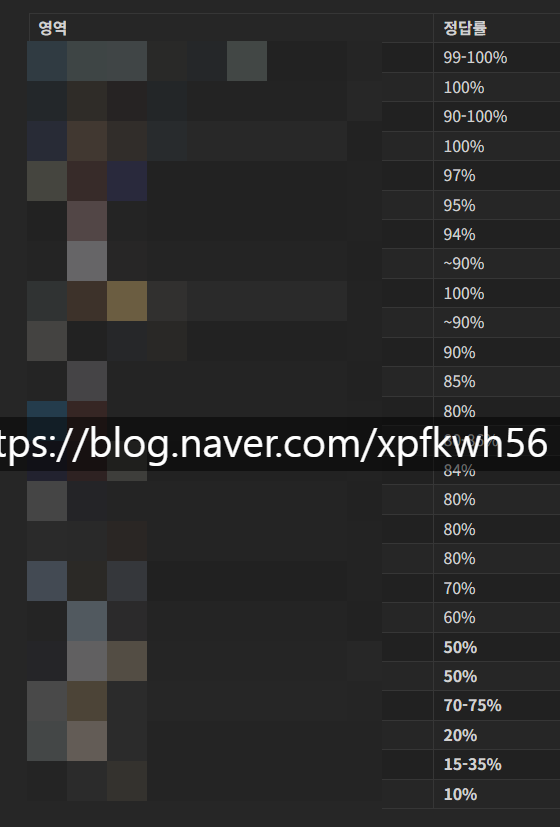
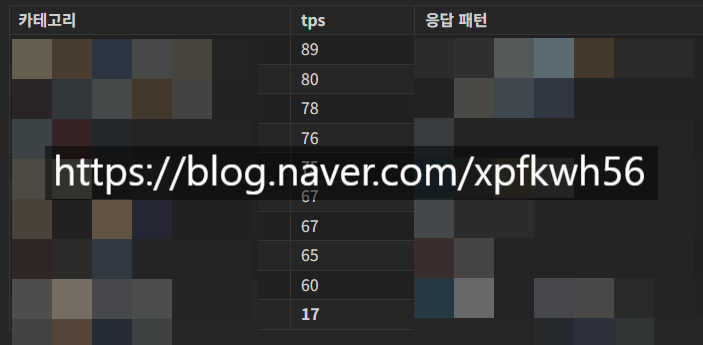
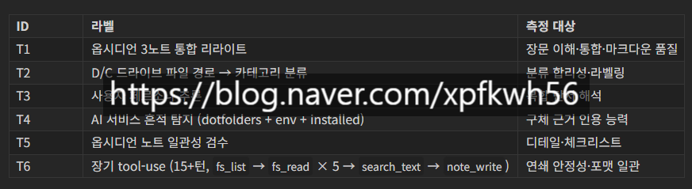

# 잉공지능 물어봐도 답을 할 수 없는 이유
**Date:** 22시간 전
**Category:** 다이어리
**Original URL:** https://blog.naver.com/xpfkwh56/224297468907
---

1. 이하는 똑같은 모델을 똑같은 사람이

똑같은 환경에서 돌렸을 때 생기는 일임

​

일반적으로 **'양자화'** 가 일어나면,

모델 성능이 감소한다고 알려져 있고

​

**'무검열'** 모델을 사용하는 경우 는

​

강제로 뇌를 꺼냈다 뺐다 하는 일이라

성능 저하가 더 크게 일어난다고 알려짐

​

2. 국민 벤치로 쓰는 AIME 26 에서

​

idx=9 문항에 대해 제가 했던

4가지 조건의 응답 비교 임

​

1) thinkOFF, max\_tok=4k

​

in(2B - \theta) = \sin 2B \cos \theta - \cos 2B \sin \theta$. $\sin(2C - \theta) = \sin 2C \cos \theta - \cos 2C \sin \theta$. Sum $\Sigma = 3 \sin \theta + \cos \

​

토큰 제한으로 중단

​

2) thinkON, max\_tok=32k

​

Share vertex $A'$. So $A'C$ does not intersect any other edge except at vertices. $C'B$ connects 288 and 205. $B'A$ connects 168 and 104

​

$AA'$ connects 104 and 67. $CC'$ connects 325 and 288. $BB'$ connects 205 and 168.

​

← 이 시점에 32k 도달, 잘림

​

3) thinkON, max\_tok=64k, 공식 sampling

​

3. $\angle COC' = |\phi| \approx 74$. $\sin 74 \approx 0.96$. 4. $\angle C'OB = |\theta\_B - \theta\_{C'}| \approx 46$. $\sin 46 \approx 0.72$. 5. $\angle BOB' = |\phi| \approx 74$. $\sin 74 \approx 0.96$. 6. $\angle B'OA = |\theta\_A - \theta\_{B'}| \approx 33$. $\sin 33 \approx 0.54$. Sum of sines: $0.96 + 0.875 + 0.96 + 0.72 + 0.96 + 0.54 = 5.015$. Wait, previously I calculated sum of sines as 5.002. Let's check angles again. $\phi = 180-2C

​

64k 도달, self-check 중 잘림

답 직전인데 한 번 더 검증하다 끝남

​

4) thinkON, max\_tok=128k, 공식 sampling

​

$3 \cos C = 3(0.6) = 1.8$ $2 \cos(B - A) = 2(\cos B \cos A + \sin B \sin A) = 2(25/65 · 33/65 + 60/65 · 56/65)$ $-\cos(3C) = -(4 \cos^3 C - 3 \cos C) = -(4(0.216) - 1.8) = 0.936$ Sum ≈ 1.8 + 1.9811 + 0.936 = 4.7171 The total area is: S = (1/2)(65/8)² · 4.7171 = (4225/128)(4.7171) = 155.7 The integer closest to 155.7 is 156. \boxed{156}

​

**정답**

​

3. 64k 조건에서는 64k 다 쓰고도 못 푼 문제를,

128k 조건에서는 35k 만 쓰고도 정답을 맞혔음

​

이처럼 **'직관'** 이랑 반대로 가는 일이 **너무** 많음

​

**4. 서빙 레시피**

​

Model: Huihui-Qwen3.6-27B-abliterated-NVFP4-MTP

Quant: NVFP4 (W4A4)

Serving: vLLM 0.21.0

--max-num-seqs 1

--kv-cache-dtype fp8

--max-model-len 131072

--gpu-memory-utilization 0.90

--speculative-config '{"method":"mtp","num\_speculative\_tokens":2}'

--chat-template chat\_template\_froggeric.jinja

Hardware: RTX 5090 (Blackwell sm\_120), 32GB VRAM, WSL2 Ubuntu

Proxy: enable\_thinking=False

​

lm-eval run \

--model local-chat-completions \

--model\_args base\_url=[http://localhost:XXXX/v1/chat/completions,model=qwen36-mtp-vlm,num\_concurrent=1,tokenized\_requests=False,max\_retries=2,timeout=300 \](http://localhost:8012/v1/chat/completions,model=qwen36-mtp-vlm,num_concurrent=1,tokenized_requests=False,max_retries=2,timeout=300%C2%A0%5C)

--apply\_chat\_template \

--gen\_kwargs temperature=0.0,max\_gen\_toks=2048 \

--log\_samples \

--tasks <task\_name>

​

lm-eval 버전: 0.4.12

--apply\_chat\_template

temperature=0.0: greedy

​

Model: Huihui-Qwen3.6-27B-abliterated-NVFP4-MTP (vLLM 0.21.0, NVFP4)

​

| Benchmark | Score | Stderr | n | Method |

|------------------------|---------|----------|-------|------------------------------|

| GSM8K | 97.19% | ±0.45 | 1319 | 5-shot, exact match |

| MMLU-Redux (generative)| 87.77% | ±0.44 | 1500 | 0-shot, exact match |

| IFEval (inst\_loose) | 92.69% | N/A | 541 | Rule-based |

| MBPP | 81.00% | ±1.76 | 500 | 3-shot, pass@1 |

| HumanEval | 93.29% | ~±2 | 164 | 0-shot, pass@1 (custom) |

| ARC-Challenge (chat) | 85.07% | ±1.04 | 1172 | 0-shot generative + sys\_inst |

| MMLU (generative) | 85.26% | ±0.29 | 1000 | 0-shot generative + sys\_inst |

​

환경 매니페스트

​

vllm==0.21.0

lm-eval==0.4.12

torch==2.10.0+cu128

flashinfer-python==0.6.8

transformers==5.6.0.dev0

​

gsm8k.yaml, mbpp.yaml 등

lm-eval 내장 그대로 돌림

​

GSM8K 97.19% ±0.45%p 1,319 exact\_match (정수 정답

MMLU-Redux generative 87.77% ±0.44%p 1,500 exact\_match (A-D letter)

IFEval (inst\_level\_loose) 92.69% N/A 541 규칙 기반 결정적 (length/keyword/format 검증)

MBPP (pass@1, 3-shot) 81.00% ±1.76%p 500 코드 unit test 통과

HumanEval (pass@1, custom) 93.29% ~±2%p 164 코드 unit test 통과 (custom rescore)

​

**5. 님아 이게 뭔데요?**

​

4 bit 양자화 에다가 무검열 모델 인데,

27b 모델 카드 벤치 공식 점수 대비할 때

​

**'최대'**, **'2%'** 차이 난다는 뜻 임

​

속도는? tps 75/s 정도 나옴

​

**\* 프론티어 속도급**

​

근데 더 중요한 사실은 뭐냐면,

​

만약 나 자신에게 variance 개념이 없으면

모르면 맞아야지 가 된다는 것 임

​

**6. 벤치가 전부가 아니잖아요?**

​

맞는 말임

​

​

그래서 제 실사용 목적에 맞게끔,

​

제가 벤치 문제를 직접 만들었고

​

가동 조건 없이 외부 환경 배제된 채로

실질적인 문제 해결을 테스트 하고,

​

개선할 수 있는 상태로 쓰는 법을 찾음

​

​

굳이, 예를 들어 어떤 것들을 시키냐면

​

​

이런 작업들로 테스트를 하는 편 임

​

7. 똑같은 수학 문제를, 똑같은 모델한테

또는 인공지능 모델들한테 풀게 시켰는데,

​

**왜 누구는 풀고, 누구는 못 풀게 되나요?**

​

1) 본인이 풀 수 있는 문제만 시킬 수 있고,

2) 내가 **'가르칠 수 있는 것만'** 가르칠 수 있음

​

근데 지금 이런 경험을 하고

사는 사람이 **아주 적기 때문에**,

​

본인이 뜻이 있으면 로컬 돌려 보면서

최대한 경험을 많이 쌓아보라 권유하는 것임

​

**8. 어디서 못 배우나요?**

​

제가 5090 400-500

할 때는 약을 굉장히 팔았음

​

그리고 그 당시에는 cpu 좋은 것 살 필요 없다,

​

ram 도 굳이 AI 연산에 도움 잘 안되니까

gpu 만 좋은 것 사서 달면 된다 얘기가 많았음

​

**'본인이 해보는 것'** 아니면 알 수가 없습니다

​

위에 있는 이야기 보고, 본인이 본인 컴퓨터에서

똑같은 기계들고 돌려도 **20%P 씩 요동 칩니다**