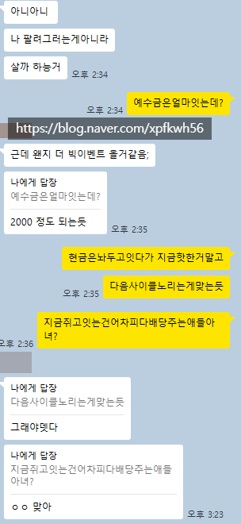
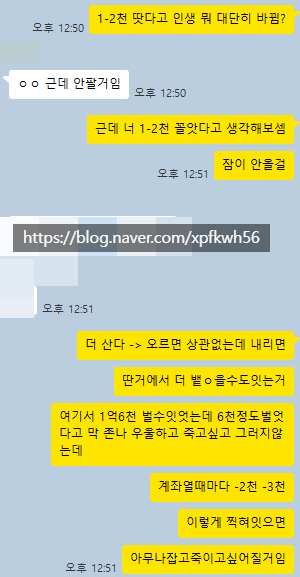

# 두 가지 대응
**Date:** 23시간 전
**Category:** 다이어리
**Original URL:** https://blog.naver.com/xpfkwh56/224208312623
---

​

**1. 딱히 급한 상황은 아니다**

​

그냥 현찰 들고, 어차피 사이클 도니까

다음 섹터가 어딘지 꾸준히 관찰하기

​

**2. 난세는 내가 원하던 무대다**

​

고변동성은 많은 사람들의 팔자를 바꿈

​

뛰어들어서 살아남으면

10년 농사 끝낼 수 있음

​

**3. 내 생각**

​

문통이 좋은 대통령은 아니었다고 생각하지만,

​

그래도 내가 문통을 마냥 깔 수가 없는 것이

코로나 유동성 폭발로 팔자 바뀐 것이 나 임

​

**\* 많은 수요의 증가는 거의 대부분 옳다**

**​**

심지어 나는 첫 물결을 탄 케이스도 아니구,

가까스로 막차 얻어탄 정도 밖에 안 되는데

​

그거로 나 + 내 주변 인생 100년이 바뀜

​

**\* 돌아봐도, 참 그 시절 열심히 살았음**

**​**

지키기 어렵다는 것도 맞는 말이지만,

적어도 경제력 이라는 스텟 안에서는

​

일정 궤도에 오르면 유리하기도 유리하고

다른 게임이지만 잘 내려가지도 않는데

​

**\* 자기 수양이 잘 되었다는 전제 하에서**

​

내가 시장을 오래 봐서 그런 것인지,

배가 부른 것인지 **뛰어들** 엄두는 안 남

​

코스피가 1만을 찍고, 서울

부동산이 평당 몇 십억을 찍어도

​

**몰라야** 살 수 있지,

봤던 사람은 손이 안 나감

​

**\* 아는데, 모르는 경지는 아주 어렵**

​

삼전 분할 전, 10만 전자 시절,

5만 전자, 20만 전자 다 본 사람이

n0% 빠졌다고 15에 들어간다? ,,

​

**내가 5를 봤는데? ,,**

​

20대 시절에 만나던 전남친들

다 전문직 이었는데, 30살 땡 찍었다고

바로 눈 낮춰서 어떻게 만나냐 이거

​

머리론 알아도 가슴이 안 따라감

​

→ 그래도 시집 가려면 만나야지

하면 사는 것이고,

​

**\* 행복한 미혼보다**

**행복한 기혼이 낫다**

**​**

→ 그냥 혼자 살지 뭐 하면

집에서 개, 고양이 키우면서

취미 생활 하고 지내는 것

​

**\* 불행한 기혼보다**

**불행한 미혼이 낫다**

​

​

**4. 그럼 비싸다고 숏?**

​

숏충이 네임드도 2년인가, 3년 예측 빨라서

파산 직전까지 갔다가 간신히 살아 돌아왔음

​

드럼 치듯이, 인공지능 같은 기술이나 숙달하고

집에서 육아하고 살림이나 하면서 5년, 10년 뒤

​

내 다음 파도 기다리는 것이 차라리 더 낫다고 봄