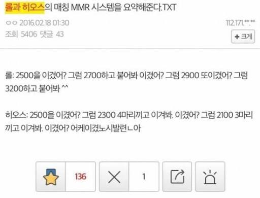

# 알아도 몰라도 그만, 네이버 블로그 트래픽 팁
**Date:** 23시간 전
**Category:** 일기장
**Original URL:** https://blog.naver.com/xpfkwh56/224382775975
---

1. 블로그 랭크는 **후행성** 이다

​

즉, 어떤 **'조건'** 에 부합하는 블로그가

상위 노출에 들어가고, 정석이 있어서

그걸 따르면 **'결과'** 를 얻는 것이 아니고,

​

**'많은 결과'** 를 얻은 블로그가

**'더 많은 트래픽을 점거하는 구조'** 다

​

놀랍게도, 이건 **'IR'** 이라고 부르는

컴퓨터 전공자들이 배우는 3학점 짜리

교과서에 나오는 **'당연한'** 이야기고,

​

심지어 전부도 아니고 **'극히 일부'** 임

​

검색노출 알고리즘, SEO 가 궁금하면

유튜브, 블로그 뒤적거릴 것이 아니고,

​

교과서를 보는 것이 가장 빠를 확률 높음

​

**\* 내 영역을 좁히면 좁힐수록,**

**나중에는 볼 교과서도 없어짐**

**​**

한편, 블로그만 그런 것이 아니고

**'대다수'** 의 알고리즘 체계가 그러함

​

이는 모든 LLM 이 기본적으로

패턴 학습 자판기인 것과 똑같음

​

유튜브/인스타그램의 경우,

초기에 계정에 트래픽을 **할당** 함

​

2. 예를 들어,

​

계정을 새로 만들면 **광고비도 안 냈는데,**

공짜로 콘텐츠를 특정 값 만큼 노출 시킴

​

**\* 사람들 눈에 띄려면 돈을 내야 됨**

**이 바닥은 관심을 돈으로 바꾸기 쉬움**

​

​

너 10명 보여줄게, 10명이 좋아해?

그럼 20명 보여줘볼게

20명이 좋아해? 그럼 100명,

​

100명, 10000명, 10만명

어케햇노 시발련ㄴ아

​

가 되는 **구조** 라는 것임

​

기본적으로​ **'절대 평가'** 가 아니고,

​

증권 시장 처럼 아주 복잡한 상호작용을

계속 상호적으로 서로 반복하는 것이라서

​

뭔가 **'배워서'** 할 수 있는 영역이라기보단,

​

**1) 하면서 되거나,**

**2) 될 사람 이거나** 둘 중 하나일 확률 높음

​

그럼 그렇다고 **아예** 몰라도 되냐?

​

변호사랑 무속인은 매우 유사하지만,

​

무속인 자격과 변호사 면허를

1:1 로 잡을 수 없는 것 처럼

​

똑같은 무속인이라도 아예 구라 100 보다,

​

진리 99 에 비진리 1 을 섞을 때

훨씬 더 파괴력 있는 것처럼

​

이런저런 잡기술도 알아서 나쁠 건 없음

​

문제는 그걸 내가 **'분별할 수 있느냐'** 인데,

​

고기를 본인이 먹어봐야 파악할 수 있으니

초보자는 열심히 해보는 것 말곤 답이 없음

​

**3. 저품질 블로그의 진실**

​

API 호출 이라는 것이 있음,

​

지금도 여러 홈페이지들에 들어가면

그 사이트에 있는 정보들을 무료든,

유료든, 허락을 받았든 아니든 간에

​

들어가서 가로채거나, 호출할 수 있음

​

예전에 어떤 일이 있었냐면,

​

> **그게 정확히 뭘 의미하는진 모르겠지만**

​

남의 네이버 블로그에 있는 특정 API 를

호출하면 등급, 숫자가 나왔던 적이 있음

​

그래서 사람들이 그걸로 준최, 최블, 등

적당한 표현을 불러서 부르기 시작 했고,

​

일찌기 개발밥 먹던 사람 중에 이런 것이 있다

라는 것을 안 사람들은 그걸 가져다가,

​

사람들한테 **블로그 평가 서비스** 라고 팔았음

​

여기서 공급자들의 반응한 것이 다름

​

1) 살 빠지는 약 먹는 사람들과 뭐가 다르지?

그냥 사기꾼이 호구를 잡아먹는 시장이다

​

**위정척사파** 임

​

2) 저게 정확히 최적화 블로그를 의미하나?

그건 몰라, 근데 의미가 없진 않은 것 같아

​

**온건개화파** 임

​

​

3) 애초에 최블 자체가 무근본 인데,

그냥 내가 기준을 만들면 되는 것 아님?

​

**급진개화파** 임

​

이렇게 크게 떠들썩 하다가,

네이버에서 저 호출을 막아버려서

​

지금 블로그를 **'평가'** 할 수 있다는

사람들은 그나마 네이버에서 공식적인

​

채널로 제공하는 것도 아니고 각자들이

자의적으로 판단한 기준으로 하는 중임