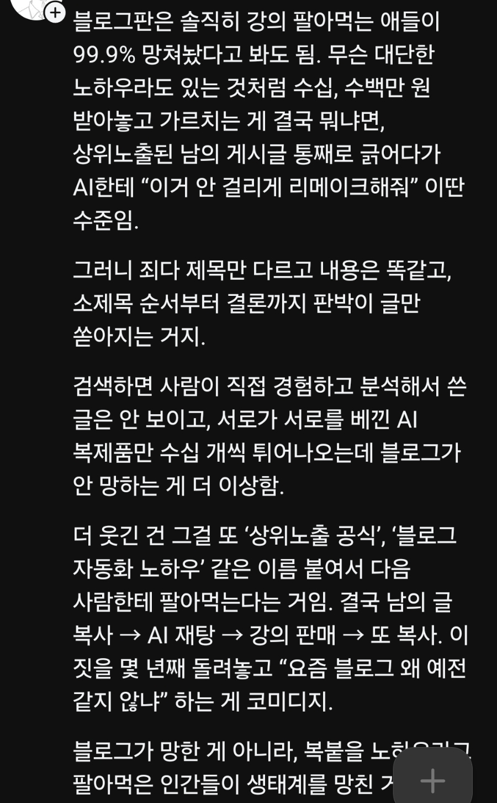

# 인공지능으로 글을 쓰는 것이 문제가 아님
**Date:** 23시간 전
**Category:** 일기장
**Original URL:** https://blog.naver.com/xpfkwh56/224381642353
---

​

1. 인공지능으로 글을 **'못'** 쓰니까 문제인 것

​

**2. 상위노출 공식 = 없음**

**​**

그냥 없음, 진짜 없음

​

굳이 요령이 있다면 유명한 사람이고,

고정 구독층, 트래픽이 본인 자체로도

계속 발생할 수 있는 사람이면 가능함

​

**안 그런 사람도 상위 잡던데요?**

​

**'네이버'** 에서 **'그렇다고'**

간택, 점지해준 사람인 것임

​

3. 자동화 노하우 = **불가능**

​

자동화 노하우 배울 시간에 알바해서

그거로 사람 뽑아서 직원 쓰는 것이 나음

​

노하우가 **없냐?** 하면 그건 아닌데,

진심 나는 배우는 것 **불가능** 하다고 봄

​

예외, 암묵지, 하면서 배우는 감각

이런 요소들이 지나치게 많기 때문

​

4. 제목 똑같고, 내용도

똑같은 양산글 나오는 이유

​

**'AI'** 가 문제가 아니고,

​

**'SEO 글쓰기'** 라는 개념이 약간

정석처럼 쓰고 있기 때문에 그런데,

​

이게 명확한 정의나 기준, 목적이

있는 것이 아니고 해석하는 사람에 따라

보는 사람에 따라 **하기 나름** 이고,

​

**\* 주식 차트 보는 법 이랑 비슷**

**​**

LLM 한테 보통 콘텐츠 써달라고 할 때,

가장 많이 하는 규격이고, AI 입장에서도

익숙하게 학습한 패턴이라 그런 것 임

​

**5. 그럼 구글 SEO 에 대한 틀은 있냐?**

​

<https://developers.google.com/search/docs/fundamentals/seo-starter-guide?hl=ko>

[**SEO 기본 가이드: 기본사항 | Google 검색 센터  |  Documentation  |  Google for Developers**

검색엔진 최적화의 기본사항에 관한 지식만으로도 눈에 띄는 효과를 얻을 수 있습니다. Google SEO 기본 가이드에서 기본적인 검색엔진 최적화에 관해 간략히 알아보세요.

developers.google.com](https://developers.google.com/search/docs/fundamentals/seo-starter-guide?hl=ko)

​

이거 읽고, 자의적으로 사람들이

자기가 해석한 방식 + 경험 기반으로

이랬다, 저랬다 이야기 해주는 것 임

​

6. 도저히 눈에 안 들어온다,

조금 더 콤팩트 한 것은 없냐?

​

**있음**

​

국/내외 유튜브 들어가서,

유명한 사람들이 만든 영상 열고

​

자막 추출해서, 구조화 시키면 됨

​

도입부 부터, 결론, 마무리까지

어떻게 구성하는 것인지 내용 나옴

​

7. 블로그 생태계 의 가장 큰 책임은,

내 생각에는 **네이버** 한테 있다고 봄

​

얘네가 자기들 기술력 조금만 해방하고,

블로그 운영에 조금만 의지를 보여주면

​

해결할 수 있는 문제가 상당히 많을건데

돌아가는 것 보면 별로 관심이 없어보임

​

8. 사족으로, 사람이 직접 경험하고

​

분석해서 쓴 글이라고 해서 진짜 실제로

트래픽이랑 연결되고 이러는 것도 아님

​

지금 상위노출된 글이 이런이런 글인데,

​

내가 더 잘 쓰면 노출이 되겠지? 라는

접근 자체가 ,, **이걸 잘 모른다는 뜻** 일 것