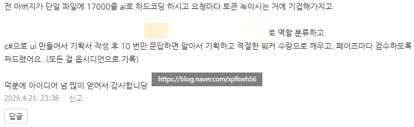
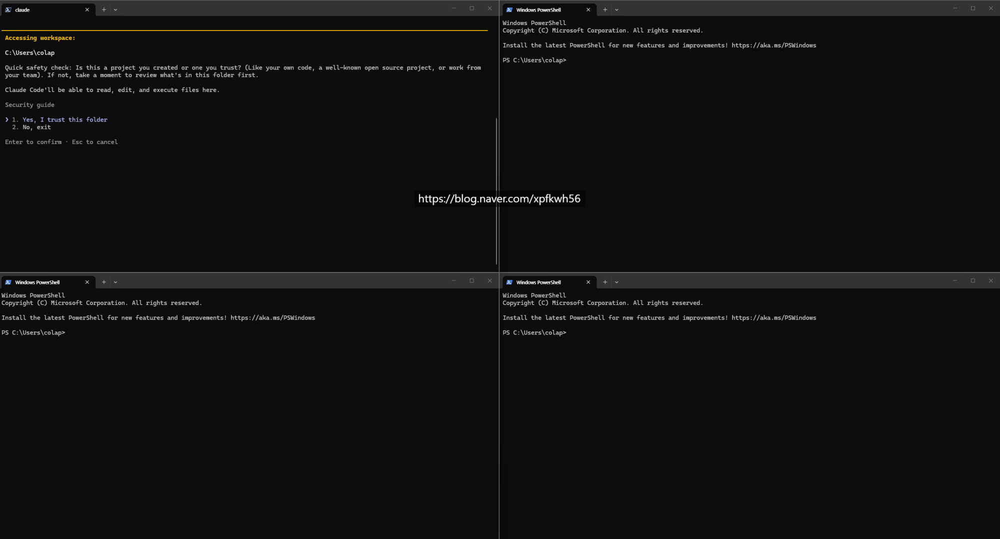

# 프론티어 모델의 한계와 해결책
**Date:** 23시간 전
**Category:** 다이어리
**Original URL:** https://blog.naver.com/xpfkwh56/224260666047
---

​

1. 조금 더 깎아보실 수 있는 지점이 있음

​

**2. 준비물 = 듀얼모니터**

​

​

1) 듀얼 모니터로 멀티 페어링을 한다

​

2) 1번 모니터는 평소 쓰던 대로 쓰고,

2번 모니터는 4분할 해서 사용한다

​

**\* 컴퓨터 앞에 있을 땐 그냥 고개 돌려 쓰고,**

**앉아서 하기 귀찮으면 집에서 매시 wifi 쓰고,**

**태블릿 pc 마다 연결하면 아주 편리합니다**

​

​

3. 위는 스모크 테스트 실제 시연이구,

​

​

실제 goal 걸어서 맡기면 이렇게 됩니다

​

**4. 이게 뭔데? ,,**

​

현재 인공지능 특히 추론 llm 이 쉽게

할 수 없는 작업 중 하나가,

​

**메타 추론 및 메타 설계** 입니다

**​**

**\* 자신의 행동을 예측하고, 결과가 예측값 대비**

**얼마나 분산되었는가 실증한 이후, 원래 목표에**

**맞게 재설계 하고 루프할 수 있는 능력 같은 것**

​

아주 똑똑한 분들이 월드 모델 이니,

​

AGI 니 말씀하시지만 현실적으로

일반인들이 그걸 쓸 일은 **아예** 없죠

​

5. 아기는 물리학을 몰라도,

​

물건을 던지면 어딘가로 날아간다

그리고 떨어진다 라는 것을 익힙니다

​

**\* 지각을 했다 → 내일 일찍 잠자리에 들자,**

**알람을 2개 늘리자 같은 것은 인간한테는**

**아주 당연한 일이지만, AI 는 하기 어려움**

**그 방법을 누군가 외부에서 넣어줘야 됨**

**​**

즉, **'유동지능'** 기반으로 선행된 지식을

**'결정지능'** 으로 바꾸어 적용하는데요

​

인공지능은 정확히 그 반대 입니다

​

결정지능이 먼저 주어지고,

유동지능은 **'낯설게 느낍니다'**

​

할 줄 아는 것은 많은데,

그걸 어떻게 쓸 줄 모른다

​

→ 인공지능

​

뭐 아는 것이 없어서

할 수 있는 것이 없다

​

→ 아기 라는 것이지요

​

6. 인간은 자기가 갖고 있는

재귀적 깊이를 금방 알 수 있어서,

​

실시간으로 내가 뭔가를 할 때,

​

이걸 알고 하는 것이다

모르고 하는 것이다를 알지만

​

극히 간단한 메타적 레벨의 인지도

인공지능한테는 **'아주'** 어렵습니다

​

그래서 이 때, 예측/실행/측정/

분산계량/재설계 같은 작업을

영상처럼 루프로 설계해서 주면,

​

외부 신호를 바탕으로 특정 작업에서

규약에 맞게 행동하는 것이 가능함

​

7. 기술적으로는 간단하기 때문에,

처음에는 inbox 같은 형태로 하고

​

쓰다가 이제 충분하다 싶어질 때면

sdk 같은 것으로 바꿔서 실시간으로

상호 피드백, 반영되게 하면 됩니다

​

8. 잡힐 듯, 안 잡히는데 좀 더

간단 명료하게 설명해줄 수 있나요?

​

1) 인공지능이 뭔가 했다

2) 이게 맞는지, 틀린지 모르겠다

​

3) 다른 인공지능이 그걸 검수한다

4) 그리고 너 이거 틀렸어 가르쳐준다

​

5) 아, 내가 틀렸구나 하고 고치고

6) 고쳐준 AI 가 다음부턴 이렇게 하면

더 낫겠는데? 라면서 계속 개선한다

​

**\* 이 부분의 동적 진화가 핵심**

**​**

장점 = 작업 품질이 향상된다,

더 정확히는 실수를 **'볼 수 있다'**

​

단점 = 토큰이 녹는다

​

9. 1만 7천줄 짜리 단일 파일 코딩이면,

모듈/캡션 쪼개서 **'할 수 있다'** 라는

​

존재 자체를 아버지께 누군가 알려줬으면

아마 개발 몰라도, **'머지않아'** 스스로

자료 구조 같은 것을 알게 되셨을 것임