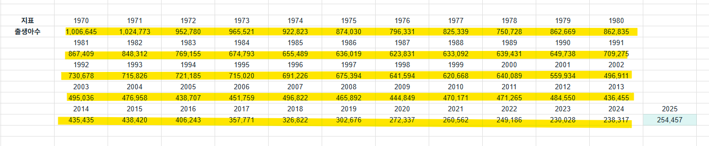

# 지금 아기 낳는 부모들이 알면 좋은 전제
**Date:** 24분 전
**Category:** 다이어리
**Original URL:** https://blog.naver.com/xpfkwh56/224265176733
---

​

1. 20년생부터 출생 인구가

**20만 단위로 내려온** 상태 입니다

​

2. 26년 기준 스카이,

입학 정원이 약 1만명

​

27학년도 기준, 의치한약수

정원이 **러프하게** 1만명

​

서울 소재 4년제 대학 전체 모집

정원 약 8만, 주요 15개

대학 기준 5만 명 나옵니다

​

3. 정원 자체가

달라질 순 있겠지만,

​

1만명을 뽑을 때,

​

60만명 기준 시대랑

20만명 기준 시대는

​

컷 범위가 **'3배 차이'** 남

​

**\* 학과 이름 짧은 전공은 비교적**

**통/폐합에서 자유로울 확률이 높음**

​

**4. 소결**

​

미래는 대학이 급할 시대가

아닐 확률이 **상당히** 높다

​

일부 급진적인 부모님들의 경우,

직업이랑 직접 연계 되는 전공 아니면

​

굳이 진학을 해야 되나? 라고 생각하는

숫자도 지금 기준 결코 **적지는 않은** 편

​

**\* 최저임금 인덱스는**

**절대 우상향이란 마인드**

​

5. 전문직 티오부터, 공무원 티오,

대기업 티오 등 특정 직역들의 경우

​

1년에 배출되는 숫자가 정해져 있음

​

**'몇 명'** 이 수험 시장에

들어올진 모르나,

​

장수생이 현실적으로 그렇게 많이

있을 수 없다는 점을 감안한다면,

​

적어도 지금보다는 **'널널할'** 확률이

높다고 예측해 볼 수도 있을 것 같음

​

**\* 직업을 형식적으로 얻기는 쉽고,**

**실질적으로 밥벌이는 어려울 확률 ↑**

​

6. 사자는 사자의 게임을 하고,

가젤은 가젤의 게임을 하게 됨

​

직업 자체를 얻기 위한 과정이

고단해서, 그걸 이수한 시점에서

​

그 사람이 **'유능하다'** 라는

사회적 브랜드가 있었더라면,

​

이게 헐거워질수록, 사회는 아마

더 깊은 **'증명'** 을 요구할 확률 큼

​

**7. 예시**

​

1) 서울대 의대 나온 성형외과 의사

​

vs 지방대 의대 나온 성형외과 의사

단, SM 같은 아이돌 전문으로 다량의

수술 포트폴리오를 갖고 있는 상태 임

​

**이 경우, 전자보다 후자가 최소한**

**영업적으로는 유리할 확률이 높음**

​

2) 하이엔드 코스 다 밟은 엘리트

문과 계열 직역 전문직 vs

나랑 커뮤니케이션이 되는 전문직

​

설경, 설로 출신 변호사 1시간 보다

나랑 시간 2시간 써주는 변호사를

더 높게 평가할 가능성이 높다고 생각

​

8. 특정 직업이 주는 경제적 아웃풋은,

전체 수요 대비 공급량과 **일정** 비례함

​

그리고 인구 구조 같은 문제는

하루 아침에 바뀔 수 있지도 않음

​

**9. 결론**

​

진로 탐색/적성 탐구 열심히 시키고,

​

제일 잘할 수 있는 직업을 할 수 있는 한,

일찍 정해서 해당 시장에서 요구하는

역량을 잘 잡아주는 것이 유리할 수 있음

​

**10. How?**

​

1) 다른 사람이 **앓는 소리** 많이 듣게 한다

2) 실무 프로젝트 경험에 많이 노출 시킨다

3) 아동 노동에 대해 적극적으로 고민해 보자

4) 부가가치 생산 경험을 누적 시켜본다

5) 메타 스킬, 상위 레이어 역량에 관심 갖기 등

​

모든 직업은 결국 남의 **불편** 해소하는 일이고,

​

어린 시절 책을 읽는 것보다 더 좋은 경험은

제 생각에는 책을 **'집필'** 해보는 경험 같읍니다

​

서재에 **권장도서 100권** 쌓인 것도 좋지만,

**직접 쓴 책 100권 있는** 애도 나쁘진 않을 것임

​

**\* 어느 한 쪽으로 될 시대는 아닐 것이고,**

**모든 영역을 커버할 수 있어야 될 것 같음**

**​**

**1인분이 아니라, 2인분 3인분을 해야지**

**사회를 지탱할 수 있을 가능성이 크니까**

**​**

전자는 **'소비'** 지만, 후자는 **'생산'** 이죠

​

저는 그 차이를 아주 중요하게 보고 있습니다