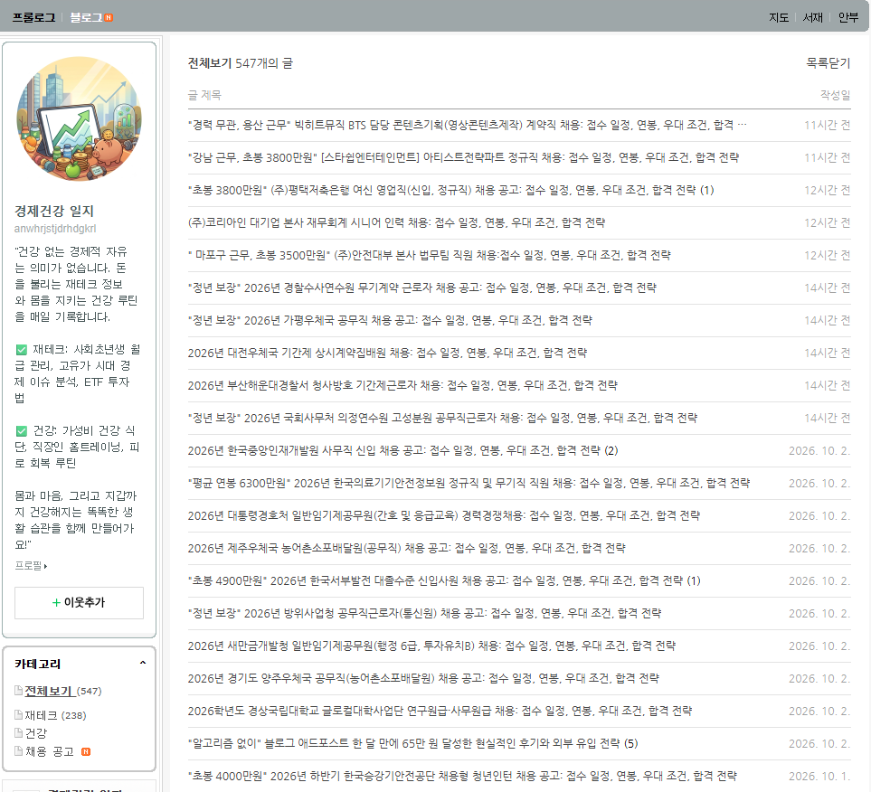
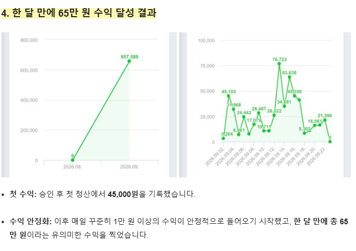

# 60만원 벌었다는 경제블 근황
**Date:** 2시간 전
**Category:** 스냅
**Original URL:** https://blog.naver.com/xpfkwh56/224430718401
---

​

1. 채용, 접수, 일정, 연봉, 우대, 조건, 전략, 합격

이라는 키워드가 거의 **모든** 제목에 들어갑니다

​

클러스터링을 돌려봅시다

​

일정/연봉/채용/우대/조건/공고/인재

공무원/정년/근무/신입/임기/청년/공무직

​

최근 1개월 동안 글을 300개 정도 쓰셨네요

​

운영 방식은 아주 간단합니다

​

<https://www.jobkorea.co.kr/>

[**잡코리아 | 대한민국 대표 구인구직, 취업 정보 & 채용 플랫폼**

대기업 실시간 공채 소식부터 핫한 스타트업의 기업 리뷰, 연봉 정보 및 면접 후기까지 - 성공적인 커리어를 위한 모든것을 지금 '잡코리아'에서 확인하세요!

www.jobkorea.co.kr](https://www.jobkorea.co.kr/)

​

잡코리아 에 있는 공고를 긁어다가

그대로 템플릿에 넣고 돌리는 거죠

​

> 않이 시발 말이 됨?
>
> 어케 저런 글이 홈판 노출이 됨

​

바로 **'알고리즘'** 때문 입니다

​

네이버 홈판 알고리즘은 기본적으로

그 사람이 최근에 검색하고 읽었던

페이지 정보를 바탕으로 노출 됩니다

​

**그말인즉슨,**

​

내가 지금 취업, 연봉 이런 것 관심 있으면

그거랑 관련된 **'아무거나'** 일단 띄워준단거죠

​

2. **아마** 정확하진 않지만,

​

1) 정년보장

2) 학력무관

​

누구나 몸만 오면 취업 시켜주고, 돈 많이 줌

같은 것을 클릭할 사람들이 눌렀을 것이고,

​

놀랍게도 본문에 **'별 내용이 없기 때문에'**

정렬된 애포를 눌렀을 가능성이 **아주** 큽니다

​

​

네이버 블로그를 지금 하면 돈을 범니다

이제 얼마나 갈진 모르겠지만욬ㅋㅋ

​

3. 저는 들어본 적이 없어, 강의 라는 것에서

무엇을 어떻게 가르쳐주는진 모르겠으나

​

**이런 범위 밖을 벗어나지 않을 확률이 큽니다**

​

**왜 why?**

**​**

현실이 이렇거든요

​

심지어 저기서 **아-주 조금만 신경 써도**

트래픽 차이 + 수익 차이가 **크게** 납니다

​

AI 메이트? 그걸 왜 함

​

슬롭 계정 돌리면

그거 몇 배를 버는데 ,,