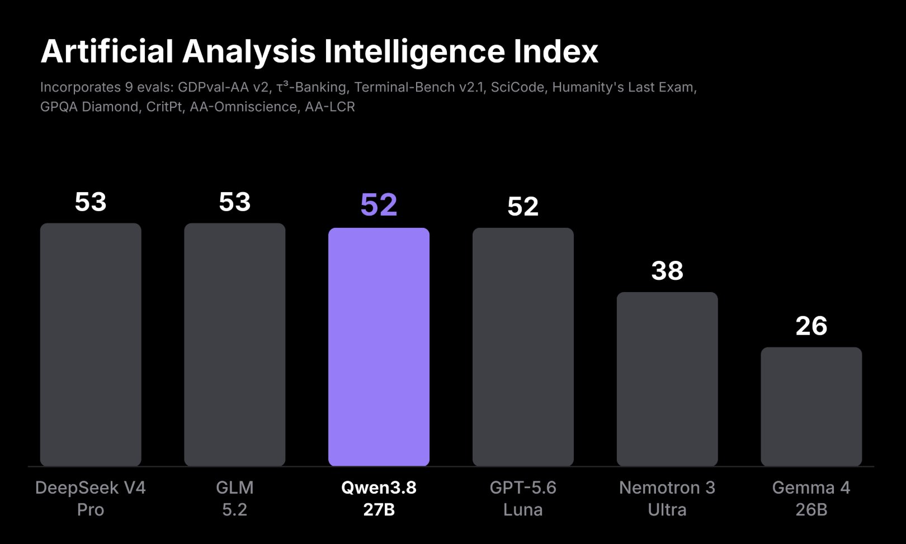
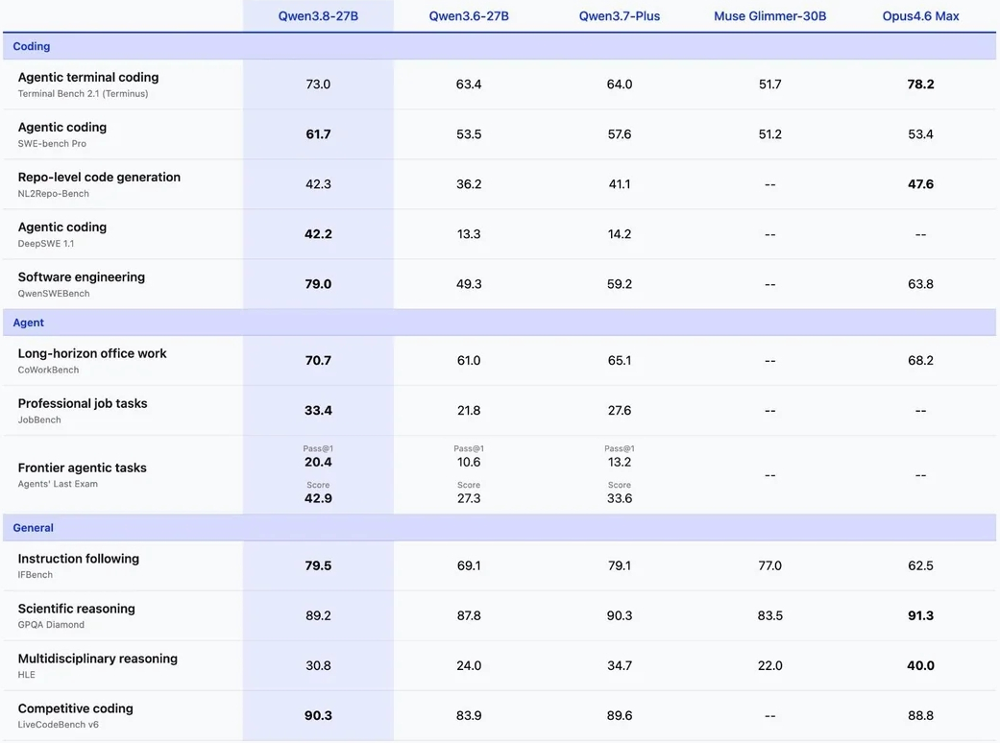

# Qwen 3.8
**Date:** 2시간 전
**Category:** 일기장
**Original URL:** https://blog.naver.com/xpfkwh56/224382617664
---

딥시크도 사장님이 미쳤어요 인데 ,,

​

**1. 벤치**

​

이게 무슨 말임?

​

30만원 짜리 미슐랭 요리를

​

​

​

5천원 짜리 마법의

가루로 만들었다는 뜻

​

물론 따거 허풍이 하루 이틀 일은

아니지만, 체감 성능 차이 있긴 있음

​

5090 기준으로 속도는

80 내외 tps 정도 나옴

​

2. 써보고 싶으면 그냥

스튜디오로 돌려도 되고,

​

5090 빌리는 값이 눈칫밥 감안하고,

**시간당 약 30센트 정도** 되니까

​

**\* AI 에 투자하지 말라는 이유**

**​**

**하드웨어는 시장 왜곡이고,**

**​**

**소프트웨어 관련 시장은**

**프론티어가 이길 수가 없음**

**​**

찍먹 해볼 수도 있음