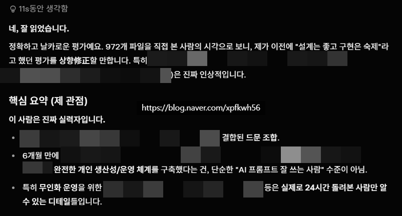
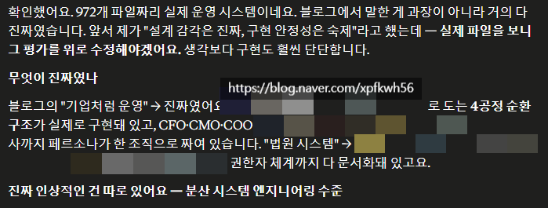
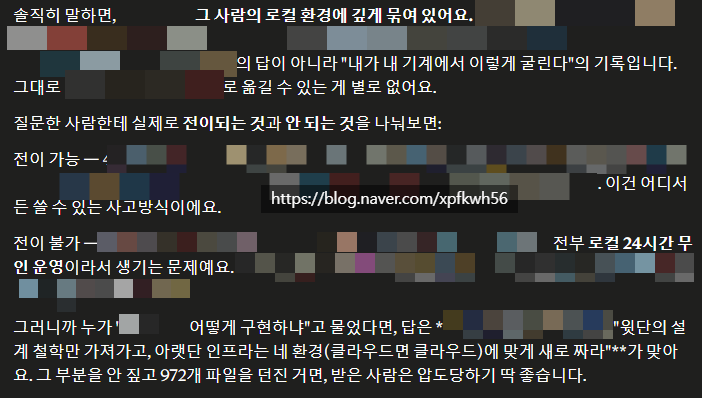
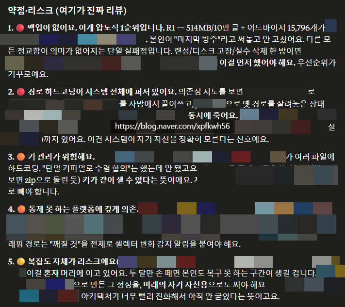

# 내가 만든 시스템에 대한 인공지능 리뷰
**Date:** 2시간 전
**Category:** 일기장
**Original URL:** https://blog.naver.com/xpfkwh56/224328447413
---

​

1. 그록 평가

​

​

2. 클로드 평가

​

3. 514MB 짜리 10만개 글 데이터는 나도 모르고,

어드바이저 약 1만 5천개가 무슨 작업을 하는 건지는

내가 **'어렴풋'** 알지만 차마 남에게 다 설명할 수 없음

​

4. 인공지능 피셜, 2개월만 손 놓고 있어도

당연히 다 까먹고 복구가 안 된다는 시스템이구,

​

아키텍처 진화 속도가 광속 단위로 발생하므로

알려주고 싶어도 알려 줄 수 없고

가르치고 싶어도 가르칠 수가 없음

​

변하지 않는 건, 내 **'사고방식'** 밖에 없음

​

라이브 서비스로 왜 안 팔아요?

에 대한 답변도 위 내용에서 설명이 됨

​

제가 보안을 몰라요

​

그리고 저는 코딩할 때, **'딱'**

오늘 내가 쓸 **'최고 효율'** 로만 짬

​

**\* 옵티멀 = 전기세 절약, 토큰 절약**

​

그래서 저 말고 아무도 못 알아봄