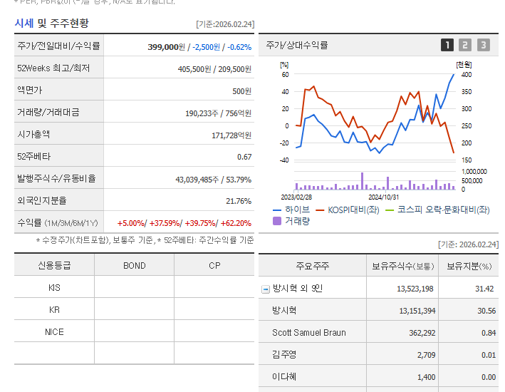
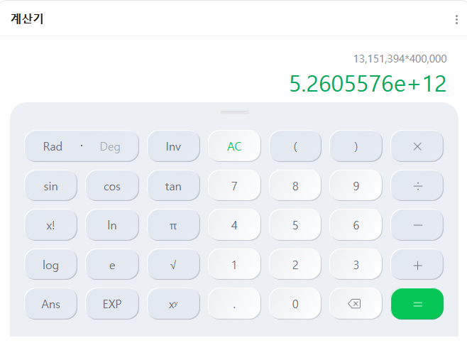
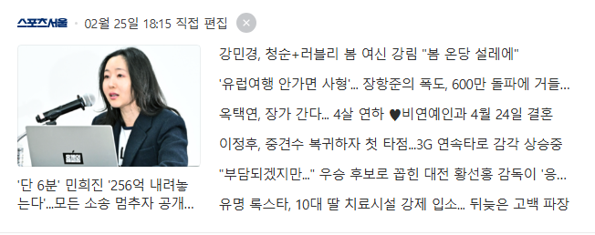
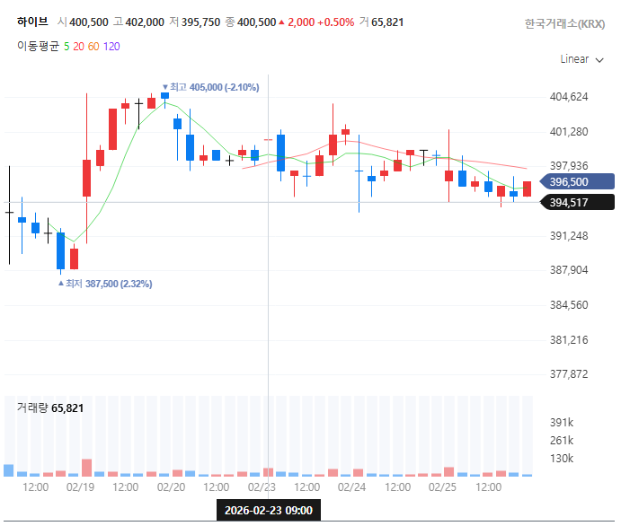
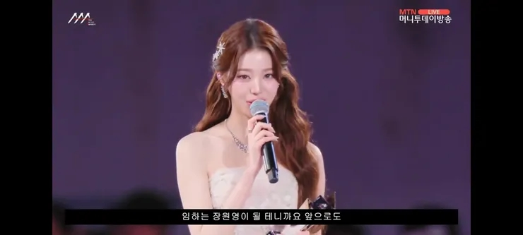
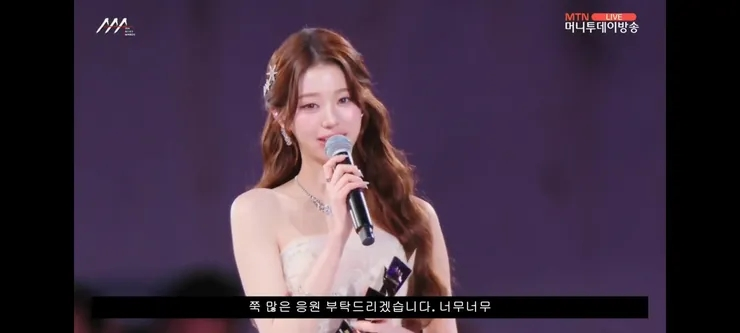

# 민희진의 악수
**Date:** 2시간 전
**Category:** 다이어리
**Original URL:** https://blog.naver.com/xpfkwh56/224195964089
---

​

1. 오늘 기준, 아저씨 주식을 보자

​

​

네이버 계산기론 숫자가 나오지도 않는다

​

당연히 저 물량을 다 털 순 없겠지만

당일 호가 기준, **5조** 가 조금 넘는다

​

​

256억은,

​

​

**하루짜리 변동성조차** 안 된다

​

2. 이 언니가 뭘 원하는진 모르겠지만,

아마 진짜 원하는 것은 **쇼맨십** 같음

​

만약, **'진짜'** 평화를 원했다면

**'진짜'** 평화에 맞게 행동했어야 됨

​

여론전에 꺾일 인간이, 방탄 같은 것을 만들고

나와서 자기 소속사를 차릴 가능성은 **희박하다**

​

1) 기자회견이 아니고, 카톡을 하든

전화를 하든 직접 만나려고 했어야 됨

​

보통 이런 상황에서는 물밑 에서

싸이즈를 봐주는 사람이 하나 있구,

​

결말이 나오면 당사자들이

그제서야 나오는 구조인데,

​

기자회견으로 저렇게 때려버리면

독기 올리는 것 밖에는 안 될 것 같음

​

물론 독기 올리기가 목표면 **'Ok'** 임

​

2) 딱 결론만 놓고 보자면,

최대 피해자는 **'다니엘'** 임

​

얘가 제일 많이 잃었음

**​**

**\* 본인이 초래했든, 아니든**

​

어차피 짤린 마당에 활동도 오래 쉬었는데

물론 송사 중에 하긴 부담스러운 일이겠으나,

​

차라리 다니엘 데리구, 뭐라도 만들어서

유튜브에 올리고 그랬음 낫지 않았을까 싶음

​

내 생각에는 방시혁

공략 방법 **딱 2개** 임

​

하나는 **실력**, 하나는 **진심**

​

진심은 진작 물 건너 갔으니,

제대로 뭔가 하나 보여준 다음에

​

작품으로 말하자고 했으면

말이 통할 확률이 더 높았을 듯

​

하이브 라고 지금 뉴진스를 데리고

뭐를 해보겠다는 생각이 들긴 들까?

​

이미지 소비는 진즉 다 끝났는데,

​

쫓겨난 다니엘 데리고 뭔가 증명하고

그 다음에 이야기를 하면 더 **빠를 것** 임

​

3. 뉴진스는 **'너무'** 아쉬운 그룹임

​

​

하늘은 어찌 주유를 낳고,

제갈량을 낳았는가

​

뉴진스도 보통 재능이 아닌데, 애초에

**태어나길 아이돌로 태어난** 기집이 있구

​

​

악재란 악재는 다 몰고 다니는데,

그냥 **'운빨'** 하나로 버티는 애도 있고

​

장원영 재능의 절반만 가졌더라도,

카리나 행운의 절반만 있었더라도,

​

여기까지 올 일이 없었을 것 같음

​

민지는 칼국수 한 방에 쓰러졌지만,

장원영은 그런 억까? 500개는 있었음