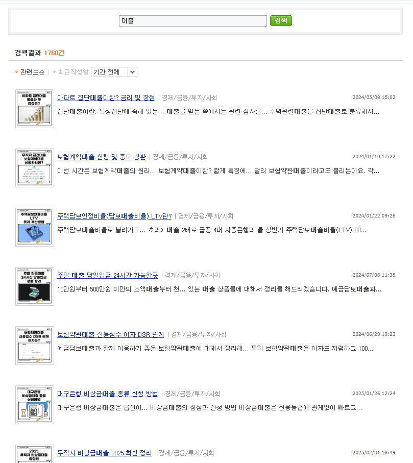

# 사실 참 웃긴 일이라고 생각함
**Date:** 2시간 전
**Category:** 스냅
**Original URL:** https://blog.naver.com/xpfkwh56/224421425404
---

**1. 네이버가 바라는 것**

​

진짜 좀 쓸모 있고, 사람들이 찾는 정보

​

**2. 사람들이 정작 유인을 느끼는 것**

​

어떻게 하면 보상이 더 큰가

​

3. 네이버가 **'바라는 것'** 을 공개하지 않음

그냥 잘 되면 후행성으로 판단하기 때문

​

이유는 있음, 노출되는 즉시 작살 나니까

​

4. 그러니까 사람들이 **고민 자체를 바꿈**

​

뭐가 도움 되는진 모르겠고,

암튼 이거 하면 보상 좋으니 ㄱㄱ

​

5. 그래서 **'얕고, 양산 가능하고'**,

​

**'금방 결과가 나오는 콘텐츠'** 를

사람들이 쓸 수 밖에 없는 구조고,

​

**\* 지금 네이버 블로그는 AI 안 쓰면**

**문서 할당량을 누구도 못 채웁니다**

**​**

공식화, 규격화 되면서 콘텐츠

다양성이 급속도로 줄어들게 됨

​

6. 네이버 **'씩이나'** 되는

회사 치곤 아쉬운 행보임

​

지금 구조에선 내가 어떤 특정 쿼리나,

정보에 대해서 다루고 **'싶다고 해도'**

​

특정 **'점수대'** 가 아니면

써봤자 죽어도 노출 안 됨

​

내가 소신껏 진짜 취미로 하고 있다면

비벼볼 수 있겠지만 누가 그거를 할까 ,,

​

7. 약간 **대입 현실** 과 성적,

학습의 관계랑 비슷한 느낌 같음

​

또 진짜 내 적성, 내 맘대로 공부 하면

대학을 못 가거나, 남들 1년 만에 갈 길을

나는 5년, 10년 해야 닿을 수 있는데

​

**\* 특정 카테고리는 죽어도 돈이 안 됩니다**

**기본적으로 트래픽 모수 자체가 달라서**

​

더 웃긴 건, 야매로 인플단 다음에

번외 키워드로 제휴 달면 수익 더 생김

​

**8. 그게 무슨 말이냐?**

​

요리는 비교적 AI 메이트 에 잘 뜨고,

​

일전에 말한 것처럼 **'여행'** 이나

**'반려동물'** 키워드는 인플이 잘 돼요

​

그래서 어떻게 접근을 하냐면,

내가 보험, 대출, 주식, 만지고 싶으면

​

요리블 운영하거나, 여행, 반려동물로

우회상장해서 인플을 일단 단 다음에

​

인플 키워드로 고단가 니치 키워드를 먹음

​

법률도 처음부터 법률 키워드 안 먹고,

정치/사회/사건사고 쿼리 결속 늘린 다음에

​

연결된 링크 다는 식으로

법무법인 블로그로 연결하는데,

​

이렇게 **요령껏** 우회하는 길이 효율이 더 좋음

​

9. 맛집 키워드나, 요리 키워드 같은 경우,

AI 포스팅이 다른 쿼리 대비 상대적으로 적음

​

**그럼 왜 적을까요?**

​

우선 프론티어 모델이 가짜 경험을 안 써주고,

문서에 들어가는 이미지가 많기 때문입니다

​

**그럼 저 작업은 불가능 할까요?**

​

품이 들어서 그렇지,

하면 못할 것도 없읍니다 ,,

​

다른 작업이 단가가 더 좋아서 그렇지

​

10. 말 나온김에 블로그 예시 하나 더

​

**경제 메이트** 달고 있는 분이고,

손으로 쓰는지, ai 쓰는지 증거는 없지만

​

나는 킹리적 갓심으로 ai 블롭 이라고 봄 ,,

​

​

대출 쿼리 들어간 글이 1760건 인데,

외부링크 들어가면 티스토리 나옴

​

티스토리엔 뭐가 있냐? 에드센스가 있음

​

11. 이 바닥은 정보가 매우 중요함

​

근데 정보가 중요하다, 는 것 보다

더 중요한 것이 **'왜 정보가 중요하냐'** 임

​

정보가 중요한 이유는, 정말 별 것도 아닌

​

작고 사소한 노하우 몇 개만 갖고도

**차이가 크게 크게 나기 때문** 이고,

​

**\* 애포 광고비 몇 푼보다 똑같은 트래픽이면**

**외부 유입으로 돌리는 애드센스가 훨씬 비쌈**

**​**

**문제는 그걸 많이 빨면 블로그 노출이 짤리게 됨**

**​**

더 근본적으로는 **'독/과점 검색엔진'** 이라는

​

상당히 큰 이권집단이 똑바로 시스템을

제대로 못 굴리고 있기 때문에 그런 것임