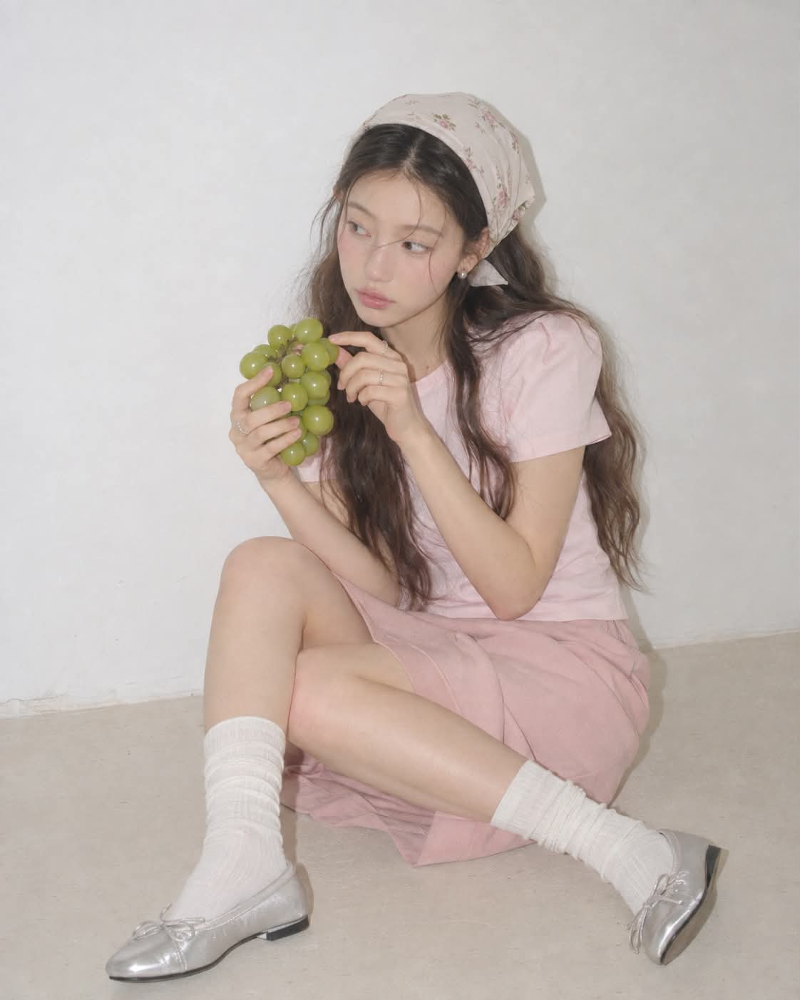
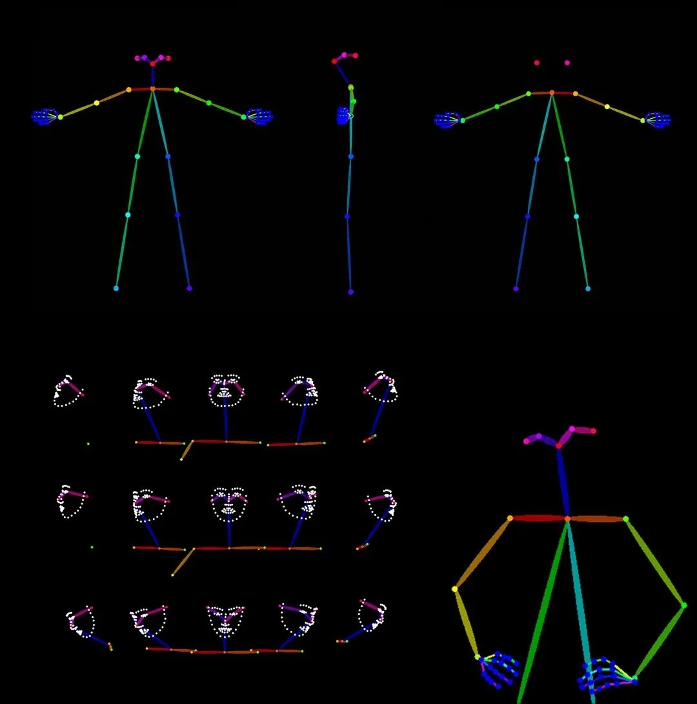
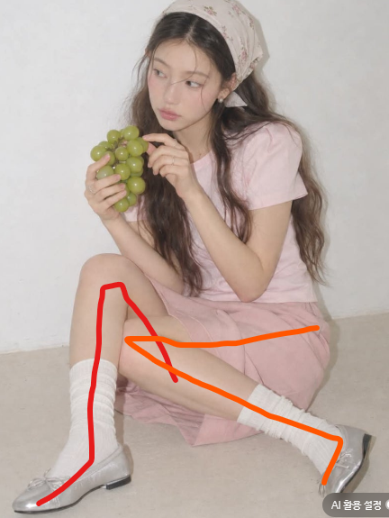
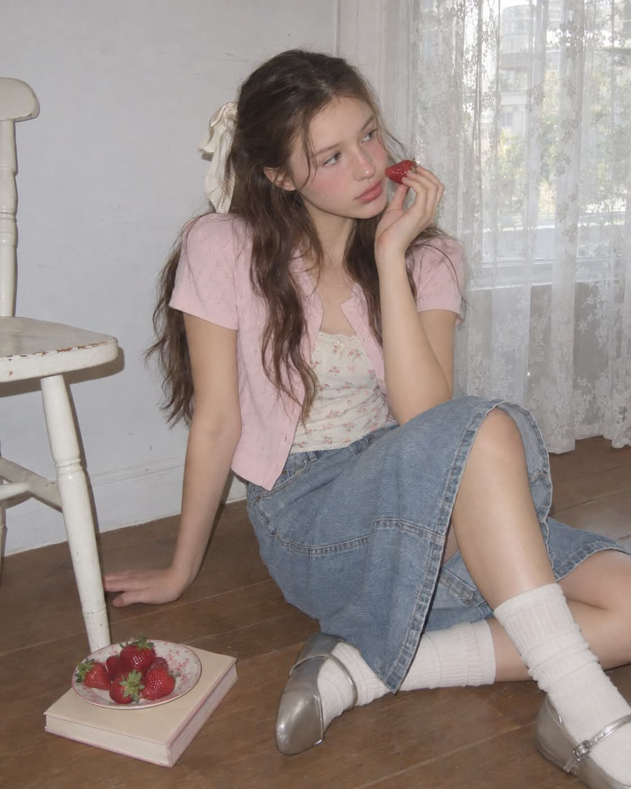
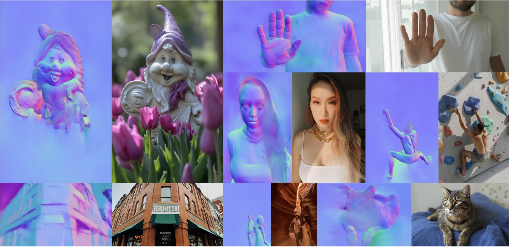
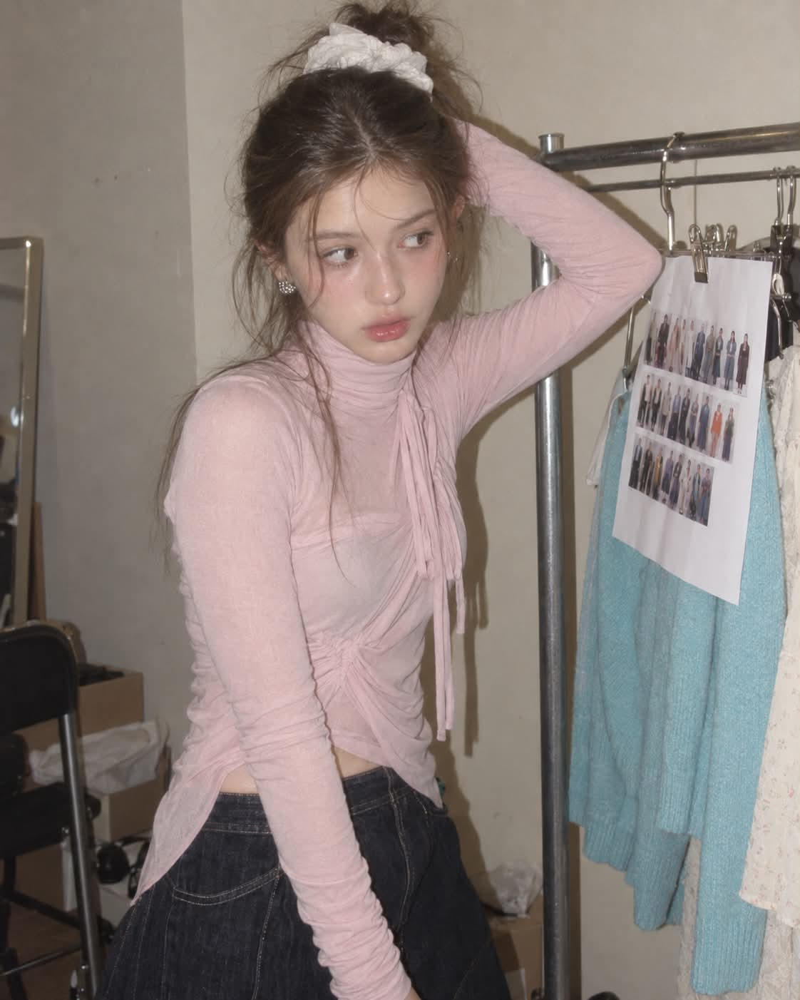
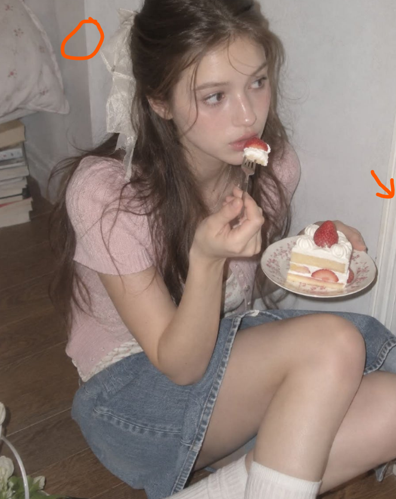

# 스레드 눈팅하다가
**Date:** 2시간 전
**Category:** 스냅
**Original URL:** https://blog.naver.com/xpfkwh56/224422801492
---

​

1. 지피티로 뽑으셨다는데,

컴피 쓰면 퀄 올릴 수 있음

​

​

오픈포즈, dw포즈 이런거 쓰면

저렇게 스켈레톤을 만들 수 있는데,

​

​

그걸 쓰면 이런 인체 비례를

더 잘 맞출 수 있음

​

그리고 **손** 같은 경우,

​

중국 인스타그램 잘 구경하다 보면

자기 손만 찍어올리는 여자들 있는데,

​

그 여자들이 올린 손 영상 싹 다운 받고

손 로라 만들어서 fixer 돌리면 퀄 좋아짐

​

​

2. 이거 같은 경우, 조명 방향이 문제임

​

IC-Light 라는 테크닉이 있음

​

AI 가 뽑는 이미지는 빛이 무작위로 나가서

몬가 어딘지 설명할 수 없는 이질감이 드는데

​

후처리 단계에서 빛 방향

통제하면 더 진짜 같아짐

​

​

노말맵 프로세서로 컨트롤넷 돌리고,

익숙한 다른 사진 각도 따와서 씌우면 편함

​

​

이 사진 같은 경우는,

**'뭉개서'** 좋아보이는건데

​

SeedVR2 쓰고 2pass 돌리면

더 사실적이게 보일 것임

​

1) 몸이랑 배경 먼저 만들고

2) 얼굴만 인페인트 처리해서 입히고

3) 업스케일 돌린 다음에

4) 보정 후처리 하는 것이 제일 좋음

​

이걸 한 번에 다 돌리면 문제가 생기는 것임

​

​

이 사진 같은 경우, 피사체가

위치할 공간 명시가 안 돼서

​

실내 구조물에 문제가 생긴건데,

다중 컨트롤넷 써서 처리하거나

​

아예 3d 맵으로 무대를 만들어놓고

그 위에 얹어서 사용할 것 아니라면

​

가능하면 배경 심플하게 가져가는 것이 좋음

특히 저런 바닥나무 패턴 같은 경우,

​

무늬가 계속 미묘하게 변할 수 있어서

고정할 지점과 가변할 지점 나눠놔야 됨