# 악마의 안목
**Date:** 2시간 전
**Category:** 다이어리
**Original URL:** https://blog.naver.com/xpfkwh56/224267285733
---

[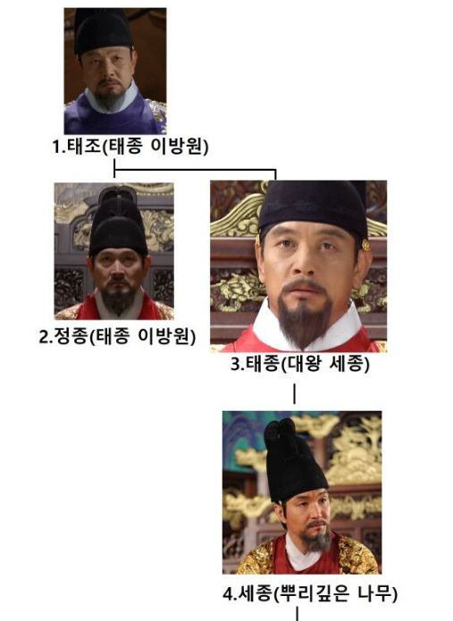](#)

​

1. 천년 수도 경주보다,

한양이 더 익숙한 만큼

​

현대인들에게 조선 이라는 국가는

중앙집권화 **근본 국가** 처럼 느껴짐

​

[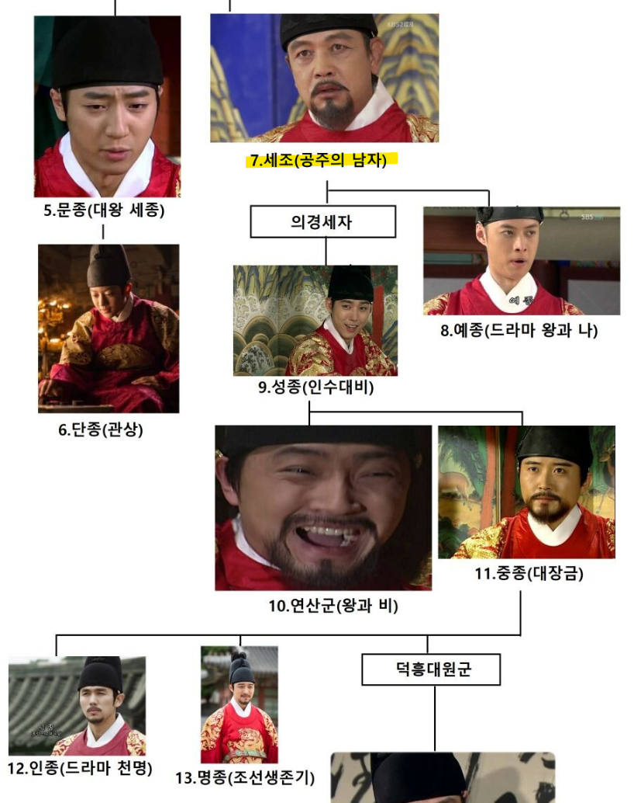](#)

​

2. 허나, 극초반 정도를 제외하면

**근본성** 을 운운하긴 다소 어렵고

​

시스템이 붕괴한 상태로 차력쇼 하며

어떻게든 버텨낸 국가가 아닐까,

라고 생각하는 사람들의 숫자도 있음

​

[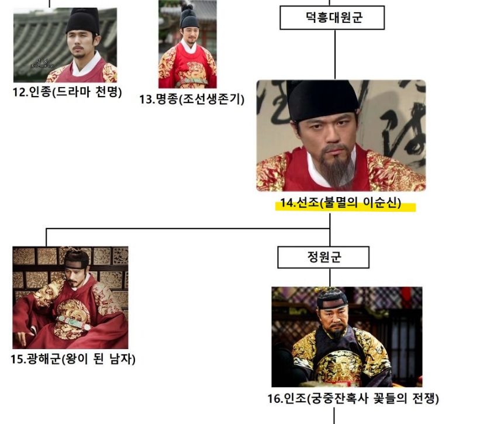](#)

​

암군이 나오면 망하고,

명군이 나오면 흥하는 것이야

​

어느 시대건 다들 그러했지만

​

이게 암군인지, 명군인지

고점/저점을 **크게 오가는** 왕이 있음

​

그게 **선조** 임

​

3. 선조 하면 아무튼 임진왜란,

어디서 듣기로는 빤쓰런을 잘 했다

​

요런 정도로만 알려져 있는 편인데,

​

[](#)

​

선조는 조선 역사 탑급에 가까운

**'인간 보는 눈'** 을 가진 괴물이었음

​

[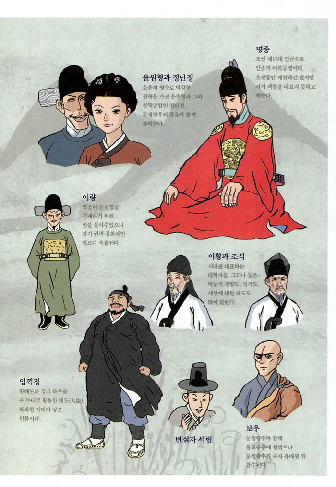](#)

cf. 여인천하

​

외아들이던 세자가 죽고, 명종은

조카에게 왕위를 물려주기로 결심

​

[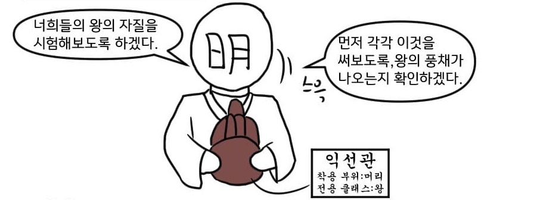](#)

​

하원군, 하릉군, 하성군에게

익선관을 써보라고 제안했는데,

​

**\* 익선관 = 왕이 쓰고 있는 모자**

​

다른 경쟁자들이 이런 기회가?

하면서 덥썩 머리에 쓴 것과 달리

​

하성군은 감히 왕만이 쓸 수 있는

익선관을 어떻게 쓰냐며 사양했고,

​

인생은 한 방이야

​

그 한 방의 배팅으로 왕위를 받게 됨

​

​

전하 병조판서가 왕을 패싱하고

자기 마음대로 의사결정 한 다음에

뒤늦게 선조치 후보고 했답니다

​

이건 왕을 호구로 보는 겁니다

저 무례한 놈을 귀양 보내주세요

​

사람들 얘기 들어보니까

어그로도 많이 끌고

평판도 나쁜 사람이래요

​

​

**ㅇㅇ 알아 근데 걍 냅둬**

**바쁘면 그럴 수도 있지**

**​**

**내가 괜찮다는데 니들이 왜 난리?**

**더 말 얹으면 싸그리 다**

**귀양 보낼테니까 가만히 있어**

​

[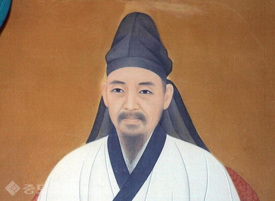](#)

조선 성리학계의 거두이자, 중기 최고 개혁가

​

탄핵 당하고 귀양 갔을 팔자를

살려놓은 것이 율곡이이 선생임

​

​

감사원에서 보고 들어왔는데,

질이 아주 나쁜 놈이라고 합니다

파면 시켜야 됩니다

​

​

(딱 보니까 실제 문제는 아니고

애들끼리 정치 싸움 하고 있구만?)

​

**얼마 전에, 안주에 기근 났다는데**

**보내서 잘 하나 능력 테스트 해보고**

**잘 하면 그냥 복직 시키고 치워**

**​**

**내 성격 알지?**

**ㅇㅇ 반박은 받지 않는다**

​

[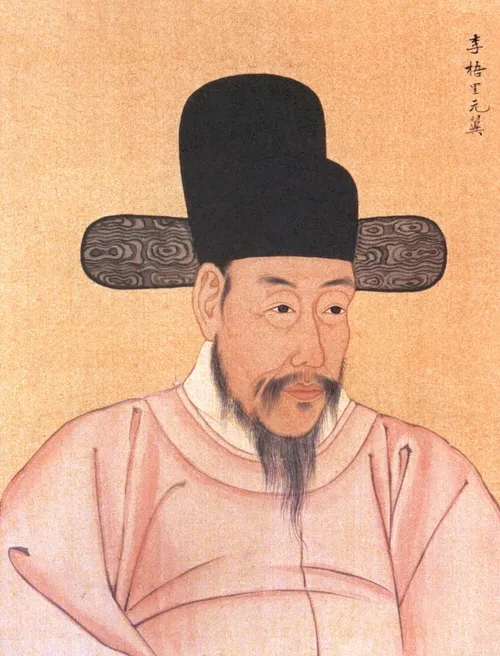](#)

명재상 이원익

​

재해로 곤궁하던 안주의 행정가로 부임해,

치세를 펼쳤고 그 실적을 기반으로 중앙정계 복귀

​

조선의 대표적 청백리 중 하나이자,

임진왜란 당시 막대한 공로를 세우고

모함 당한 이순신을 변호했던 사람이기도 함

​

​

기축옥사 대숙청 명단입니다

컨펌 내려주시면 싹 다 죽일게요

​

[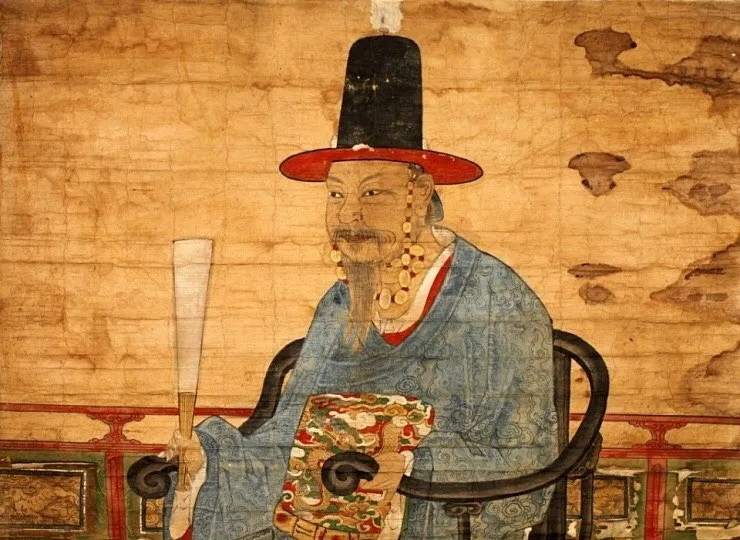](#)

​

**보자, 어? 얜 죽이면 안 돼**

**​**

**쟤는 내 최애야 ㅇㅇ**

**건들지말고 살려놔**

​

[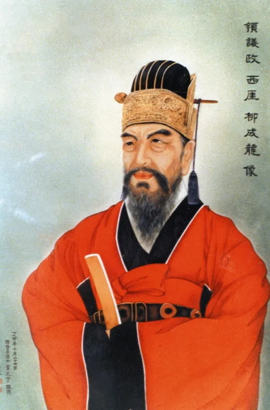](#)

류성룡

​

조선 최고의 명재상 중 하나,

권율과 이순신을 천거했고

전시 재상으로 임진왜란 시기

지휘, 수습, 군제 재편까지

분야를 가리지 않고 전부 해냄

​

​

얘는 진짜 하자가 있습니다

뇌물 받았고 증거 다 있어요

​

파직 시키고 귀양을 보내든,

당장 죽이든가 해야 됩니다

​

​

**떡 만지다 보면 떡고물이 손에**

**묻을 수도 있지, 빡빡하게 굴지말고**

**적당히 지방가서 근신하라고 해**

**​**

**내가 나중에 때가 되면**

**잘 데려다 쓸 테니까 ㅇㅇ**

​

[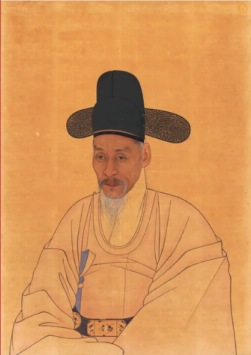](#)

윤두수

​

윤치호 선생, 초대 내무부장관

윤치영, 윤보선의 직계 조상

​

임진왜란 당시, 명나라로 망명하려던

선조를 목숨 걸고 말렸고 행정 분야와

외교 분야에서 S급 성과를 낸 사람 임

​

​

이번에 식년시(공무원 시험) 꼴찌로

들어온 친구인데, 잡기술이나 능하지

어디 마땅히 쓸 자리가 없습니다

​

인사 적체도 심한데,

적당히 한직 보낼게요?

​

​

**얘 글씨가 예사롭지 않은데?**

**데려와봐 내가 곁에 두고 쓸게**

**​**

[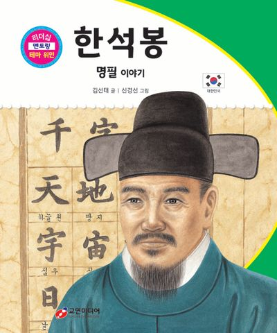](#)

​

**서예 GOAT**

​

인간 프린터 조차도 아니고,

​

현대에서 쓰이는

한자 폰트 표준 이

한석봉이 쓴 글씨임

​

​

유쾌한 것은 좋은데, 드립이 과합니다

처벌해서 기강 좀 잡아주세요

​

​

**ㅋㅋ 너도 웃었잖아 냅둬**

**괜히 일 잘하는 사람 괴롭히지말고**

**​**

**애들이 화끈하고 말 잘 하니까**

**외교라인 으로 돌려보면 좋겠다**

​

[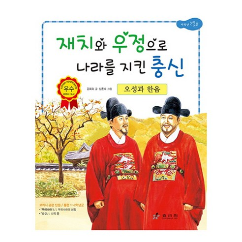](#)

공적은 하나하나 헤아릴 수도 없을 뿐 아니라

임진왜란 시기, 병조판서로 국방을 총괄했고

명나라의 지원을 이끌어내는데 최대 공헌을 함

​

​

잡과 급제자 하나가 있는데,

​

어그로 너무 끌어요

쟤 좀 파직 시켜 주세요

​

​

난 반대로 하고 싶은 걸?

​

조선 역사상 유일하게 잡과

급제자에게 **정 1품** 제수할게

​

[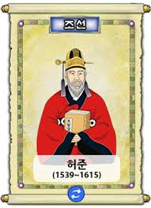](#)

​

**한의학 GOAT**

​

[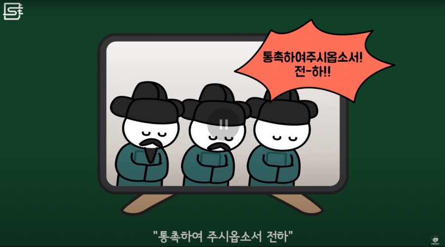](#)

​

녹둔도 전투에서 성과가 좀 있는데,

성적도 안 좋고 끗발도 나쁩니다

대충 자리 하나 주고 치우죠?

​

​

장계 보니까, 이거 인물이다

​

지금 직위가 뭐라고? 대위?

얘는 대위로 있을 사람이 아니야

​

**'중장'** 으로 올린다

​

**\* 8계급 파격 승진**

**​**

육군 출신이라서 좀 그렇다고?

해전도 잘 하지 않을까?

​

일단 시켜봐 ㅇㅇ

​

[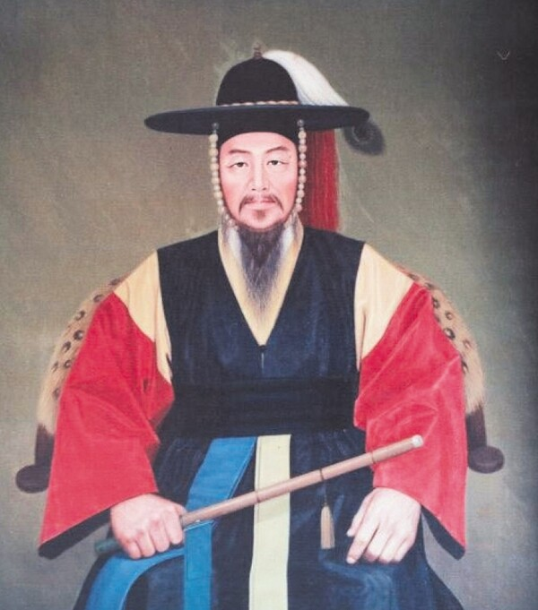](#)

이순신

​

**한국사 위인 GOAT**

​

​

낙하산으로 들어온 영의정 아들인데,

​

직원들 인사 평가도 나쁘고

일 처리도 대충대충 게으릅니다

​

​

정확히 설명할 순 없지만

나는 **인비지블 썸띵** 이 보여

​

인사권자는 나니까

그냥 내 맘대로 할게

​

[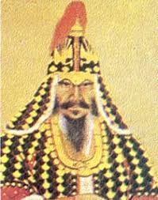](#)

권율

​

임진왜란 당시, 이순신과 더불어

명장의 대명사였고 행주산성, 이치전투 등

나라 넘어갈 전투를 극적으로 다 이겨냄

​

[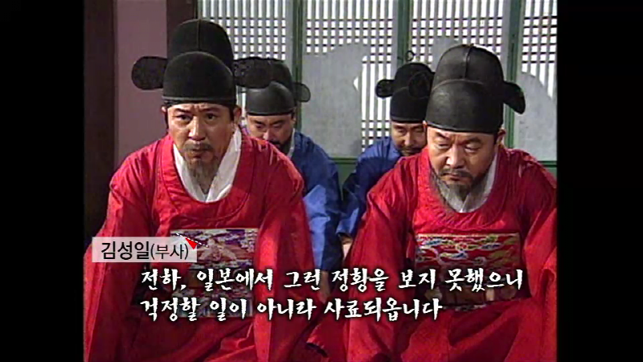](#)

​

전하 제가 일전에 잘못된 판단으로,

왜의 침략을 대응할 수 없게 한

책임이 있으니 처벌을 달게 받고

그만 고향으로 돌아가겠습니다

​

​

**실수 안 하는 사람이 어딨어?**

**너가 일부러 그런 것도 아니고**

**​**

**나는 너 이해 한다 ㅇㅇ**

**책임을 지려면 전장에서 지셈**

​

[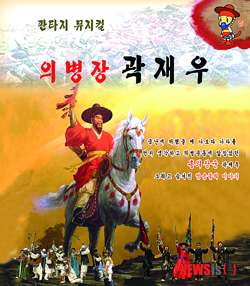](#)

​

영남 방면 전시 행정 통제권 안정화와

의병 지원 등의 공적을 세워 나라 구했고

특히 곽재우와 함께 활동한 것으로 유명

​

​

왜놈 장수 하나가 투항했습니다

스파이 일지도 모릅니다 죽이죠?

​

​

**알게 뭐임 ㅋㅋ 고급 인력이 귀순했는데**

**​**

**내가 친히 이름을 내릴테니**

**기술과 노하우를 전부 빼먹어라**

​

[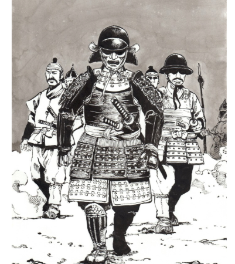](#)

김충선

​

울산성 전투에서 가토의 1군을 전멸 시켰고,

이괄의 난과 병자호란에 참전해 공을 세움

​

​

땡중 하나가 활발히

활동하고 있다고 합니다

​

조선이 숭유억불 인 것 아시죠?

어떻게 처분 할까요?

​

​

**형은 능력만 있으면 다 상관없어**

​

[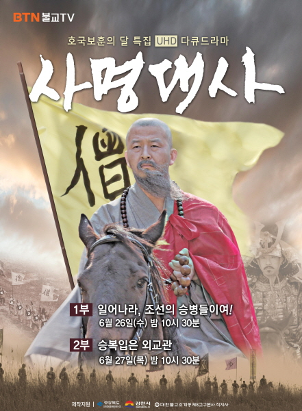](#)

​

승병 총대장으로 평양성을 수복하고,

전쟁 협상에서 포로 3500명을 돌려 받고,

​

불교를 숭상하던 왜나라 와의

외교에서, 독보적 존재감을 보임

​

[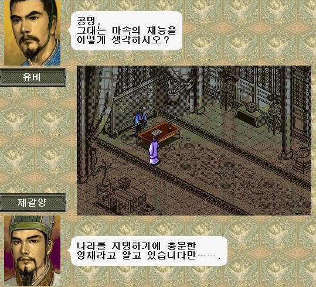](#)

[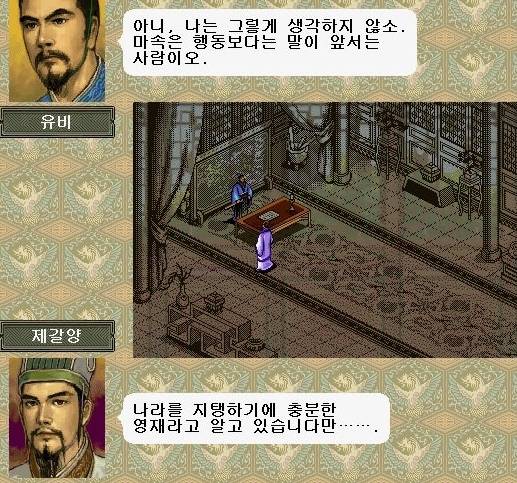](#)

​

4. 이처럼 선조가 보여준 인사는

​

사람 보는 눈 하나로 황제까지 찍었던

유비에 필적할 정도로 악마적이었는데

​

거의 대부분이 평타 이상,

몇 개는 **초대박** 을 치는 등

​

소리소문 없이 썩을 수 있던 인재들이

선조 시기에 르네상스 급으로 발굴됨

​

지금에야 우리는 미래를 알고 있으니,

그럴만 하다고 느끼지만 당대 기준으론

​

**얘를 왜? 얘를 이정도까지 올린다고?**

라는 반응과 우려가 계속 나타났었음

​

그러나 **딱 2번**, 선조는 인사에 있어

돌이킬 수 없는 큰 실수를 하게 되는데,

​

<https://youtu.be/--0XOlJ3Lw4?si=qaFp2uq3g_-an26X>

​

**1) 신립**

​

당대 기준으로는 최고의 명장으로

꼽히던 신립에게 임진왜란 초기에

​

조선 최정예 병사 약 2만을 줬지만

탄금대에서 싹 갈아먹는 패전을 함

​

**\* 배수진의 안 좋은 사례**

**​**

선조 입장에선 억울할 수 있는 점이

​

삼성전자에 투자했는데,

갑자기 상폐를 당한 것임

​

**2) 원균**

​

지금에야 똥별의 대명사 지만,

​

[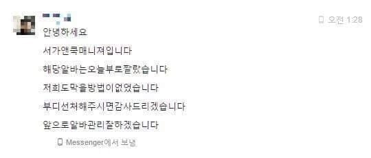](#)

​

선조 입장에서는 제한적으로

정보를 습득할 수 밖에 없었고

​

순전히 선조 입장에서만 본다면,

원균의 졸전/패전 소식을 들었을 때

​

하이닉스 상폐 정도의

충격을 받았을 것임

​

**\* 원균이 망했다고?**

**그럴 리가? 왜?**

​

[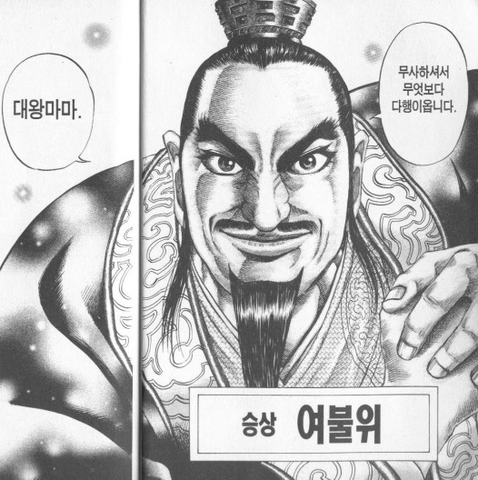](#)

킹덤

​

5. 사기에는 여불위 라는 인물이 나옴

​

세상만물의 시세를 꿰뚫고,

​

샀다 하면 저점이고

팔았다하면 고점을 찍던

대상인 이라 알려지는데

​

조나라 수도 한단에서 우연치 않게

볼모로 잡혀온 진나라 왕자를 보고,

집으로 돌아와 아버지와 대담을 나눔

​

" 밭을 가는 것은 몇 배가 남습니까? "

​

여불위의 질문에 아버지가 답하길,

​

" 열 배다 "

​

" 주옥을 파는 것은 몇 배의 이익이 남습니까? "

" 백 배다 "

​

" 국가의 군주를 세우는 것은

그럼 몇 배의 이익이 남습니까? "

​

여불위는 아비의 대답을 기다리지 않고,

​

" 지금 힘써 밭을 갈아도

재물을 사고 팔아도 겨우 먹고

입을 뿐에 지나지 않습니다

​

그러나 군주를 세우면 그 복이

만세에 미칠 것입니다

​

저는 그 일을 하겠습니다 "

​

라며, 전 재산을 털어

진나라 볼모에 투자했고,

​

그 볼모가 후일, 진나라의 국왕이 되어

아이를 낳는데 그 아이가 **'진시황'** 임

​

한 사람의 배팅이 볼모를 왕으로 만들고,

중국 통일 왕조까지 영향을 미친 사례로

​

말년이 썩 좋진 않았지만

​

여불위가 인간이 누릴 수 있는

부와 명예, 권력의 정점까지

도달했다는 사실은 부정할 수 없음

​

6. 퀀트가 득세하고, 르네상스 테크놀로지가

여전히 금융 업계를 주도하고 있긴 하지만,

​

정용진

​

수천 년이 지난 오늘날 에서도,

​

**오너 리스크** 라는

표현이 낯설진 않고

​

정의선

​

같은 일도, 누가 하느냐에 따라

차이가 있는 만큼이나

​

**\* 능력 차이까진 조심스럽지만**

**결과물 차이는 글자 그대로 팩트**

**​**

좋은 안목으로 사람을 잘 보는 것이

꽤 중요한 역량 중 하나인 것 같음