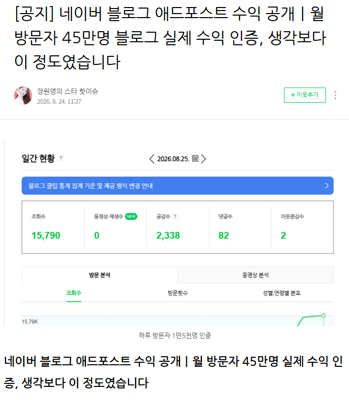
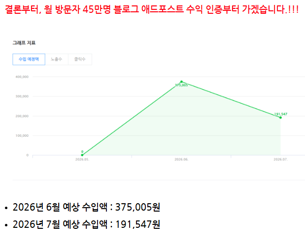
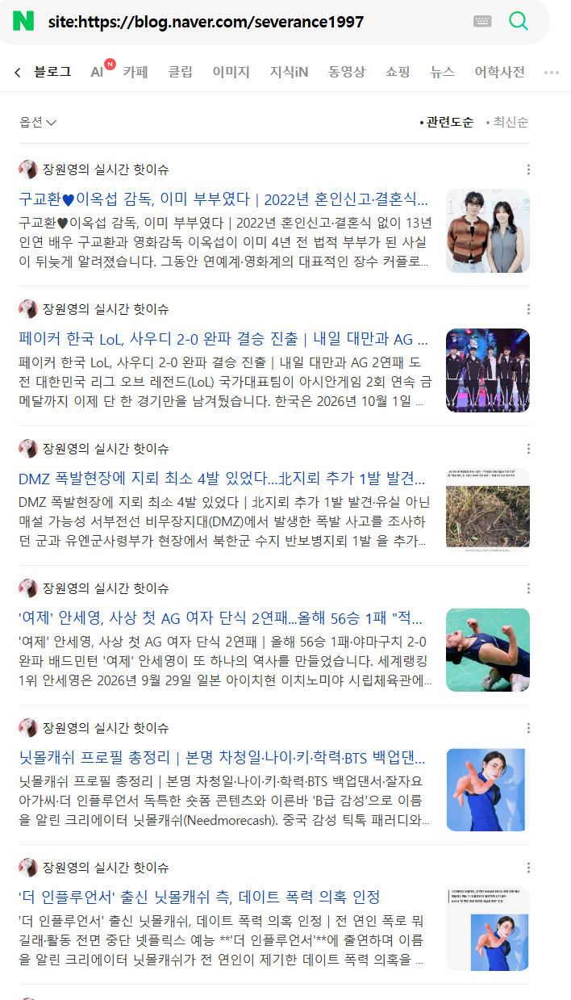
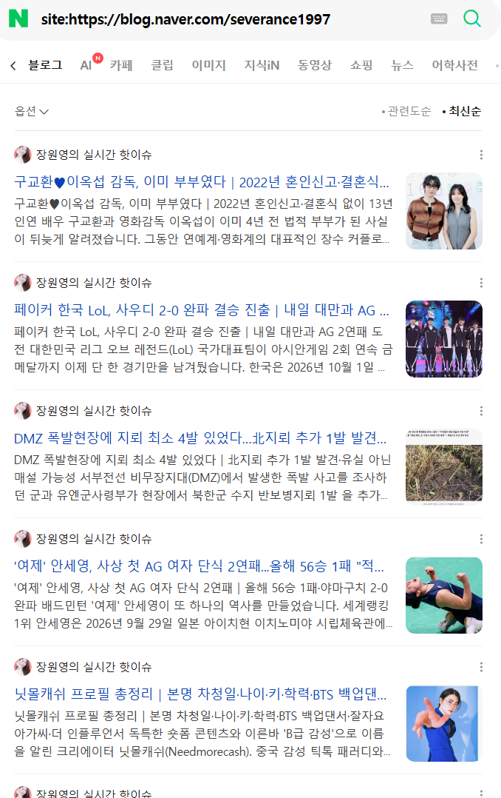
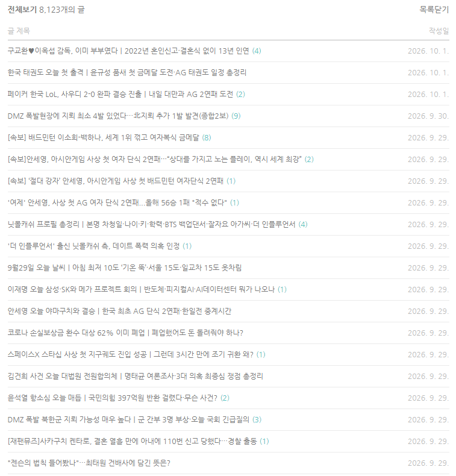

# 월방 40만 연예/이슈블 근황
**Date:** 2시간 전
**Category:** 스냅
**Original URL:** https://blog.naver.com/xpfkwh56/224430723407
---

​

1. 6-8월 기준으로 일방 1만을

꾸준하게 계속 찍던 블로거가 있음

​

2. 연예/이슈 블로그 고,

요즘은 시들한데 한창 인기가

많기로 유명했던 방식 임

​

3. 이거 어떻게 돌림?

​

4-1. 연예/이슈 인터넷 기사를 복사함

그리고 붙여넣기 함

​

4-2. 여기서 조금 더 하는 사람들은

연예/이슈 인터넷 기사를 ai 한테

다시 특정 말투로 써달라고 한 다음,

​

그대로 복붙해서 포스트에 올림

​

**월 발행량은 2280개**

**인간 이면 당연히 불가능한 수치**

**​**

실제로 돈도 벌었고,

트래픽도 잘 나왔던 걸로 보임

​

그럼 지금 어떻게 돌아가나 보자,

​

​

위 검색어는 네이버에서 해당 블로그의

포스트를 노출하고 있나 체크하는 것 임

​

​

상당수의 콘텐츠가 누락된 걸로 보임

​

5. 나는 이 블로그가 똑같은

애그리에이션 콘텐츠를 뿌리면서

​

왜 저품질이 되었는지, 그나마도

왜 점점 더 저품질이 되어가는지,

​

그 이유를 알고 있지만

여백이 부족해 적지 않겠음

​

**6. 결론**

​

1) 정직하게 땀 흘려서, 내 오리지날 콘텐츠로

퍼쇼날 브랜딩 해서 잘 가꾸는 행운과 재능

​

또는,

​

2) 악착같이 요령을 찾아서 **짜치게** 돈 벌기

​

둘 중 하나 밖에 없는데,

​

여기서 2번 방식의 경우 으마으마한

시행착오를 본인이 직접 겪지 않는 한

​

**그게 꾸준히 유지되리란 있을 수 없는** 일 임