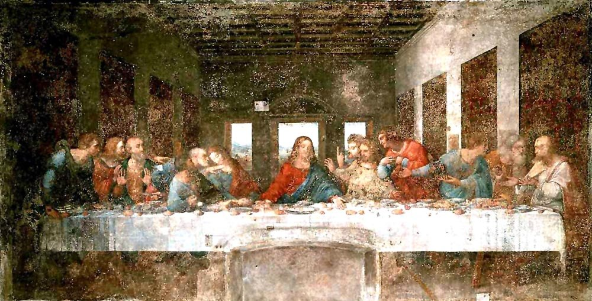
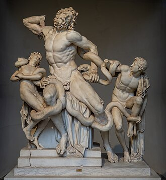
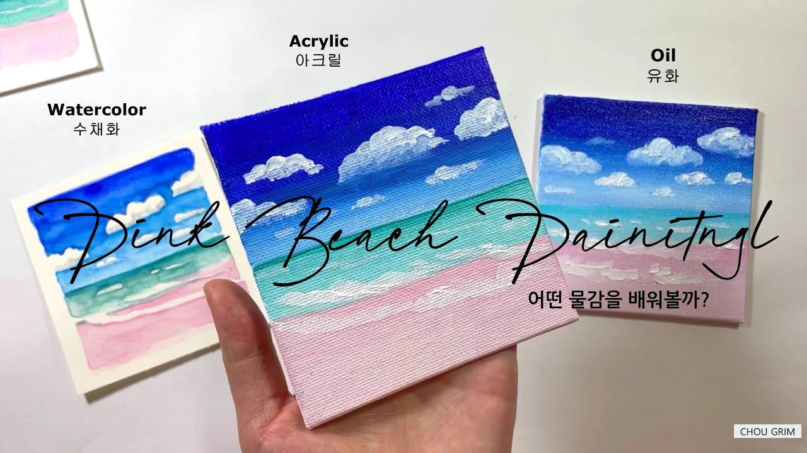
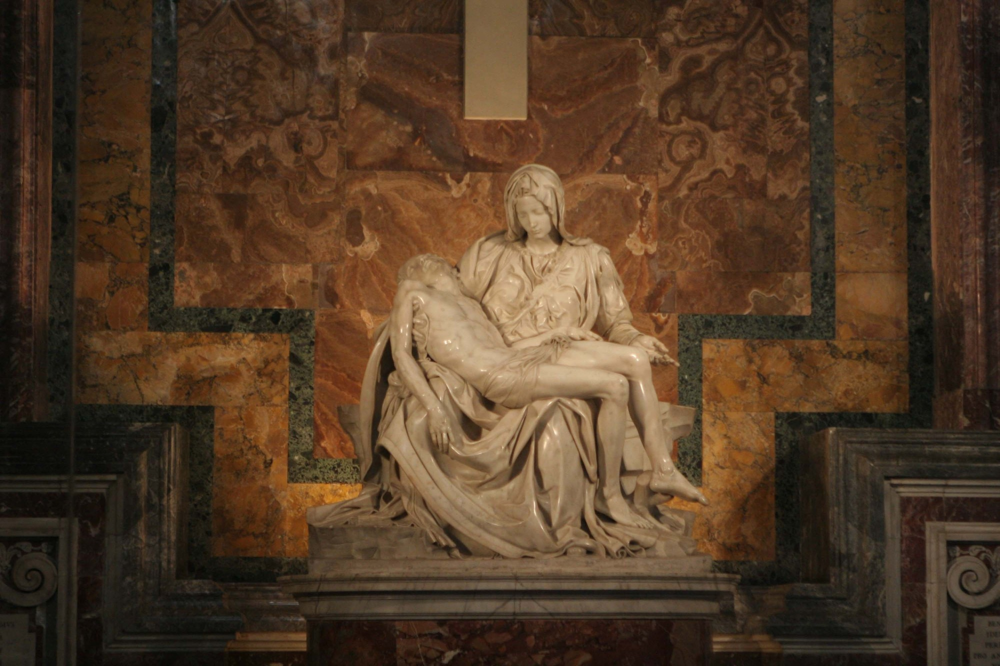
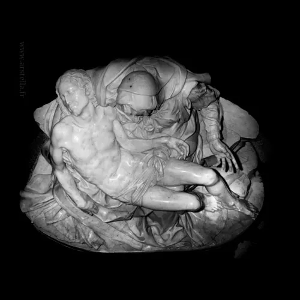
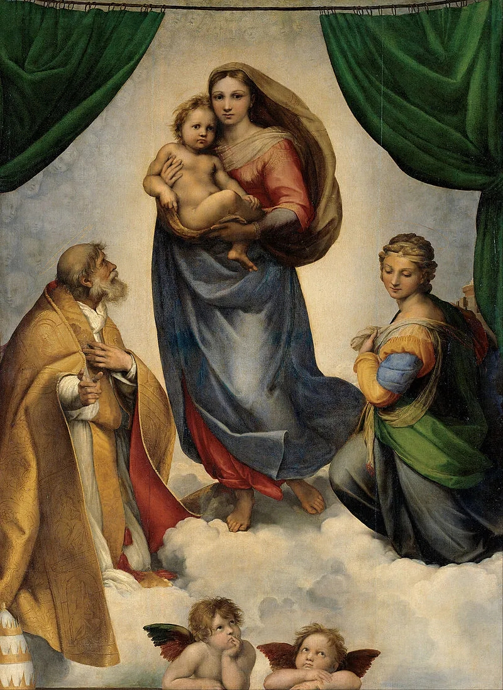
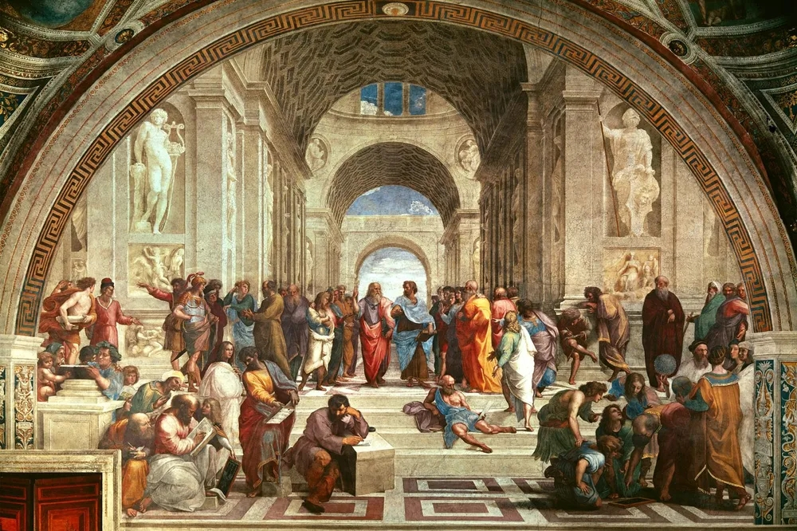

# 인생 몰라요
**Date:** 2시간 전
**Category:** 다이어리
**Original URL:** https://blog.naver.com/xpfkwh56/224193223382
---

<https://blog.naver.com/xpfkwh56/223117557228>

[**40대에 3억이 없으면 망한 인생이다?**

반박 시 내 말이 옳음 진짜 망한 인생은, 어른이 되고서도 타인의 가치를 특정 인간이 소유한 경제적인 재...

blog.naver.com](https://blog.naver.com/xpfkwh56/223117557228)

​

1. 르네상스 3대 천재라고 있음

​

르네상스 시기는, 인류 문화사에 있어

거의 불가사의할 정도로 황금기 였는데

​

지금 AI 기술 쏟아져 나오는 것처럼

맨날 맨날 천재들이 계속 나타났었음

​

그 수도 없이 많은 사람들 중에서,

추리고 추리고 추려 나온 것이 **셋** 임

​

**2. 다빈치**

​

​

다빈치는 **찍먹의 달인** 이었음

​

이 사람은 **'안 만진 것'** 이

무엇인지 찾는 쪽이 더 빠름

​

다빈치는 14살에, 베로키오의 **공방**

이라는 곳에 들어가 수련을 시작했는데

​

보통 당대의 예술인들이

화실에서 시작한 것과 달리,

​

다빈치의 경우, **'종합 기술 연구소'**

같은 곳에서 커리어를 끊어가지고

​

조각을 하다가, 청동 주조법을 배우고,

집을 그리다가 설계도를 그리는 등의

복잡다단한 활동을 했다고 알려짐

​

결과적으로 그런 **'무근본성'** 이

다빈치의 경계를 많이 허물게 했고,

​

요즘 말로 **통섭형** 인간이 나오게 됨

​

기록에 따르면 다빈치가 스승과

작업 합작을 하던 도중,

​

베로키오가 다빈치의 천재성에 의지가 꺾여

다시는 붓을 들지 않았다는 야사가 있지만

​

좋소 오우나가 오퍼레이터 취직 시키니까,

​

안살림은 똘똘한 다빈치에게 맡겨놓고

밖으로 영업 뛰고 다닌 것에 가까울 것임

​

다빈치는 도구에 그닥 구애받지 않았는데,

이는 얘가 **'지킬 것'** 이 없어서 그런 것임

​

내가 늘 강조하는 부분으로,

​

30살까지 특정 경로를 밟은 사람은

그 경로 밖으로 나갈 수도 없고,

나가는 것이 별로 바람직하지도 않음

​

근데 앰생으로 30년 살았으면,

**'걸어온 길'** 자체가 없기 때문에

​

어디든 갈 수 있고, 그게 **큰 무기** 임

​

만약 다빈치가 전통 기법에만 묶였으면

모나리자의 스푸마토 같은 것은 없었음

​

**3. 미켈란젤로**

​

다빈치한테 님 전공이 뭐에요?

라고 물어봤다면, **'컴퓨터 과학'**

이라고 대답했을 가능성이 높음

​

다빈치는 **진짜**

컴퓨터 과학을 함

​

만약 같은 질문을

미켈란젤로에게 했다면?

​

**'C언어'**

​

혹은, 대답 자체를 씹었을 수 있음

​

미켈란젤로는 다빈치와 달리,

그리 외모가 좋은 편도 아니고

​

사회성이 발달한 스타일도 아니라

1인 개발, 아싸, 이런 느낌으로 함

​

이건 비즈니스적으로 좋지 않은데,

​

불친절하게 실력 100 찍기 보다는

친절하게 실력 50 정도를 찍는 쪽이

먹고 사는 것에는 더 이롭기 때문임

​

근데 미켈란젤로는 싸가지less 로

실력 200 을 찍었고, 생계를 유지함

​

실력에 관계없이, 주변을 살펴보면

천성 자체가 이런 인간이 한 둘 있음

​

거기에서 **재능이 더 있던 케이스** 임

​

​

**1) 라오콘 일화**

​

라오콘은 트로이 전쟁에서

**진실을 통찰했던 현자** 인데,

​

알면 안 되는 것을 알았고

봐서는 안 되는 것을

봤다는 이유로 뱀에 물려 죽음

​

라오콘 조각상은 바로 그 장면임

​

굽어있는 한쪽 팔은 발굴되었을 당시,

떨어져 있는 상태였는데, 당시 사람들은

​

근육의 모양 등을 보고 떨어져 나간 팔이

쭉 뻗고 있는 자세를 취할 것이라 생각함

​

미켈란젤로는 팔이 굽어있는 것이

**'조각가'** 의 눈에 자연스럽다고 했고,

​

실제 나중에 발견된 팔이 굽어있어서,

​

이 새끼가 승질은 더러워도

조각 분야에서는 정점이구나

​

라는 것을 인정했다는 얘기가 있음

​

현재 남아있는 라오콘 조각상 역시,

미켈란젤로가 했던 해석을 따름

​

**2) 천장화**

​

성격 자체가 **적이 많을 성격** 임

​

교황 율리우스 2세가, 미켈란젤로에게

무덤 조각건을 의뢰했는데 (B2G)

​

계약 중에 갑자기 무덤 프로젝트를 중단 시키고,

시스티나 성당의 천장화를 그리라고 지시함

​

미켈란젤로는 자긴 조각가지, 화가가 아니라며

라파엘로 같은 그림쟁이한테 시키라고 하는데,

교황은 신을 반역할 셈임? 니가 하라고 명령함

​

여기에 대해서는 라파엘로 파벌이

미켈란젤로를 엿먹이려고

교황한테 추천했다는 설이 있음

​

시스티나 천장화가 놓여지는 자리는,

역대급 쟁쟁한 회화가 놓여있는 곳임

​

관람객 입장에서 우와 하고 옆을 보다가

위를 봤는데, 급이 떨어지는 것이 있으면

​

저건 누가 함? 저건 미켈란젤로가 했데

으이그 같은 시나리오가 나올 수 있었음

​

실제 미켈란젤로의 편지를 살펴보면,

천장화에 굉장한 부담이 컸던 걸로 보임

​

**같은 그림인데, 그게 그거 아닌가요?**

​

미켈란젤로는 **'가치투자자'** 였던 것임

​

정교한 기업 분석을 통해서,

좋은 자리를 찾고 시간을 조져서

수익을 버는 트레이더 였는데

​

이런 사람한테 너 주식 좀 친다며?

스캘도 잘 하겠네? 파생도 잘 하겠네?

​

라면서 그걸 맡긴 것과 거의 비슷함

​

​

수채화고, 아크릴이고, 유화고,

그게 그거 같지만 좀 **자세히** 보면

​

대체로 유화가 더 **비싼** 냄새가 남

실제로 더 비싸고, 더 어렵기도 함

​

시스티나 천장화는 미켈란젤로가

거의 처음 했던 프레스코화 플젝인데

​

젖은 회반죽 위에 그려야 하고,

마르기 전에 끝내야 해서 수정 불가

​

**\* 컨트롤 Z 버튼 없음**

​

부담을 느끼는 것이 **당연** 했음

​

다만 본인도 모르던 것이 있었는데,

자신의 스페셜 어빌이 **'C언어'** 였단 것

​

미켈란젤로는 **인체 해부학** 이라는

**'저수준 최하위 레이어'** 를 완벽하게

세계에서 최고 수준으로 마스터 했음

​

전 세계에서 C언어 제일 잘 하는 사람이

파이썬 처음 잡았다고 **'초보'** 일 리가

​

<https://www.vatican.va/various/cappelle/sistina_vr/index.html>

[**Sistine Chapel**

www.vatican.va](https://www.vatican.va/various/cappelle/sistina_vr/index.html)

​

위 링크에 들어가면, 방구석에서

편안하게 실제 천장화를 볼 수 있음

​

TV 또는 빔프로젝터로 연결해다

틀어서 보면 **세상 좋다**, 느낄 것임

​

큐레이션은 유튜브 가면 많이 있음

​

**3. 라파엘로**

​

피에타

​

피에타는 미켈란젤로가

20대 초반에 완성한 조각임

​

​

피에타는 신께 바치는 조각이라서,

위에서 감상하도록 설계된 것인데

​

이게 앞에서 볼 때랑,

위에서 볼 때가 또 다름

​

정면에서 볼 때는,

성모의 모습이

먼저 프레임에 잡힘

​

고우시다, 엄마가 좀 어린 것 아닌가?

여자치고 떡대가 있는 것 같은데?

​

라는 생각을 가질 수도 있는데,

위에서 보면 그 느낌이 **많이** 사라짐

​

피에타는 대속적 죽음과

사명의 완결성을 상징하는데,

​

찾아보면 **아주 자세하게** 나옴

​

이제 라파엘로의 대표작을 보겠음

​

시스티나 성모

​

앱솔루트 명작에 있는 아기 천사가

라파엘로가 그렸던 그림에 있는 것임

​

아테네 학당

​

다음으로는, 르네상스 버전

솔베이 세계 물리학 회의 같은

​

라파엘로의 아테네 학당 임

​

취향마다 다르겠지만, 나는

라파엘로 그림을 처음 봤을 때

​

**'이게, 천재?'**

​

라는 생각을 먼저 가졌음

​

라파엘로 또한 똑같은 개발자인데,

​

대기업 시니어 풀스텍 엔지니어고

인싸라 파티에, 영업에 친구도 많음

​

라파엘로의 스페셜 어빌리티는

**조화로움, 균형적임, 우아함** 임

​

특히, 구성에 있어서

으뜸으로 평가받음

​

있어야 할 곳이 있어야 할 것을 배치하고,

오브젝트들을 정확하게 놔둘 수 있었음

​

즉, 라파엘로는 **'UX/UI 의 천재'** 임

​

우리가 토스나, 배민, 카카오톡을 쓰면서

흐음, 이게 그렇게 대단한 디자인 인가?

​

라는 생각을 갖는 것과 마찬가지인 셈임

​

한편, 다빈치/미켈란젤로 같은 애들은

지리긴 하지만 저건 **쟤네 밖에** 못 하는데

​

라파엘로는 **'표준'** 이 되었기 때문에,

​

당대 르네상스 작가들은 물론 이옵고

현대 회화에 이르기까지 영향력을 미침

​

조금 있어 보이는 척하고 싶으면,

대중들이나 다빈치, 미켈란젤로 빨지

​

저는 회화적인 측면에서

라파엘로를 더 높게 칩니다

​

라고 말하면 좀 있어 보일 수도 있음

​

**\* 다빈치 = 새 알고리즘 발명**

**미켈란젤로 = 하드웨어 레벨 최적화**

**라파엘로 = 기존 라이브러리 전부**

**통합해서 완벽한 프로덕트 출시**

​

4. 그렇다면, 저 셋 중 누가 **최고** 일까?

​

이 접근은 우리한테 매우 친숙하지만

**영원히 답에 도달할 수 없는 질문** 임

​

누군가에게는 이발소에 걸린 그림이

다른 그 어떤 그림보다 좋을 수도 있고,

​

무엇에서 무엇이 아름다운 것인지를

포착하는 것은 자신이 가진 눈에 달림

​

다빈치도, 미켈란젤로도, 라파엘로도,

​

기록에 남지 않은 수도 없이 많은

르네상스의 다른 이름 없는 작가들도,

​

각자 자신의 아름다움을 향해 살았고

자신이 아름답다 생각하는 것을 남김

​

남기기 위해서 남긴 것이라기보다는,

남겨졌기에 남았다고 봄이 타당할 것임

​

인생 아무도 모름

​

본인이 옳다고 생각하는 것 하면 됨