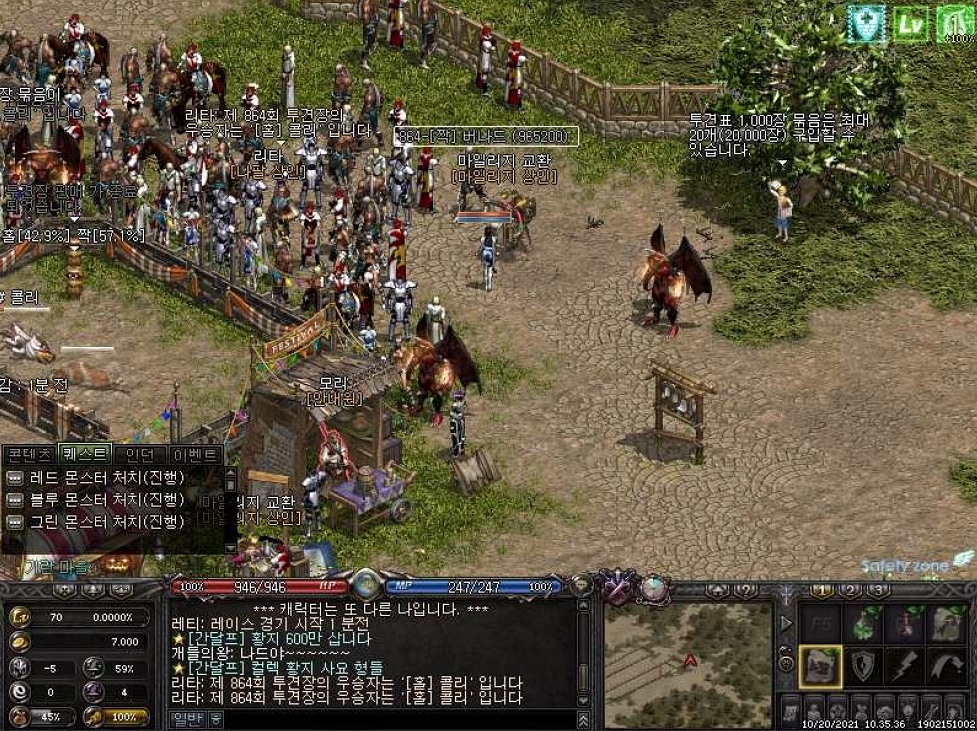

# 지피티 가격 정책
**Date:** 2시간 전
**Category:** 스냅
**Original URL:** https://blog.naver.com/xpfkwh56/224430710776
---

1. 그냥 공짜로 쓰는 챗봇은 공짜 거나,

​

아마 앞으로도 커피값 정도만

지불하면 편하게 쓸 수 있게 하고,

​

헤비 유저들은 계속 점점 더

고가 구독을 쓰도록 만들고 있음

​

코덱스의 경우, 그래도 엔트로픽 대비

나름 혜자인 가격에 속하는 편인데,

**​**

**\* 페이블/아스트라, 오퍼스/솔 라인**

​

앞으로 200달러 한도는 -50%

그리고 500달러 모델을 출시하기로 함

​

1계정당 구독비만 한화 70만원 내야 됨

​

**왜 이런 가격 정책을 쓰는 걸까?**

​

인공지능 사용자는 생각보다 적음,

​

그 한줌단의 극히 일부의 일부를

파워 유저라고 하는데 **대부분** 로컬임

​

심하면 컴퓨터 1대에 억 단위 쓰고,

중형차 이상 박는 아재들도 많이 있음

​

근데 이 사람들이 기계는 막상 샀는데,

깎아서 쓸 시간/정신이 없다보니까

​

저열한 성능으로 바퀴만 만들다가

지치는 경우들 제법 많이 있음

​

그럼 이런 생각이 들 수 밖에 없음

​

이럴 바엔 그냥 api 가 낫겠는데?

​

api 쓰다보니, 엥 ,, 이럴 거면 그냥

프론티어 모델 쓰는 쪽이 낫겠는데?

​

**→ 5만원 구독하자, 제미나이 쓰자**

**​**

열심히 깎는 사람들도 마찬가지 임

​

정-말 정말 잘 깎으면 쓸모도 있고,

프론티어는 **'안'** 해주는 작업도 가능함

​

**\* 로컬은 다른 사람이 쓴 글 복사 하듯**

**토큰 생성 해달라고 해도 해줍니다**

**​**

근데 그런 일을 하려면?

학습 곡선이 **너무 가파름**

​

고점은 높은데, 그걸 유지하는 것도

따라 잡는 것도 너무 어렵고

​

특히 오픈소스 기술이 금방 시간 지나면

사용하기 좋게 가공해, 나올 때가 **꽤** 있어서

​

증말 엣지의 극단에 있는 기술을

하필 내 분야에 적용해야 되는 경우,

​

그런 것이 아니라면 그냥 클로드 쓰고,

코덱스 쓰는 쪽이 더 **'편하기도'** 함

​

지금 로컬 컴퓨터 맞추려면 통상적으로

가성비도 1-2천 정도는 쓸 각오 해야 하고,

​

마음 먹고 제대로 돌리겠다고 생각을 하면,

아무리 싸도 수백, 심하면 몇 천 만원이 됨

​

그럴 거면, 월 50만원 들어간다고 해봤자

1년에 600, 5년 써봐야 3천이면 해결인데

​

하드웨어 사서 감가될 것도 감안하고,

기술 편의성 받는 것이라고 생각을 하면

​

계산기가 저렇게 돌아갈 수 밖에 없음

​

**2. 그런데 잘 생각할 지점이 있음**

​

500달러를 왜 결제하고,

왜 페이블을 결제 하고,

​

**왜 사람들이 20X 를 결제할까?**

​

​

리니지 라는 유명한 게임이 있는데,

이 게임이 **'경제'** 를 아주 잘 가동함

​

먼저, 최상위권이 쓰는 장비를 만듦

​

그 다음에 그 최상위권이 쓰는 장비를

시간에 따라서 점차 물량을 푼 다음에,

​

원래는 상위 1% 만 들고 다니던 것을

10% 정도까지 넓게 사용할 수 있게 되면,

​

그 시점에 다시 기존보다 좋은 걸 풀어서

스펙 자체를 **'상향 평준화'** 시켜 버림

​

달라진 것은 숫자 쪼가리 밖에 없는데,

​

감가를 수용하면 매몰된 투자가 아쉽고

계속 자기 경쟁력 유지하고 싶으니까

​

**어차피 또 반복될 것을 알아도 사게 됨**

​

일본도가 나오니, 싸울이 나오고,

집행검이 나오고, 듣도 보도 못한

​

희한한 장비들이 점점 더 생기면서

인플레가 터질 때 까지 올라가게 됨

​

이 공식을 **NC식 운영** ​이라고 하고,

대부분의 모바일 게임 에서 똑같이 씀

​

인공지능 구독제에서도 같은 일이 있음

​

**\* like 쿠팡**

**​**

저가 출혈 공세로 고객을 확보한 다음에,

사람들이 **전환하기 귀찮아 하는 걸** 노려서

​

경로 의존성을 확보하고,

​

**\*** **AI 를 업무와 생활에 깊게 집어넣으면**

**영향력이 클수록 나중엔 단순히**

**모델 하나를 바꾸는 문제가 아니게 됨**

**​**

체리피커/라이트유저/헤비유저를 구분해

각 분류별로 그들의 주머니를 열 궁리를 함

​

오픈 ai가 소비자 시장에

고가 구독제를 가져왔다는 말은,

​

때문에 두 가지 의미로 해석할 수 있음

​

1) 엔터프라이즈 시장에서 점유율 경쟁을

하는 것이 비효율적이라고 생각을 했거나,

​

이제 거기서 뽑아먹을 파이가 없다고 본 것

​

**지금 인공지능 기술은 증말 ,, 어지간하면**

**나올 법한 기술은 다 나왔다고 봐도 무관함**

​

지금 제일 인기 있는 기술이 뭐냐면,

빠르게 에이전트 **'라우팅'** 해주는 것 임

​

비유 하자면, **청기/백기 빨리 맞추는 모델** 이

사람들 사이에서 선풍적 인기를 끌고 있단 것

​

안 되는 기술, 불가능 했던, 상상에 있던

그런 일들을 여기서 더 해볼 수가 없으니까

​

비용, 최적화 같은 이슈로 집중하고 있는 것임

​

**\* 근본적으로 따거의 영향이 큼**

**존나 열심히 만들어봤자 손해니까**

​

기업도 오, 신기하네요

그래서 이걸 어디에 쓰죠?

​

하고 있는 마당에 있다보니,

​

돈은 많이 드는데 더 연구할 가치를

**'찾아내는 것'** 에 지친 것으로 보임

​

2) 지피티 모델에서 **'코딩'** 에

AI 를 활용하는 사람은 몇 % 일까?

​

25년 기준, **4%** 임

​

국내/외 할 것 없이, 대부분은

아예 안 쓰거나 챗봇 정도로 사용함

​

mcp, 하네스, 에이전트, 등등 같은

말 자체가 일반적인 용어가 아닌 것 임

​

프론티어 헤비유저들은 원래,

엔터프라이즈 매출 버스를 탔었음

​

걔네가 돈을 많이 벌어다주고 있으니,

​

얘네는 **'당장'** 돈을 벌어오지 않아도

되는 새우 정도로 취급을 했었는데,

​

이제 그 역할을 헤비유저가 맡게 되고,

​

그들이 지불하는 돈으로 라이트 유저가

무료 챗봇 서비스를 이용하는 그림인 것임

​

그럼 **'당연한'** 흐름에 맞게,

영원힌 공짜는 없단 결론에 닿음

​

3. 구독비는 아마 **'계속'** 올라갈 것 임

한도는 아마 **'계속'** 내려갈 것 임

​

그리고 어느 시점부터, AI 를 쓰려면

**'돈'** 을 내야 된다는 인식이 어디부턴가

​

**'틀려 먹었다'** 라고 생각하는 지점이 오면,

거품이 급속도로 꺼질 확률이 높다고 봄

​

**\* AI 가 비싼 가격을 받아낼 만큼**

**경제적 가치를 만들어낼 것이라는**

**​**

**시장의 기대가 깨지는 순간, 현재의**

**막대한 AI 투자는 정당화하기 어려워진다**

**​**

세상에는 부자들이 너무너무 많기 때문에

​

캐시든 뭐든 자원 신경 안 쓰고 에이전트가

해준다고 하면, 토큰을 펑펑 쓰기 바쁘나,

​

늘 이야기 하는 것처럼, 지금

우리가 쓰는 토큰은 **'정가'** 가 아님