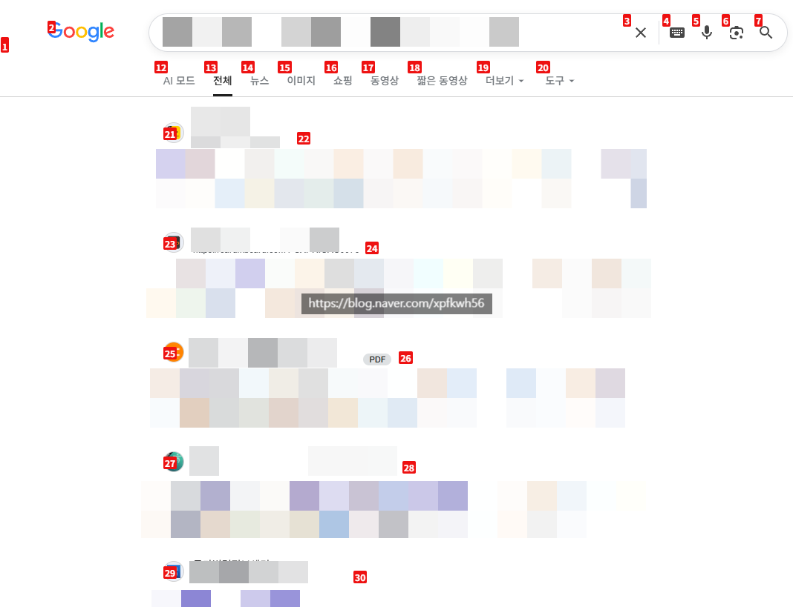
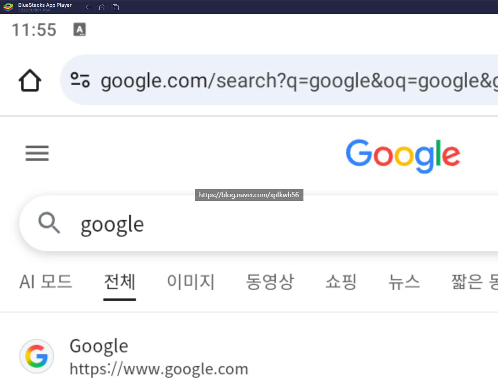

# 블로그, AI 자동화 광고 듣지 마세여 ,,
**Date:** 33분 전
**Category:** 일기장
**Original URL:** https://blog.naver.com/xpfkwh56/224373367071
---

1. 아주 낮은 확률로 아닐 수도 있지만,

​

그걸 알려주는 사람이 갖고 있는 역량이

기대하는 수준보다 **상당히** 낮을 겁니다

​

지피티, 클로드, 제미나이에 소재 던져서

글 써줘 하는 걸로는 블롭에 **다** 걸립니다

​

그럼 결과적으로 어떻게 되느냐?

​

**1) 인건비가 안 나오거나**

**2) 죽어라 써도 돈이 안 됩니다**

​

2. 이건 그냥 제 편향일 수도 있지만,

​

스레드 자체가 주목도/인지도 올린 다음

그거 **바탕으로** 수익 내는 플랫폼 입니다

​

나 주식 초보자, 어떻게 재테크 하지?

로 입문 했다가 나중에 강의 듣거나,

급등주 검색기 가입하고 그러는 것과

​

별 차이 없는 결과를 겪을 확률 높아요

​

3. 아예 초보면 이렇게 하세요

​

1) 일단 블로그를 하세요

AI 쓰지도 말고 그냥 손으로 하세요

​

2) 그리고 **'감'** 이 오는 단계가 오면,

하나씩 **'효율'** 을 올려보세요

​

효율은 둘 중 하납니다

​

들어가는 것을 덜 쓰거나,

나오는 것을 더 많이 뽑거나

​

시작 자체를 AI 를 써서 블로그를

자동화로 돌려보겠다 이게 아니고,

​

**'내가'** 혼자 하려니까 손이 많이 간다

**'사람을'** 부리고 싶은데, 인건비 비싸다

​

그러니까, **'AI'** 로 **'인건비'** 를

대체하겠다 라는 접근이 낫습니다

​

**4. 디테일**

​

fetch로 긁히는 일반론 죽어라 써도

색인에 안 걸리고, 애초에 이런 접근으론

트래픽 트렌드 자체를 못 잡기 때문에

​

100개를 쓰든, 1000개를 쓰든

노출이 안 잡혀서 유입이 안 뜹니다

​

그럼 **시의성** 있는 키워드만 해야 하고,

**특종 사냥꾼** 처럼 살아야 됩니다

​

현실적으로, 그게 얼마나 갈까요?

사람이 지쳐서 못 합니다

​

핵심만 보면,

​

1) 플랫폼에서 트래픽을 땅겨온다

2) 트래픽을 내 수익으로 환원한다

​

이게 끝 입니다

​

근데 저 두 줄로 무슨 말인지 모르겠다,

​

그럼 뭘 배우고 말고 할 것이 아니고

일단 내가 그걸 **붙들고 있어봐야** 됨요

​

5. 콘텐츠 비즈니스 시장이 지금

경쟁자 수준이 그리 높지도 않고,

​

아직 미성숙한 시장이라 쉽게 쉽게

갈 수 있으니 다들 착오하는 건데,

​

그 갭이 **'상당히 빠르게'** 재편되고 있음

​

예를 하나 들어볼까요?

​

​

제가 돌리고 있는 블로그 자동화

파이프라인에 있는 옵션입니다

​

**이게 뭘 하는 거냐?**

​

로컬 LLM 이 자율적으로 브라우저를

들어가서 실제 사람처럼 구글링 합니다

​

**너는 이걸 어떻게 만들었냐?**

​

제가 구글링을 **겁나** 잘 합니다

그러니 어떻게 지시할지를 알죠

​

무슨 정보가 있으면 어떤 각도로,

어디를 파고, 무엇을 뒤적거려야 하나

​

**알고 있으니 그걸 지시하는 겁니다**

​

키워드는 SoM, dom 이라고 하는데

관심 있으면 두 내용을 찾아보면 됩니다

​

**\* IR SoM 같은 건 쳐도 잘 나오지도 않음**

**이 분야, 이 바닥 자체가 워낙 황무지 라서**

​

100콜 이상 쏘면서, 비전 모델이

직접 브라우저를 시각적으로 캡쳐하고

​

동적으로 lora 학습하는 브레인 모델이

임베딩 계산하면서 정보를 수집 합니다

​

그렇게 해서, 매 화면에 나온 정보들을

바탕으로 **'판단'** 한 다음에 근거를 모으고

​

그걸로 **'사고'** 해서 콘텐츠를 씁니다

​

프론티어 모델로 비전모델 굴리면서

몇 백콜? 20X 긁어도 3일이면 앵꼬남요

​

이렇게 돌리면 진짜 빠르면 40분,

​

**\* 이건 트릭이 있음**

​

오래 걸리면 글 1개 집필에

통상 2시간 까지 걸립니다

​

**\* 컴퓨팅 자원만**

**있으면 스케일링 가능**

**​**

**물론 설계는 계속 돌리면서**

**보완하고 손 보면서 패치를 함**

**​**

**→ 직접 제가 블로그에 글을 쓰거나**

**하는 작업은 안 하지만 다른 의미로**

**메타적인 판단이나 구현에 시간을 씀**

**​**

​

웹 브라우저로 안 긁히는 경우는,

​

VPN 도 쓰고 우회 브라우저도 쓰고

블텍으로 모바일 직접 접속도 합니다

​

**\* goto 하면 봇 탐지에 걸림**

​

즉슨, **'인터넷 검색'** 자체를

**'사람이 아니라 AI'** 가 하고 있다

​

라는 것을 이해하고 있어야,

이 판의 **미래** 를 보는 것 임니다

​

6. 원래는 다들 익스플로러를 썼는데

어느 시점부터는 크롬이 1위가 되었고,

​

AI 웹 브라우징이 가능하다,

라는 것이 알려진 시점 이후로는

​

**'웹 표준'** 자체가 **'사람이 쓰기 좋은'**

형태로 두는 것이 경쟁력이 아니라,

​

**'누가, 차세대 인터넷 환경에서**

**AI 를 잘 돌리게 할 수 있는 판'** 을

​

깔아줄 수 있느냐, 로

승부가 갈리고 있음

​

그걸 지금 꽉 잡고 있는 것이

**구글, 마소, 아마존** 이고

​

**\* 셋 중 하나가, 차세대 웹 표준을**

**선점할 것이다 라는 것이 정배**

**​**

세상이 이렇게 돌아가고 있는데,

​

1일 1포, 열심히 꾸준히 콘텐츠 쓰면

나중에 100만원 천만원 번다 ,,

​

라고 접근하는 건

나이브 하다고 생각함

​

7. 사족으로 인공지능 조금 다룰 수 있으면,

예전에 블로그 판에 한창 인기를 끌었던

​

최블이니, 상위노출이니, 블로그 랭킹이니

이런 것들에 대해서 다 동태눈으로 보게 됨

​

8. 와 저거 배우면 꿀 이겠네요?

​

지금 그냥 할 줄 아는 사람이 적으니,

딱히 감독/제약 없어서 돌아가는거지

​

이거도 얼마나 갈까 모르겠는 상태 임

​

나중에는 **'AI'** 가 검색하게 할 때,

비용 청구 의무적으로 하게 할 수도