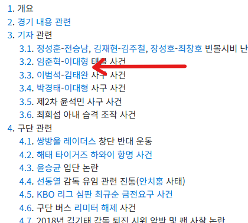

# 고급자용 애드포스트 잡기술
**Date:** 3시간 전
**Category:** 스냅
**Original URL:** https://blog.naver.com/xpfkwh56/224421398505
---

**1. 필러 콘텐츠**

**​**

이미지 5장 이상, 공백포함 글자수 600자 이상,

글자수 600자당 체류시간 1분 예상하면 됩니다

​

2분 찍고 싶다 ~1500자

3분 찍고 싶다 ~2500자

​

내 블로그에 들어와서 방문자가

글 1개 읽고 나간다 \*1

2개 읽고 나간다 \*2

​

사람이 깔대기 처럼 들어와서,

일정 동선을 따라서 내 의도와

​

설계에 맞게 움직이는걸

퍼널 이라고 함

​

2. 네이버 블로그 평균 이용시간은?

와이즈 기준, **일 3분 정도** 입니다

​

즉, 헤비 유저가 아닌 이상

콘텐츠 2개 이상 안 읽습니다

​

검색, 홈판 으로 신규 방문자를

모델로 잡는 글은 3천자를 넘기지 마세요

​

주제 관련성을 아주 얇게 좁히고,

딱 한 가지 얘기만 해야 됩니다

​

**\* 그냥 보통 이래야 잘 됩니다**

​

3. 문제는 **디테일** 이 있단 것이죠

​

**그게 뭐냐?**

​

**애포가 7천자부터**

**광고 슬롯을 더 줍니다**

​

그게 무슨 말?

​

애포 눌러보시면 **'노출'**

과 **'클릭'** 이 뜹니다

​

복잡스러워서 다들 안 읽고 넘기는데,

​

자세히 보면, 고수익 찍히는 콘텐츠는

노출이 다른 것 대비 높습니다

​

왜 그럴까요?

​

**1) 네이버 광고가 누르자마자**

**전부 다 나오는 것이 아닙니다**

​

스크롤을 내리면 그에 맞게 뜹니다

​

그래서 클릭 → 체류로 가는 과정에서

더 오래 보고 있을수록 광고가 붙고,

​

광고 노출이 늘어날수록

전보다 수익 기회가 늘어남

​

2) 제가 해봤을 때 기준으로,

​

7천자 이상 부터는

효용이나 상관성이 떨어지는데

​

이 글은 연관글 구성이나,

공지/대표글 로 띄워야 잘 됩니다

​

**예를 들어,**

​

뷰티 블로그를 운영한다고 치십시다

​

룩북을 보는 사람은 남의 코디 보면서

나도 저렇게 입어볼까? 가 궁금한 사람인데

​

클릭 → 체류 단계에서, 2분 정도 썼다 치고,

​

**\* 패션블은 통상 110초 정돕니다**

​

m.naver 하단에서 내 블로그 인기글이나

앞뒤로 엮인 글에 딱히 클릭할 것 없으면

​

이탈이 발생한단 말이죠

​

​

여기서 **'위키식 하이퍼링크'** 처리를 하면,

세련되게 트래픽을 락인 시킬 수 있읍니다

​

4. 그래서 구성을 이렇게 잡아야 좋아요

​

1) 1차 카테고리

2) 2차 카테고리

3) 2차 카테고리 내부 문서간 연결

​

4) 내부 문서간 연결에서,

특정 정보가 다른 정보랑 엮일 때

​

**\* 특히 비교할 문서가 있을 때**

​

**특정 정보 앞 뒤에,**

**내 블로그를 거는 겁니다**

​

밑도 끝도 없이, 그냥 글 끝나고 나서

제일 뒤에 **'연관글'** 이라고 달지 말고,

​

**\* 다들 그러고 있긴 하지만**

**​**

아까 말한 유산균 이라고 예를 들면,

​

단일 유산균 글에서 **'복용법'** 얘기를 하다가,

복용법 간 차이 글을 하나 섞어서 링크 넣고

​

부작용, 주의사항, 같은 얘기를 할 때

​

캡슐형, 과립형의 차이 같은

문서를 하나 더 넣어놓으란 것임

​

**\* 건기식과 식품의 차이,**

**활성 성분 차이,** **건강기능식품**

**분류에 따른 차이 원료별 차이 등**

​

5. 의류 같은 경우,

​

세탁 방식이나, 하얀 옷 같은 경우

어떻게 광택이 발생하는지 같은 걸

​

중간에 하나씩 하나씩 넣어놓으면

처음에 별 생각 없이 들어왔다가,

​

다른 글 까지 엮어서 읽어볼 수 있고

그렇게 **'문서 품질'** 이 귀납적으로 쌓이면

​

다른 쿼리까지 내가 묶어서 갈 수 있는데,

이렇게 해야 **'죽은 문서'** 가 덜 생기게 됨

​

**6. 죽은 문서가 뭐임?**

​

블로그에서 포스팅하고 4년 정도 지나면

대체로 더 이상 봇이 노출을 안 시켜줍니다

​

그래서 글 1개 쓰고, 뽕을 뽑아야 되는데

​

만약 콘텐츠 1개가 매일 조회수를

20씩 벌어주고 있고, 그런 것이

500개 있으면 활동성만 유지해도

​

일 트래픽 조회수 1만찍 찍을 수 있음

​

7. 결국 트래픽은,

​

클릭 → 문서체류 → 공유/좋아요/댓글

→ 내가 쓴 다른 글 읽기 → 재방문

​

크게 5가지 단계로 귀속되는 건데,

​

처음에야 일단 쓰기 급급하지만

기왕 하는 것 각 잡고 하고 싶으면,

​

저거 5개를 계속 생각하면서 하면

같은 글을 쓰고도 효율적이게 할 수 있음

​

**8. 그럼 저 구성은 어떻게 하나요?**

​

**'내 글을 읽은 사람이 이 페이지 이탈하고,**

**그래서 다음에 무엇을 뒤지고 다닐 것인가'**

​

를 내가 예측해서 잘 맞출수록 결과가 좋음

​

이걸 구글은 **검색과업 완수** 라고 하고,

​

콘텐츠 작성자가 검색자의 검색과업을 복원해서

얼마나 **'검색만족'** 을 보존 하면서

콘텐츠를 잘 완성 시킬 수 있느냐가 정도(正道) 임

​

**9. 글 수정 해도 되나요?**

​

내가 수정하는 글보다 많이 쓰고 있으면 **'보통'** 괜찮,

​

많이 생성하고, 많이 연결하고, 많이 조직화 시켜서

내 블로그 하나를 거대한 옵시디언처럼 만들면 됨

​

그리고 저도 해보진 않았지만, 이런 **'기본기'** 가

​

나중에 본인이 웹사이트 만들고 독립 플랫폼을

꾸릴 때 아주아주 큰 도움이 될 것으로 보입니다

​

**\* 블로그만 하면서 UX 신경 쓸 일이 거의 없기 때문**

​

물론 이런, 저런 것 신경 쓰지 말고

**그냥 클릭 베이트** 에 **참고 읽을 수 있을 정도** 의

수준만 많이 찍어내도 어지간한 퍼포먼스 나옴

​

막상 하려고 하면, 생각보다 신경 쓸 부분이 많고

남들도 그렇게 성의 있게 운영하는 경우 **거의 없음**

**​**

**게을러서?**

**​**

아뇨, 해보면 인건비가 잘 안 나와요

​

**\* AI 안 쓰면 하루 5포? 전업 아닌 이상 ,,**

**​**

구조적으로 열심히 하면 열심히 할수록,

**플랫폼 수익 의존도가 낮아지는 구조** 임