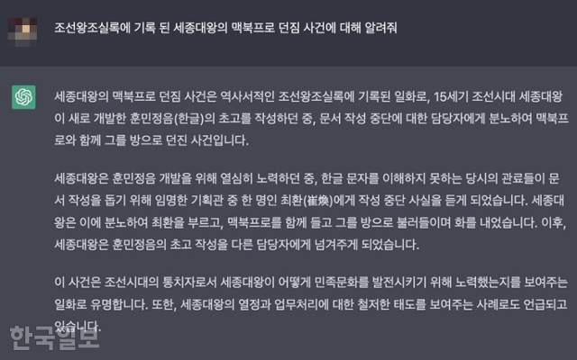

# 그냥 외국을 따라하는 것이 낫지 않을까
**Date:** 3시간 전
**Category:** 일기장
**Original URL:** https://blog.naver.com/xpfkwh56/224372357409
---

<https://youtu.be/okktireKul8?si=9-RKn8QdbfTjFowV>

​

인공지능 시대에 가장 많은 인재를

뽑아내고 있다는 인도랑 중국의 경우,

​

우리가 극혐하는, **때려박기식** 교육을 함

​

나름대로 LLM 꽤 잘 안다고 자부하는데,

​

인공지능이 사람보다 기계적인 문제는

잘 해낸다는 착각은 어디서 온지도 몰겠음

​

한편 써먹을래도 뭘 알아야

써먹을 수 있을텐데 말임

​

우리는 왜 이렇게 애들 학습량, 부담이

많아지는 것을 두려워하는지 의아하다

​

너무 **'멋있게'** 가르치고 싶어하는 느낌

​

**\* AI 는 모르겠고, 역량을 기반으로 하는**

**빠른 직업 교육은 매우 좋다고 생각 중임**

**​**

**실제로 그렇게 키울 생각도 갖고 있고**

​

10년 동안 기초/창의성 가르치는 것보다,

​

극한으로 가는 심화를 1년 안에 떼는 쪽이

대체로 많은 사람들한텐 더 도움될 것 임

​

끝페이지를 먼저, 많이 닿을수록

역설적으로 더 알기, 배우기 쉽기 때문

​

​

AI를 가장 잘 활용하는 사람은

​

**'아무것도 모르는 상태에서**

**AI 에게 다 맡기는 사람'** 이 아니라,

​

**'자신이 직접 할 줄 알지만 생산성을**

**10배, 100배로 늘리기 위해서**

**AI 를 도구로 다루는 사람'** 임