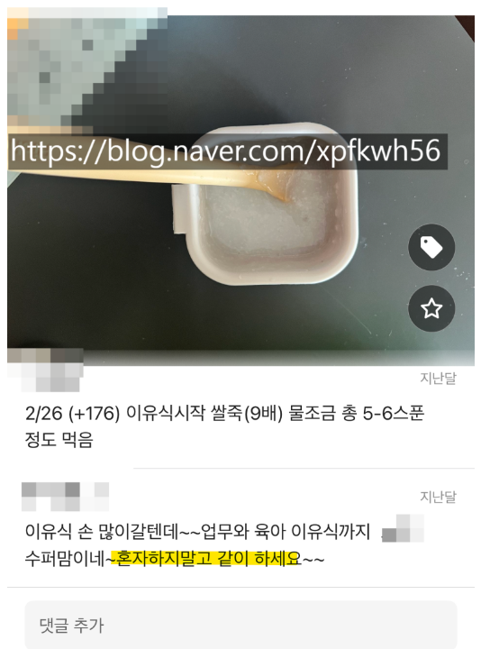

# 시어머니와 데잇트
**Date:** 3시간 전
**Category:** 다이어리
**Original URL:** https://blog.naver.com/xpfkwh56/224251211201
---

1. 내 경우, 시어머니랑 친한 편인데

일단 **꽤 좋은 롤모델이라 생각해서** 임

​

시어머니는 평소에 자기계발이나,

문화생활, 사회봉사 같은 것을 하시구

​

자기가 살아왔던 이야기를 들려주시는데

그 소탈한 코드가 나랑 잘 맞는 편인 듯함

​

2. 아빠가 조만간 미국에 가서

일을 하실 예정이기 때문에,

​

상비약을 구입해서 드리려고 했음

​

어떤 약이 좋을까? 어디서 살까? 하고

​

말로만 듣던 창고형 드럭 스토어를

찾아보던 중에, 이 소식을 공유했음

​

**" 내가 잘 아는 곳이 있다! "**

​

시어머님을 따라서, 종로 5가 소재의

상당히 유명한 약국을 가보게 되었는데

아주 인상 깊은 경험 이었음

​

나중에 1호기랑 같이 이런 종류의,

경험을 하면 좋겠다는 생각을 했음

​

**3. 재미로 보세욬ㅋㅋ**

​

1) 시어머님 지인들이랑 식사 중에

귓동냥을 하면서 들었던 내 생각 들임

​

국내에서 아주 유명한 모 엔터사 대표는

최근 내부 인테리어 공정 작업을 하는 중임

​

시스템 에어컨을 비롯해, 노가다 하는 분들이

들어와서 작업을 하고 있는데 용접도 하고,

통창만 해도 무려 1500만원 짜리를 쓴다 함

​

현장에 있던 사람이 작업을 하던 도중에,

용접 불똥이 튀니까 그 자리에 있던 사람이

질겁을 하면서, **그러면 큰일 난다고 했다** 함

​

이 집에 혹여 기스가 나면, 님이 평생 벌어도

해결이 안 될 **배상책임** 이 생긴다고 했다 함

​

**나는 그걸 듣고, 내 가설이 옳다고 느꼈음**

​

예전에 나는 예식장 알바를 했던 적 있음

거기서 나는 중식홀 서빙을 맡아서 했는데,

​

인원을 감독하는 사람들이 우리를 대상으로

수도 없이 계속 주의를 줬던 내용이 있음

​

**'절대'**, **'절대'** 음식을 쏟지 마라

​

결혼식이나, 행사를 하는 돈 많은 분들은

아주 비싼 옷을 입고 참여하는 편이 많은데

​

드라이값만 발생해도 그 책임이 막중하니까

절대 급하게 하지 말고, 도저히 기운 없으면

그냥 보고하고 뒤에 가서 쉬다가 하라고 했음

​

당시 나는 어렸기 때문에, 그 호텔에서

결혼식을 하려면 얼마를 써야 하나 몰랐음

​

근데 지금 생각하면, **'그 비싼 호텔에서'**,

**'그 비싼 서비스'** 를 위임해서 굴리는데

​

정작 거기서 일하고 있던 것은

최저시급 받고 급조된 상태로

들어오는 인력들이란 점이 **킥** 임

​

**\* 서비스, 장소가 고급이면 뭐 하나?**

**일 하러 온 사람은 최저 시급 알바인데**

**​**

저 공사가 있던 집은 수백억을 호가하는,

아주아주 고급스럽기로 유명한 주택이고

​

그 일을 맡긴 사람 역시,

천억도 아니고 **조 단위** 자산가인데

​

결국 본인이 **총괄해서** 일을 맡기지 않으면

**저렇게 흘러갈 수 밖에 없구나** 라는 생각 함

​

이게 내가 **남을, 돈을 믿지 않는 이유** 임

​

2) 종로 5가에 있는 아주 유명한 약국은,

많은 약사들이 마치 컨베이어처럼 움직임

​

시어머니는 특정 시간대가 사람이 없구,

자기가 아는 사람이 있다고 언질을 주셨음

​

미리 연락을 한 이후, 우리는 방문한 다음

​

간단히 이 약들이 왜 필요하고,

어떤 목적에서 구입해야 되는가?

​

같은 내용을 듣고, 거래를 끝냈음

​

서비스 수준은, **'괜찮았다고'** 생각함

​

**\* 주변이 도때기 시장 그 자체인데,**

**차분하고 느릿느릿하게 약에 대해서**

**설명하는 약사님이 독특하게 느껴졌음**

**​**

이게 무슨 대단한 차이는 아니지만,

해당 약국은 이직/퇴사율이 꽤 높은데

​

고정으로 일을 하는 약사랑,

변동성 있게 하는 분들이 있고

​

그냥 **'내 생각에는'**, 아무렴

후자보다는 전자가 조금이라도

섬세하게 일을 하는 것 같았음

​

**특이한 점은 거래의 끝에 있었음**

​

내가 아는 바에 의하면, 이 약국에서

파는 약들은 통상적인 시세 보다는

​

적게는 20%, 심하면 30% 이상

더 저렴하게 판매 되는 편이었는데,

​

시어머님은 미국에 들고 갈 때,

​

어떤 상비약이 필요하고,

무엇이 통관이 쉽고,

어떤 경우에는 위탁 수하물로

보내야 좋은 것인지를 **대리했고**

​

괜찮은 영양제가 없냐고 물었음

​

약사분은, 자연스럽게 하나 권했고

내가 산 약 값의 2-3배 이상을 주고

영양제를 몇 개나 사서 따로 챙겨가심

​

이게 **'옛날 어른들의 방식이군'** 을 느낌

​

**\* 무언의 약속**

**​**

이 영양제는, 대단히 가성비가 좋거나

그렇다고 대단히 어떤 특이한 건 아닌데

​

온라인으로 판매되지 않는 약국 독점

직통 판매 물건으로 보였고, 집에 오며

성분을 비교/검색해보니까 흠도 없고,

​

그렇다고 뭐 엄청난 장점도 딱히 없는

**'전형적인'** 상품인 것처럼 보였음

​

3) 어쩌다 법률 시스템에 관한 대화가

나와서 서로 이야기를 나누던 도중에,

​

시어머님이 과거, 변호사를 썼던 얘길 함

​

종로에 엘칸토, 에스카이아 건물 사이에

황산성 변호사 라는 분이 있었다고 함

​

지금으로 따지면, **인플루언서 변호사** 로

**상당한 명성** 을 떨치고 있던 분이라 하는데

​

**90년대** 에 **30분** 에 **'20만원'** 을

지불하고 상담을 받으셨었다고 함

​

90년 기준, 최저 임금이 700원 이고

99년 기준으로 잡아도 2천원이 안 됨

​

머리로 주판을 쳐봤을 때, 그 금액 자체가

나는 도저히 낼 엄두도 못 낼 금액 같아서,

​

어떠셨냐고 후기를 물어봤는데,

​

지금 이게 무슨 사건인지,

그리고 재판 절차가 무엇인지

설명 듣다가 시간이 다 끝나서

​

수임해야 되는데, 자긴 잘 모르겠어서

하지 않고 넘어가신 적이 있다고 했음

**​**

**\* 너무 오랜 기억이라, 당연히**

**정확하진 않고 그냥 어떤 사람이**

**과거에 겪었던 썰이라 신빙성 X**

​

불과 20-30년 전만 해도

그럴 수 있었구나, 싶었는데

​

한편 그럴만 하다 싶기도 했음

​

**\* 인터넷이 있나, 뭐가 있나**

​

공무원한테 무언가를 요청할 때도,

따로 현찰을 쥐어줘야 일이 진행되고

​

학교에서도 교사한테 돈을 안 가져오면

일부러 매를 때리는 야만의 시대가

​

**'진짜'** 로 있었다고 **'진짜'** 그 시기를

겪었던 사람의 입으로 들으니 재밌었음

​

4) 그 외에 기억에 남는 대화

​

나 " 매일 나이는 먹는데,

내가 잘 사는 것인지 가끔은

헷갈릴 때가 있는 것 같다

더 나이를 먹으면 다른가? "

​

→ 먹어도 비슷하다,

​

40 까지는 내가 어떻게

살았나 기억도 잘 안 난다

​

정신 차리고 눈 떠보니,

할매가 되었다

​

나 " 나이가 들면 어떤가? "

​

→ **세상이 자비가 없다**

​

길게 말씀하셨는데 요지만 꼽으면,

​

만약 지방에서 올라온 대학생이

임대인한테 제가 상경을 해가지고

자금이 부족해서 조금 어렵습니다

​

혹시라도 가능하다면, 월세를

3만원만 깎아주실 수 있을까요

​

같은 이야기를 하면, **'도와줌'**

​

그리고 그걸 딱하고,

심지어 **기특하게** 여김

​

**\* 세상 살 줄 아네, 같은 느낌**

**​**

그러나, 나이 50/60 먹은 사람이

똑같은 제안을 집주인에게 하면

​

저 사람은 저 나이 먹고도 왜 저럼?

같은 반응을 보인다는 것을 **알기에**,

​

그런 말을 할 **엄두**도 못 낸다고 하심

나는 저 이야기가 꽤 섬뜩하게 들렸음

​

**5) 다시 살면 어떻게 살고 싶으세요?**

​

요즘 애들 너무 부럽고 똑똑한 것 같음

​

나는 결혼 안 함, 쿨하게 만나고

쿨하게 헤어지고 내 인생 살 것임

​

**\* 眞 페미니스트 아우라**

**60대 여성이라 진정성 넘침ㅋㅋ**

**​**

**​**

내가 너였으면 난 니 서방이랑

결혼 안 했을 것 같음

​

그래서 늘 미안하고 고마움

​

이라고 말씀 하심ㅋㅋㅋ