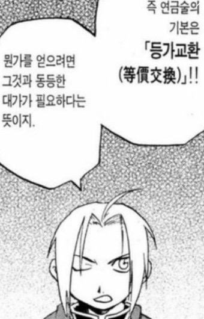
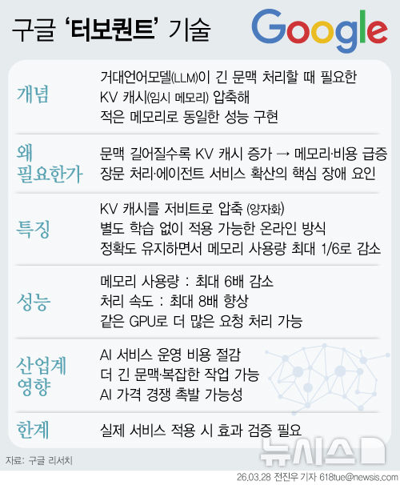
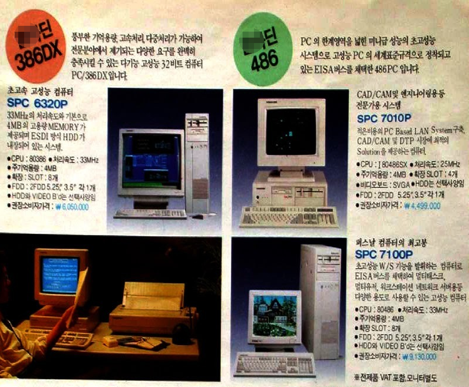
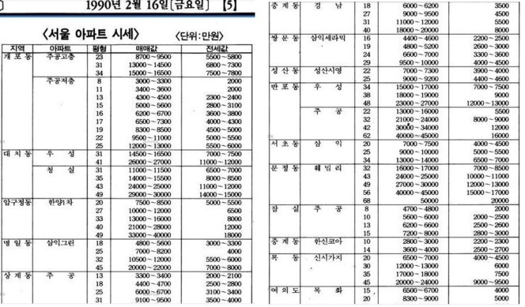
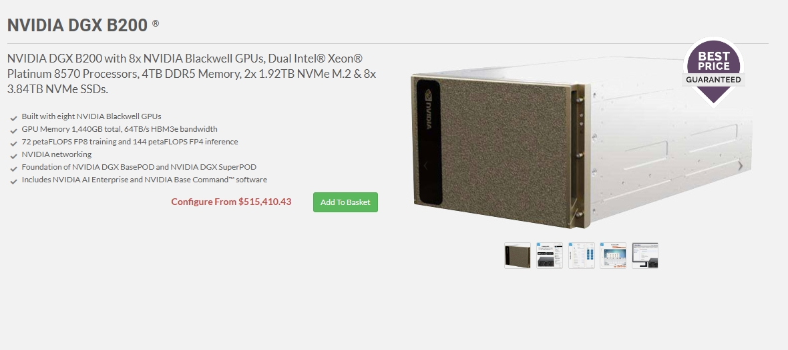

# 차세대 HBM 에 대한 생각
**Date:** 3시간 전
**Category:** 다이어리
**Original URL:** https://blog.naver.com/xpfkwh56/224268462918
---

1. 파운드리가 어떻겠다, 반도체가 뭐다

​

이런 이야기가 아니고 그냥 내가 아는 선에서

딱 이런 기술도 있다 정도로만 말하는 것임

​

2. 회장님이 말씀하신 것처럼

아무튼 메모리가 크면 좋은 건 맞음

​

근데 **'왜'** 커야 되느냐 가 필요함

​

3. 원래는 RNN 이라고 부르는 한 글자씩

순차적으로 처리하는 기술이 있었음

​

나는 오늘 밥을 먹었다 라고 하면,

나는 → 오늘 → 밥을 → 먹었다

이런 식으로 계산할 수 있었음

​

​

순차적으로 하니까 일단 느렸고,

문장이 길고 복잡하면 복잡할수록

정보를 제대로 잡기가 어려웠음

​

**\* 먼저 나온 앞쪽 토큰의 영향력이**

**뒤에 나온 뒷쪽 토큰보다 더 낮아짐**

**​**

Transformer 논문이 나오고,

Self-Attention 이란 기술이 나옴

​

모든 단어가 모든 단어를 동시에

병렬적으로 직접 쳐다볼 수 있게 함

​

순차대로 처리할 필요가 없으니까

속도가 빨라졌고, 정보와 정보 간의

거리가 길어져도 처리가 잘 돌아갔고

​

데이터와 모델을 키우면 키울수록

성능이 직접적으로 바로 향상 되었음

​

그래서 트랜스포머 기술이

LLM 을 포함한, 현대 인공지능에

표준으로 자리를 잡게 되었음

​

**4. 소결**

​

RNN = 글자를 하나씩 읽음

읽다 보면 앞에 있는 것 까먹음

​

Transformer =

글자를 동시에 읽음

​

1) 동시에 할 수 있어서 더 빠름 (병렬)

2) 멀리 있는 정보도 잘 잡아냄 (어텐션)

3) 키우면 키울수록 더 좋아짐 (스케일링)

**​**

**왜 키우면 키울수록 좋아짐?**

​

​

몰?루

​

5. LLM 이 텍스트를 만들 때는,

**'토큰'** 이라고 하는 것을 생성함

​

**'나는 밥을'** 까지 만들었으면,

​

다음 토큰을 예측하려고

확률 계산을 하게 됨

​

이걸 **어텐션** 이라고 함

​

사과는 빨갛고 맛있었다

나는 **'그걸'** 좋아했다

​

라는 문장이 있다고 가정함

​

저기서 **'그걸'** 은 뭐를 의미함?

당연히 **'사과'** 임

​

그럼 저 문장에서

​

**'어떤 글자'** 가, **'어떤 단어'** 가

가장 높은 정보 밀도를 갖고 있음?

​

이걸 판단하는 것이

**어텐션 알고리즘** 임

​

한 번의 어텐션은

단일 관점만 잡아서 처리함

​

이걸 헤드라고 하는데,

​

어떤 헤드는 문법 관계

어떤 헤드는 대명사 참조

어떤 헤드는 의미적 유사성 (시멘틱)

어떤 헤드는 글자 간의 위치 관계 등

​

복잡한 다층 레이어를 갖고,

​

각 단어가 다른 단어들에

얼마나 주목할 것인지를

​

일정 가중치로 계산한 다음에

가중 평균으로 정보를 모은 후,

​

그걸 기반으로 정보를 판단하게 됨

​

**6. 정리**

​

어텐션 = 어떤 정보를 읽고

의미를 차등해서 부여하는 것

​

**7. 여기서 병목이 생길 수 있음**

​

연산 때, 모든 단어가 모든 단어를

동시에 쳐다볼 수 있는 것은 Ok 인데,

이미 본 단어를 다시 볼 필요는 없음

​

**나는 밥을 먹었고**, 그 밥은 맛있었다

​

라는 문장이 있을 때,

​

이미 **'나는 밥을 먹었고'**

라는 부분의 연산이 끝났으면

​

그걸 굳이

**'한 번 더 볼 필요'**

**​**가 없단 것임

​

**'없는'** 단어를 연산하는 것은 불가능하므로

​

**\* 안 보이니까**

​

새로 추가된 **'봐야 될'** 부분만 연산하고,

​

이미 연산이 끝난 것은 기억해놨다가

그걸 다시 쓰면 작업을 절약할 수 있음

​

1) 나

2) 나는

3) 나는 밥

4) 나는 밥을

​

이렇게 있을 때,

​

4번 단계에서, 이미 3번까지는

다 어텐션이 들어간 상태니까

​

다시 어텐션 계산을 하지 말고,

이미 계산된 결과만 들고

​

나는 밥+**'을'** 에서

을 부분만 하면 된단 것임

​

이런 방식을 쓰면 종래의 기법은

스텝당 비용이 **O(N²)** 형태인데,

**O(N)** 로 바꾸는 것이 가능함

​

**차수 단위로 내려가 버리니까,**

비용 효율이 폭발적으로 감소함

​

**\* 2^10 = 1024, 2^9 = 512**

**차수를 하나만 내려도 드라마틱**

**​**

이 기술을 **'KV 캐시'** 라고 함

​

8. KV 캐시는 **컨텍스트** 라고 하는,

어떠한 맥락 정보를 담는 그릇임

​

내가 오늘 비가 온다는 정보를 알음

우리 신랑이 밖에 나가려고 하고 있음

​

1) 그럼 **'비가 온다 → 우산 필요'**

2) 우산을 제안한다

​

라고 **'추론'** 을 할 수 있는데,

​

우산을 제안하기에 앞서,

​

비가 온다, 우산이 필요하다

라고 어떤 의사결정에 앞서서

​

단서 를 보유하는 메모리를

**컨텍스트** 라고 부르는 것임

​

딱 봐도 컨텍스트가

많으면 많을수록,

​

**'똑똑할'** 것 같은데

이게 모조리 **VRAM** 을 먹음

​

100k 컨텍스트 기준으로,

수십 gb 정도는 가뿐히 쌓임

​

**\* 하기 나름이겠지만**

​

GTX 5090 GPU (32GB) 가

금일 가격으로 600만원 정도고,

​

RTX A6000 (48gb) 는 천만원

H100 (80gb) 은 5천만원 쯤 함

​

80gb 5천주고 돌릴 바에야,

​

32gb \* 2 하면 64gb 인데

1200만원 쪽이 합리적이네?

​

직렬 연결이랑, 병렬 연결이 다르고

대역폭이랑 전력, 서버용, 컨슈머용

​

이런 식으로 복잡한 디테일이 있어서,

실제론 사칙연산으로 해결이 잘 안됨

​

결론은 **'VRAM = 돈'** 이다

라고 간략하게 알아도 충분함

​

**9. 정리**

​

VRAM = 필요한 것

VRAM 이 많이 필요 = 비싸다

VRAM 이 적게 필요 = 싸다

​

KV 캐시 = VRAM 요구량 낮춘다

KV 캐시 압축률 = 저렴해지는 것

​

​

압축률을 하면? → 성능 손실 발생

​

**\* 공짜는 없음**

**​**

압축은 압축대로 잘 하는데,

손실이 적으면? → **안 할 이유 X**

​

10. 그래서 돈도 아끼고, 전기도 아끼고,

냉각 비용도 아끼기 위해서, 똑똑한 분들이

​

여러 가지 기술을 발전시키게 됨

​

SWA = 가까운 것만 보자

NSA = 중요한 것만 보자

​

MLA = KV 를 직접 저장하지 말고,

중요하지 않은 부분은 더 깎아서 저장하자

​

Linear Attention = 연산 방식을 바꾸면,

O(N²) 가 아니라 O(N·d²) 로 할 수 있는데

이렇게 하면 메모리가 늘어나지 않는다!

​

**\* 동시 다발적이고, 누적적**

**​**

하드웨어 엔지니어들은,

더 **'크게'** 담을 수 있는 것이 목표

​

소프트웨어 엔지니어들은,

더 **'많이'** 담을 수 있는 것이 목표

​

가 된 것임

​

**11. 하드웨어 발전 속도는 필연적으로**

**소프트 웨어 발전 속도보다 느리게 됨**

​

​

26년 3월, 불과 1-2개월 전

​

구글에서 **'터보 퀀트'**

라는 기술을 공개 했음

​

그래서 그걸 사용하면

KV 캐시(메모리) 를

대체 얼마나 줄여주냐?

​

최소 **4배**, 감수할 수 있는

손실까지 감안하면 **6배** 임

​

원래 32GB VRAM

1장에 돌릴 수 있던 양이

​

6배 압축되었으니까

**192GB** 까지 가능해짐

​

보수적으로 3.xx 배 잡아도

**32\*3 = 96gb** 인데

​

RTX PRO 6000 (96gb)

모델 값이 **1700만원** 정도임

**​**

**12. 정리**

​

원래 1700만원 있어야 됐다

​

근데 이제 600만원만 있어도

거의 똑같은 성능을 쓸 수 있다

​

13. 집에서 돌리는 GPU 들은

크기도 작고, 용도도 제한적이고,

​

만드는 난이도가 그렇게 막

복잡하고 특수하지 않지만,

​

산업용 모델의 경우, 아주 어렵고

아주 복잡하고, 아주 특수한 편임

​

그래서 크기가 크면 클수록 **'비쌈'**

​

​

근데 **'큰 용량 GPU'** 가 없어도

충분히 돌릴 수 있다면 어떨까?

​

​

90년대 초반, 최저임금이

천원 따리 할 시절,

​

PC 가격은 무려

600만원에 육박했음

​

​

지금 컴퓨터 10대 살 돈으로

집 사는 것은 **'택도 없는'** 소린데,

​

B200 GPU = $515,410

​

최고급 GPU 10대 정도면

**거의** 아파트값에 비빌 수 있음

​

**14. 소결**

​

하드웨어를 아주 잘 만들어도,

​

가격이 비싸면 소프트웨어 레벨에서

구매 유인이 떨어질 가능성도 있고

​

이 경우, 고메모리 반도체 시장에 관한

평가가 달라질 수 있단 시각도 있음

​

**15. 결론**

​

현재 기준으로, 위와 같은 의견은

상반된 두 가지 입장을 갖고 있음

​

1) 소프트웨어 급격한 혁신이

궁극적으로 온디바이스 AI 라는

방향으로 귀결될 가능성이 높다

​

그러니까, 매우 비싼 GPU 가

없더라도 **경량화 된** 하드웨어 에서

충분히 AI 를 돌리게 될 것이다

​

2) 소프트웨어 레벨의 혁신이 있어도,

**더 싸졌으니까 더 많은 돈을 때려박아서**

​

더 많은 연산을 하게 할 것이므로,

​

어차피 고메모리 반도체에 대한 수요는

여전히 견조할 것이다 라는 측이 대립됨