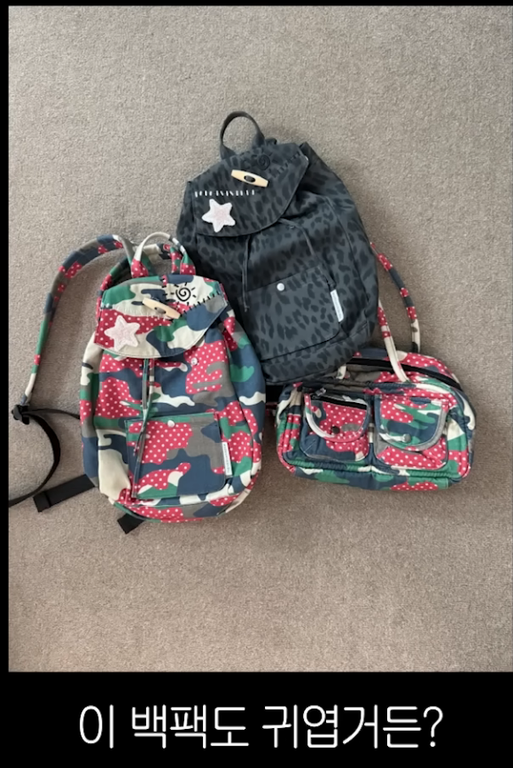
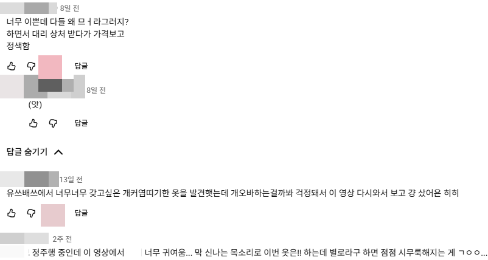

# 콘텐츠 글쓰기 LLM 의 능력은
**Date:** 3시간 전
**Category:** 일기장
**Original URL:** https://blog.naver.com/xpfkwh56/224372336933
---

쓰기 엔진이 아니고 읽기 엔진을

더 잘 만드는 것에 성능이 **직결** 됨

​

사람 말로 비유해서 설명한다면,

​

요즘 유명인들이 갖고 있는

**'나락방지 센서'** 라는 것이 있음

​

이거는 해도 된다, 이건 문제가 된다,

라는 것을 LLM 이 스스로 판단 한다?

​

**'불가능'** 함

​

심지어 사람도 가능한 사람이 있고,

불가능한 사람이 있는데

​

이 능력이 **'사회성'** 산물이란 말임

​

퍼포먼스 마케팅이나, 콘텐츠 비즈니스 관련해서

노하우 자체가 대체로 학계보다는 스타트업이나

직접 대가리 박은 사람들 구전으로 흘러 내려와서,

​

착안한 발상을 써보는 수 밖에 없는데,

​

LLM 한테 다양한 상황, 조건 꾸러미를 제공하고

사회적인 규칙들을 분석하게 한 다음에

그걸 일관화 시키면 글이 더 **'예쁘게'** 나옴

​

예를 들어보겠음,

​

어떤 여자 유튜버가 있는데 팬덤이 **강함**

그 유튜버가 **자기 장바구니 콘텐츠** 를 함

​

댓글을 보면, 에바다 사지마라, 줘도 안 갖는다

돈 아깝다 저걸 왜 사냐 같은 얘기가 있는데

​

​

실제 내용을 보면 다소 **난해한** 부분이 있음

​

​

그 난해한 부분이 있음에도 불구하고,

어떤 댓글들은 사고 싶으면 사라, 잘 어울린다,

좋아보인다, 라는 식으로 **'편'** 을 들어주는데

​

이게 굉장한 **'복합추론'** 임

​

**\* 설계자가 저 커뮤니케이션의**

**발화 의도 레이어를 못 읽으면**

**당연히 구조를 짜는 것도 불가능**

**​**

​

LLM 한테 이 전체 내용을 읽게 시킨 다음에,

**'커뮤니케이션 관습'** 을 알게 하는 것 임

​

**[****추구미는 있는데 코디력이 개밤티인 경우]**

​

라는 댓글에서 **'밤티'** 가 무슨 뜻인지 몰라도

얼추 다른 댓글이랑 조합하면 의미 파악이 되고,

​

추구미, 라는 단어를 찾다가

**'도달 가능미'** 라는 단어로 확장하고

​

**'마라탕임?'** 이라는 어휘를 읽은 다음에

마라탕 = MZ 집단을 의미하는 표현 처럼

​

**'사람'** 이 생각할 수 있는 패턴을 넣어주면

기본 모델 특유의 AI 냄새나는 글이 덜 나옴

​

**\* Pragmatic Reasoning**

​

결국 **단순히 글 써주는 AI 돌려보기** 가 아닌,

​

최대한 사람이랑 분간하기 어려운 LLM 을

만든단 목표의 하부 주제로 글쓰기를 넣어야 됨

​

**\* Low Entropy → NG**

**​**

그래야 블롭에 안 걸리는 것임