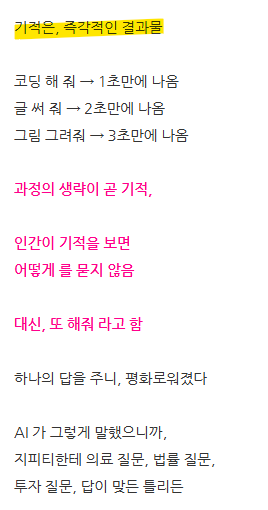

# 클로드 '코드' 를 쓰세요
**Date:** 3시간 전
**Category:** 다이어리
**Original URL:** https://blog.naver.com/xpfkwh56/224249890468
---

1. 지피티 결제해서 쓰고 계시면,

API 로 쓰면 어떤 차이가 있냐 물어보고

같은 돈을 주고 써도 API 로 쓰세요

​

2. 제미나이 쓰고 계신 상태라면,

웹 모델만 사용하지 마시고 구글에서

제공하는 AI 스튜디오 라고 있는데

​

처음에는 어색할 수 있지만,

훨-씬 성능이 좋으니 이걸 쓰세요

​

3. 클로드는 **'클로드 코드'** 를 쓰세요

​

CLI 환경에서 쓰면 좋고,

리눅스 에서 쓰면 **더** 좋습니다

​

위에 있는 셋을 처음 해보려고 하면,

​

키오스크 앞에 놓인 중년이 된 느낌을

받을 가능성이 **상당히** 높은데요

​

**\* 알면 아무것도 아닌데,**

**모르면 앞이 캄캄하기 때문**

​

일단 돌려보면, 세상이 달라졌구나

라는 것을 실감하기 **아주** 쉽고,

​

그제야 비로소 **AI 가 뭐다**,

를 알 수 있어짐

​

https://blog.naver.com/xpfkwh56/224195811376

​

**'기적'** 같은 괴력난신에 취하지 말고,

이걸 과학과 기술의 영역으로 둬야 됨

​

**4. 배경지식**

​

스타크래프트 라는 민속놀이 가 있음

​

원래 맵에디터 를 써서 만들 수 있는

기본적인 구현과 구성이 있는데,

​

데스나이트 라는 어떤 맵 에디터가

**'신의 기술'** 이라는 이름으로,

원래 안 되던 것을 할 수 있게 만듦

​

마린이 히드라처럼 공격을 하거나,

저그 유닛에 쉴드를 붙이는 등의

​

**기적** 을 보여준 것인데,

​

초기에는 그 자체가 너무 놀라우니까

이거로 뭐도 된다, 뭐도 된다 하면서

​

커뮤니티에서만 들썩들썩 거렸지만

차후, 그 기술이

​

데스 스코어라고 하는, 수치를 통한

일종의 오버 플로우 기술임이 알려지고,

​

**E**xtended **U**nit **D**eath

​

EUD 라는 기술로 명명되기 시작하면서

빠르게 발전했던 전례가 있음

​

세계 각지에는 **'홍수신화'** 가 많은데,

​

다른 국가들과 달리 이집트의 경우,

홍수를 신이 내린 재앙 같은 것이라기보단

​

자연스러운 과학적 범람,

통제 가능한 기술로 인지함

​

현상을 기적으로 읽을 것인지,

과학과 기술로 해석할 것인지는

​

내가 그걸 어떻게 대할 것이냐에 달림