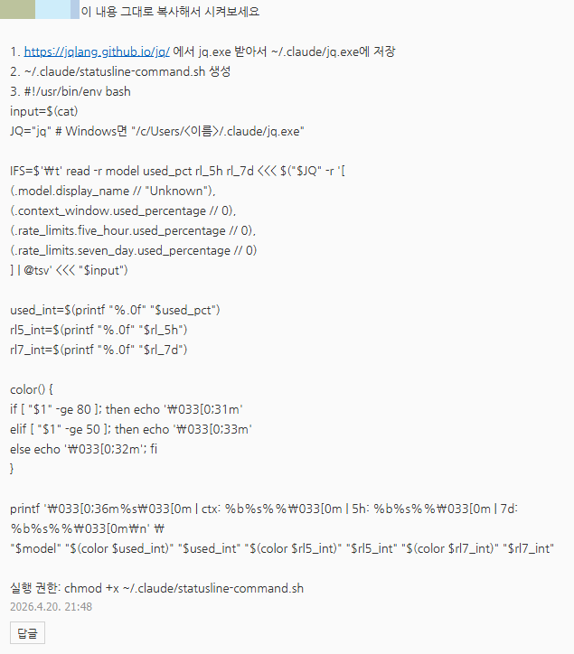
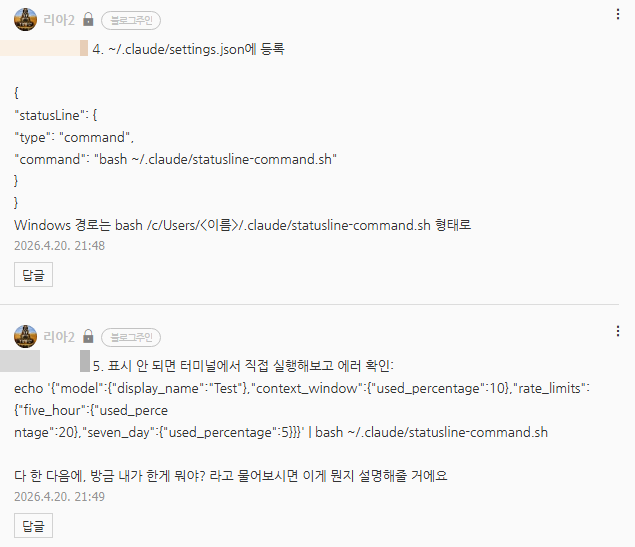

# 터미널 클로드 쓸 때, 있으면 좋은 것
**Date:** 3시간 전
**Category:** 다이어리
**Original URL:** https://blog.naver.com/xpfkwh56/224259228768
---

​

1. [https://jqlang.github.io/jq/ 에서 jq.exe 받아서 ~/.claude/jq.exe에 저장](https://jqlang.github.io/jq/%C2%A0%EC%97%90%EC%84%9C%C2%A0jq.exe%C2%A0%EB%B0%9B%EC%95%84%EC%84%9C%C2%A0%7E/.claude/jq.exe%EC%97%90%C2%A0%EC%A0%80%EC%9E%A5)

2. ~/.claude/statusline-command.sh 생성

3. #!/usr/bin/env bash

input=$(cat)

JQ="jq" # Windows면 "/c/Users/<이름>/.claude/jq.exe"

​

IFS=$'\t' read -r model used\_pct rl\_5h rl\_7d <<< $("$JQ" -r '[

(.model.display\_name // "Unknown"),

(.context\_window.used\_percentage // 0),

(.rate\_limits.five\_hour.used\_percentage // 0),

(.rate\_limits.seven\_day.used\_percentage // 0)

] | @tsv' <<< "$input")

​

used\_int=$(printf "%.0f" "$used\_pct")

rl5\_int=$(printf "%.0f" "$rl\_5h")

rl7\_int=$(printf "%.0f" "$rl\_7d")

​

color() {

if [ "$1" -ge 80 ]; then echo '\033[0;31m'

elif [ "$1" -ge 50 ]; then echo '\033[0;33m'

else echo '\033[0;32m'; fi

}

​

printf '\033[0;36m%s\033[0m | ctx: %b%s%%\033[0m | 5h: %b%s%%\033[0m | 7d: %b%s%%\033[0m\n' \

"$model" "$(color $used\_int)" "$used\_int" "$(color $rl5\_int)" "$rl5\_int" "$(color $rl7\_int)" "$rl7\_int"

​

실행 권한: chmod +x ~/.claude/statusline-command.sh

​

4. ~/.claude/settings.json에 등록

​

{

"statusLine": {

"type": "command",

"command": "bash ~/.claude/statusline-command.sh"

}

}

Windows 경로는 bash /c/Users/<이름>/.claude/statusline-command.sh 형태로

​

5. 표시 안 되면 터미널에서 직접 실행해보고 에러 확인:

echo '{"model":{"display\_name":"Test"},"context\_window":{"used\_percentage":10},"rate\_limits":{"five\_hour":{"used\_perce

ntage":20},"seven\_day":{"used\_percentage":5}}}' | bash ~/.claude/statusline-command.sh

​

다 한 다음에, 방금 내가 한게 뭐야? 라고 물어보시면 이게 뭔지 설명해줄 거에요

​

**6. 이게 뭔데요?**

​

터미널에 한도 띄워주는 겁니다