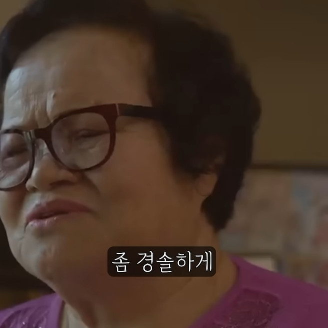
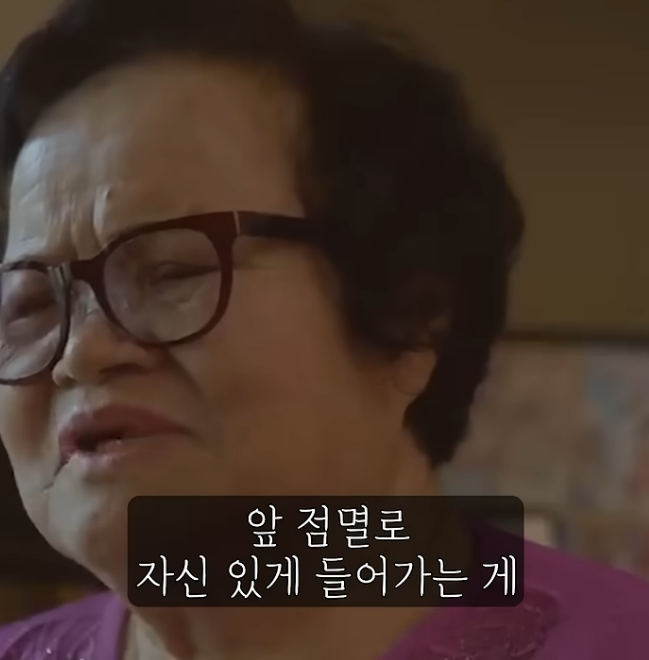

# 행운과 재능
**Date:** 3시간 전
**Category:** 다이어리
**Original URL:** https://blog.naver.com/xpfkwh56/224257909302
---

1. 어느 기초생활수급자 가정이 있었음

​

부모님은 이혼을 하셨고,

할머니, 할아버지, 남동생과

15평 집에서 살고 있었음

​

아이는 새벽 4시까지 매일 게임을 했는데,

할머니는 그저 항상 응원을 해줬음

​

그는 13년 고등학교를 중퇴하고,

17세에 프로게이머에 데뷔를 함

​

데뷔 전에서, 세계에서 제일 게임을

잘 한다는 팀을 만났고, 세계에서

제일 미드를 잘 한다는 사람을 만남

​

그 게임에서 MVP 를 받으면서

온갖 대회에서 우승을 휩쓸음

​

얘가 누구냐? **페이커** 임

​

페이커가 수급자로 얼마를

받았나는 모르겠지만,

​

정성적 문화적인 공헌도, 영향력과

정량적 순수 납세액 기준으로 보면

​

국가 기준, **투자 대성공** 임

​

그냥 게임만 하라고 방임했으면, 앞점멸 같은 표현은 알 수가 없음

​

2. 페이커 정도 되면

할머니도 다르구나 (x)

​

**'절대적 지지를 보이는 1명의 팬이**

**오늘날 최고의 선수를 만든 것'** (o)

​

아마? 다른 남자들이 그런 것처럼,

​

별 관심도 없는데 혼자 주저리주저리

떠드는 것을 성의 있게 잘 들어주신 듯

​

<https://youtu.be/PabDB33qYys?si=miooKZO-N3FRGfjU>

​

저 기출은 **희웅이 케이스**에도 나옴

​

**\* 눈을 마주친다,**

**대화를 경청한다**

**​**

**→ 어렵지만 가치 O**

**​**

영재교육이니 뭐니 말이 많지만,

​

결국 아이한테 **관심** 을 갖고,

적성과 흥미를 보이고 있는 것을

​

**'같이'** 좋아해 주는 것이

거의 왕도적인 방법인 것 같음

​

3. 내가 현재 집중하는 것은,

아이의 재능이나 이런 쪽이 아님

​

어디로 방향이 터질진 모르지만

**'의지'** 를 꺾지 않는 것이 **목표** 임

​

아이를 영재로 만드는 것이 목표면 안 됨

​

아이가 몰입하고 있다는 사실 자체를

존중하는 부모가 되겠다를 목표로 삼는 것이

내 생각에는 더 좋은 길이라고 생각함

​

방향과 속도는 **'아이가 정하는 것'** 임