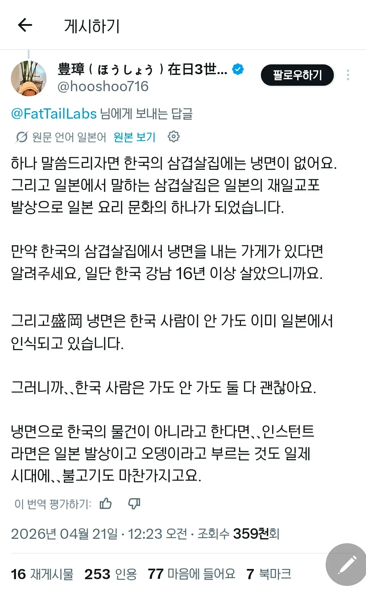

# 한국어 코퍼스 데이터의 유무
**Date:** 44분 전
**Category:** 다이어리
**Original URL:** https://blog.naver.com/xpfkwh56/224260616313
---

​

1. 커뮤에서 꽤 이슈가 되고 있는 글이다

​

내용을 보면, 글쓴이는 강남에서 16년 이상

거주한 사람이고 한국 삼겹살 집에서는

냉면을 따로 판매하지 않는다고 주장을 함

​

2. 이걸 실제 한국에서 20년 이상

거주한 **'인간'** 이 해석한다고 가정하자

​

**1) 개소리다**

​

고기구이 집에서 냉면을 팔지 않는다

라는 것은 상당히 납득하기 어렵다

​

동네에 있는 어지간한 식당을 가도,

냉면과 고기를 같이 파는 곳들이 많고

​

삼겹살까진 아니더라도 육쌈냉면이니

경상도 특유의 고기/밥 문화 등등을 보면

​

냉면+고기 조합이 남조선 문화를 볼 때,

대단히 낯설고 이질적인 개념도 아니다

​

**2) 그럴 수도 있다**

​

이제 이런 것이 **'코퍼스'** 데이터 인데,

글쓴이는 **'강남'** 에서 거주했다고 한다

​

강남조차 어디 강남이냐에 따라 다르겠지만,

뭐 본인 라이프 스타일이 **아주** 특이해서

​

늘, 100% 삼겹살만 파는

식당만 갔을 수도 있고

​

사장이 고집이 있어서, 고기집에서는

고기만 팔아야 겠다는 철학이 있다면

**​**

**\* 전문점 곤조**

​

또 그게 **아예 불가능한**얘긴 아닐 수 있다

​

거기에 **'냉면'** 의 퀄리티도 지적할 수 있는데,

​

인스턴트로 그냥 육수, 면 구해다가

삶고 빨리 뽑는 것을 냉면으로 안 정의하고

​

전문점급으로만 서빙하는 것을

냉면이라고 정의하면 저 말도 맞다

​

**\* 삼겹살 파는 곳에서 전문점 퀄리티로**

**냉면을 뽑는 곳은 실제로 보기 아주 어렵**

​

3. 똑같은 주장도 읽는 방식에 따라서,

언어를 정의하고 기준하는 방식에 따라서

​

또 각자의 경험칙과 상식에 근거해서

맞을 수도, 틀릴 수도 있는 일이 많은데

**'해상도'** 차이로 해독이 안 될 수도 있음

​

한국어 코퍼스 데이터가 높으면 높을수록

모델의 도메인 해상도가 높을 확률이 있고

​

이 능력은 실사용에 **아주 큰 영향** 을 미침

​

**4. 돈 주고 프론티어 모델을 쓰는 이유는?**

​

프론티어 모델은 지식 컷 오프를 업뎃하면서

이런 데이터를 **'실시간 업데이트'** 하기 때문

​

좋은 의미로는 금액을 지불한 대가로,

빅테크가 알아서 처리해주고 있는 것이고

​

나쁜 의미로는 내 돈을 내고,

모델 향상에 조력하고 있는 셈