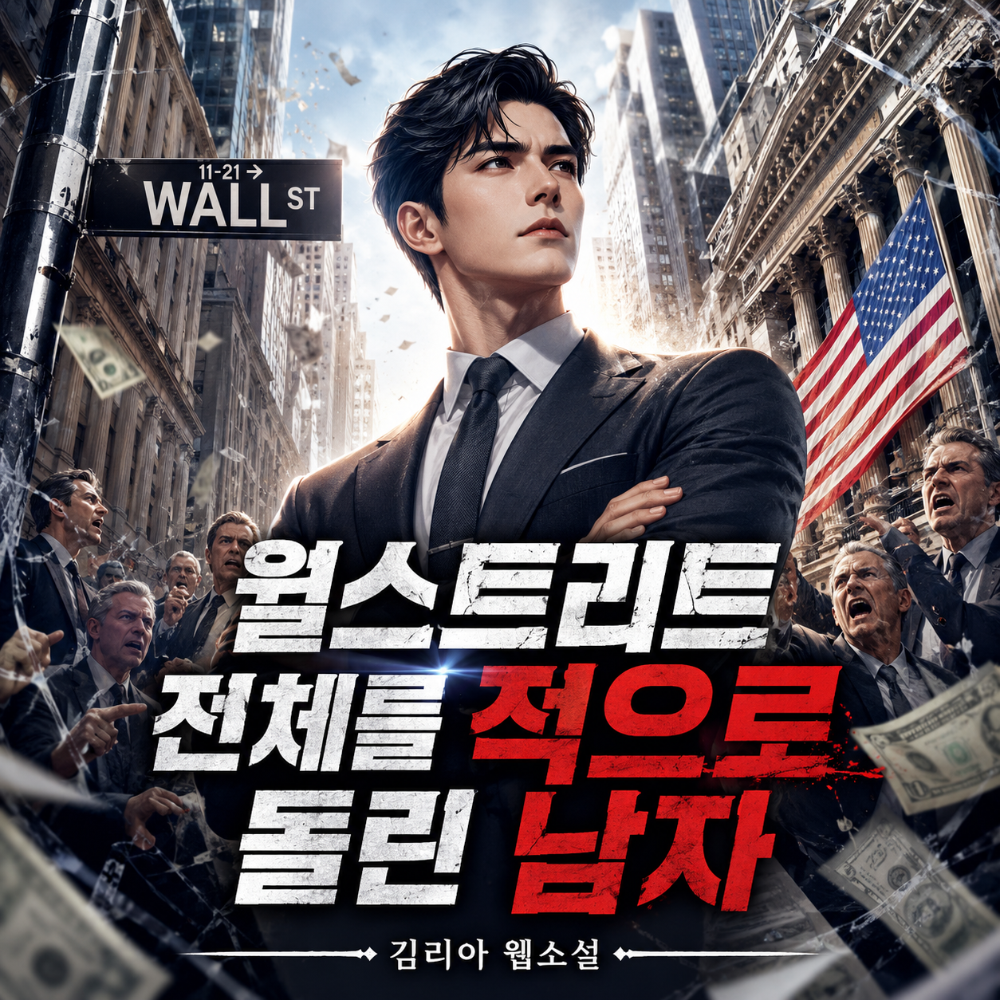

# 월스트리트 전체를 적으로 돌린 남자
**Date:** 46분 전
**Category:** 행운과 재능
**Original URL:** https://blog.naver.com/xpfkwh56/224312328942
---

​

보글이 뛰어든 자산운용업의 생리는 단순했다.

​

똑똑한 펀드매니저가 좋은 종목을 골라 시장보다 높은 수익을 내주겠다고 약속하고, 그 대가로 고객에게 수수료를 받는 것.

​

금융투자 업계 전체가 이 구조 위에 있었다.

​

수수료가 곧 돈이었으니, 당연히 수수료는 높을수록 좋았다.

​

같은 1%라도 큰 금액이면 빠따가 다르다. 그리고 금액이 크면 클수록 투자는 매우 어렵다.

​

버핏조차도 시드가 커지면서 투자의 기회를 놓치게 되는 것을 한탄한 적 있을 정도다.

​

누구나 할 수 있지만, 아무나 할 수 없다는 바로 그 지점이 펀드매니저의 연봉을 천상계 레벨로 올렸다.

​

금융투자 업계의 성과급은? 상한가가 없다. 태평양 무인도 조세 피난처에서 사모펀드를 운영하는 일부는 1년에 1조가 넘게 번다는 소문도 있다.

​

천문학적인 금액을 다루면서, 천문학적인 돈을 버는 것.

​

그게 자산운용업의 매력이었다.

​

그런데 보글은 일찍부터 한 가지 불편한 사실을 봤다.

​

프린스턴 시절 썼던 그의 졸업 논문에서 이미 싹튼 생각이었다. 그 잘난 펀드매니저들이 모은 펀드의 대부분이, 길게 보면 시장 평균조차 못 이긴다는 것.

​

화려한 분석과 짜릿한 매매로 시장을 이기겠다고 큰소리치지만, 결과를 수십 년 단위로 모아 보면 대다수가 그냥 시장을 따라가느니만 못했다.

​

그러면서도 높은 수수료는 꼬박꼬박 떼어 갔다.

​

고객 입장에선 이기지도 못하는 게임에 비싼 입장료만 내는 셈이었다.

​

여기서 보글은 남들이 안 하는 질문을 했다.

​

이길 수도 없는데 비싼 돈을 들여 시장과 싸울 거면, 차라리 시장 전체를 통째로 사서 비용을 줄이는 것이 나은 것 아닌가?

​

시장 전체를 사는 것은 누구나 할 수 있다. 딸깍. 딸깍.

​

종목을 고르지 않으니 비싼 매니저도 필요 없고, 그만큼 수수료가 내려간다. 건초 더미에서 바늘을 찾으려 애쓰지 말고, 건초 더미를 통째로 사자.

​

1976년, 보글은 이 발상을 실제 상품으로 내놨다. S&F 500 지수를 그대로 따라가는, 세계 최초의 개인용 인덱스 펀드였다.

​

결과는? 처참했다.

​

출시했더니 모인 돈이 고작 1,000만 달러 남짓. 작은 돈은 아니었지만 목표에 한참 못 미쳤다.

​

투기 시장에 대한 이해가 부족했던 것이다.

​

위험 자산에 투자하는 사람들은 원금 손실을 '당연히' 감내하는 사람들이다.

​

안전하고 작은 수익보다는, 위험하되 화끈한 수익을 추구하는 도파민 추종자들이 중간 정도 한다는 보글의 제안에 선뜻 돈을 낼 리가 만무했다.

​

월가는 보글을 비웃었다. 보글이 내놓은 이 펀드를 '보글의 멍청함' 이라고 부르기도 했다.

​

자고로 금융인이라 함은, 탁월한 통찰과 시대를 관통하는 지혜를 토대에 두고 기회를 낚아채야 하는 것 아닌가.

​

이 판에 들어와서 시장을 이기려 하지도 않고 평균만 하겠다? 야망도 없는 '패배자의 게임' 을 하겠다니.

​

어떤 이들은 '미국적이지 않다' 고 했다. 무릇 자유로운 시장에서 최고가 되려 경쟁하는 것이 미국을 세계 최고로 만든 정신의 뿌리인데, 고작 평균에 만족하라니.

​

업계 전체가 그를 골칫덩이 취급했다.

​

" 요즘 인덱스가 괜찮다는데 어떤가요? "

​

" 고객님, 저 고객님한테 예금 이자 정도 먹여드리려고 주식하는 놈 아닙니다. 저희 작년 실적이 어떻냐면요… "

​

어쩌면 당연했다. 보글의 펀드가 퍼질수록, 그들이 받아온 두둑한 수수료가 줄어드니까.

​

보통 사람이라면 이쯤에서 접었을 것이다. 돈도 안 모이고, 업계 전체가 조롱하고.

​

그러나 보글은 자기가 본 것이 옳다고 믿었다.

​

무엇보다 시간이 그의 편이었다.

​

시장 평균이 1년은 질 수 있지만, 5년쯤에는 이기고, 10년이 넘으면 절대로 지지 않는다.

​

또한 보글의 진짜 승부수는 따로 있었다. 보통 회사라면 창업자가 지분을 갖고, 회사가 번 돈을 주주가 배당으로 가져간다.

​

보글은 정반대로 회사를 설계했다. 그가 만든 뱅가드는, 펀드에 가입한 고객들이 회사를 소유하는 구조였다.

​

그러니 회사가 돈을 벌면 그 이익이 외부 주주의 배당으로 새어 나가는 게 아니라, 전부 다시 수수료를 더 깎는 데 쓰였다.

​

고객이 주인이니, 고객에게 더 싸게 돌려주는 게 당연했다. 수수료가 낮아지면 이익은 더 증가한다. 이익이 더 증가하면 고객들은 더 많이 찾아오고 선순환을 타게 된다.

​

주가가 오르는 원리는? 지금 호가보다 더 비싸게 사는 사람이 있으면 올라간다. 만약 거대한 자본이 시장 전체를 소유하고 매물을 꽉 쥐고 있다면.

​

그들은 '지지 않기 위해서', 인덱스라는 파도에 올라타야만 한다.

​

**지지 않을 때, 이길 수 있다**

**​**

그게 보글의 '설계' 였다.

​

동시에 이건 곧 창업자인 보글 자신이 그 거대한 회사의 지분을 한 푼도 안 갖는다는 뜻이었다.

​

비싼 수수료를 받지 않으니 본인이 챙길 돈도 적었다.

​

세계적인 자산운용사를 일군 사람이라면 천문학적 부자가 되는 게 당연한데, 보글이 죽으며 남긴 유산은 약 8,000만 달러.

​

작년 기준, 골드만삭스 CEO가 받은 '1년' 연봉이 1억 2천만 달러 쯤이다.

​

금융계 거물들의 재산에 비하면 초라할 만큼 적은 액수였다.

​

세월이 흐르자, '멍청함의 대명사' 였던 그 펀드가 옳았음은 숫자로 드러났다.

​

비싼 수수료를 떼던 대다수 액티브 펀드는 장기적으로 인덱스 펀드를 이기지 못했다. 반대로 수수료가 바닥인 인덱스 펀드는, 그 아낀 비용이 복리로 쌓여 평범한 투자자들에게 더 큰 부를 안겼다.

​

출시 때 1,000만 달러였던 인덱스 펀드는 그가 세상을 떠날 무렵 수조 달러로 불어났고, 뱅가드는 운용 자산 10조 달러가 넘는 세계적인 자산운용사가 됐다.

​

보글을 비웃던 월가는, 결국 너도나도 인덱스 펀드를 팔게 됐다.

​

버핏은 그를 두고 '미국 투자자를 위해 가장 많은 일을 한 사람' 이라 했고, 투자자를 위한 동상을 세운다면 그건 보글의 것이어야 한다고까지 말했다.

​

2026년, 우리는 주식을 처음 하려는 사람에게 당연하다는 듯이 말한다.

​

인덱스 사라고. 지지 않는 투자를 하라고.

​

월스트리트의 당대 초엘리트 금융인들이 놓치던 것이 있다.

​

운용 수수료를 낮게 잡고, 시장에 오래 머무르며, 존버하면 이긴다.

​

그 단순한 아이디어가 그렇다.

​

당대 모든 자본과 권위는 거대한 업계 쪽에 있었고, 보글은 그들 전부를 적으로 돌린 외톨이였다. 하지만 그 한 사람은 끝내 세상의 상식을 바꿨다. 그 자신이 옳다는 바로 그 신념으로.