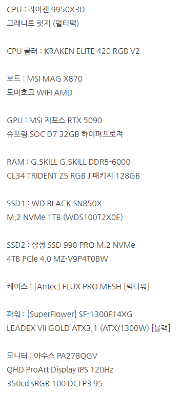
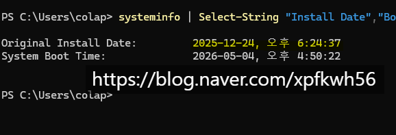

# 뉴스 말고 필드를 보셔야 됨
**Date:** 4시간 전
**Category:** 다이어리
**Original URL:** https://blog.naver.com/xpfkwh56/224274789720
---

https://blog.naver.com/xpfkwh56/224160084877

​

1. 제가 산 사양은 위와 같음

​

**\* 5090 총 2대를 샀고,**

**서로 각 작업 목적이 다름**

**​**

1) 당시 기준으로 CPU **굳이?** 였고,

​

2) 최상급기면 아스트랄을 사야 맞지,

5090 상급기인데 콩라인 **슈프림?**

​

3) 렘을 128GB 까지 **굳이?**

4) SSD를 1+4TB 나 쓸 필요가?

​

5) 파워 마진 애매한 것 아닌가?

​

6) 벤큐도 있고, 모니터 많은데

프로아트를 왜 쓰지? 등등,

​

모든 선택에 이유가 있었지만

그걸 다 설명하려면 **너무 길었음**

​

​

제가 세팅한 시기가

작년 12월 무렵 임

​

당시에는 GPU 값 대란이었고,

얼마 뒤 RAM, SSD 대란이 떴고

​

근래 들어서는 이제 에이전트 돌릴 때,

레이턴시 걸린다고 CPU 얘기가 나옴

​

당시 컴퓨터 맞출 때, 쓸 수 있으면

**무조건** 용도부터 정한 다음에 사라했구

​

5090 (당시 기준 400초반) 사서,

​

**이 바닥 전문가 아무도 없으니까**

본인이 알아보고 다 맞춰서 사라함

​

실제 용산에 계신 PC 고인물들도

게이밍 PC 전문이지, 워크스테이션은

거의 모를 가능성이 높고 **지금도 그럼**

​

2. 지금은 클로드가 많이 유명해졌는데,

​

당시에 제미나이/지피티/그록 쓰시는

분들 있으면 인지도 모델 굴리지 말고,

​

프론티어 유료 > 무료 > 도메인 > ...

API > 로컬 순서로 넘어가게 될테니,

​

가능한 생태계 상단에 머무르라 했구,

같은 돈이면 클로드 넘어가라고 했음

​

그리고 클로드도 웹클로 쓰지 말고,

​

터미널 세팅 금방 할 수 있으니까

콘솔에서 사용하는 것을 권장 했음

​

기능 모델 쪼개서 쓰라고 했고,

벤치 믿지 말라고 한참 전부터 얘기함

​

중국에서 나온 모델 사용하고,

양자화 쓰고, 아키텍처 단위에서

​

하드웨어 병목 해결할 수 있으니까

​

자체 인프라 세팅하고, 튜닝하고,

최적화 해서 파이프라인 꾸리라 함

​

3. 26년 5월 기점으로,

​

에이전트 얘기 나오고

실제 작업에서 중요하다,

​

같은 얘기 나오고

​

**\* 백앤드 차이만 해도, 연산 속도 차이가**

**10배, 40배 까지 나는데 CPU 만 다른가?**

​

원래 B2B 기업용 시장 모델이던 클로드가

전보다는 더 많이 사용하는 모델로 바뀌게 됨

​

**\* 덕분에 서버 부하랑 품질은 하락했지만**

​

즉, **'뉴스'** 로 넘어가는 시점이면

아무리 호의적이게 해석을 한다쳐도

​

최소 **'1세대'** 이상은 지나간 정보인데

그거 트래킹 하기 바쁘면 **좀 안 좋은** 것임

​

내가 실제 그 분야에서 플레이어로 뛰고,

머가리 박아가면서 하나씩 하나씩 꺼내서

​

맞고, 틀림을 규명하고 검증하고

내 사용처를 확보하는 것이 학습이지

​

설명서 튜토리얼 읽는 것에만 심취하면

이 기술을 제 값 주고 쓰기 아주 어려워짐

​

이 도구로 이걸 할 수 있습니다 (x)

뭘 해야 되는데, 이 도구를 써볼까? (o)

​

같은 이야기 같지만, **아예** 다름