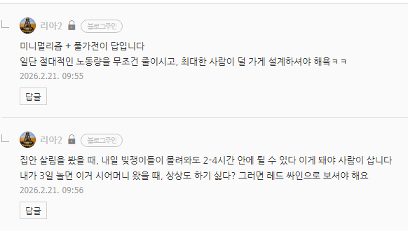
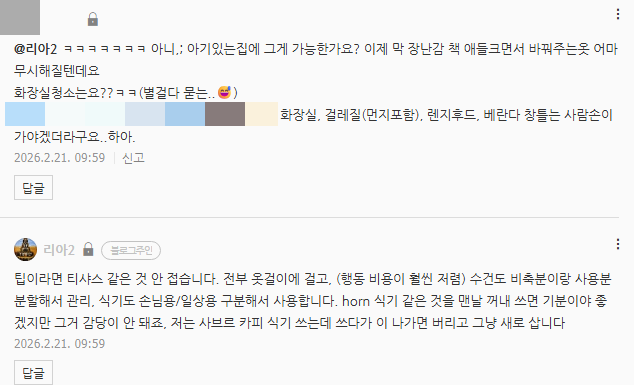
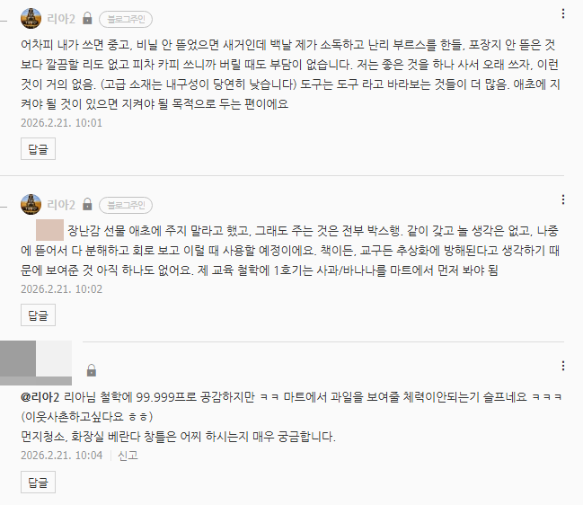
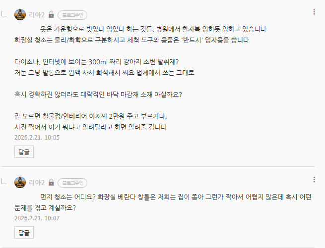
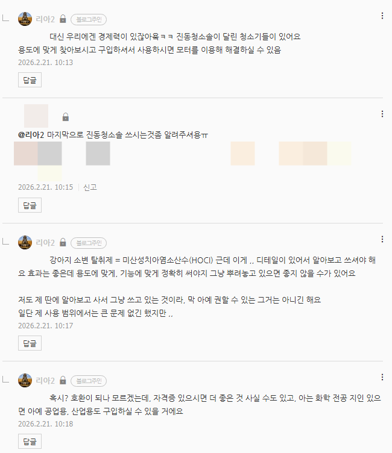
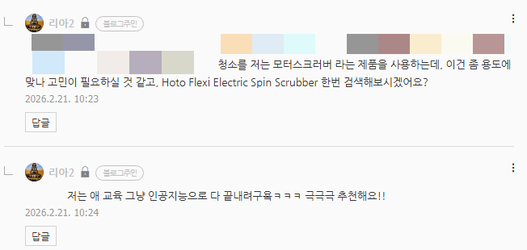

# 답변
**Date:** 4시간 전
**Category:** 다이어리
**Original URL:** https://blog.naver.com/xpfkwh56/224190789239
---

​

1. 제가 부지런한 것이 아니고,

​

1) **노동 절대값 자체가 적고**

2) **돌아가는 것들이 있어서** 임

​

로청만 해도 없으면?

​

내가 바닥 5번 훔칠 것,

10번 훔쳐야 되고

​

식세기만 해도 없으면?

​

으어어어 저거 해야 되는데

으아아아아 해야 되는데

​

하고 밀린 숙제처럼 느낄 것

​

건조기 없으면?

상상도 하기 싫네요

​

집에서 물 쓴답시고

우물 가서 길어와야 했으면

​

제가 부지런하고 나발이고

아무 것도 못했을 겁니다

​

옷걸이 = 디자인, 내구성, 표준규격, 공급 안정성, 여유분 등등

​

2. 한낱 공산품이 버릇없이

손빨래 필수 이러면 안 삽니다

​

헐리웃 스타들이야 대강 조금 쓰다가

헐면 비싼 것도 새로 사고 그러겠지만

제가 그럴 정도의 형편은 아니기 때문

​

물론 제가 직접 가공한 가구라던가,

이런 것들은 다 애지중지 하고 씁니다

​

​

3. 집에서 한글 나라, 단어 공부판

굳이 만들 필요 없이 여기가 거실이다,

화장실이다, 수도꼭지다, 밥그릇이다,

​

내가 엄마다, 이건 코다, 이건 눈이다

​

컵이다, 이불이다, 베개다,

구스다운이다, Giza 45 라고 있다

세틴, 디럭스가 있고 어쩌고 저쩌고

​

집에 있는 것을 그냥

알려주면 된다고 생각해요

​

부드럽다 → 60수다, 80수다, 100수다

천이다, 나이롱이다, 혼방이다, 레이온이다

​

나무, 철, 플라스틱, 스뎅

​

고해상도로 가르칠 것이

온 집안에 널려있을 겁니다

​

집에 단어가 없을 리가 없어요

​

숫자를 배울 수 있는 도구를

몸에 24시간 달고 있기도 함

​

**\* 손은 2개, 손가락은 10개**

**​**

꼭 그거만 쓰란 이유도 없구요

​

**\* 우리 집에 숟가락 몇 개**

**​**

**1은 내 숟가락,**

**2는 엄마 + 아빠 숟가락**

**3은 우리 셋 숟가락**

**​**

​

4. 헨리 포드는 컨베이어 벨트를 활용한,

대량생산, 대량소비 개념을 기업에 접목했다

​

효율을 배웠으면 효율을 행하면 됩니다

​

업자용 = 성능 굿, 단 리스크 있음

​

**\* 부작용 없는 전문의약품은 없다**

**성공확률 100% 수술 같은 것은 없다**

**근데 그게 의료를 멀리할 이유는 안 됨**

​

→ 리스크만 제어하면? 굿