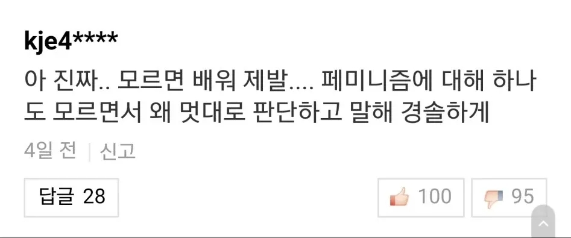
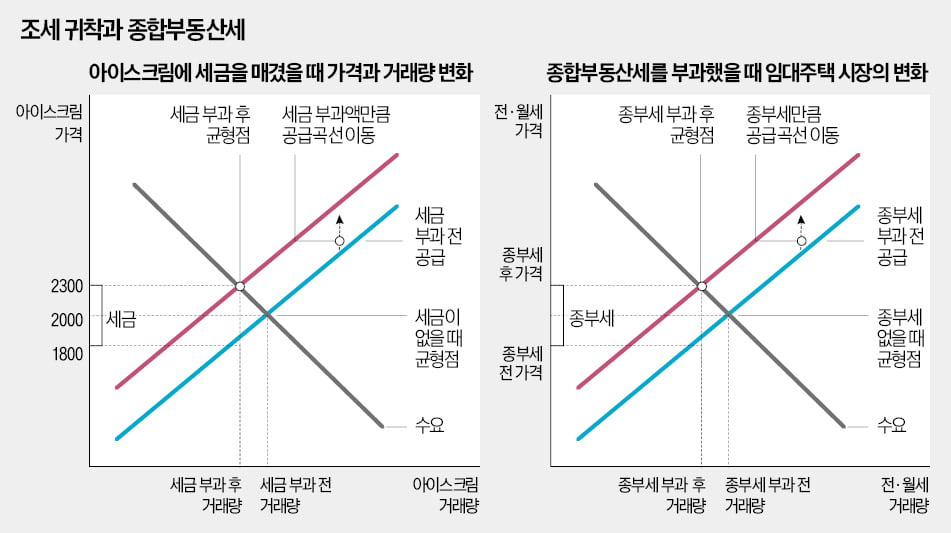
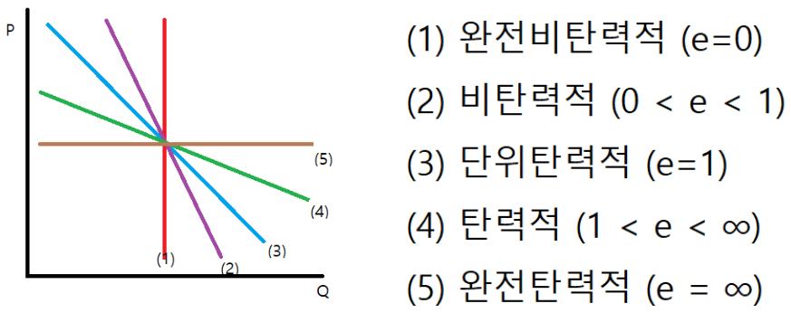

# 블라그 경제학은 재미로만 보세요
**Date:** 4시간 전
**Category:** 다이어리
**Original URL:** https://blog.naver.com/xpfkwh56/224265878496
---

​

1. 장특공 관련 댓글 보다가

​

모르면 공부해라, 내지 계급론으로

휙휙 튀는 것 보니 **이게 뭐라고?** 싶음

​

책 귀하던 옛날이 정보 구하기 어렵고,

​

배웠다는 사람이 엣헴 헛기침 한 번 하면

선생님 선생님 하면서 떠받들기 바빴지만

​

지금은 발로 매일매일 **'뻥뻥'**

채이는 것이 지식이요 정보임

​

**2. 보유세가 비싸지면,**

**임대인은 가격을 올릴 것이다**

​

누구 말이 맞냐, 틀리냐를 떠나서

​

검색엔진이나 유튜브에다가

**​**

**'조세의 전가와 귀착'** 이라고

검색하고 그거 찾아 읽으면 됨

​

조세 = 세금

전가 = 떠넘기는 것

귀착 = 실질 부담하는 주체

​

부동산 관련 세금이 올라간다면,

임대인은 임차인에게 자신이 부담할

조세분을 떠넘기게 될 것이고

결과적으로 임차인의 부담이 커진다

​

라는 말로 풀어서 읽어볼 수 있을 것임

직관적으로 금방 와닿는 내용이기도 함

​

3. 경제가 이론대로 돌아가면,

경제학자들이 주식으로 떼돈 벌게?

라고 하면 더 이상 논의가 안 됨

​

**\* 물론 유의미한 문제 제기지만,**

**일단 하나씩 닫으면서 진행해야 됨**

​

그럼, **'일단'** 교과서 에서는

이런 현상을 어찌 해석하나 보겠음

​

​

여러 제품을 예시로 들어 설명하는데,

사람들이 흔히 아는 그 설명 그대로 임

​

가장 깔끔한 설명으로는

**물품세, 거래세** 가 되겠음

​

특정 물건을 거래하는 과정에 있어서,

조세분이 발생하면 소비자에게

실질 부담이 전가되는 현상이 생김

​

그러나 **'보유세'** 는 **'거래세'** 가 아님

말장난 같지만, 잘 들어보면 **실제** 다름

​

거래세는 거래의 **'행위'** 에 세금을 물림

​

그러나 보유세는 거래의 유무와 별개로

**'보유했다는 지위'** 자체에 세금이 발생함

​

그래서 위에 있는 그래프처럼

왼쪽에 해당하는 사례를

오른쪽에 바로 **붙일 수 없음**

​

순전히 그 현상은, 보유세를 부담하는

임대인이 세금 부담이 추가로 발생하니까

​

더 높은 임대료를

**'받고 싶어 하는 유인'** 이

증가한다는 설명만 됨

​

즉, 보유세가 증가한다고 해도

임대인이 그로 인해서 가격을

증가하는데 정당화되는 논리로

​

적어도, **'조세의 전가/귀착'** 을

가져오는 것은 적절치 않은 것임

​

**\* 예외는 후술**

**​**

공부해라, 공부해라 를 많이들 말하는데

​

설령 외부 요인으로 가격이 상승하더라도

세입자 입장에서 가격 탄력성이 높다면,

​

세금이 오른다고 해도 조세분 만큼

전가하는 것이 불가능할 뿐만 아니라,

​

임차인 입장에서 대출도 어렵고,

소득의 증가분이 그리 높지도 않다면

​

임대인이 조세 상승분 만큼을

임차인에게 전가하고 '싶어도'

​

전가하기 어려운 상태가 된다는 것이

​

사람들이 그리 말하는 **'경제학원론'**

레벨에서 설명할 수 있는 이론 설명임

​

**\* 전공을 했고, 몇 년을 공부했고**

**이런 것 상관없이 써 있는 그대로를**

**그대로 가져온 설명이고, 누구든지**

**의지만 있으면 찾아서 읽을 수 있음**

**​**

물론 아주 복잡한 실물 경제 현상을

​

교과서의 한 꼭지만 갖고 모두 설명한다

이런 것은 실상 불가능에 가깝기 때문에

​

**\* 본문도 마찬가지로, 제한적으로**

**범주 안에서만 가정된 설명을 할 뿐**

**​**

전제와 조건이 달라진다면 복잡할 것이나

최소한 저 기준 내에서는 위 내용이 맞음

​

**4. 중간 정리**

​

조세의 전가와 귀착이란 것이 있다

​

실제 세금을 부담하는 사람이 누군지,

이론적으로 설명할 수 있는 이론인데

​

보유세는 주택의 판매와 결부된

세금이 아니므로, 거래세 예시를

보유세에 가져오는 것은 부적절하다

​

세입자가 들어오든, 안 들어오든 간에

계속 세금이 적용되는 보유세는

거래세와 속성적으로 **당연히** 다르다

​

5. 그럼 저건 **'어디에'** 붙여야 될까?

​

임대인이 시장에서 요구하는

임대료의 기준점은 그 자산을

보유함으로써 발생하는

​

일정 비용을 보전하는 수준이

될 가능성이 높다고 할 것이고,

​

그것이 실제로 관철되는지 여하는

수요/공급의 탄력성에 달려있다는 것이

차라리 더 올바른 설명에 가까울 것임

​

6. 모로 가든 서울만 가면 그만이지,

​

어쨌든 규제가 생기고 나갈 돈 오르니

그거로 전월세가 올랐다는 것 아니냐?

​

**그거도 짚어볼 부분들이 없진 않음**

​

먼저 수요와 공급에 대해서 논하고,

이후 탄력성에 관하여 다루어 보겠음

​

**1) 수요와 공급**

​

임대 사업자, 다주택자가

공급을 할 수 있었는데,

​

이 사람들이 없어지면 당연히

시장에 매물이 줄어들 것이고,

​

수요는 넘치는데 공급이 마르니

가격이 오르는 것은 자명하다 (x)

​

다주택자가 본인이 들고 있는 물건을

팔면 공급할 수 있는 임대분도 감소하나

**그와 동시에**, 수요자의 임대분도 채워짐

​

다주택자가 파는 집이 갑자기

하루 아침에 없어지는 것이 아님

​

다른 누군가의 손에 들어가고,

​

**그 사람이 실거주를 하게 되면**

**임대 수요 1개를 채운다는 것임**

​

높으신 분들의 판단이야 알 노릇이 없지만

여기에서 각자 의견과 해석이 달라지게 됨

​

주택 물량이 나와도 실수요자가

그걸 구매할 수 있는 여력이 없다면

결국 임대를 살아야 되는 것은 같은데

​

이 과정에서 임대 사업자, 다주택자가

생태계를 원활히 돌리게 할 수 있고

시장 안정에 도움 된다는 분들이 있구,

​

**\* 내가 살 돈 없으면, 나 말고 다른 사람이**

**사놓은 것을 빌려 쓰는 것 말고 대안이 있음?**

**​**

시장에서 지불할 수 있는 구매력 이상으로

계속 가격 기준선이 올라가 있는 상태라면,

​

시장에서 알아서 실제 상황에 맞게끔

거품을 빼든, 경착륙을 하든, 방향을 잡고

따라갈 것이라고 보는 분들의 견해가 있음

​

**\* 안 팔리면 가격 내리는 것 말고**

**뾰족한 방법도 없는 것 아니겠음?**

​

**2) 탄력성**

​

하나의 변수가 변할 때,

다른 변수가 얼마나 민감하게

반응하는 것인지 측정하는

지표를 탄력성 이라고 함

​

아파트는 오늘 뚝딱 짓고 싶다고

하루아침에 늘어나지가 않아요,

​

주택 매입자금은 오늘 사고 싶다고

하루 만에 살 수 있는 것이 아니에요,

​

라는 **각자의 입장** 을 설명할 수 있음

​

​

임대인 우위 시장이다,

임차인 우위 시장이다

​

같은 익숙한 표현을 그저 조금 더

어려운 말로 표현하는 것에 불과함

​

주택 보유에 대한 비용 증가가

발생할 때, 시장에 적용될 수 있는

상황을 가정 해보도록 하겠음

​

부동산 시장에서 매도자인

집주인의 탄력성은 어떨까?

​

실상 제로에 가깝다고 볼 수 있음

​

**\* 공급이 완전 비탄력적이면**

**조세분 전부를 공급자가 부담**

**​**

**수요가 완전 비탄력적이면**

**수요자가 부담하게 되기 때문**

**​**

때문에 **'적어도'** 매매 시장에서는

블라그 경제학 이야기가 **말은 안 됨**

​

**\* 이론적으로**

​

그렇다면 임차인의 경우를 보겠음

​

만약 서울에서 거주할 여력이 없다면,

좋든 싫든 외곽으로 나가든 아니면

경기/지방권으로 쫓겨날 수밖에 없음

​

매매 수요에 대한 해결책이 부분적으로

전세를 통해 해소할 수 있는 여지가 있지만,

​

전세 품귀를 비롯해, 다양한 이슈 때문에

이 부분을 유의미한 대안으로 보긴 어려움

​

다음은 **임차 수요** 임

​

부동산의 경우 다른 재화와 달리,

​

없으면 길바닥에 나앉아야 되므로

가격이 안 맞아도 딱히 방법이 없음

​

그 동네에 꼭 내가 살아야 된다면

선택지 없이 가격을 수용하거나 아님

그냥 아예 생활 여건을 바꿔버려야 됨

​

<https://youtu.be/On1TNhURBTk?si=goWYyvD6Axub7ov2>

​

부동산 이야기만 나왔다 하면,

대화가 서로 통하지 않는 이유도

​

**'기준'** 을 정하지 않고 각자가 인지한

프레임 내에서 대화를 하기 때문 임

​

**7. 그래서 오른다구요? 내린다구요?**

​

오른다, 내린다가 본질이 아니고

뭐든 그 부동산에 그 가격을 내고

​

들어가서 살겠다는

인간이 있냐, 없냐

​

문제로 간다 이거죠

​

똑같은 세월에 똑같이 늙어도

누구는 쉰내나는 식초고,

누구는 풍미 넘치는 와인인데

​

닮은 것이라곤 염색체 밖에 없는 제가

여자라는 이유로 장원영 갖다 대면서

현상을 해석하려고 해봐야 뭔 의미가 ,,