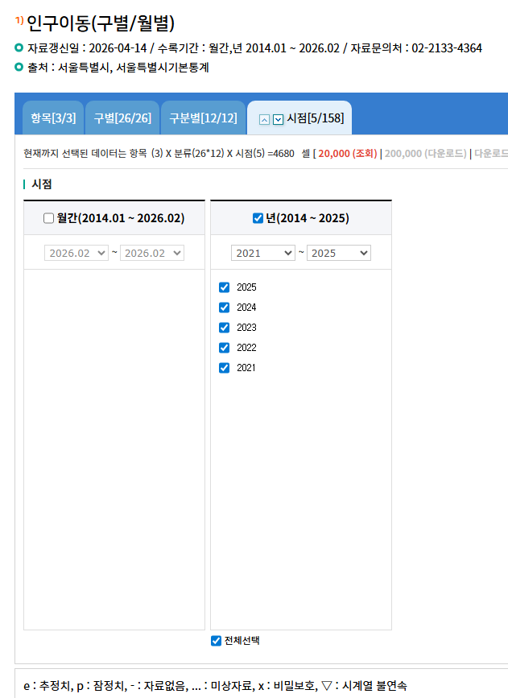
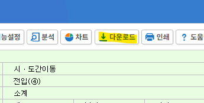
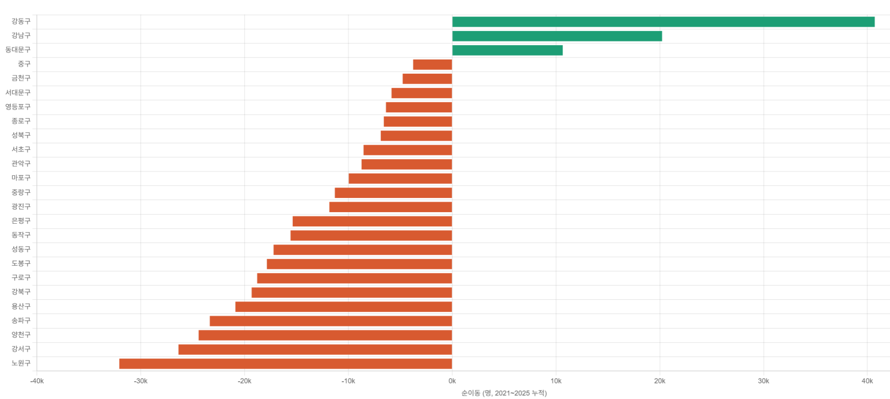

# 서울 공급이 어떻고, 저떻고
**Date:** 4시간 전
**Category:** 다이어리
**Original URL:** https://blog.naver.com/xpfkwh56/224254884686
---

<https://data.seoul.go.kr/>

[**열린데이터광장 메인**

데이터분류,데이터검색,데이터활용

data.seoul.go.kr](https://data.seoul.go.kr/)

​

1. 서울 열린데이터 광장 접속

​

2. **'인구'** 검색

​

​

3. 본인 취향에 맞게 시점 선별

​

**\* 인구 말고 다른 것 보고 싶으면**

**다른 것 찾아서 보셔도 전혀 무관**

**​**

**​**

4.**다운로드** 클릭

​

최근 5년, '여성인구' 전입/전출

​

5. AI 분석 위임 후 시각화 **'끝'**

**​**

6. 인사이트를 쫓아다닐 것이 아니구,

자료를 찾아서 돌려도 되는 세상이 옴