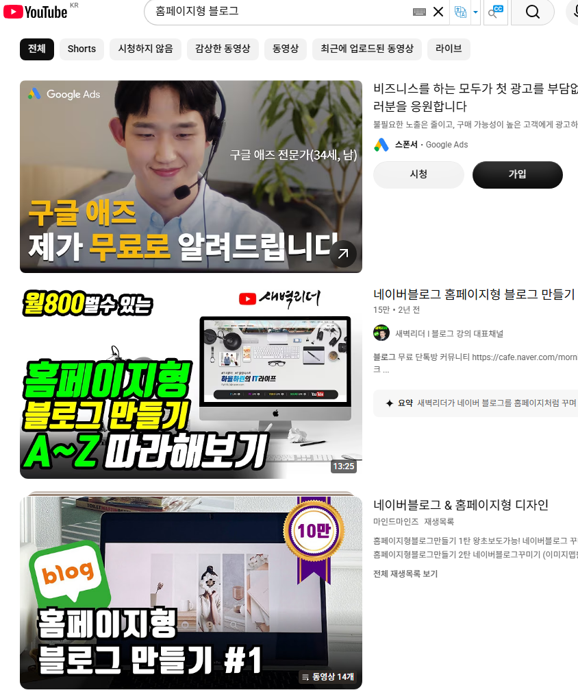
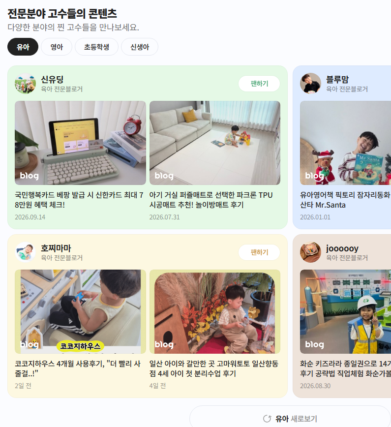
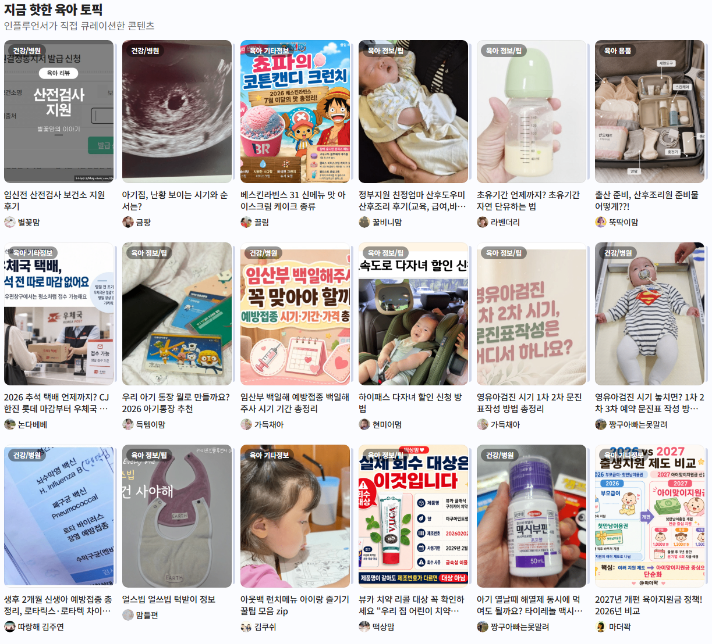
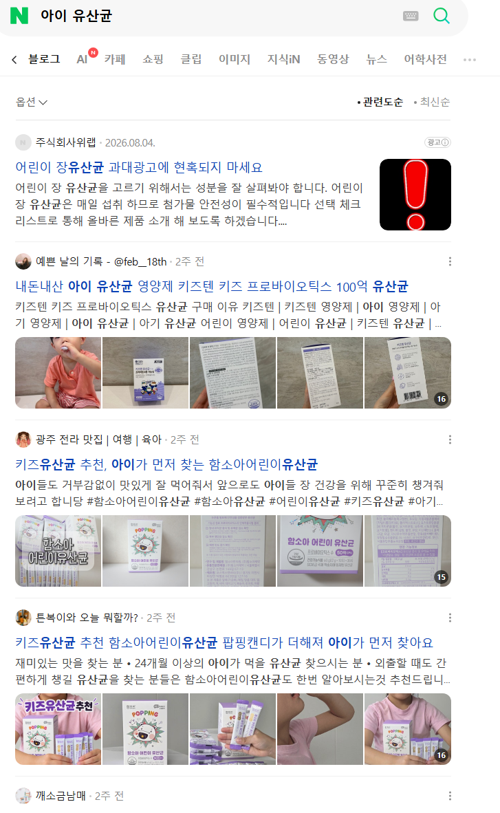
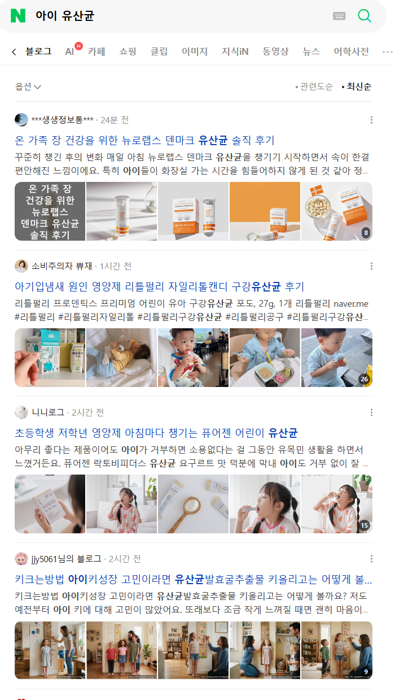

# 아기 엄마가 집에서 블로그 시작하는 방법
**Date:** 4시간 전
**Category:** 스냅
**Original URL:** https://blog.naver.com/xpfkwh56/224421380267
---

​

1. 유튜브에 홈페이지형 블로그 검색

2. 레이아웃, 스킨, 어떻게 쓰는지 알려줌

​

<https://in.naver.com/discover/135969005989696>

[**네이버 인플루언서**

관심분야의 전문 창작자를 만나는 곳

in.naver.com](https://in.naver.com/discover/135969005989696)

​

3. 위 링크 들어간 다음에,

​

​

여기서 나랑 핏 맞는 사람 고릅니다

​

​

4. 스크롤 더 내리면 이거 나오는데요,

저기서 내가 쓸 글감 소재 구합니다

​

중복인데 괜찮나요? **네 상관 없음**

​

**첨부파일**

육아블.txt

[파일 다운로드](https://download.blog.naver.com/open/b92ca51600323387a24b2b1227c5bac46330cf82/EFsQa7dDxrzO9thaLuoSggWaFwbSq_x2cV8UKD1m_gMvEIq_VX4v6vm8CYEO7ylArS20bkPn_FwpmqpItlL-aa2oYEqbfD4/%EC%9C%A1%EC%95%84%EB%B8%94.txt)

​

5. 육아 블로그들 명단입니다

​

**\* AI 쓰시면 밤새도록 구할 수 있음**

​

6. **아무 블로그나 1개 고르고**,

**거기에서 눈에 걸리는 제목 키워드** 검색

​

​

관련순/최신순 누릅니다

​

최신순은 **최근 24시간 이내만** 봅니다

​

**발행된 문서가 많다 = 경쟁이 쌔다** 입니다

키워드 도구로 검색량 조회 하지 마세요

​

관련성은 첫 콘텐츠가

**내돈내산, 성분, 복용법** 있네요

​

관련성 dom 5 까지가 **단일 제품** 입니다

​

업자 콘텐츠란 뜻이고,

경쟁 쌔니까 패스합니다

​

**dom 10까지** 읽어봅시다

​

복용법이 꼭 들어가고,

고른 이유가 나오네요

​

**쿼리 검색**

**​**

쿼리 검색이 뭐임?

​

앞에 접미사, 접두사 다 넣어보는 겁니다

​

접두사는 유아, 영아, 신생아,

다이어트 같은 키워드랑 묶이고

​

접미사는 복용법, 주의사항,

부작용, 효능, 추천, 이유 같은 게 나오네요

​

7. **누가? 왜? 어떻게 해서? 뭐가 달라졌나?**

가 필수적으로 요구하는 장르 관습 같습니다

​

고정 쿼리는 키즈유산균, 어린이유산균,

​

<https://blog.naver.com/naver_search/224305800678>

[**AI 시대에 사용자의 선택을 받는 콘텐츠 작성 가이드\_실전편**

안녕하세요. 네이버 검색입니다. AI와 함께 변화하는 환경에서 네이버와 창작자, 커뮤니티가 함께 콘텐츠...

blog.naver.com](https://blog.naver.com/naver_search/224305800678)

​

~한 문제가 있었는데 ~로 해결했다

~한 제품 특징이 ~해서 좋았다

~한 제품 요소는 ~해서 개선이 필요했다

​

3개 정도 들어가면 될 것 같읍니다

​

**비교 큐레이션 콘텐츠가 더 도움되지 않나요?**

맞는 말인데, 그건 카페 쿼리로 들어갑니다

​

총정리, 비교, 핵심, 처럼 여러 대안을 놓고

의사결정을 돕게 하는 건 개인이 못 하게 함

​

8. 위 방식대로 고인물들이 하고 있는 것을

소재만 바꿔서, 구성만 바꿔서 계속 쓰면 됨니다

​

**1) 제휴 원고는 언제부터 받으면 되나요?**

​

충분히 고일 때 까지 받지 마세요

블로그 터짐

​

**2) 언제부터 유의미한 수익 나오나요?**

​

방문자 1만 찍히면 그제서야 뭐가 나옴

​

다만 현실적으로 1년 안에

월 100만원 벌긴 많이 어려움

​

**\* 빨리 많이 벌고 싶으면, 연예인들**

**자식 키운 얘기를 맨날 올리세요**

**​**

**3) 1만 언제 찍어요?**

​

맨날 육아블 하는 사람들 보고,

거기서 잘 된 사람들 추린 다음에

​

쟤는 왜 잘 되고 있지? 를

실시간으로 학습하면서 해야 됨

​

**4) ai로 찍어내면 되나요?**

​

고정 템플릿으로 돌리면

유사문서, 스팸으로 저품질 걸림

​

초안 받고 본인이 직접 써야 됨

아니면 정말정말 잘 사용하거나

​

**5) 육아블로 그래도 좀**

**가성비 좋은 것 없나요?**

**​**

당장 병원 갈 여건 안 되는 엄마들이

급하게 찾아봐야 될 정보 다루면 잘 됨

​

맘카페 들어가신 다음에, 고민/걱정

같은 것 질문 하시는 분들 많은데,

​

그거 내용 블로그에 답변 쓰시면 됨

​

**6) 나는 의사가 아닌데요?**

​

<https://doctornow.co.kr/content/faq>

[**닥터나우 1분 FAQ | 전문 의료진이 자주 묻는 질문에 답변해 드려요.**

비대면 진료, 약 처방, 진료비, 건강 관련 궁금증을 1분 만에 해결해보세요. 닥터나우 FAQ로 쉽고 빠르게 확인할 수 있어요.

doctornow.co.kr](https://doctornow.co.kr/content/faq)

​

이거랑 유튜브 뒤지면 거진 다 나옵니다

​

**7) 소재가 떨어졌어요**

​

집에 있는 밥그릇, 숟가락, 젓가락 하나까지

내가 그거 어디서 왜 샀나 올리면 됩니다