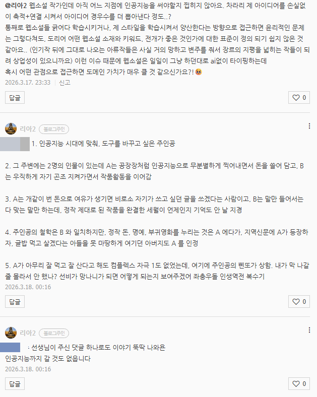

# 잉공지능과 창작 활동
**Date:** 50분 전
**Category:** 다이어리
**Original URL:** https://blog.naver.com/xpfkwh56/224220274896
---

모비딕

​

**1. if**

​

파인튜닝 데이터 중에, 책 3만원 5만권씩

데이터 베이스로 만들어 놓은 것이 있읍니다

​

먹여도 그만이고, 학습 데이터 이내에서

풀어달라고 하면 천일야화 가 따로 없음

​

**2. 팔리는 글이 무엇일까요?**

​

저는 프로는 아니지만,

둘 중 하나 같읍니다

​

1) 서사에 끌리는가?

2) 감정에 끌리는가?

​

글쓰기도 예술이라면, 본인이 아름답다고

느낀 것을 동화 시키는 것이 예술가 같음

​

나 자신 스스로가 아름다움을 규정할 수 있구,

그 기준에 맞게 스스로를 설득할 수 있어야지

​

그 외의 요소는 별로 큰 의미는 없는 것 같아요

​

바로크니, 고딕이니 지금에야 멋있게 느끼지만

당시에는 뭐 저런 인간들이 다 있지? 였음

​

근래 제가 무척 재밌게 봤던 에우리피데스 도

당대에는 **어디 감히 신성한 아테네에서** 였는데

​

제 생각에 그 사람은 그걸 쓰고 싶어서가 아니라

**그런 것 밖에 쓸 수 없던 사람이었을 것이다** 싶음

​

3. 웹소설 작가가 인공지능을

어디에 쓰면 좋을까요?

​

모닝콜에 쓰셔도 되고,

카카오톡에 연결해도 되고,

​

굳이 한정해서 생각할 필요가 없을 듯요

​

문창과를 가면 문예창작을 배울 것이고,

문예창작을 배운 사람은 문예창작에 맞는

글을 뽑을 것이고, 과학 공부한 사람은

​

과학 소설을 쓸 것이고, 수학 공부한 사람은

수학 소설을 쓰고, 허구언날 사람 죽이는

상상만 하는 사람은 추리 소설을, 눈만 뜨면

연애질만 궁리하는 사람은 연애소설을 쓰듯,

​

묶일 필요가 없는 것 같음