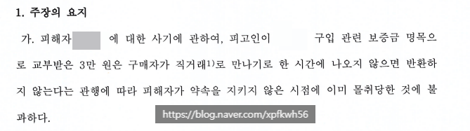
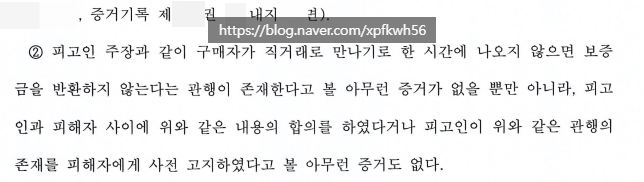
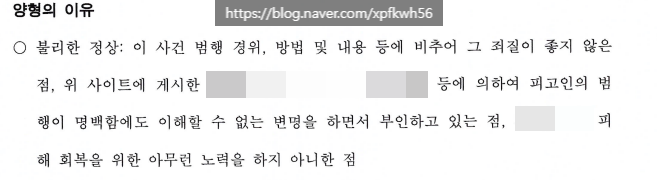

# 본인 허락받고 올림
**Date:** 51분 전
**Category:** 다이어리
**Original URL:** https://blog.naver.com/xpfkwh56/224258070466
---

1. 어떤 블로거가

당근 마켓에서 거래를 함

​

이하, **판매자** 라고 하겠음

​

그냥 거래를 했으면 상관 없는데,

​

판매자는 구매자에게

**예약금 3만원** 을 받음

​

2. 대화 내용에는 **'예약금'** 이라는

말만 있지, 그 돈의 용도를 따로

구체적으로 설명한 부분은 없음

​

구매자가 약속 당일에 나오지 않았음,

판매자는 그래서 예약금을 자기가 먹음

​

3. 3일 뒤, 구매자가 다시 연락 와서

사정이 생겨서 당시에 연락을 못 드렸다

​

아직 거래할 수 있겠냐? 라고 물었고,

​

판매자는 물건을 아직 안 팔았으니까

그냥 다시 오면 거래를 하겠다고 말함

​

**4. 그리고 거래를 하려고 했는데,**

**그 사이에 와이프가 그 물건을 팔음**

​

**\* 거래가 파기된 줄 알고**

**​**

판매자는 구매자에게 물건이 이미

팔렸기 때문에 거래를 할 수 없다 함

​

이 때, 구매자는 판매자에게

그렇다면 거래가 취소된 것이니

예약금을 다시 돌려달라고 요청

​

판매자는 기존 거래랑 지금 거래는

연장이 아니라 새로운 거래이므로

예약금을 돌려줄 필요가 없다고 함

​

**\* 둘이 니가 맞네, 내가 맞네 말다툼**

**​**

구매자 : 고소하겠다

판매자 : 해라

​

**5. 경찰서 방문**

​

이 직전 시점에, 저한테 댓글로

어떻게 대응할 것인지를 물었고,

​

나는 **'당연히 내 상식 선에서'**

절대 죄가 되지 않는다고 말함

​

**\* 질문자가 나한테 정보를 고의적으로**

**누락해서 제공하지 않았다면 당연한 것**

​

근데 이게 **'사기'** 로 송치가 됨

​

**여기까지 듣고, 나는 믿을 수 없다고**

**수사기록 전체를 보여달라고 요청했음**

​

내용의 핵심은, 다음과 같음

​

당근마켓에서 개인 간의 거래를 할 때,

거래 당시에 예약금을 냈는데 안 나타나면

​

예약금을 몰취한다는 관행이 있다는

근거가 없을 뿐 아니라, 그게 거래 당시에

이미 고지된 적이 없었기 때문에 사기란 것

​

**이게 진짜 무슨 소린가?** 싶을 정도인데,

​

**\* 내가 법을 몰라서 그럴 수도**

​

내가 아는 범위 내에서는 말이 안 된다고,

소명하고 필요하시면 변호사 상담 정도를

받아보시라 권해드리고 연락이 한참 끊김

​

피고측 주장

​

6. **약식기소 50만원** 나왔고,

불응해서 재판 넘어가서 **벌금 200** 나옴

​

판결문

​

나는 판결문 전체를 직접 다 확인했는데,

​

**\* 재판기록, 수사기록도 다 봤음**

​

적어도 내 상식에선 도무지

**이해할 수 없는 판결** 이었음

​

소액 사기로 벌금 200 이면, 적어도

양형위 기준으로는 겁나 쌘 처분인데

**​**

**\* 상담자는 형사처벌 전력 전혀 X**

​

일단 본인 주장에 의하면,

​

**반성하지 않았기 때문에**

더 엄하게 처분된 것 같다 함

​

예약금은 거래 당시에 안 나타나면 뺏기는 것이다 → 이해할 수 없는 변명

​

근데, **저기서 뭘 반성을 해야 됨?**

이라는 생각이 들긴 하는 것 같음

​

**\* 재판 당시, 판사님이 당근마켓에**

**혹시 공지사항이나 규정 같은 것으로**

**예약금 관련된 내용이 있냐고 물었고,**

**​**

**피고측은 그런 것이 없다고 했다고 함**

**근데 있다 한들, 그걸 과연 누가 읽을까?**

**​**

1심은 혼자 독자적으로 하셨다는데,

2심은 변호사를 써서 해볼까 고민 중이다

​

라고 물어보셨는데, 뭐라 할 말이 없었음

​

진짜 내 솔직한 생각은 그냥 **운이 없어서**

당근마켓 거래를 모르는 판사 걸렸구나 임

​

이런 비극은 **'누가 나빠서'** 가 아님

그냥 다들 **'바빠서'** 생기는 일 임