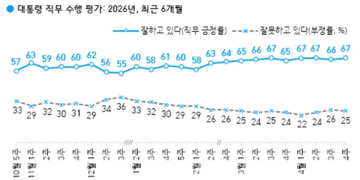
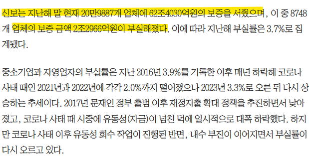
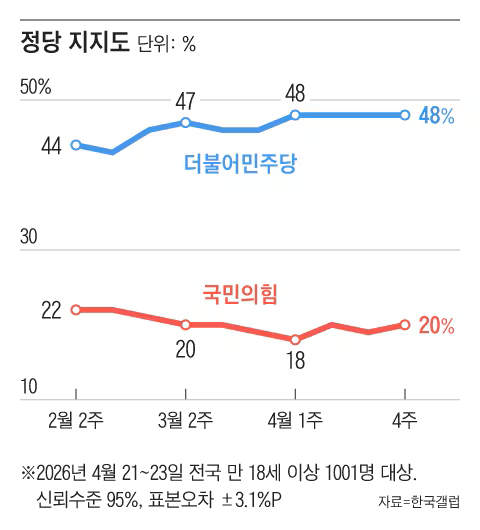
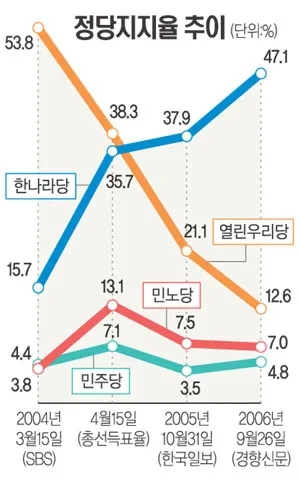
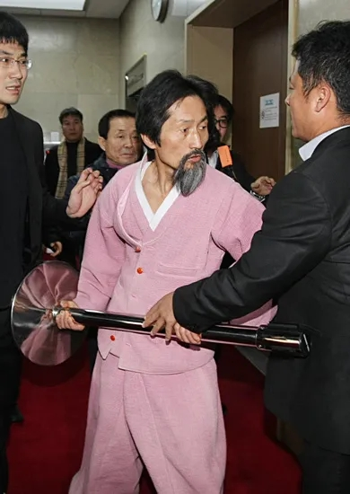
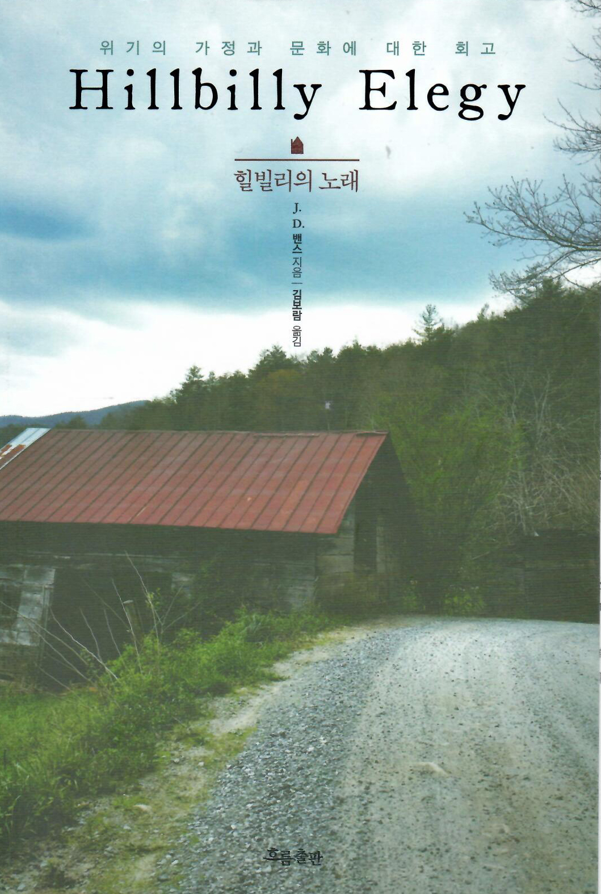
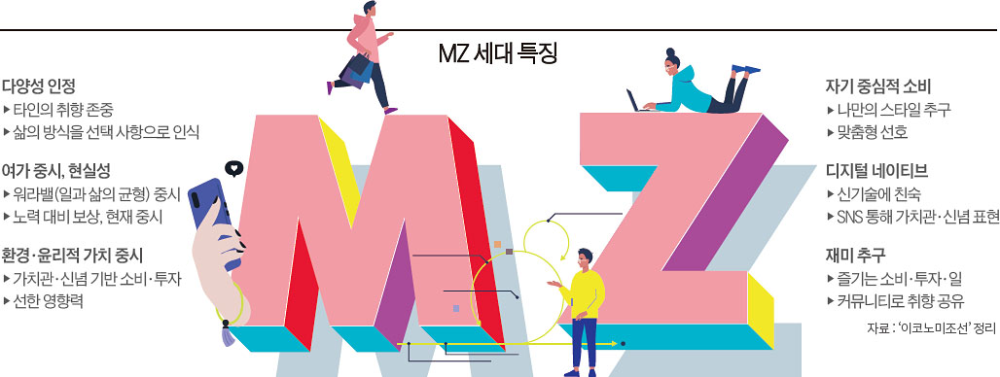
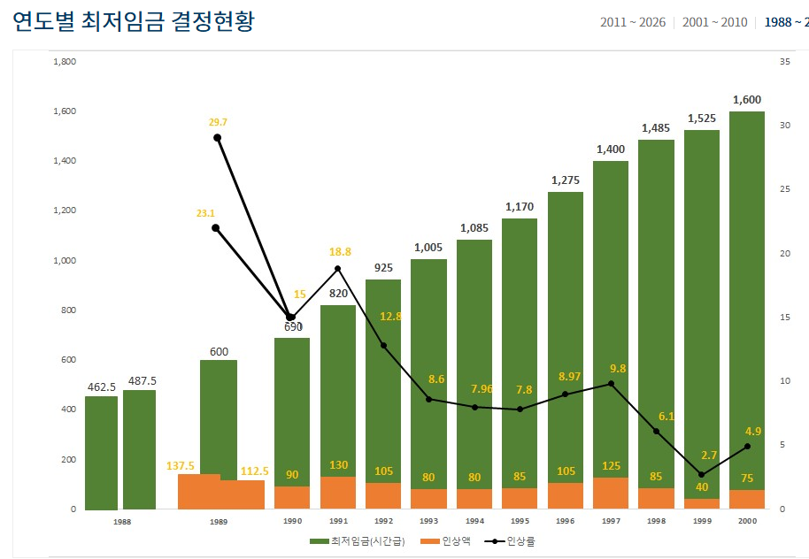
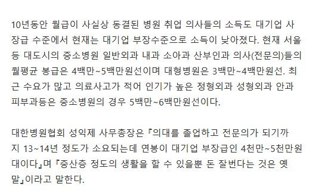

# 이재명 지지율과 진보 메타
**Date:** 55분 전
**Category:** 다이어리
**Original URL:** https://blog.naver.com/xpfkwh56/224265152815
---

​

1. 발표하는 기관에 따라 다르지만,

​

적어도 **'정치인 비호감'** 파트에 있어서

이재명 만큼 극단적인 사람도 드물었음

​

크게 나누면, **노빠꾸 개혁가 이미지** 와

**극단적인 포퓰리스트 라는 이미지** 사이

어딘가에 이재명이 위치했던 것 같은데,

​

정치에 아주 관심이 많은 분들을 제외하면

담합도 잡고, 뭐 이래저래 뜻이 있어서 하되

​

부동산 정도만 걱정이 되는 정도로

보고 있을 가능성이 높다고 생각을 함

​

<https://youtu.be/gAlyjctGZms?si=Y0EpkjKhuulzvd-i>

​

2. 최근 유튜브를 통해서 손쉽게

볼 수 있는 영상 중 하나가,

​

직접 정부/공공 관료들이 나와서

일을 하는 것을 볼 수 있는 것임

​

내가 자세히는 모르지만 해당 영상과

홈페이지에 나온 자료를 봤을 때,

​

사학 재단에서 받는 5천억 기금이

뭔가 앞 뒤가 안 맞는다고 느껴졌는데

​

**'사학 재단'** 은 기본적으로 사적 재산인데

거기에 공적 자금을 지원해서 운영을 한다

​

라는 점이 모순적이게 여겨졌기 때문 임

​

**\* 사학진흥재단 비용을 사립학교들끼리**

**기금을 꾸려서 한다면 문제가 없겠지만**

**​**

시간 있을 때, 설거지 하면서 유튜브로

틀어놓고 있으면 세상 돌아가는 것이나

​

이런 기관도 있구나, 저런 기관도 있구나

하면서 생각을 해볼 수 있는 것들이 있음

​

3. 살면서 사회의 부조리 에 관하여,

조금도 경험하지 않은 사람은 없을 것임

​

내 경우, 신보에서 대출을 받은 적 있는데

신보는 아는 사람은 알다시피 **'저리'** 임

​

실사를 온다고 해서, 나는 꽤 긴장 했는데

​

내 사업체의 수익성 검토를 하는 작업은

약 **'5분'** 정도였고, **기천만원** 대출이 나옴

​

편해서 좋긴 한데, **이래도 되나?** 싶었음

​

그렇게 썼다는 것은 아니지만, 상환만

들어가면 되었지 내가 대출 받은 돈을

​

어디에 썼는지, 검증하는 감시/감독 또한

적어도 **내 경험상은** 없었던 걸로 기억함

​

​

어느 누군가, 신보에서 대출을 받은 다음

요긴하게 저리 쌈짓돈으로 사용을 하다가

​

따갚되를 하면 **아마** 대응이 불가능할 것임

​

26년 기준, 부실 보증 규모는 약 **'3조'**

전체에서 적다면 적고 많다면 많은 돈인데

​

알음알음 장사하는 사람들 입장에서

​

기보돈, 신보돈은 **'쉬운 돈'** 이라는

인식이 있다는 것은 부정하기 어려움

​

관심 있게 보는 사람들 입장에서는,

이런 사회적 비대칭 소위 말을 하는

**​**

**'정보 기반 꿀통'** 을 부시고 다니는 것이

고깝게 느껴질 수도 있을 것 같긴 하고,

​

또 누군가에겐 **'당연한 정의'** 로

해석될 수 있는 여지가 있는 것 같음

​

정책적 이유 때문만은 아니겠지만,

​

내가 나름 종사한 적 있던 사금융이나

꽤 자세히 아는 기보 관련 쪽에서는

정권이 바뀌고 **'많이'** 빡빡해지긴 했음

​

4. 우리의 지난 과제가 지역 감정이니,

남북 통일이니, 민주화 같은 것이었다면

​

근래 가장 큰 화두는 **사회 갈등** 일 것임

​

그 사이에 우리의 인식이 많이 좋아져서,

어디 지역 출신이라고 누군가 멸시하거나

​

하는 것은 **'저질스러운'** 행위 라는 것이

공공연하게 문화적으로 자리 잡기도 했음

​

다만 그와 별개로, 나랑 다른 생각을

가진 사람이 있으면 **수준이 낮다** 거나

​

**비상식적이다**, 라는 식으로 비난하고

척 지는 것은 문제로 나타나게 되었는데

​

그 중심에 있는 것 중 하나가 **'정견'** 임

​

​

한국갤럽 기준, 정당 지지도는

​

**\* 물론 보수, 진보 개념이**

**의미가 있나는 모르겠지만**

​

민주당측이 국힘측을 2배 정도

리드하면서 꾸준히 유지되고 있음

​

​

약 20년 전만 해도, 한나라당 지지율이

민주 진영 지지율을 압도하고 있었고

​

과거 민주당이라고 하면 약간 이런 느낌 이었다

​

**'보수'** 의 인식이

**지금보단** 긍정적이었음

​

5. 그럼 지난 세월을 살펴봤을 때,

​

**'어른들이 인식하는'**

보수의 가치는 무엇이고,

​

그게 **'왜'** 시대에 부합했을까?

​

​

자주 인용되는 서적 중 하나로,

**힐빌리의 노래** 라는 책이 있음

​

힐빌리 는 미국 중부 특정 지역에 사는

가난한 백인들에 대한 멸칭으로,

​

편의상 비유하면 소위 우리가 굳이

말은 하지 않아도 암암리에 아는

​

**'하급지'** 개념에 가까움

​

자서전의 주인공 밴스의 어머니는

술과 마약에 늘 절어 살았고, 아버지는

​

자주 바뀌어서 누군지도

알 수 없었다고 회고함

​

**\* 아빠가 친부 개념 보다는**

**엄마의 남친 이라는 느낌**

**​**

불우한 성장 과정에서 유일하게

자신이 의지할 수 있던 사람은

할머니 하나에 불과했지만,

​

본문 내용을 보면 그나마도

인격적으로 대했다고는 보기 어려운

묘사들이 빈번하게 등장함

​

**\* 좋게 말하면 터프**

**​**

밴스는 돈이 없어서 군대에 입대했고,

학비가 저렴한 주립대에 진학했다가

​

비로소 예일대학교 로스쿨에 들어가고,

​

가까운 일가 친척 중에서 대학을

구경이라도 해본 사람이 없는 출신이던 밴스가

​

미국 상류층 티켓을 거머쥐고, 마침내

미국 부통령의 자리까지 올라가는

이야기가 해당 서적에 나오는 서사임

​

어찌 보면 그냥 전형적인

**'개천용 스토리'** 같은데,

​

이 글을 소비하는 입장에서는

두 가지 다른 해석을 할 수 있음

​

**1) 노력이다**

**2) 운이다**

​

6. 10-20년 전 기준으로 보면,

그 시대를 살던 사람들의 인식에서

​

어떤 성취가 발생했을 때,

그게 사회적 조력이나 규정할 수 없는

​

운의 영역이냐? 아니면 개인이

열심히 노력한 결과냐? 라고 하면

**​**

**후자** 라고 여기는 사람이 더 많았음

​

우리에게 익숙한 대표적인

개천용 테크가 **'고시', '수험'** 인데

​

물론 그거도 돈이 있으면 더 유리하다,

라고 생각하는 인식도 있긴 하지만

​

맨몸으로 정정당당히 경쟁해서

순수 실력으로 성취를 얻어낸 다음,

​

입신양명 하는 것에 대한 정의는

응당 바람직한 것으로 여겨지곤 했음

​

때문에, 과세를 늘린다는 것은

​

정당한 노동과 생산에 대한 대가를

**'무임승차자'** 들이 **'약탈'** 하는 것으로

여겨지는 인식이 지금보다 더 강했고,

​

낙오/실패자에 대해 **대체로** 갖는 시각도,

**니가 그럴 만한 이유가 있겠지** 라는 식의

해석이 따라오는 경우들이 더 많았었음

​

7. 즉, 전부 그런 것은 아니지만

​

**'보수'** 를 지지한다는 것은

​

실력주의 안에서 정당하게 이루어지는

분배를 내재적으로 수용하느냐? 였고,

​

**'진보'** 를 지지한다는 것은

​

아무리 잘 쳐줘도, 비현실적 공상에 빠져

남이 잘 만들어 놓은 보금자리에

고춧가루 뿌린다고 인식되곤 했었음

​

정치공학적인 문제도 있었는데,

​

민주주의는 기본적으로

대가리 숫자 싸움이라,

​

지금 보수 진영에서 **'다소'**

비상식적으로 보일 수 있는

의견에 과격하게 동조하듯,

​

당대 진보 진영에서도 일반적으로는

다수가 이해하기 어려운 집단과

협업을 하는 경우들이 많았기 때문에

​

구조적으로 **'틈'** 이 더 많기도 했음

​

**\* 좌파 스피커로 유명한 양반 께서**

**먹고 살려고 팔았던 물건들을 보면**

**저렇게까지 해야 했을까? 싶을 정도**

**​**

**물론, 직업에 귀천은 없다지만**

**분명 대안이 있긴 있었을 것이다**

​

​

8. **'노오력'** 을 하면 바뀌던 시대를

살아온 세대와 **'노오력'** 이라는 말이

공허하게 들리는 세대는 아닌 말로

​

다른 **'국가'** 를 사는 사람이라고

봐도 거의 무관할 정도임

​

의치한약수, 변변회감 법세노관,

대기업, 공기업, 공무원, 등등의

​

이른바, **'아주 열심히 살았을 때 얻는'**

직업적 성취들에 대한 아웃풋을 보면

​

**지금도 그 정도면 괜찮지 않나?** 싶은데,

​

1년에 변호사 60명 나올 시절 변호사랑,

2천명 나올 시절의 변호사는 **아예** 다르고

​

**SK 하이닉스 버리고, 한전 들어간 사람** 과

​

죽어라 열심히 노력해서 명문대 들어가고,

좋은 직장까지 가졌는데 그냥 뜬금 없게도

​

**벼락부자 된 사람을 본 사람들의 경우**,

**'노오력'** 의 가치를 신봉하기 아주 어려움

​

**\* 10년 전 기준, 수의사 라는 직업은**

**입결만 봤을 때, 명문대 공대 쯤이었음**

**​**

​

1990년대 최저임금은 1천원대 인데,

​

​

동 시대, 의사 연봉은 **5-6천만원** 으로

​

대졸 초임 연봉에는 **2-3배** 에 달했고,

중소기업 연봉은 **비빌 수도** 없었음

​

최저임금은 인권이니 뭐하니 하면서

열심히 챙겨주기 바쁘지만,

​

**'고점'**계층의 소득은 **'유지'** 되니까,

점점 상대적으로 프리미엄이 내려갔고

​

**'노오력'** 하면 인생이 바뀐다 에 대해서,

​

**'나도 노오력 이면 할 만큼 했는데요?'**

라고 말하는 사람 숫자가 많아진 것임

​

당장 지금 시대를 사는 20대 입장에서,

​

노오력이냐, **'행운과 재능'** 이냐 물으면

나는 일말의 주저없이, **'후자'** 라고 봄

​

노-오력이 황금 티켓을 잡을 수 있는

유일무이한 자기 증명의 수단이 아닌,

​

**'그거라도 해야 되는 지푸라기'** 쯤으로

격하된 시절로 한참 지났다는 이야기임

​

9. 개인의 성취가 전적으로 그 개인의

몫이라고 볼 수 없다는 세계관의 차이는

​

**'사회의 기능과 역할'** 을 확장해서

해석할 수 있는 계기로 연결될 것임

​

그리고, 내 생각에는 이게 현재 나타나는

**'부동산 때려잡기'** 에 중추 라고 보는 편임

​

알음알음 아는 사람들은 아는 트릭이지만,

​

**서울 아파트를 경매로 구입하면**

**구입 증빙과 실거주 의무가 사라짐**

​

**\* 토허제 지역 조차 예외로 처리하지만**

**복잡한, 예외 조항, 디테일이 많이 있음**

​

그래서 비거주 1주택 소유와 거주를

분리하는 것이 적어도 내가 아는 선에서

​

가장 효율적으로 아파트를 보유하는,

장기적 관점에서 **안전한** 포지션이었음

​

**\* 경우에 따라 다르겠지만, 프리랜서나**

**창업가 기준으로는 이거 말곤 대안도 X**

​

현재 돌아가는 사정만 보면,

​

대출 목덜미 잡기, 다주택 타파에서

비거주 1주택 이라는 범위까지

점점 딥하게 들어오는 것 같고,

​

**'진짜'** 부동산으로 돈 벌 생각은

**아예 포기하라는** 뉘앙스가 보이는데,

​

그 스텝의 궁극적인 신호는 이렇게 보임

​

> 우리가 하는 부동산 억제책의 골자는
>
> 투자에서 오는 수익률을 낮추는 데 있다
>
> 할 테면 해보시던가

​

민주주의 사회에서 지지율은 **'깡패'** 임

​

관료제가 발달한 행정 국가에서

**'지지 받는 정권은 못할 것이 없음'**

​

그게 옳냐, 그르냐, 를 논하기 앞서서

​

앞으로 어떻게 돌아갈 것이냐? 정도는

미리 짐작해 보는 쪽이 **차라리** 나은데,

​

실거주 1주택, **'보유세 납부'** 가능이

현 정권에서 보고 있는 범주인 듯함

​

자주 인용되는 레토릭 중에 하나인데,

​

**50억 짜리 주택을 1채 가진 사람이**

**5억 짜리 주택을 3채 가진 사람보다**

**더 무거운 세금을 무는 것이 정당하냐?** 가 있음

​

이는 다주택자에게 세금을 중과하는 종부세가

애초에 비합리적이라는 의도도 있지만,

​

더 깊게는 재산세 중과를 통한

보유세 중과를 바라본다고 볼 수도 있음

​

50억 짜리 주택 1채와

10억짜리 주택 5채는 동일한

조세 부담을 져야 하는가?

​

정부의 기조를 미루어 볼 때,

현 정권은 **'후자에 조세부담이 높은 것이'**

정당하다고 봄이 타당한 해석인 것 같음

​

때문에, 불필요한 조세 저항을 부르는

전역 재산세 카드는 안 뽑을 것 같고,

​

전 국민의 **3%** 만 확실히 조져놓으면

​

**\* 실제 해결이 될진 모르겠지만**

​

안전하게 털을 뽑을 수 있는

종부세 중과 쪽으로 방향을 잡고,

​

부동산 가격 경착륙을 목적으로,

​

**\* 경착륙은 가격이 서서히 떨어진다**

**이런 것이 아니고, 메리트가 내려간다**

**​**

**또는 상승세가 더뎌진다에 가깝읍니다**

**대단히 공격적인 포지션이 아니라면**

**가십 정도로만 이해해도 차이 없을 것임**

​

정책을 풀어가지 않을까 싶음

​

**10. 결론**

​

1) 진보 메타는 시대정신에 가까워서,

​

보수 정권이 설령 정권을 잡는다 해도

아마 큰 차이 없이 그 기조가 유지될 것

​

**\* 보수 라고, 보수 정책만 쓰는 것 아님**

**근본적으로 남조선엔 보수/진보가 없음**

**​**

2) **'메타'** 가 바뀌려면

시대가 바뀌어야 되는데,

​

단기에 그걸 기대하긴 어렵다

​

그러니까 정부가 뭐 하려고 하면

의지에 반하려고 하지 말고

그냥 가는 대로 휘는 것이 낫다

​

3) 부동산 정책은 계속 **압박적** 일 것,

​

근데 그게 떡락이 된다든가,

​

서울 메이저 아파트가 5억대,

10억대로 나온단 소리는 아니고

​

상대적으로 메리트가 줄어들거나,

상승폭이 전보다는 더딜 순 있을 듯

​

**\* 금융 투자가치 측면에서**

**​**

4) 실거주 1주택이 무적이었는데,

더 안정적으로 보면 실거주 1주택에

​

**'재산세 부담까지 가능함'** 으로

더 보수적으로 볼 수도 있을 것 같다

​

정부 레인지에 걸리는 자산가 라면

그 부분에 대한 고민이 필요할 듯함

​

5) 보유세 실행에 있어서,

​

전역적인 재산세 집행은 아마도

어지간하면 안 일어날 것으로 보임

​

다만, 종부세 관련으로는 대체로

지금보다 더 빡빡할 수도 있을 것 같다

​

6) **필요하고, 감당 가능하면** 사고

뭘 해보려고 한다면 각오가 필요할 듯

​

**\* 점점 세상이 잔재주가 안 통하는**

**사회로 바뀌어감은 확실한 것 같음**

**​**

갭 펑펑 찍어가면서, 휘황찬란한

포지션으로 자본 수익을 쓸어담는

그런 것은 옛날 이야기가 된 듯함