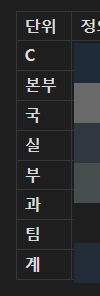

# LLM
**Date:** 57분 전
**Category:** 일기장
**Original URL:** https://blog.naver.com/xpfkwh56/224333614031
---

1. **'무조건'** 메가데이터 다룰 것

​

책 한 권 요약, 블로거가 포스팅 했는데

무슨 내용인지 모르겠어서 제미나이에

슥슥 긁어서 1개 요약 이런 것 하지 말고,

​

내가 죽을 때 까지 다 봐도 못 볼 데이터,

​

아무리 계산해도 인간이 다 찾을 수 없는

그런 것들을 LLM 돌리는 기술 해야 좋음

​

**'메가데이터 + 멀티 오케스트레이션'**

​

26년 6월 기준, 몸값 제일 비싼 기술이고

그냥 지금 **'할 줄 아는 인간'** 자체가 없음

​

너무 감이 안 오는데요?

​

법적인 부분은 알아하실 부분이고,

그냥 예시니까 편하게 얘기한다면

​

내가 편의점 사장임

​

1) 손님이 문 열고 들어오는 시점부터

계산하고 밖에 나갈 때까지 전부 스샷

​

2) 무슨 옷을 입고 있고, 키가 몇이고,

남자인지, 여자인지, 모자는 썼는지

안썼는지, 동선 어디에 머무르는지 체크

​

3) 얼마 썼는지, 뭐 샀는지, 어떻게 샀는지,

시선은 어떤지, 손은 어디에 갔는지 등 체크

​

데이터 싹 모아서, 데싸 ㄱ

​

2. 제가 지금 무인화 블로그할 때,

체크/수집/가공/관리 하는 데이터들

​

1. 발행 현황 (오늘/주/월 발행수/전체수/페이스/카테고리)

2. 발행 통계 (기간별 누적/일평균/당일Δ/추세/Mann-Kendall)

3. 발행 대비 (오늘 vs 일평균/CAGR/EWMA)

4. 발행 추이·누적·가속 (주별)

5. 누적 발행 곡선

6. 발행 가속 모멘텀

7. 발행 집중도 (지니)

8. 볼륨 단위 = 총 글자수 (글 수 ↔ 볼륨 이중화)

​

9. 카테고리별 글 수·비중 (상위/하위)

10. 카테고리 비중 추이

11. 카테고리 다양성/엔트로피 (유효종수 exp(H), Hill q=0/1/2,Theil 분해, HHI, Pielou 균등도,지니 병기)

12. 빈 라인 매핑

​

13. 카테고리별 발행 추이 (주별)

14. 요일별 발행

15. 발행 버스트/몰아찍기 (Burstiness/Fano/Hawkes)

16. 요일×시간 히트맵

17. 카테고리 로테이션

18. 발행 간격 분포

​

19. 포스팅 에이징 커브 (분포, 중앙값)

20. 카테고리별 마지막 발행 (방치 순)

21. 신선도/방치 히트맵

22. 신규 비율 추이

23. 방치 경보 (임계 넘은 라인)

​

24. 주별 평균 글자수(표제외) 추이

25. 평균 이미지수 추이

26. 평균 표수 추이

27. 현 시점 규격 분포 (평균, 중앙, 히스토그램, KDE)

28. 표준글 프로파일 및 강조, 색상 통계

29. 규격 조합 패턴

30. 카테고리별 규격 비교

31. 고정키워드 = 노린 키워드 ↔ 실제 유입 대조 추이

​

32. 공정별 병목 (T\_A·T\_B·T\_C 핸드오프 시각·Process Mining)

33. 구간 리드타임 (T\_B−T\_A, T\_C−T\_B, T\_C−T\_A)

34. 리드타임 분포 (Tail)

35. 카테고리별 리드타임

36. 총 생산 토큰 (T\_C−T\_A 토큰 = 글별 AI 비용)

37. F × 규격 상관 계수

​

한 섹터고, 이런 것이 8개 더 있음

​

**\* 자동화 어떻게 해요? 하면**

**진짜 저로선 드릴 말씀이 없음**

**​**

**그냥 데이터가 모인다**, 가 아님

​

각 데이터를 LLM 모델들이 개별적으로

판단해서 추론하고 합산된 정보 바탕으로

그 다음 스텝을 이끌어낸다는 것이 중요

​

저 하나 하나가 회사에 있는 하나의 **cell** 인 것

​

**\* 나 혼자는 불가능하고, 사람한테 시켜도**

**매우 비싼 작업이고, 설령 맡긴다고 해도**

**내 성에 찬다는 보장이 없는데 AI 는 가능**

**​**

​

○○계가 모여서 ○○팀

○○팀이 모이면 ○○과

○○과가 모이면 ○○부

○○부가 모이면 ○○실

○○실이 모이면 ○○국

○○국이 모이면 ○○본부

​

그리고 본부 위에 C클래스 인사 있구,

각 클래스 인사들이 저한테 최종 보고함

​

**\* C급은 본부장들 보고 받음**

**​**

제가 C클래스 보고 받는 것처럼,

​

팀장은 계장들 보고 받고,

과장은 팀장들 보고 받고,

​

이런 식임

​

지금 도메인 2개 정도 완성했는데,

​

이거를 **'표준화'** 시키면 저는 앞으로

무슨 일을 하든 인간이 덜 필요할 것

​

데이터 도메인은 예전에 회사 운영할 때,

갖고 있었던 것들 다 가져와서 싹 박았음

​

당시에는 현실적으로 영세했기 때문에

할 수 없었던 것들도 AI 체제에서는

전부 구현 가능해서 훨씬 풍성해진 듯함