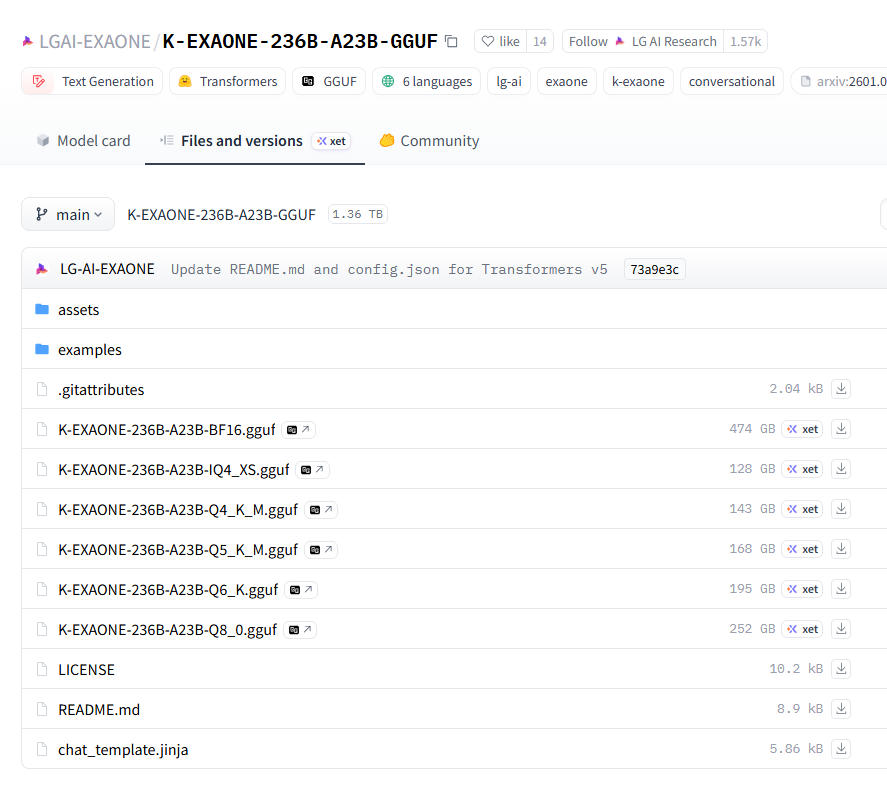

# 국가대표 인공지능
**Date:** 58분 전
**Category:** 다이어리
**Original URL:** https://blog.naver.com/xpfkwh56/224230867439
---

<https://youtu.be/tJzyMn3bS2k?si=2TdrA2riHLL91e6B>

​

1. 내가 물론 전문가는 아니지만,

​

나름 로컬을 **'그래도'** 하긴 해봤으니

내가 아는 범위 내에서 코멘트를 함

​

**2. 대중들이 쓸 수 있어요?**

​

아마 대통령의 질문은 이거였을 것이다,

​

국가에서 AI 를 만들면, 그걸 바탕으로

국민들이 GPT 처럼 쓰듯 쓸 수 있나요?

​

<https://huggingface.co/LGAI-EXAONE/K-EXAONE-236B-A23B-FP8>

[**LGAI-EXAONE/K-EXAONE-236B-A23B-FP8 · Hugging Face**

We’re on a journey to advance and democratize artificial intelligence through open source and open science.

huggingface.co](https://huggingface.co/LGAI-EXAONE/K-EXAONE-236B-A23B-FP8)

​

그 질문에 대해선, **'택도 없다'**

​

**\* 지금 기준으로는**

​

현실적으로 **'가정용 로컬'** 이

나오려면 VRAM 12gb 이하로

서빙이 돌아가야 의미가 있고,

​

프론티어 모델로 붙여서 돌린다면

상용 모델과 비교할 때 의미가 있을까?

라는 생각을 지우기 **'아주 어렵다'**

​

그래서 컨소시엄 별로,

**'서비스를 만들고 있다'**

​

라고 하는데, 뭘 만들고 있으며

어떻게 나오느냐가 핵심일 듯함

​

진짜 솔직히 말하면, 기대는 없다

​

왜냐면 일단 AI 자체가 **'초초 거대한'**

하나의 모델을 만든다고 만능 원패스로

문제를 해결하는 것 자체가 **'불가'** 하고

​

그렇게 지향해서 만든다고 해도,

**'극도로'** 비효율적이다

​

그래서 몇 번 예전에 썼다, 지웠다 했는데

내 생각에는 차라리 국내 도메인 데이터를

기반으로 솔루션 모델을 많이 만들어서,

​

맞춤식으로 골라 쓸 수 있게 하는 것이

더 낫다는 생각을 하고는 했었다

​

500B, 1000B 프론티어 모델 찍어서

우리도 이제 **'AI'** 만들 수 있다 말고,

​

EBS랑 제휴해서, 데이터를 먹이고

학습 시켜서 맞춤 가정교사로 쓰거나

​

**\* Math 모델 많으니까**

​

기존에 있는 프론티어 모델 바탕으로,

파인튜닝만 새로 입혀서 뿌려주는 것이

더 효율적이라고 생각하는 입장이다

​

먹어야 되는 것은, **모델 패권**이 아님

​

그 모델을 중심으로

하고 있는 **'생태계'** 지

​

**3. 말장난**

​

허깅페이스에 올려서, 누구나

다운 받아서 이용할 수 있지만

일반 국민들은 아직 어렵습니다

​

라는데,

​

**'사용하게 만들 것이라면'**

양자화 모델부터 잡아놨어야 됨

​

중국 모델이 로컬을 호령하는 이유는

성능 자체가 좋아서가 아니고,

​

**'성능 대비 진입 인프라'** 가

비교할 수 없게 저렴하기 때문

​

​

ㅋㅋ이걸 어떻게 써요

​

4비트를 143gb 들여서

저거 쓸 바에 딴 걸 쓰죠

​

8비트 252gb면 상식적으로

딥시크나 퀘인을 쓰지 누가 씀

​

**4. 그럼 뭘 풀어야 되냐?**

​

1) **'전처리된 공공 데이터'**

​

모델이 중요한 것이 아니고,

​

모델을 훈련 시킬 수 있는 재료를

잘 만들어놓으면 알아서 오픈소스

생태계에 있는 애들이 발전을 시킴

​

**\* 고품질 한국어 데이터셋**

**​**

2) **'원버튼 SaaS'**

​

홈페이지만 들어가도 쓸 수 있을 정도로

간단하게 서빙해서 돌리게 하고, 서버비를

나라에서 물어서 처리하면 해결이 될 것임

​

**5. 그러나,**

​

AI 의 공공성이 넓어지면 넓어질수록

99% 확률로 규제에 대한 말이 나올거고,

​

**\* 국가대표 AI 를 국민이 사용해서,**

**범죄나 불법적인 경로로 쓰고 있다?**

​

도메인 데이터를 활용해서, 시장을 넓히면

기존에 있던 사람들의 **반발** 이 나타날 것임