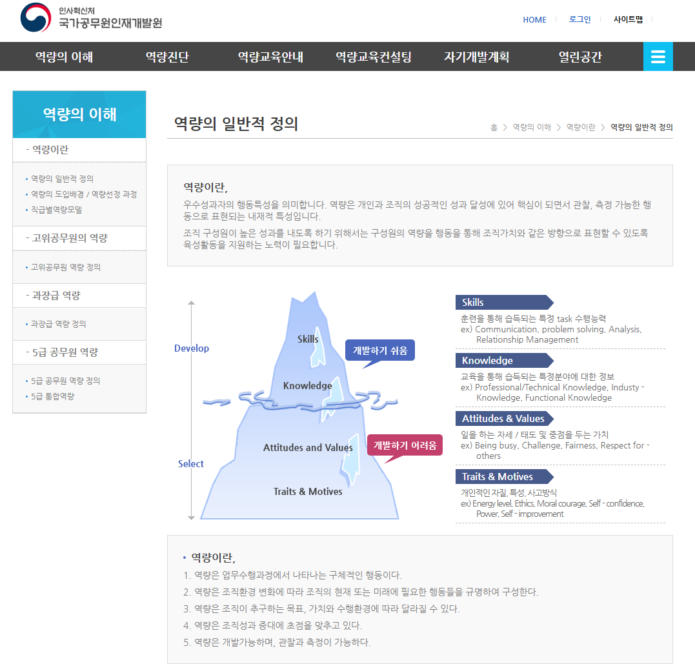
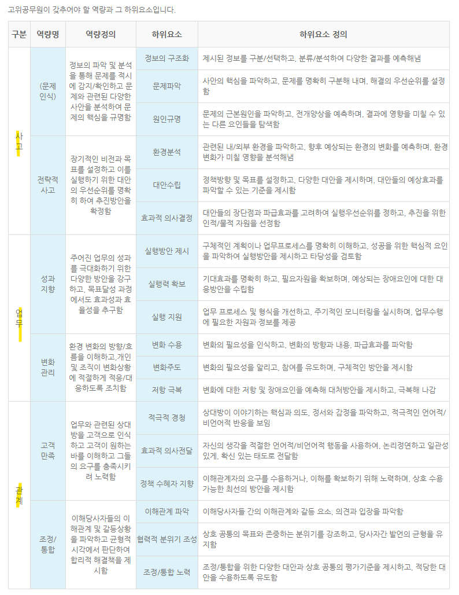

# 고숙련, 저숙련에 대하여
**Date:** 5시간 전
**Category:** 다이어리
**Original URL:** https://blog.naver.com/xpfkwh56/224254856712
---

**1. 저숙련 노동자가 무엇이고,**

**고숙련 노동자가 무엇일까요?**

​

사전적 정의에 의하면,

​

교육, 기술, 훈련이 없어도

누구나 쉽게 수행할 수 있는

단순하고 정형화된 업무 = 저숙련

​

실질적 정의에 의하면,

​

**면허증**이 있으면 고숙련,

없으면 저숙련

​

면허를 얻기 위한 비용이 비싸면

더 고숙련, 싸면 덜 고숙련 정도가

빨리 빨리 써먹기 좋은 정의인 듯요

​

특정 직종은, 4년제 졸업 학위자를

의무적으로 고용해서 보유해야 되는데

이런 것들은 당연하게도 고숙련 입니다

​

**\* 4년제 학위는 하루아침에 안 나옴**

​

**2. 저숙련 노동자 내에서도**

**고수와 하수가 나뉘는데,**

**​**

**그 중 하수가 더 대체되기 쉽고,**

**가치를 창출하기 어렵다 보면 될까요?**

​

숙련 과 경쟁력 이라는

정의가 혼용된 듯요

​

이게 뭐 사회철학 할 것도 아니고,

엄밀한 표준적 정의를 내긴 어렵지만

​

해당 질문은 경쟁력 이슈 같습니다

​

**3. AI 시대에 지식 기반**

**고숙련의 가치가 흔들린다면,**

**앞으로 진짜 고숙련의**

**기준은 뭐가 될까요?**

​

https://www.nhi.go.kr/cad/frontAbi/cacAbi.do

​

국가공무원 인재개발원 이라는

공공 기관에서는 고공단 포함하여,

​

정부 차원 내에서 현대 사회의

인적 자원 HR 기준을 제시합니다

​

**\* 에티튜드, 벨류, 트레잇, 모티브 등**

**여러 표현으로 하지만 돌고돌아 재능**

**​**

고공단 = 엘리트, 고공단 역량 = 고급 역량

​

정리하면, 해당 직종을 갖기 위해서

해자가 있어 쉽게 진입할 수 없고

​

진입한 이후에, 상대적인 역량을

높게 가져간 상태에서, 자신의 경쟁력을

보존할 수 있는 사람이면 유리할 듯요

​

**'판사'** 라는 직업이 선망받는 이유도,

​

**휴먼 리소스 관리를 빡빡하게**

**잘 해줘서 그런 것이라고 생각**

​

4. 친절함·대인 능력처럼 수치화하기

어려운 숙련은 어떻게 평가·보상되어야 할까요?

​

수치화할 수 없는 숙련은, 대체로

시장에서 **'보상 받을 수 없습니다'**

​

**응, 그래 너 열심히 했어** 가 될 확률이 높음

​

5. So?

​

이건 그냥 제 생각인데,

입장을 **바꿔서** 보면 쉽게 나옵니다

​

**\* 좋은 직원이 되려고 하지 말구,**

**면접관의 입장에서 보면 더 쉬움**

**​**

**아이돌이 되려고 소속사에 가지 말고,**

**유튜브에서 팬을 만드는 것이 빠르단 것**

**​**

**전자는 잘 팔릴 것 같은 사람을 추리지만,**

**후자는 실제 팔리고 있는 사람이기 때문**

**​**

내가 사람이 필요해서 고용을 해요,

​

대단한 어떤 역량을 가진 사람?

창의적이고, 혁신적인 인재?

​

엄청난 대기업이 아닌 이상에야,

최소한 좋소 기준으론 **노필요** 입니다

​

**\* 만약 이런 쪽으로 욕심이 있다면**

**최소한 좋소는 기웃 거리지 마세요**

**​**

**제도권 직업은 제가 안 해봐서 모르겠지만**

**어렴풋, 비제도권보단 분명 더 나을 것임**

**​**

1) 그냥 출근 성실하게 잘 하고,

2) 사고 안 치고, 상식이 있고,

​

3) **'시키는 일'** 똑바로 잘 하면

그 자체로 A급 인재 취급 입니다

​

시키지 않은 일을, 찾아서 능동적으로

자신의 일처럼 해주는 사람도 있지만

​

그런 사람이 있으면 아마 제 생각에는,

감사함과 고마움도 느끼겠지만

​

**'얘는 내 밑에 오래 안 있겠네'**

라는 생각을 가질 확률이 더 높음

​

**6. 취업자 관점**

​

뭐 신기한 사파적인 테크트리 말구,

그냥 하라는 것을 잘 하면 됩니다

​

시키지도 않은 인도 수학 교육 과정,

피아노, 이런 것에 괜히 용 쓰지 말고

​

**\* 알면 좋지만**

**​**

내신, 수능만 열심히 해도 충분해요

그거 열심히 하는 것도 쉽지가 않음

​

제 경험에는 월급 주는 입장에서는,

그 사람이 대단히 뭐를 잘 하는 것보다

​

**'사고'** 를 치지 않는 것을 더 높게 칩니다

​

**\* 잘하면 +1~10점**

**사고를 치면 -10000점**

**​**

**7. 창업자 관점**

​

**'Contribution'** 이 되는 인간인가?

나한테 로열티가 높나?

​

좋소 기준으로는 저거면,

**'거진'** 다 뚫립니다

​

다른 누군가에게 **'쓸모'** 가 있냐,

라는 것을 충족 시키는 것이 장사라

​

남이 **필요로 할 것 같은** 것을 하면 됨

​

**\* 좋소 사장의 위에는 고객이 있음**

**​**

**고객을 부리고, 모실 수 있는 사람이**

**결국 다른 사람을 휘하에 둘 수 있는 것**

**영업이 안 되는 사장은 무조건 망함**

**​**

8. 오늘 당장 나는 뭘 해야 할까요?

​

**1) 내가 하는 일에서 재밋거리를 찾기**

​

내가 하고 있는 업무를 체계화 하고,

스스로 문제를 정의하고 해결하면서

​

일을 최대한 **'세련되게'** 하면 됩니다

​

프로바나나 쓰면 그림 그려준데 (x)

API 로 쓰면 같은 값에 해상도 더 좋음 (o)

​

ComfyUI 쓰면 파이프라인 짤 수 있음 (o)

유즈 케이스에 따라 Omni가 더 좋음 (o)

​

<https://arena.ai/>

[**Arena | Benchmark & Compare the Best AI Models**

Chat with multiple AI models side-by-side. Compare ChatGPT, Claude, Gemini, and other top LLMs. Crowdsourced benchmarks and leaderboards.

arena.ai](https://arena.ai/)

​

**덕테이프** 쓰면 되는데요? (o)

​

관심이 없으면, **알 수가 없어요**

​

인공지능은 **'표층'** 을 빨리 잡아먹는 것이지

**'심층'** 까지 뚫어낼 수 있는 역량은 없음

​

**2) 명확한 가시적 성취로 증명하기**

​

나한테 일을 맡기면 나는 단도리가 됩니다

​

나랑 일을 하면 당신은 돈을 벌 수 있습니다

당신은 나를 통해서 시간을 아낄 수 있습니다

​

당신 혼자 할 수 없는 일을, 나와 함께 한다면

그 문제를 풀어갈 수 있습니다

​

같은 것을 설득하면, 더 **빨리** 닿을 수 있음