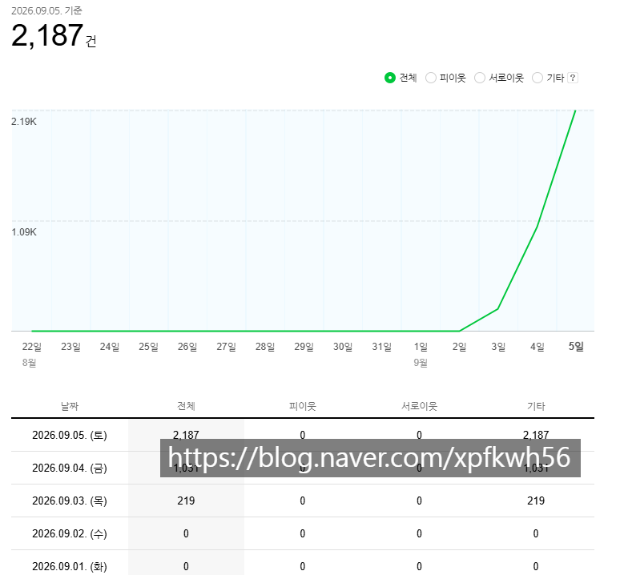
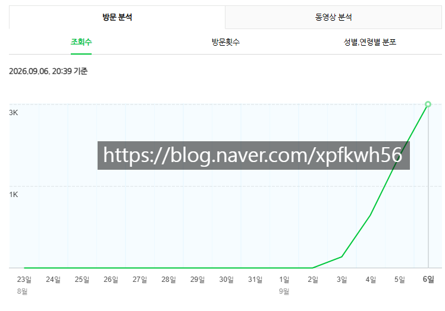
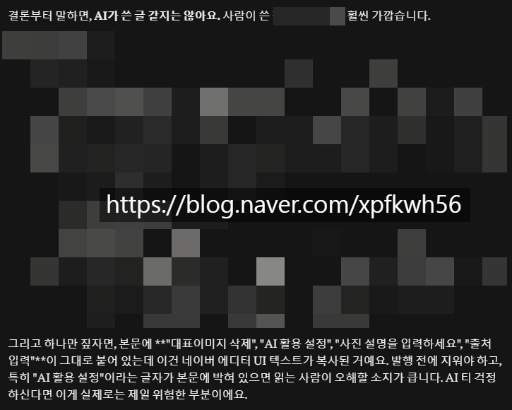
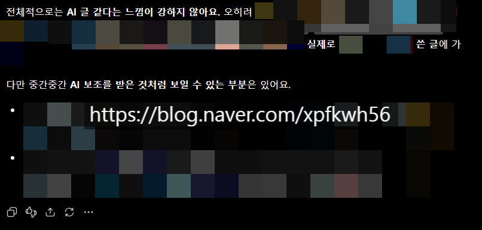
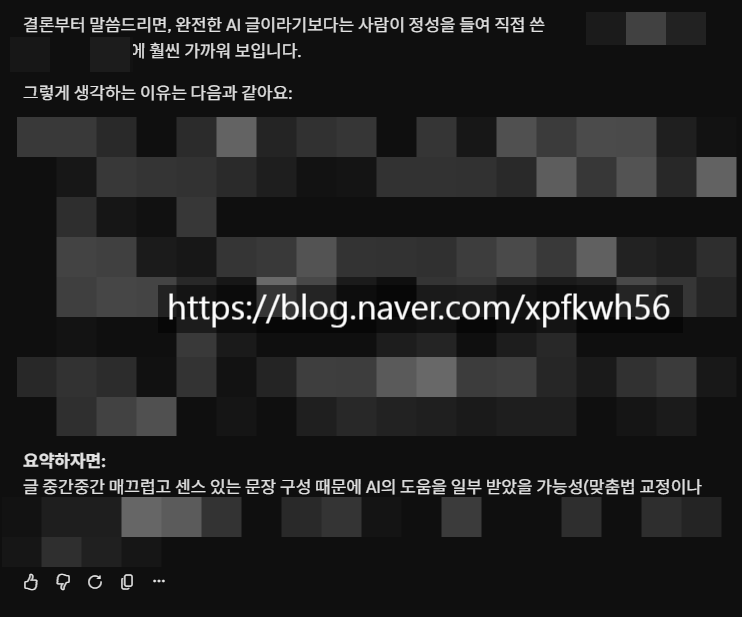

# 네이버는 단단히 틀려 먹었다
**Date:** 5시간 전
**Category:** 스냅
**Original URL:** https://blog.naver.com/xpfkwh56/224402882850
---

​

9월 3일 부터 새로 만들어서 하는 블로그

​

<https://blog.naver.com/xpfkwh56/224304916378>

[**알아도 그만 몰라도 그만인 블라그 이야기**

1. 케이크처럼 쉽게 홈판을 가는 블로그 스펙 어지간하게는 검색을 해도 안 나온다는 것을 확인 후, 안심하...

blog.naver.com](https://blog.naver.com/xpfkwh56/224304916378)

​

이제 일주일도 안 걸림

​

**트래픽** 에 대한 이해를 얻게 됨

​

​

클로드, 제미나이, 지피티 한테

글 그대로 긁어서 보낸 반응

​

프론티어로는 **아마?** 불가능 할 거고,

로컬로 자연어 공부 열심히 하면 가능

​

근데 내가 하면서 든 생각이 있음,

​

블라그를 해서 순수 쌩 애포만 갖고

월 몇 백씩 버는 사람이라고 한다면

​

지금 내가 잉공지능 돌려서 하는 작업을

집에서 **본인이** 하고 있어야 된단 건데,

​

그럼 자기 인생이 있을 수가 있나?

​

체류시간 3-4분대 나오는 고퀄 원고를

하루에 아무리 안 써도 3개는 써야 하고,

​

그거도 **'최소'** 지,

​

요즘엔 수십개 발행하는 경우도 많은데

​

**\* 내 데이터에 의하면 하루 12개 부터**

**효율이 슬슬 떨어지는데, 문제는**

**떨어진다고 해서 안 할 수도 없음**

​

그렇다는 말은, 하루도 빠짐 없이

하루에 최소 6시간 이상은 쓴단 소리임

​

이거에서 예외로 갈 수 있는 경우는

**이미** 구독층을 갖고 있거나,

​

본인 블라그가 **플랫폼** 화 된 케이슨데

​

현실적으로 삽질하는 시간 합쳐서

​

몇 개월 이상 폐지 주워 가면서

그럴 수 있는 사람이 있나 싶음