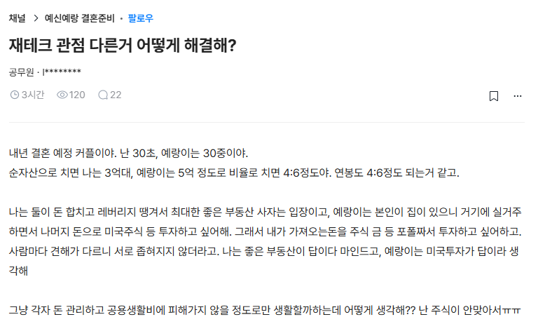

# 부부 간의 재테크 관점 차이
**Date:** 5시간 전
**Category:** 일기장
**Original URL:** https://blog.naver.com/xpfkwh56/224372282684
---

​

1. **'얼마가 있어야 된다'** 로는

아마? 싸울 일 거의 없을 것임

​

애초에 목표치 기준이 다른 사람이라면

결혼까지 이어질 확률이 낮기 때문

​

경제관으로 갈등이 생기는 부분은,

**'얼마까지 없으면 안 된다'** 일 때 생김

​

2. 둘 중 하나는, 자산이 무슨 일이 생겨도

​

최소 5억은 있어야 된다 라는 입장이고

누구는 1억만 있어도 먹고 살기 지장 없다

​

월 따박따박 500 은 찍혀야 생활이 된다,

300 정도만 있어도 생계에 큰 지장 없다,

​

이런 식으로 갈등이 생기면 피곤해질 수 있음

​

3. 어떻게 해서, 자산을 얼마나 불린다

​

라는 것으로 대화를 해서 싱크 잡기 보다는

우리가 **'무슨 일이 생겨도 얼마는 있어야 된다'**

란 것을 중심으로 대화 하는 것이 안정적일 것임

​

아무튼 많으면 많을수록 좋은 것이고,

많이 벌고, 많이 모으면 좋은 것 아닌가?

​

라는 목표로 시작하면 **끝** 이 없기 때문에

**망할 때까지** 계속 리스크 테이킹만 하게 됨

​

4. 내 경우, 신랑하고 대화할 때 강조하는 점이

​

**1) 지출 대비 현금흐름**

**2) 경제활동이 붕괴해도 재기할 기간** 임

​

나갈 돈이 정해져 있는데, 들어오는 돈이 없으면

거기서 오는 압박감 + 스트레스가 매우 클 수 있음

​

나는 억만금 없어도 되는 사람 임

대신, **'압박감'** 을 갖고 살기 싫음

​

우리가 월 x 정도 현금 흐름이 확보 되고 있고,

​

우리가 쓰는 돈이 y 라서 이대로 쭉 가면

**'아무튼 돈이 쌓인다'** 라는 상태를 유지한다

​

이게 우리집 경제 정책의 **기본** 임

​

**\* 현찰 빼곤 잘 안 믿음**

​

다음으로는 **'절대'** 수익이

유지된다고 전제하지 않음

​

소득이 끊어지면 그 다음 먹거리를 확보하기 위해

필연적으로 **'투자'** 해야 되는 **'시간'** 이 필요한데,

​

짧게는 3년, 길게는 5-10년 정도

특별히 무슨 일을 하지 않아도

​

급박한 결정으로 내몰리지 않아도 된다,

라는 것을 목표로 하려고 하는 편 임

​

5. 본문에서 저 고민 중인 부부의 문제는,

**부동산 지향이냐, 주식 지향이냐** 문제가 아님

​

**'선택지'** 가 적다는 것이 문제 임

​

내가 직장 생활을 하든, 부업을 하든 간에

여러가지로 수익을 발생시킬 수 있는 조건이다

​

또는 그 **'조건'** 을 지향하고 있다는 점이

화해 돼야 아마 저 문제가 해결될 것 같음

​

~는 답 없어, ~를 해야 돼

라고 터널 시야 가지면 안 됨

​

그게 무엇이든, **'잘'** 할 수 있냐 여부지

​

수단과 도구의 여하에 따라서 결론이

정해진다고 착오하면 위험해지게 될 것임