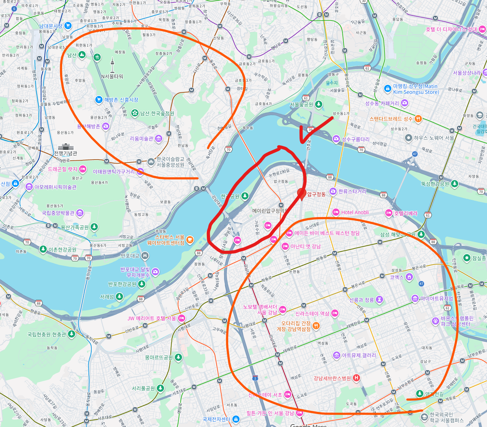
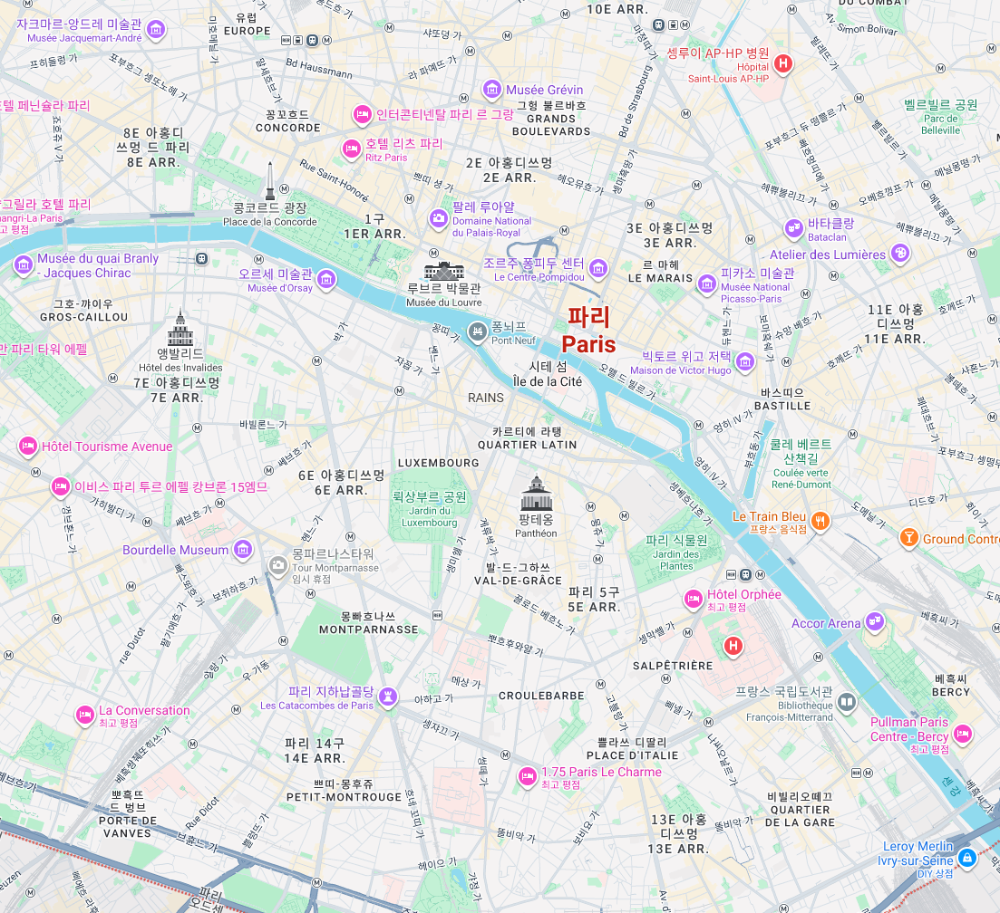
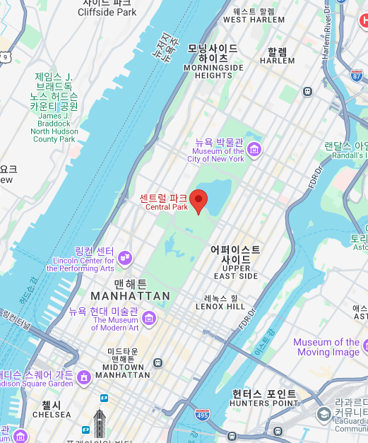

# 서울이 사람들이 살고 싶어서 비싼 것만은 아닌데
**Date:** 5시간 전
**Category:** 스냅
**Original URL:** https://blog.naver.com/xpfkwh56/224429850358
---

1. 서울이랑 똑같은 인프라를

다른 곳에 만들려면 얼마가 들까?

​

**라고 접근 하는 것이 더 맞을 것임**

​

​

2. 그럼 국내 탑티어 라는

압구정 입지를 보자

​

구도심 살고 있는 노인들 다 죽고,

​

강남처럼 도로 다시 싹 닦으면

강남 어드벤티지 삭제 가능

​

근데 그런 날이 올까?

그럴 일이 있을까?

​

**\* 북한이랑 전쟁 나서 도시계획**

**다시 백지부터 하지 않는 한 ,,**

**​**

한강 물줄기를 옆으로 길게 늘려서,

리버뷰를 **'평등'** 하게 만들면 가능

​

못할 건 아니지만 ,,

그럴 일이 있을까 ,,

​

​

3. 어디서 참 많이 본 그림이다

​

넉넉히 잡아봤자, 100년 된

우리나라 부동산에서 겪는 문제는

​

런던이나, 파리 같은 다른 지역에서도

여전히 겪고 있는 문제고,

​

4차 산업 혁명은 아직 모르겠지만,

1~3차 돌아가는 내내 바뀐 적 없음

​

그게 **'입지'** 의 힘 임

​

**\* 서슬 퍼런 시대였으니**

**그 시절에도 강남이 가능했지**

**​**

**지금은 윤석열이 계엄 성공 했어도**

**서울에서 신지구 재개발? 택도 없다**

​

4. 맨하탄 중심에는

​

저 **'말도 안 되는'** 입지에

큰 공원이 차지하고 있는데,

​

당시에 수십조 단위 돈을 들여서

원래 살고 있던 사람들 다 쫓아내고

​

공사해서 만들어 놓은 것 임

​

그럼 만약 저 공원을 상하좌우로

딱 5% 더 늘리겠다고 하면 어떨까?

​

지금은 어디 전쟁 나지 않는 한,

그런 사업 자체를 **시도도** 할 수 없다