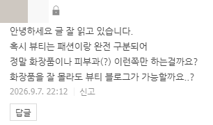

# 카테고리를 어떻게 해야 될까요?
**Date:** 5시간 전
**Category:** 스냅
**Original URL:** https://blog.naver.com/xpfkwh56/224404121679
---

​

1. 교육, 학술 상위 노출

블로그는 무엇을 다룰까요?

​

초등 수학부터 고등 수학까지

수학 내용을 다루고 있지 않을까요?

​

아니면, 아주 어려운 과학이라던가

전문적인 내용을 다루고 있을까요?

​

가장 많이 쓰는 키워드가 **~ 뜻** 입니다

사보타지 뜻, 동서고금 뜻 이런 것 임요

​

**\* 주제는 어학, 학문으로 묶입니다**

​

화장품, 옷, 피부과 를 다루는 것이 아니고

**'아름다움'** 에 대해서 이야기하면 됩니다

​

제가 조금 하다 그만 둔

몇 가지 화제 중 하나는 이겁니다

​

<https://youtu.be/Nx0BE0VGBmI?si=S_kMYf82ZuYsN3U5>

​

지미추 더 아틀리에 라인 입니다

​

<https://youtube.com/shorts/T_b4ixOgcq0?si=CNR4o-jI8PuiHjaV>

​

이유는 구체적으로 설명할 수 없지만,

그냥 **'딱'** 보면 예쁘고 뽐쁘가 옵니다

​

이게 왜 예쁘냐, 왜 **'팔릴 것 같냐'**

같은 것은 대답을 할 수가 없음

​

저는 이걸로 **'패션'** → **'드레스'**

→ **'결혼'** 카테고리로 퍼널을 짰고,

​

후기들을 모아서, 결혼식 드레스 평균 비용

결혼 하는 여자들이 드레스 를 알아봤을 때,

​

자주 사용하는 업체, 주의할 점 같은 것들을

컨텐츠로 만들어서 뿌리는 작업을 했었음

​

이렇게 한 이유는, 제가 의상, 의류

같은 것에 어렸을 때 관심이 있었고

​

실제 결혼을 해봤을 때, 결혼 **'시장'** 에

대해서 환멸을 느꼈던 경험이 많아서 임

​

카테고리는 목록이 결정하는 것이 아님니다

**내가 무슨 목소리를 낼 것이냐** 에 달려있음

​

이래도 저래도 잘 모르겠으면

그냥 뷰티, 아이티 찍고 쓰면 됩니다

​

뭐든 갖다 붙이세욬ㅋㅋ