# 컴퓨터를 핸드폰으로 리모콘처럼 조작하는 방법
**Date:** 5시간 전
**Category:** AI 활용
**Original URL:** https://blog.naver.com/xpfkwh56/224313226279
---

1. 대체로 애플 사용자들은

**'생태계'** 를 배우지 않아도 알음

​

근데 안드로이드, 구글 사용자들은

**'SW 생태계'** 라고 하면 물음표 찍힘

​

글자로는 알아도 이게 무슨 말인지,

내가 **'느끼기'** 아주 어렵다는 것 임

​

[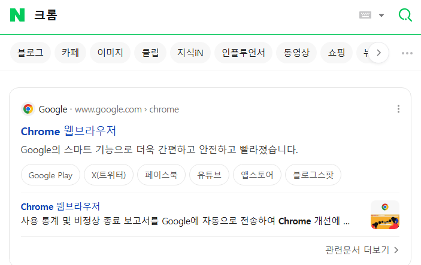](#)

​

2. 네이버에 '크롬' 검색

​

[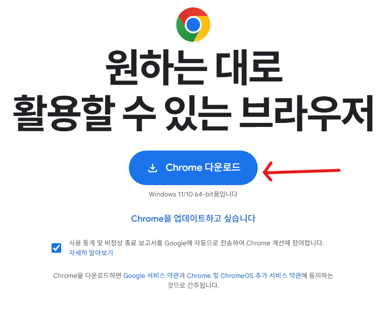](#)

​

3. 클릭 하고, 다운로드 및 설치

​

[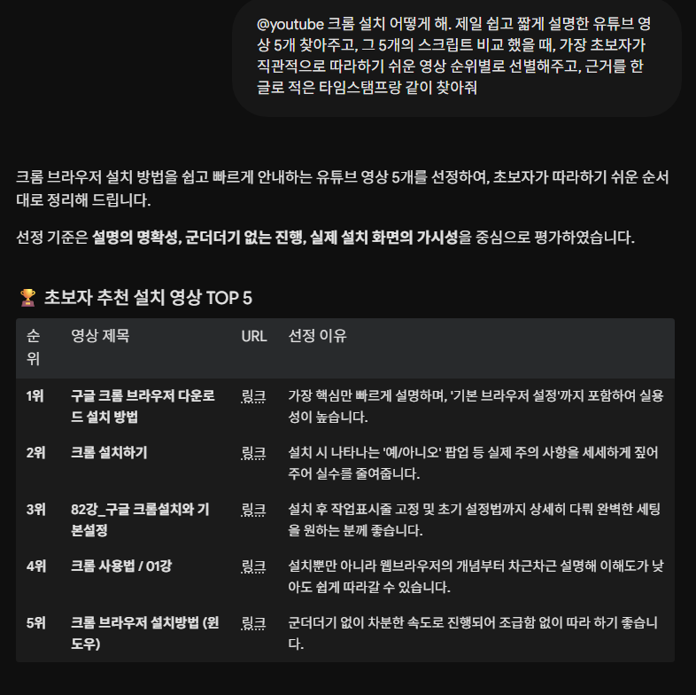](#)

​

4. 그렇다고 합니다

​

<https://remotedesktop.google.com/access>

[**Sign in - Google Accounts**

Couldn’t sign you in The browser you’re using doesn’t support JavaScript, or has JavaScript turned off. To keep your Google Account secure, try signing in on a browser that has JavaScript turned on. Learn more Help Privacy Terms

remotedesktop.google.com](https://remotedesktop.google.com/access)

​

5. 크롬 설치했으면, **'크롬'** 으로

해당 주소를 들어갑니다

​

로그인 하라고 나오면

로그인 하면 됩니다

​

[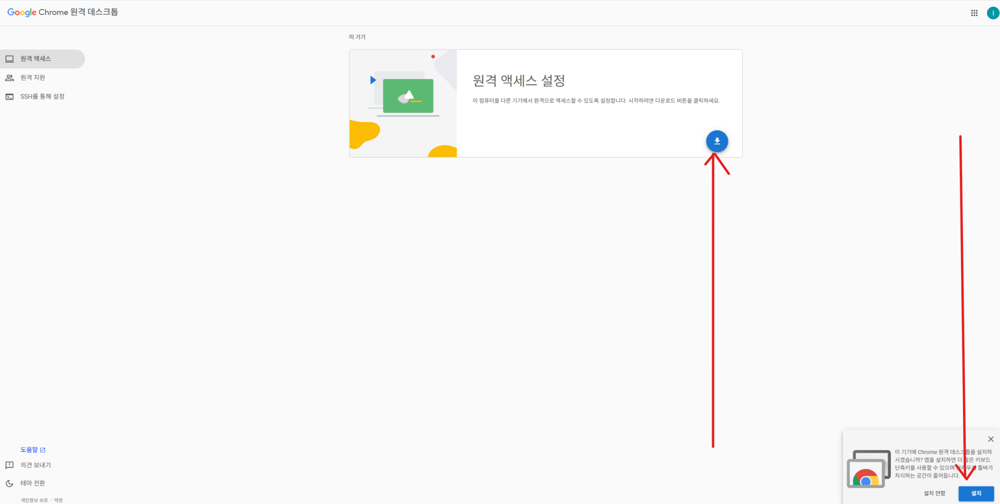](#)

​

6. 둘 중 아무거나 누르고 설치

​

[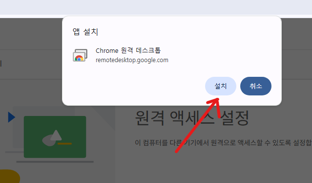](#)

​

7. 이렇게 나오면 정상 입니다

​

[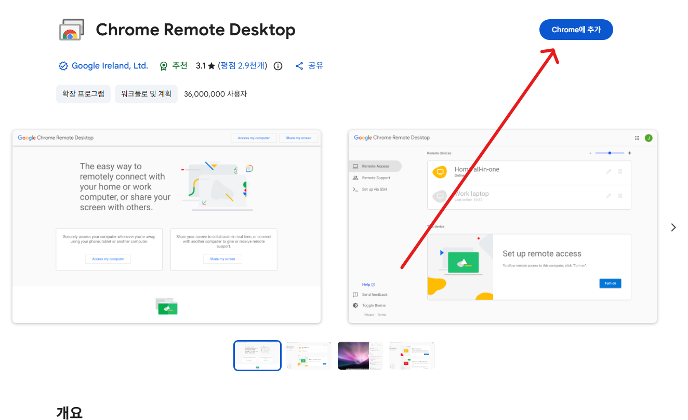](#)

​

8. 클릭

​

[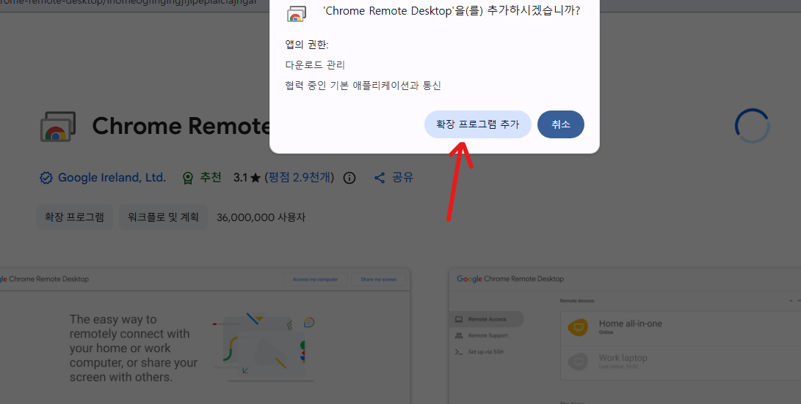](#)

​

9. 클릭

​

[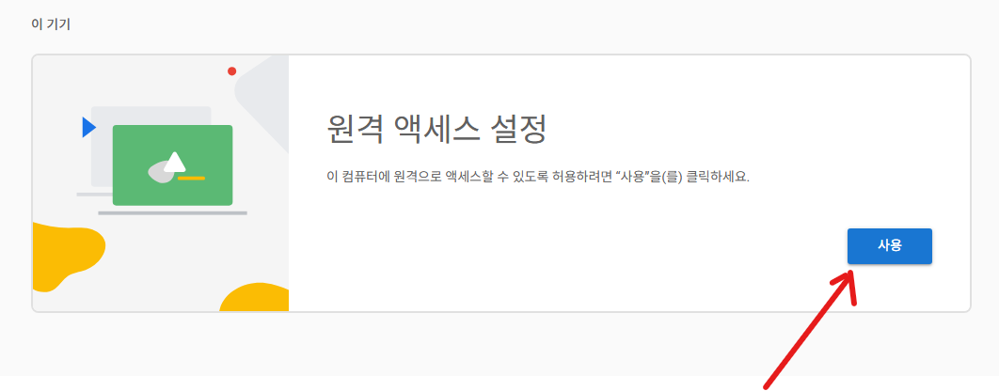](#)

​

10. 클릭

​

[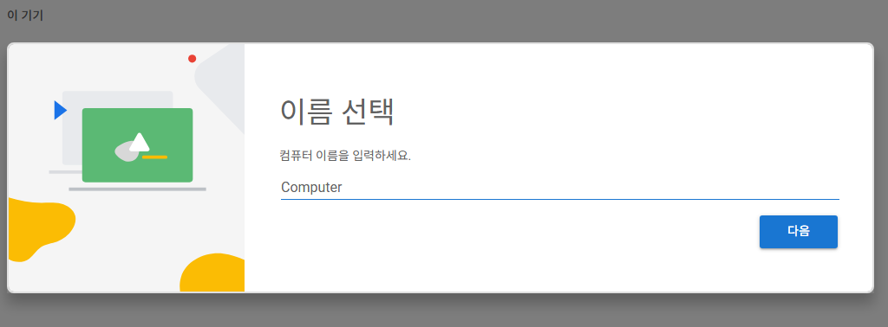](#)

​

11. 컴퓨터 이름 설정 후,비밀번호 입력

​

PIN 번호 까먹으면 골치 아프니까

잊어버리지 않는 이름으로 하거나,

​

포스트잇에 적어놓고 컴퓨터 본체에

붙여놓는 방법을 쓰거나, 해도 됩니다

​

**핸드폰이나, 컴퓨터에 저장하면 안 됨?**

​

해도 큰 문제는 없을 확률이 높긴 한데,

문제가 터지면 **크게** 터질 수 있기 때문에

​

가능하면 잘 기억을 하거나,

**'오프라인'** 으로 저장 하세요

​

거의 없는 일인데, 일이 만약에 잘못 되면

외부에서 내 컴퓨터를 맘대로 조작 가능함

​

[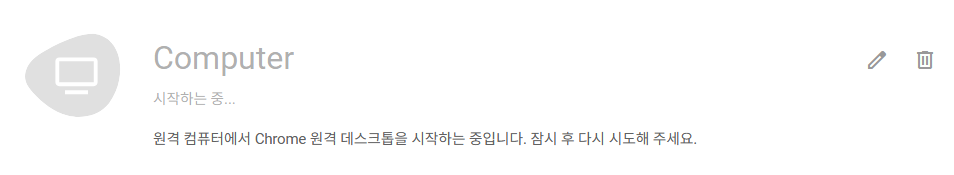](#)

​

12. 조금 기다리면

​

​

13. 이렇게 바뀝니다

​

[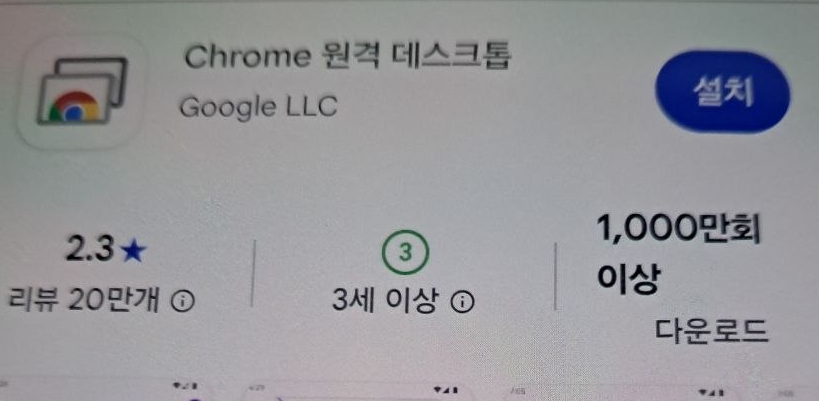](#)

​

14. 핸드폰에서 '원격데스크톱' 검색

​

[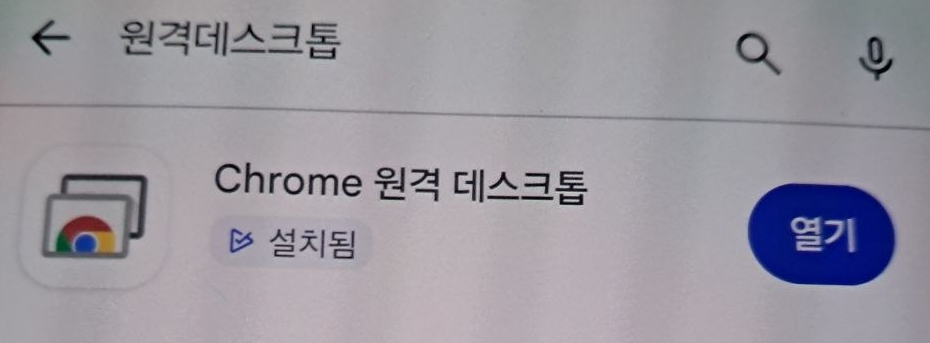](#)

​

15. 설치 후, 열기

​

[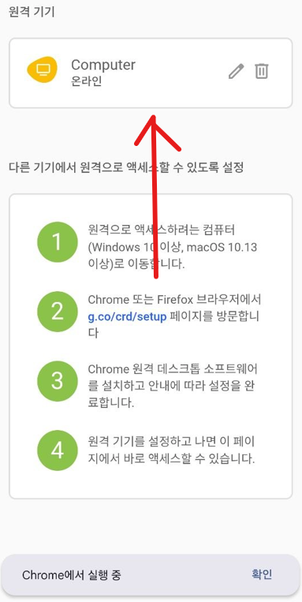](#)

​

16. ​**'핸드폰'** 에서 클릭

​

[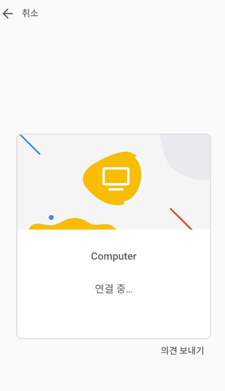](#)

​

17. 연결 기다립니다

​

[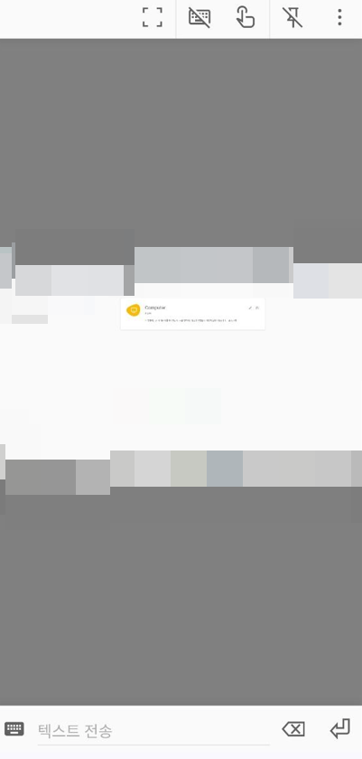](#)

​

**18. 테크놀로지아!**

​

이제 휴대폰으로 컴퓨터를

조작할 수 있게 되었습니다

​

[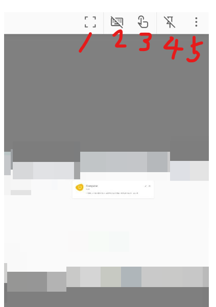](#)

​

19. 위에 있는 버튼들 입니다

​

1번 = 화면 전체로 보기

2번 = 키보드 보이게 안 보이게

3번 = 버튼 액션 어떻게 할건지

4번 = 고정할 건지 말건지

​

다 안 만져도 됩니다

​

점 3개가 찍힌

5번 누릅니다

​

[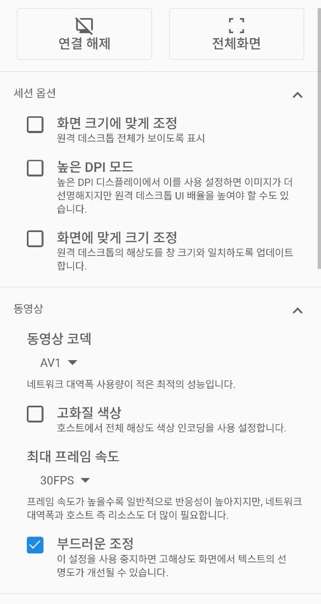](#)

​

20. 세션 옵션

​

화면 크키에 맞게 조정

높은 DPI 모드

화면에 맞게 크기 조정

**​**

**해상도를 조정한다는 뜻이다**

까지만 이해하고 넘어갑니다

​

아래로 내려가면,

​

[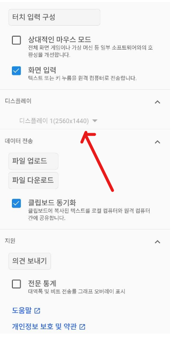](#)

​

21. 디스플레이 라고 나옵니다

​

[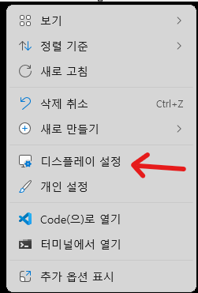](#)

​

22. 바탕화면 빈 곳에서

마우스 오른쪽 버튼 클릭

​

디스플레이 설정 나오면 클릭

​

[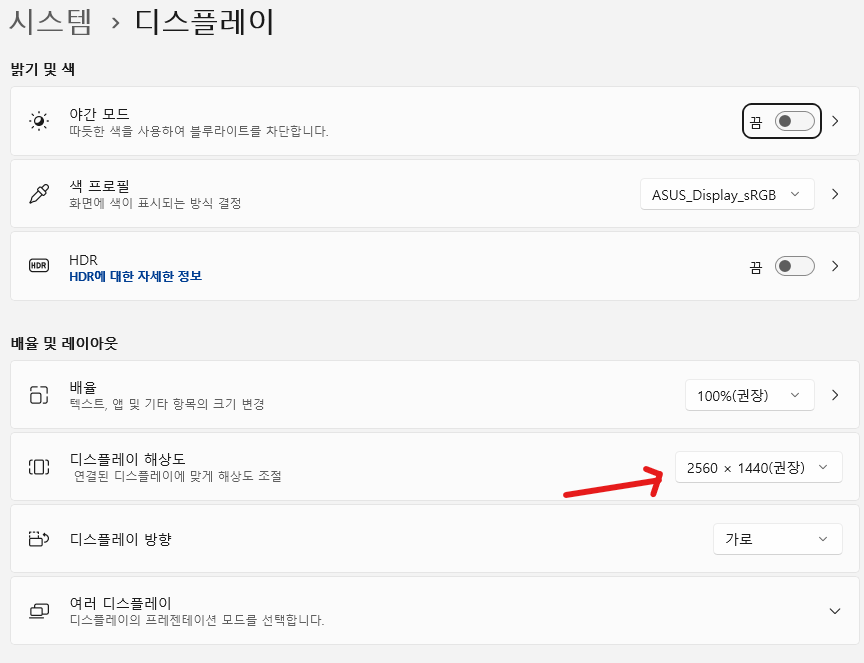](#)

​

23. 내 컴퓨터 해상도는 2560\*1440

내 핸드폰 해상도는 그거보다 낮으니까

​

저렇게 한 눈에 안 들어오게 보이는 것 임

​

[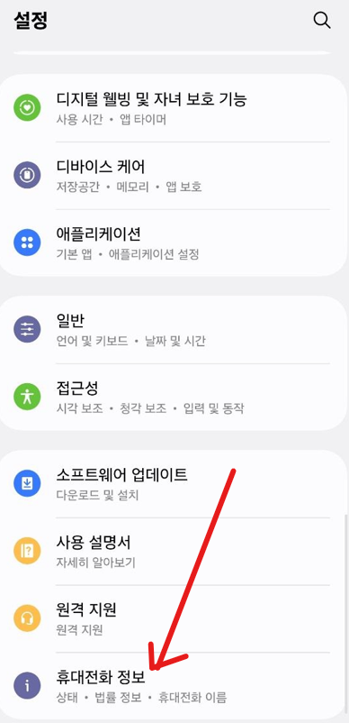](#)

​

24. 핸드폰마다 매우 다양하겠지만,

​

무튼 **'휴대전화 정보'** 라는 취지의

글자가 적힌 메뉴를 찾아서 클릭

​

그러면 **'제품명'** 과 **'모델명'** 이 나옴

​

[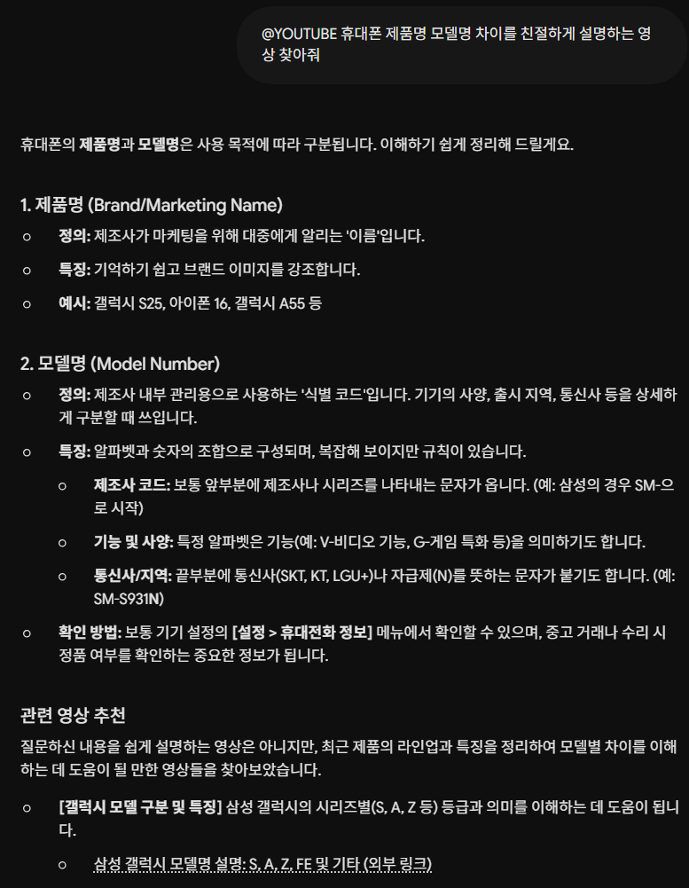](#)

​

그렇다고 합니다

​

[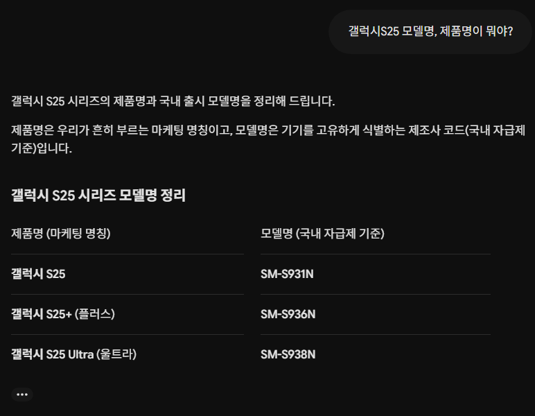](#)

​

25. 예시로 나온 아무 모델이나 골랐습니다

​

**SM-S931N**

**​**

[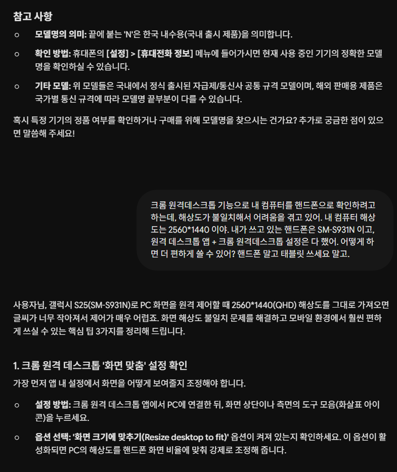](#)

**​**

26. 이제 제미나이의 도움을 받아서

내 상황에 맞게 해상도를 맞춰 쓰거나,

​

아니면 그냥 있는대로 쓰면 됩니다

​

크게 방법은 셋 입니다

​

1) 컴퓨터 해상도를 낮춘다

​

2) 리모콘 해상도를 올린다

​

대부분의 핸드폰으론 한계가 있기 때문에

태블릿PC 를 연동해서 사용하면 편합니다

​

애플폰이다 → 아이패드

안드로이드 폰이다 → 삼성 태블릿

​

이렇게 기억하면 됩니다

​

그리고 이렇게 **'짝'** 이

맞는 것이 **'생태계'** 입니다

​

**\* 크롬은 구글이 만든 서비스 임**

**​**

[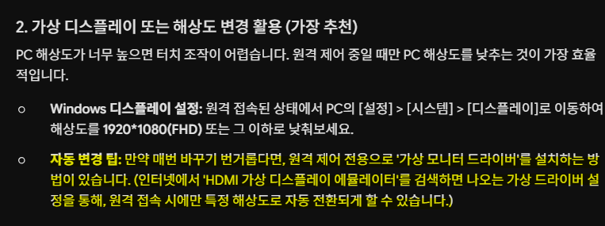](#)

**​**

3) 그리고 이제 내가 **'깎고 싶으면'**

디테일들을 하나씩 추가하면 됩니다

​

나는 집에 휴대폰이 2대 있고,

태블릿이 1대가 있다

​

**'고정'** 해상도가 아니라,

​

휴대폰/태블릿 마다 다르게

가변 해상도를 쓸 수 없을까?

​

휴대폰, 태블릿 말고 내 경우에는

집에 있는 **'TV'** 로 보고 싶은데?

​

AI 가 내 데스크톱 화면을 보거나,

​

**계속 자동으로 녹화 를 진행 하면서**

**내 행동에 대해 조언해줄 수 없을까?**

**​**

같은 것들로 응용할 수 있습니다