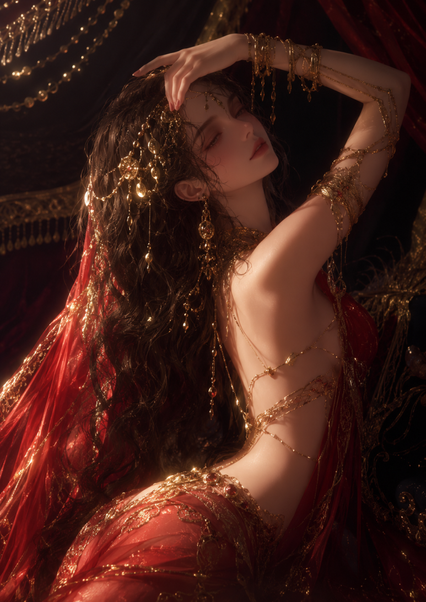

# Last DanceⅠ. 유디트 (16)
**Date:** 6시간 전
**Category:** 연애소설
**Original URL:** https://blog.naver.com/xpfkwh56/224363058250
---

​

> Last DanceⅠ.
>
> 유디트

***Previously***

​

[**Last DanceⅠ. 유디트 (15)**

Last DanceⅠ. Previously 그는 나를 떨궈내듯 침대에 내려놓았다. 가물한 의식 사이로 다시 그가 담배...

blog.naver.com](https://blog.naver.com/xpfkwh56/224363052409)

**​**

**＂그 애와 잤나?＂**

​

나는 입을 다문 채 무표정한 얼굴로 그를 바라보았다.

​

**＂화간이 있었냐고 묻는거야.＂**

​

물끄러미 나를 응시하던 그의 표정이 진지해졌다.

​

**＂당신이 빠지면 곤란해.＂**

​

나는 대답하지 않았다.

​

​

---

​

​

이해할 수 없는 하강원 회장의 말이 이명처럼 불편하게 귓가에 달라붙었다.

​

다만 한가지는 알 수 있었다.

​

처음 하강현을 만났을 때 어째서 그렇게 참담한 희롱과 경멸을 당했는지.

​

주성환과 엮였다고 오해받은 것이다.

​

경영 성과까지 내건 다툼으로 번졌으니 그 성격에 그토록 냉혹하게 응대해온 건 당연하다.

​

그의 오해대로 정말 자신이 주성환이 내 건 게임의 일부였다면 그런 모욕을 당했으니 완벽한 주성환의 패배인 셈이다.

​

그랬었는데 정작 상황은 정반대가 되어 있다.

​

어쩌다 이렇게 되었는지 잘 알 수 없다.

​

하강현을 처음 만난 이래 상황은 걷잡을 수 없이 치닫고 있었다.

​

집앞의 길목으로 들어섰을 때였다.

​

**＂유정원 씨?＂****​**

​

돌아본 순간 무언가가 둔탁하게 뒷덜미를 퍽 치고 떨어졌다.

​

목덜미를 타고 후끈한 것이 흠뻑 옷을 적시며 흘러내린다.

​

골목의 희미한 불빛 아래 반쯤 마시고 우그러진 맥주캔이 굴러가는 것이 보인다.

​

발소리가 다가들었다.

​

뒤를 돌아보는 순간, 그대로 멱살이 잡혀 거세게 안면을 강타 당했다.

​

이어 곧바로 뒤에서 누군가가 머리채를 잡아쥐며 팔을 잡아 꺾는다.

​

훅, 비명이 샜다.

​

다리로 힘껏 앞쪽의 상대를 걷어차자 욕설이 쏟아졌다.

​

**＂이 새끼가!＂****​**

​

가로등 불빛에 비친 얼굴들은 낯설었다.

​

한층 난폭하게 끌려 벽에 밀어붙여지고 곧바로 명치로 주먹이 화살처럼 꽂혀든다.

​

끔찍한 통증과 함께 저절로 훅 몸이 꺾였다.

​

거듭 주먹질이 꽂혀들고, 견디지 못하고 주저앉자 발길질이 날아왔다.

​

길바닥에 엎어진 내 머리 위로 퍽, 아까처럼 무언가가 내쳐졌다.

​

역시 마시던 맥주캔이었다.

​

누군가가 더 있었나.

​

흥건하게 맥주로 젖은 얼굴이 다시 몇 번 걷어차였다.

​

기어이 눈앞이 가물해졌다.

​

헐떡이는 내 숨소리만 선명했다.

​

희미한 시야로 또다른 누군가 몸을 숙여 나를 들여다보는 것이 느껴졌다.

​

희미한 향수 냄새가 났다.

​

여자? 본능적으로 손에 닿는 것을 움켜쥐었다. 머리칼이었다.

​

**＂아얏! 이 바보가!＂****​**

​

짧은 여자의 비명과 함께 다시 몸위로 발길질이 날아왔다.

​

잠시 정신을 잃었던 것 같다.

​

간신히 상체를 일으켜 벽에 기대 앉았다.

​

사지로 찌르는 듯 고통이 느껴진다.

​

천천히 숨을 몰아쉬었다.

​

얼마나 지났을까.

​

희미하게 차소리가 들리는가 싶더니 눈부신 불빛이 쏟아진다.

​

자동차 불빛이다.

​

발소리가 빠르게 다가든다.

​

성큼 눈앞에 와서 선 구두는 낯이 익다.

​

패기만만한 에고이스트의 구두.

​

곧바로 그가 몸을 굽혀 얼굴을 맞춰왔다.

​

어둠 속에서 눈이 마주쳤다.

​

**＂어떻게 된 거야.＂****​**

​

상태를 확인하듯 날카로운 시선이다.

​

나는 숨을 몰아쉬며 고개를 저었다.

​

뒤에서 당황한 박준영의 목소리가 울린다.

​

**＂유정원 씨? 괜찮아요?＂****​**

​

목소리가 잘 나오지 않아 고개만 끄덕였다.

​

박준영이 빠르게 앞으로 나섰다.

​

**＂제가 업겠습니다.＂**

**​**

**＂아니, 움직이게 하지 말아요. 척추를 다쳤을 지도 모르니까.＂****​**

​

박준영을 막은 하강현이 손끝으로 부드럽게 톡톡 내 뺨의 흙을 털어냈다.

​

**＂매번 꼴이 말이 아니군.＂****​**

​

심술궂게 말하지만 한손으로 빠르게 핸드폰을 꺼내 버튼을 누르고 있다.

​

**＂경찰 쪽 채널 통해서 증거부터 수집하고. 최 변호사한테 내용 전달하세요.＂**

​

동시에, 빠르게 무언가 일어나고 있다.

​

그가 직감적으로 구급차를 부르고 있다는 것을 알았다.

​

나는 간신히 팔을 들어 그의 핸드폰을 낚아챘다.

​

**＂괜찮으니까, 좀 일으켜줘.＂**

​

곧바로 눈살을 찌푸린다.

​

나는 상태를 증명하듯 힘을 모아 기대있던 벽에서 상체를 떼어내며 핸드폰을 돌려주었다.

​

**＂그냥 몇 대 맞은 것뿐이야. 뼈는 멀쩡해. 얼치기 양아치들이었어… 윽!＂**

​

반쯤 몸을 일으키다 신음을 내뱉자 박준영이 급하게 내 한쪽 팔을 잡아왔다.

​

**＂이쪽으로 기대요.＂**

**​**

**＂아니, 내가 하지.＂**

​

하강현이 찌푸린 얼굴 그대로 내 팔 밑으로 어깨를 넣어왔다.

​

자연스럽게 그의 어깨에 팔을 두른 자세가 되었다.

​

그에게 기댄 채 반쯤 일어서는데 내 옷깃에서 무언가 금속성의 소리를 내며 바닥에 떨어졌다.

​

하강현이 주워 챙겨든다.

**​**

**＂걸을 수 있겠나?＂**

​

그의 말에 고개만 끄덕였다.

​

하강현에게 업히다시피 집안으로 들어섰다.

​

소파에 나를 앉힌 그는 수건을 적셔와 내 얼굴을 닦아냈다.

​

내 턱을 들어올려 상태를 살핀 그가 눈썹을 찌푸린다.

​

**＂구급 상자는?＂****​**

​

짧게 물어와서 알려주었더니 용케 뒤져 찾아온다.

​

찢어진 입가에 소독약이 닿자 신음이 샐 정도로 따끔했다.

​

**＂어떤 놈들이야?＂****​**

​

나도 알 수가 없어 고개를 저었다.

​

어두워서 얼굴을 잘 분간하기 힘들었지만 분명 낯선 사람들이었다.

​

분풀이하듯 후려치고 가버린 걸 생각하면 어이없고 기막히다.

​

**＂이거 들어봐.＂**

**​**

고개를 들자 꼼꼼이 연고를 바른다.

​

매끈한 콧날이 코앞 거리에 있었다.

​

나는 물끄러미 그를 내려다보았다.

​

시선을 느꼈는지 고개를 들고 마주본다.

​

**＂여자한테 인기 많아?＂****​**

​

갑작스런 내 질문에 재밌다는 듯 묘한 표정이 되더니 짧게 대답한다.

​

**＂글쎄.＂**

**​**

**＂고백하는 쪽인가 받는 쪽인가?＂**

**​**

**＂별로. 그런 것에 대해 생각 안 해봤는데.＂**

**​**

**＂여자가 울면서 매달리면 어떻게 하지?＂**

**​**

**＂이봐.＂****​**

​

그가 찌푸리며 똑바로 눈을 맞춰온다.

​

나는 가팔라지는 숨을 가다듬으며 그를 마주보았다.

​

**＂여자 많겠지. 그런데 어쩌다 한 명이면 귀엽고 소중하게 느껴지겠지만, 이 사람 저 사람 자꾸만 매달리면 질리고 우습게 보이겠지. 그렇잖아? …아!＂****​**

​

갑자기 꾸욱 상처 부위에 연고를 눌러와서 작게 비명을 질렀다.

​

쭉 허리를 펴고 일어선 그는 구급상자를 닫은 뒤 무뚝뚝하게 나를 내려다보았다.

​

**＂무슨 생각을 하는지 모르겠지만, 네가 생각하는 만큼 방탕하진 않아. 연애놀음에 골몰할 만큼 한가하지도 않고, 여자랑 노닥거리는 것도 관심 없어. 섹스는 성욕이 치밀 때 참지 않고 즐기는 것 정도야. 인생이 주는 쾌락은 만끽하자는 게 내 신조거든.＂**

​

느긋한 어조는 어딘가 무심했고, 어떻게 생각하든 상관 않는다는 태도다.

**​**

**＂그만 들어가서 자. 안색이 나빠. 무슨 일이 일어날 지 알 수 없으니 오늘은 여기서 자고 가겠어. 소파에서 잘 테니 신경쓰지 마.＂****​**

​

말을 마친 그는 핸드폰의 통화 버튼을 눌렀다.

​

**＂그만 들어가고, 내일 아침 여기로 와요. 올 때 오피스텔 들러 갈아입을 옷 좀 부탁해요.＂****​**

​

나는 그가 화났다는 것을 알았다.

​

통화를 끝낸 그가 내 눈을 들여다보며 무감정한 어조로 말했다.

​

**＂베개로 쓸만한 것이 있나?＂**

​

​

---

​

​

진통제를 먹어야 했는지도 모른다.

​

욱씬욱씬 몸이 쑤시고 열이 올랐다.

​

괴롭게 시트에 얼굴을 파묻고 있던 나는 참지 못하고 침대에서 일어섰다.

​

어느새 자정이 넘어있었고, 어둠에 눈이 익어 불을 켜지 않아도 모든 사물의 형체가 가늠되었다.

​

나는 침실문을 열어젖히고 거실로 나갔다.

​

하강현은 낡은 소파에 길게 누워있었다.

​

쭉 뻗은 발끝이 소파 끝으로 불쑥 튀어나와 있었다.

​

바로 앞에 선 채 한참을 내려다보았지만 잠이 든 것인지 움직이지 않았다.

​

나는 개의치 않고 그를 향해 내쏟았다.

​

**＂결국은 우습게 여긴다는 뜻이잖아. 필요할 때만 늘 내키는 대로…＂**

**​**

**＂잠이나 자.＂**

​

그가 꼼짝 않은 채 내뱉었다.

​

선명하게 날 선 목소리였다.

​

**＂내키는 대로, 내키는 대로 즐기는 파트너 따위, 우스운 거잖아! 아무 것도 아니라고 생각하고 있지! 누구든, 몇 명이든…!＂**

**​**

**＂들어가서 누워, 유정원.＂****​**

​

낮고 침착한 어조였다.

​

**＂무슨 말인지 알았으니까, 들어가서 자.＂**

​

나는 꼼짝 않고 선 채 뺨에 눈물이 흐르도록 내버려 두었다.

​

결국 그가 몸을 일으켰다. 성큼성큼 다가온 그가 날 잡아 침실로 끌고 들어갔다.

​

화가 났음이 분명한데도 낮은 목소리는 부드러웠다.

​

**＂얌전히 자지 않으면 혼날 줄 알아. 그렇게 하지 않아도 얼굴에 멍이 올라오고 퉁퉁 부을 거야. 한 번만 거울을 보고 나면 나한테 소리 지르고 싶은 생각이 사라질 걸.＂****​**

​

나를 침대에 쑤셔박은 그가 방을 나갔다.

​

나는 그가 밀어넣은 대로 이불 속에 우겨진 채 천장을 가만히 응시하며 숨을 몰아쉬었다.

​

상처내고 망가뜨리고 싶었다.

​

그것은 이상한 오기였다.

​

까닭조차 불분명한 뜨겁고 거친 감정이었다.

​

그는 차가운 얼음수건을 들고 다시 들어왔다.

​

예고도 없이 얼굴 전체를 찬수건이 뒤덮었다.

​

더 이상 아무 것도 보이지 않았고 차가운 냉기가 욱씬대는 얼굴을 서서히 식혀줄 뿐이었다.

​

차가운 수건 아래에서 나는 얕게 숨을 들이쉬었다.

​

이상하리만치 치솟아 온 혈관을 타고 번져 내달리던 미움도 조금씩 조금씩 냉각되어 조그맣게 다시 심장 밑바닥에 가라앉는 느낌이었다.

​

세상에 불변하는 단 하나의 진리가 있다면 불변하지 않는 것 따위 없단 것.

​

나는 천천히 눈을 감았다.

​

​

---

​

​

눈을 떴을 때는 점심때가 가까운 늦은 아침이었다.

​

몸을 움직이는 순간 온몸의 뼈들이 비명을 질러댔다.

​

하강현의 말처럼 멍들이 올라오며 부어오르고 한층 심하게 욱씬거렸다.

​

가까스로 몸을 일으켰다.

​

거실에는 박준영이 신문을 보고 있었다.

​

나를 보더니 빠르게 일어나 괜찮냐고 물어왔다.

​

하강현은 이미 출근을 한 뒤였다.

​

**＂당분간 혼자 다니게 하지 말라고 하셨어요. 인터뷰와 취재 스케줄은 뒤로 미루겠다고 하셨으니, 오늘은 좀 쉬시죠. 아, 뭘 좀 드시는 것은 어떻습니까? 본가쪽 일을 맡아주셨던 아주머니께 부탁해두셔서 먹을 만한 걸 받아왔습니다. 솜씨가 좋으세요.＂**

**​**

식탁에는 보온통과 꼼꼼하고 정갈하게 싸여진 팩이 놓여있었다.

​

따뜻한 호박죽과 영양밥, 순하게 양념된 연두부와 자연송이, 전복과 갈비전이 알뜰하게 챙겨져 있다.

​

함께 식사를 한 뒤, 박준영은 하강현이 시켰다며 염소제를 발라주고 근육이 뭉친 부분에 뜨거운 수건을 얹어주었다.

​

나는 다시 침대로 파고들어가 깊은 잠에 빠졌다.

​

다시 눈을 뜬 것은 저녁에 가까운 늦은 오후였다.

​

문밖에서 하강현의 칼날 같은 목소리가 울렸다.

​

**＂어제 유정원 씨가 갖고 있던 거야. 원래 주인이 있는 머리핀이지.＂**

**​**

**＂아, 아니에요… 내 거 아니야…＂****​**

​

여자 목소리가 울먹인다.

​

**＂맞아. 네가 졸라대서 랑팔의 샵에서 주문제작한 건데 잊을 리 없지. 아이디 코드번호 확인할까?＂**

**​**

**＂아니에요… 정말 내가 안 그랬어요…＂**

​

기어이 여자가 흐느끼는 소리가 들린다.

​

나는 시트 깊숙이 얼굴을 파묻었다.

​

하강현은 가차 없었다.

​

**＂똑바로 대답해. 안 그러면 직접 대면시켜 얼굴 확인시킬 테니.＂****​**

​

협박과 취조가 수준급이다.

​

내가 보아봐야 알 리가 만무하다, 분명히 상대의 얼굴을 제대로 못 보았다고 말했었는데.

​

**＂네가 그런 짓을 할 리 없다는 건 알아. 하지만 넌 분명히 그 자리에 있었어. 곱게 끝낼 생각 없으니까 내 이성이 아직 남아있을 때 대답해.＂****​**

​

부드럽게 어르다가 냉혹하게 밀어붙인다.

​

결국 여자가 울면서 쏟아내기 시작했다.

​

**＂흑… 그래, 저깟 여자쯤, 뭐가 어때서!… 나 같은 건 아무래도 상관없어 했으면서! 내가 더 예쁜데! 그날 파티 후로 한 번도 찾아주지 않았잖아! 연락도 씹고, 누구 때문인지 내가 모를 것 같아? 그날, 방에서 저 자식 재운 거 사람들이 다 알아!! 사람들이 뭐라는 줄 알아요? 당신이 주성환 꾐에 빠져 계략에 놀아났다고…＂**

**​**

**＂거기까지. 입 다물어.＂**

​

흐느끼는 여자의 울음 사이로 하강현의 목소리가 낮게 박혀들었다.

​

**＂같이 주먹질했던 녀석들, 누구야.＂**

​

여자애의 흐느낌이 높아졌다.

​

알 것 같다.

​

주성환의 파티 때 하강현과 함께 있던 여자인 것 같다.

​

나는 이불 속에서 몸을 둥글게 말았다.

​

다시 꿈틀꿈틀 가슴 밑바닥의 까닭모를 분노가 이스트빵처럼 부풀어 오르고 점점점점 온몸을 덮쳐왔다.

​

얼마 후 방문이 열리고 뒤집어쓰고 있던 이불이 젖혀졌다.

​

그다.

​

우뚝 선 채 물끄러미 내려다보던 그가 내 머리칼 사이로 손가락을 찔러 넣었다.

​

**＂저녁 먹어.＂**

​

나는 꼼짝 않고 그를 올려다보았다.

​

눈이 마주쳤다.

​

나는 숨조차 멈춘 채 짙은 눈동자를 쏘아보았다.

​

독기처럼 번져가는 분노 속에서 문득, 내 입술을 총구처럼 그의 관자놀이에 누르고 싶다는 생각이 치밀었다.

​

저 단단한 철의 얼굴이 자기 통제력을 잃는 모습을 보고 싶다고.

​

사악한 욕망이 불길처럼 타올라 나는 숨을 죽였다.

​

그의 단단한 눈동자가 짙어지며 가늘어졌다.

​

그가 내게로 몸을 숙였다.

​

살 같은 시선이 파고들 듯 덮쳐왔다.

​

**＂재밌는 여자야. 멍청하고 한심한 여자는 여태도 많았는데 말야. 너는 가엾기까지 해.＂**

​

나는 독사처럼 움직이지 않은 채 그를 보았다.

​

아픈 어금니를 그의 목 언저리에 박아 넣고 싶은 욕망이 참기 괴로웠다.

​

​

---

​

​

사흘 뒤, 저녁. 기자시사회를 마치고 영화관에서 나오던 나는 대로가에 서있는 하강현의 차와 마주쳤다.

​

얼굴의 멍을 가리기 위해 나는 커다란 선글라스를 쓰고 있었지만, 그는 정확히 나를 알아보고 차창을 내렸다.

**​**

**＂타.＂**

​

나는 입을 다문 채 하강현의 옆자리에 올라탔다.

​

차가 도착한 곳은 청담의 어느 하이엔드 바였다.

​

지하 깊숙이 위치한 그곳은 극도로 심플하고 고급스러웠다.

​

안내된 룸 안은 이미 위스키와 간단한 안주가 준비되어 있었다.

​

인사를 하고 나가려는 종업원을 하강현이 돌려세웠다.

​

**＂매니저 들어오라고 해.＂**

​

종업원이 곤란한 듯 허리를 숙였다.

​

**＂죄송합니다. 아직 출근 전이십니다. 사무실로 메시지 남겨드릴까요.＂****​**

​

하강현이 명함을 꺼내 종업원에게 내민다.

​

목소리에 거친 감정이 묻어났다.

​

**＂들어오라고 해.＂**

**​**

명함을 받아든 종업원이 허겁지겁 돌아섰다.

​

매니저가 들어온 것은 5분도 채 안돼서였다.

​

깔끔한 슈트 차림의 남자는 정중하게 인사했다.

​

**＂오랜만에 오셨습니다.＂**

**​**

**＂주성환이 데리고 있던 그 애 호출해줘요.＂****​**

​

남자가 난감한 듯 웃었다.

​

**＂노아는 지명을 받는 애가 아닙니다.＂**

**​**

**＂내가 지금 그 애새끼랑 뒹굴고 싶어 하는 걸로 보이나!＂**

​

칼날 같은 고함에 남자가 당황한 듯 움찔했다.

​

**＂죄송합니다. 손님을 받는 아이가 아니라는 걸 말씀드리려 했을 뿐입니다.＂**

**​**

**＂같은 말 반복하게 하지마.＂**

​

가차없는 목소리에 매니저가 입을 다문 채 돌아섰다.

​

문이 다시 열린 것은 30분쯤 후였다.

​

입을 다문 채 스트레이트로 두 잔의 위스키를 비운 하강현은 들어오는 사람을 확인하자 그대로 곁에 있던 스툴을 걷어찼다.

​

단단한 나무스툴에 다리를 맞은 노란머리가 놀라 정강이를 감쌌다.

​

하강현이 일어섰다.

​

그의 턱이 단단히 굳어지는 것이 확연했다.

​

노란머리의 새침하고 앳된 얼굴이 놀람과 당황, 두려움으로 뒤덮였다.

​

비명을 지르며 방을 뛰쳐나가려던 노란머리가 뒤통수를 틀어 잡힌 채 다시 룸안으로 끌려 들어왔다.

​

몇 번의 고통스런 비명 끝에 노란머리는 카펫이 깔린 바닥에 뺨을 댄 채 처박혔다.

​

하강현이 그의 팔목을 단단한 구두로 짓밟은 채 물었다.

​

**＂고개 들어. 저 사람 알아 몰라.＂**

​

하강현이 나를 턱짓으로 가리켰다.

​

하지만 노란머리는 고개를 들지 못했다.

​

그는 공포에 질린 채 헐떡이고 있었다.

​

폭력이 주는 원시적 공포.

​

하강현의 발이 가는 손목을 짓이기자 노란머리가 울부짖기 시작했다.

​

**＂평생 손을 쓰고 싶지 않으면 계속 그 꼴로 있어.＂****​**

​

**＂알아…!! 알아…!! 저 자식이 헛수작을 했으니까! 주 상무님에게 꼬리를 쳐서… 아악! 하악!＂**

**​**

**＂혀는 몇 센티나 잘리고 싶은거야?＂**

​

노란머리가 울부짖기 시작했다.

​

**＂놔… 놔줘!! 부러질 것 같아!! 아악…!! 소속사에서… 하루 아침에 짤렸다구! 저 자식 때문인 거잖아! 화가.. 화가 나서 견딜 수가 없었을 뿐이야… 개자식! 아아악!＂**

**​**

**＂주성환이 그냥 너에게 흥이 식은 거야. 혼동 하지마. 멍청이는 질색이야.＂**

**​**

**＂하악!! 아파!! 놔... 제발!! 잘못했어…＂**

**​**

**＂난 어린 애들은 질색이야. 니가 뭐든 내가 알 바 아니야. 니가 누구한테 후장을 대다 짤리든, 그것도 나랑 상관없어. 헛다리 짚어서 귀찮은 일 만들지 마. 앞으로 한 번만 더 엉뚱한 짓 하면 그땐 손모가지가 아니라 어깨 위에 달린 니 모가지를 분질러 놓을 거야.＂**

​

신랄하게 내뱉은 하강현은 그제야 미친 듯 울부짖어대는 노란머리를 놓아주었다.

​

군더더기 없는 동작으로 재킷을 걸친 그가 나를 내려다보았다.

​

나는 꼼짝 않고 그 모든 것을 지켜보고 있었다.

​

**＂가지. 일어나.＂****​**

​

내가 움직이지 않자, 그가 입술 끝을 끌어올렸다.

​

**＂당한 만큼 갚아주고 싶은 건가? 고작 애송이니 이 정도로 참아. 못할 건 없지만 이 이상은 효율이 나빠.＂**

​

내 팔을 잡아 일으키려던 그가 멈칫했다.

​

내가 굳어진 것을 눈치챈 듯 팔을 잡았던 움직임과 목소리가 다소 부드러워졌다.

​

**＂가끔은 이런 대처가 더 담백할 때도 있어. 아주 솔직하고 인간적인 대처방법이지. 법이라는 것이 그래. 느리고 복잡하지. 확실히 말하면 내 취향은 아냐.＂**

​

태연하게 말한 그가 나를 잡아 일으켰다.

​

​

---

​

​

집에 도착했을 때는 이미 늦은 밤이었다.

​

나는 현관 안으로 들어서려는 하강현을 막아섰다.

​

**＂늦었으니까 그만 돌아가는 게 좋겠어.＂**

​

내 말에 그가 현관문을 재빨리 잡아 닫지 못하도록 했다.

​

**＂차 한 잔은 마시고 가고 싶은데.＂****​**

​

나는 시선을 내리깔았다.

​

**＂왜 자꾸 이러는 건데.＂**

**​**

**＂정말 몰라?＂****​**

​

직선적인 어조에 흠칫했다.

​

경험으로 알고 있다.

​

그가 이렇게 직선적으로 욕망을 드러낼 땐 목표물로의 도약 직전, 마지막 순간이란 것을.

​

예상대로 그가 내뱉었다.

​

**＂더는 이쪽도 참기 힘들어. 한번만 실컷 즐기게 해주면 그 다음부턴 이성적으로 대해주지.＂****​**

​

본능적으로 몸이 먼저 움직였다.

​

**＂돌아가.＂****​**

​

급하게 닫으려던 문이 잡혀 확 열어젖혀졌다.

​

빠르게 뻗어온 손이 내 턱을 잡고 터진 입술 끝을 눌렀다.

​

**＂상처가 아문 걸 보니 키스해도 되겠어.＂****​**

​

그가 내 팔을 잡아당겼다.

​

부딪히듯 입술이 겹쳐지며 그의 등 뒤로 문이 닫혔다.

​

고개를 비틀자 곧바로 쥐어진 턱이 아프게 돌려져 각도가 맞춰졌다.

​

움직이지 못하도록 턱이 잡힌 채 다시 깊숙이 입술이 겹쳐졌다.

​

흐트러진 숨소리가 섞여들었다.

​

입술을 가볍게 문지르고 빨아당기던 그가 혀로 핥아온다.

​

욕망을 누른 부드러운 행위였지만 조급한 움직임에는 흥분한 혀를 쑤셔넣고 싶은 기색이 완연했다.

​

결국 집요한 혀가 입안을 가르고 들어왔다.

​

그는 서두르지 않았다.

​

하지만 느릿하게 뜨거운 혀가 뒤엉키는 순간 누구에게선지 모를 희미한 신음이 새나왔다.

​

천천히 혀를 움직이며 그가 내 뺨과 귓불을 만져댔다.

​

나는 가까스로 그 얼굴을 밀어내고 숨을 몰아쉬었다.

​

**＂나가.＂**

​

흐트러진 목소리로 내뱉자 그가 웃음을 터뜨렸다.

​

다시 고개를 내려 내 입술을 잘근 물며 다정하게 묻는다.

​

**＂나가길 원해?＂**

​

내가 바닥을 바라보고 있자 그 역시 고개를 잔뜩 숙여 고개를 비틀고는 부드럽게 입술을 맞춰온다.

​

머뭇머뭇 고개를 들자 바로 물어뜯듯 입술을 깊이 겹쳐왔다.

​

혀를 빨아당기며 거세게 허리를 잡아채자 중심을 잃고 몸이 밀착된다.

​

뒤엉킨 채 신발장으로 밀어붙여졌다.

​

쌓여있던 고지서가 후두둑 떨어지는 소리가 들렸다.

​

중심을 잃고 무너지는 몸을 그가 잡아올렸다.

​

짙은 느낌에 몸을 가누지 못하는 나를 안아올리며 집안으로 들어선다.

​

내 혀를 놓아준 그는 젖은 입술로 내 콧등과 뺨, 입가에 정신없이 입맞춤을 해대고 있었다.

​

어지러운 뒷걸음질을 하다 벽에 등이 아프게 부딪혔다.

​

그가 빠르게 내 뒤통수를 손으로 감싸안았다.

​

고통 대신 그의 살이 부드럽게 울리는 느낌이 뒤통수에 전해졌다.

​

귓불을 잘근 물며 내 몸을 만져대는 그의 숨이 거칠었다.

​

**＂구두 벗어.＂**

​

한쪽 구두를 신은 채였다.

​

내가 움직이지 않자 그가 몸을 숙여 발목에 걸린 바지와 한쪽 구두를 벗겨냈다.

​

**＂어쩔 수 없어. 니 새침을 다 받아주단 밤새겠어.＂**

​

번쩍 나를 안아올리는 그는 흥분으로 얼굴이 붉었다.

​

성큼성큼 침실로 들어선 하강현은 내 코끝에 입술을 눌러대며 나를 침대에 내려놓았다.

​

그제야 내가 떨고 있다는 걸 깨달았다.

​

무릎이 후들거리고 있었다.

​

뒤에서 당겨안으며 몸을 붙여온 그가 입술로 부드럽게 속삭였다.

​

**＂그땐 화가 났으니까 그런 거야. 침대매너는 좋다구. 거칠게 다루지 않을 테니까…＂****​**

​

무슨 말을 하는 건지 알 수 없다.

​

어지러운 머릿속을 가르듯 그의 손이 셔츠 안으로 파고들었다.

​

아아, 정연이는… 정연이가….

​

괴로운 숨이 쏟아졌다.

​

내 셔츠깃을 잡아 내리며 그가 내 뒷덜미에 입맞추었다.

​

**＂알아? 이 집에 올 때마다 이 손바닥만한 침대에서 너랑 이러는 상상을 백 번은 했어.＂****​**

​

그의 숨이 거칠었다. 아래의 손이 점점 조여와서 나는 경련하며 몸을 웅크렸다.

​

**＂그때 일을 잊겠다는 건 생판 거짓말이야. 니 얼굴 볼 때마다 생각나서 진정이 안됐었지.＂****​**

​

그가 셔츠깃을 더 잡아 내리자 앞단추가 뜯어지며 어깨가 드러났다.

​

뜨거운 입술이 어깨선을 타고 내려온다.

​

나는 참지 못하고 베개에 얼굴을 처박았다.

​

**＂아…!＂**

**​**

그가 뒤에서 거칠게 한번에 셔츠를 잡아내렸다.

​

후두둑 단추가 뜯어지며 셔츠가 허리까지 끌려 내려갔다.

​

희게 드러난 허리선을 따라 젖은 입술이 미끄러졌다.

​

**＂하지마.＂****​**

​

갈라진 목소리가 새나왔다.

​

**＂하지…마…! 아!＂****​**

​

땀으로 젖은 머리칼에 그가 손가락을 찔러 넣었다.

​

단단한 눈이 짙은 쾌락으로 진한 빛을 띠고 있었다.

​

옥죄듯 감아오는 그의 품 안에서 나는 몸을 웅크렸다.

​

여운이 남은 몸이 자꾸 가늘게 떨렸다.

​

눈을 감자 귓전의 이명이 추상같았다.

​

네가 변명 하려느냐 해명을 하려느냐.

​

살을 저며 속죄의 번제를 올렸다 해도 이런 일이 네게 임하였거늘, 그 은밀한 쾌락을 네가 알거늘.

​

여호와 하나님이 그 사람에게 명하여 가라사대 동산 각종 나무의 실과는 네게 임의로 먹되, 선악을 알게하는 나무의 실과는 먹지말라 네가 먹는 날에는 정녕 죽으리라 하시니라.

​

​

---

​

​

인기척에 눈을 떴을 때는 아침이었다.

​

말끔하게 옷을 차려입은 하강현이 나를 내려다보며 넥타이를 매고 있었다.

​

눈이 마주치자 만족스러운 듯 웃으며 지퍼를 끌어올린다.

​

**＂정신을 못 차리고 자는군.＂****​**

​

나는 물끄러미 눈앞의 짐승 같은 남자를 바라보았다.

​

그 일이 끝났을 때는 더 이상 어제의 자신이 아닌 것만 같았다.

​

더 이상 수치스러울 것도 부끄러울 것도 없었다.

​

나는 드러난 알몸을 그대로 늘어뜨린 채 그를 올려다보았다.

​

산뜻한 얼굴로 차비를 마친 하강현은 재킷을 입으면서도 내 몸에서 눈을 떼지 못했다.

​

시선을 고정한 채 그가 허스키한 목소리로 내뱉었다.

​

**＂그대로 입지말고 기다려. 6시에 돌아올 테니까.＂**