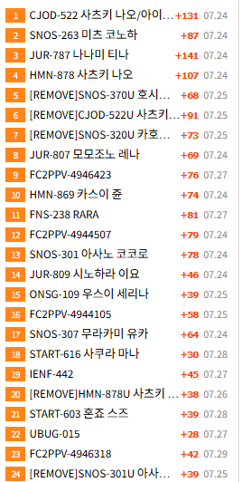
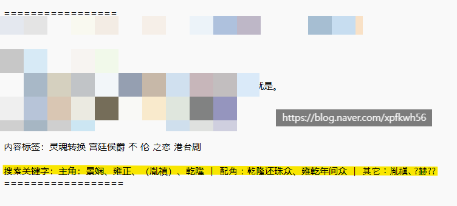

# ML 없이 로컬로 한글 코퍼스 따오는 아이디어
**Date:** 6시간 전
**Category:** 일기장
**Original URL:** https://blog.naver.com/xpfkwh56/224364159259
---

1. 유튜브 알고리즘을

직접 만든다고 가정하겠음,

​

그럼 어떻게 구축해야 할까?

​

방대한 고객의 데이터?

사용자의 행동 양식?

​

제일 먼저 해야 되는 것은,

**영상의 구조**를 확보하는 것임

​

썸네일과 실제 내용이 다를 수도 있고,

​

실제 영상의 내용과 시청자가 기대하는

지점이 차이가 있을 수 있기 때문에

​

여기서 나오는 막대한

노이즈를 해결해야 됨

​

영상이 강아지가 나오는 영상인지,

아기가 나오는 영상인지, 무슨 내용인지

이런 것들을 선별하는 것부터 노답 임

​

2. 사용자의 알고리즘을 유추한다는 것은

직관적으론 간단하게 보이지만 하나씩 파면

​

황당할 정도로 방대한 작업인 경우가 많은데,

그 어려운 일을 너무 간단히 하는 집단이 있음

​

바로 **저작권 무시 해적 사이트** 들임

​

만화, 영화, 성인물 사이트들을 찾아서 보면

**아무렇지도 않게** 연관 콘텐츠 기능을 제공하고,

​

특정 테마를 정해서 알고리즘을 유도하면,

절묘하게 딱 필요한 것만 보여주는 일이 관찰됨

​

**이들이 이런 것을 해낼 수 있는 이유**는,

​

ML 을 잘 써서 가 아니라

**ML 을 쓸 필요가 없는 상황** 이라 그럼

​

즉, 도메인에 이미 존재하는

특정한 식별 체계가 있다면

​

**그걸 그대로 사용하는 것만으로도**

복잡한 ML 구현을 하지 않아도 됨

​

3. 예를 들어보겠음

​

​

막혔다고 하나, 마음만 먹으면 누구나

쉽게 들어갈 수 있는 모 사이트의 경우,

​

앞에 있는 **'암호 같은 영어 태그'** 들이

그 내용물과 의미를 유추할 수 있는 구조임

​

이런 프라이머리 키를 사용하면

​

다른 콘텐츠 도메인들이 임베딩 학습으로

간신히 푸는 문제를 카탈로그 체계를 통해서

손쉽게 구현할 수 있음

​

즉, 메타 데이터 표준이 있으면

큐레이션이 단순 검색으로 즉각적으로

값싸게 원시화 될 수 있다는 이야기 임

​

LLM 중심의 AI 서비스에서 비용은,

구현 비용이나 설계 비용이라기보다

​

**'채점'**, **'측정'** 비용이 활용 측면에서

병목이 되는 경우가 **빈번히** 있는 편인데

​

보다 가벼운 체계를 구성하고 있는 경우,

​

채점 비용이 거의 제로에 수렴하므로

통상적인 구현 난이도보다 훨씬 간단함

​

때문에,

​

**구조가 있으면 학습이 필요 없다**

가 로컬 LLM 운용의 시작점으로 좋음

​

**\* 뭐 좋은 쓸만한 것 없나? (x)**

**어떻게 내가 만들어서 쓰지? (o)**

**​**

4. 다만 품번은 식별자에 불과함,

​

여기에 어떤 모델이 나오고

무슨 물건이다 정도만 나올 뿐

​

세부적으로 콘텐츠 내용이

태깅되지 않는다면

dedup 이슈만 해결할 수 있음

​

플리커 태그나, 인스타 해시태그 같은 것들이

노이즈로 붕괴한 이유는

​

이산적으로 깔끔하게 떨어지지 않는

자유 태깅이었기 때문이고,

​

**\* 내용을 설명하는 것이 아니라,**

**어뷰징 목적 또는 하고 싶은 말을**

**추가로 다는 용도로 실제 사용 됨**

**​**

마찬가지로 콘텐츠는 취향에 따라

해석자의 주관에 따라 비결정성을 띄므로

유의미한 데이터로 활용하기 어려움

​

**5. 그럼 답이 없을까?**

​

1girl 로 대표되는 단부루 태그는

2026년에도 여전히 사용되고 있고,

​

해당 도메인의

유한한 관습 집합으로

통용되고 있음

​

**즉, 규약적으로 태깅된 데이터는**

**복잡한 ML 없이도 실용적인 측면에서**

**바로 사용할 수 있다는 결론이 나옴**

​

6. 블로그 자동화, 라고 부르는

LLM 이 무한하게 글을 뽑아주는 작업을

기계화 할 때 어려운 것은 **글 1개**가 아님

​

콘텐츠 팜처럼 **보이지 않으면서**,

​

실제 사람이 쓴 것 같은 글을 써야 하고,

**네이티브**가 쓴 것 같은 구조를 가져야 됨

​

현실적으로는 100-x% 정도 초안을 잡은 후,

나머지 값을 수동으로 채우는 것이 보통이나

​

만약 태깅된 코퍼스 꾸러미를 무제한적으로

공급 받을 수 있다면 자기 모델에 쓸 수 있음

​

**7. 그럼 그걸 어디서 구할 수 있을까?**

​

​

단부루 태그가 무려 20년이 넘는

서브컬쳐 자가 덕질로 축적된 것처럼

​

웹소설, **더 정확히**

​

여성향 웹소설 문화권에서는

**키워드 태깅** 이라는 관습이 있음

​

**\* 중국권 웹에는 저작권 애매한**

**백조억개의 태깅된 웹소설들이 있고,**

**동양 문화권의 정서와 유사성 높음**

**​**

이를 사용해, 텍스트를 글레이징 하면

​

**'사람이 쓴 것 같은'** 이 아니고,

**'사람이 쓴'** 글이 나옴

​

**\* 구조 뿐 아니라 대사를 뽑을 수 있음**

**실제 사람이 하는 말을 뽑기 아주 어려운데**

**온톨로지 기반으로 범주화 하면 효율적임**

​

이걸 쓰면 봇이 잡는 **'AI 흔적'** 을

거의 제로에 가깝게 지울 수 있음

​

원초적인 취향을 리딩하는 것은 덤 임

​

**8. 결론**

​

AI 자동화를 돌리려고 하는데,

대본을 써도 콘텐츠 작성을 해도

​

**'AI 특유의 냄새'** 가 나는 이유는

​

1) 어휘와 문장 구조의 균일성

2) 균질하게 배분되는 호흡 등등

​

**\* 많이 써보시면 이건 GPT다, 이건 제미나이다,**

**이건 클로드다, 이건 그록이다 같은 지문이 느껴짐**

**​**

같은 디테일 이슈를 안 만졌기 때문임

​

직접 튜닝 해서 쓰셔야 됨

​

기계가 인정하는 요건으로 1차 패스,

사람이 실제 읽는 걸로 **2차 패스**를 시켜야

콘텐츠 자동화를 의미 있게 굴릴 수 있음