# 답변
**Date:** 6시간 전
**Category:** 다이어리
**Original URL:** https://blog.naver.com/xpfkwh56/224211591887
---

[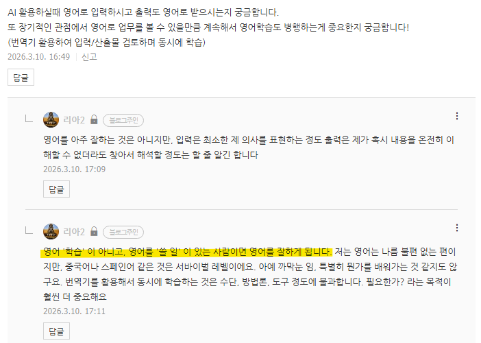](#)

​

1. **'영어'** 라는 포장지를 뜯고,

​

**'언어'** 라는 알맹이 관점에서 보면

일상에 있는 은어도 **일종의 외국어** 임

​

스불재, 분조카, 한글도 **모르면 모릅니다**

​

그 **'문화권'** 안에서 쓰고 있으면

할 수 있는 것이고, 아님 못 합니다

​

영어를 배워야 되는 것이 아니라,

​

**'영어'** 가 더 싸고 저렴하고 효율적이다

라는 **'자각'** 이 되면, 알아서 하게 됨요

​

내가 1년에 차 떼고, 포 떼고

월세로 300 남기는데,

​

세입자가 집에 뭐 고장났다고

수리해달라고 200만원 나가거나

​

이사 나갈 때마다, 청소비로 돈 질질 흘리면

누가 시키지 않아도 슈퍼 마리오가 되듯이요

​

차은우, 장원영이랑 썸을 탄다고 칠게요

​

영어로 밖에 대화를 할 수 없으면

안 익힐, 안 배울 수가 없죠

​

해야 된다고 해서 하면 더 어렵게 배워요

**'학습'** 은 그런 식으로 진행되지 않음

​

지식량이 적은 사람과 많은 사람 중에서

누가 더 쉽게 그 도메인을 다루고 있을까요?

​

**후자** 입니다

​

전자는 **'학습 부담'** 이라고 부르고,

후자는 **'몰라도 되는데 알면 좋지'** 라고 함

​

방정식만 아는 사람보다, 함수까지 아는 사람이

방정식에 대한 이해가 더 **높을 수 밖에** 없는데

​

전자는 학습량이 많을수록 더 어렵다고 느껴서,

덜 하고, 덜 쓰고, 엣지에 머무를 수 없게 됩니다

​

**'영어'** 를 잘 해야 되는 것이 아니에요

필요를 인지하고, 그 쓸모를 **느껴야** 됨

​

그래야 **이거 시험에 나와요?**

**이거 배워서 어디에 써요?**

**​**

같은 질문을 할 일이 없어짐

​

대개, 가장 좋은 동기는

**'아름다움'** 을 보는 것임

​

[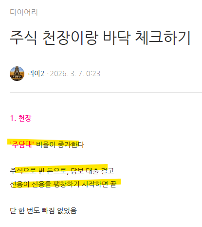](#)

​

2. 주담대 비율 늘어나면 천장이다

​

[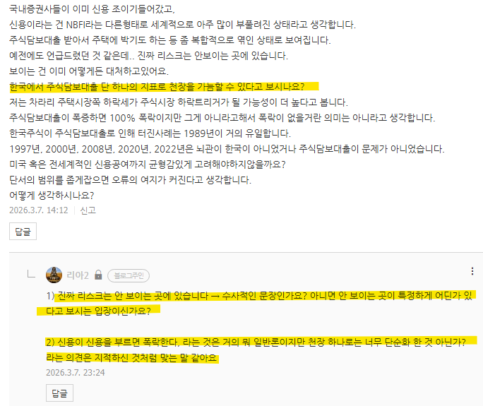](#)

**​**

**1) 지나친 단순화다**

​

→ 동의

​

신용이 신용을 부르면 폭락한다,

라는 것은 실상 명제에 가까우나

​

주담대 비율 하나만으로 한정한 것은

내가 빠르게 일반화한 것이 맞음

​

[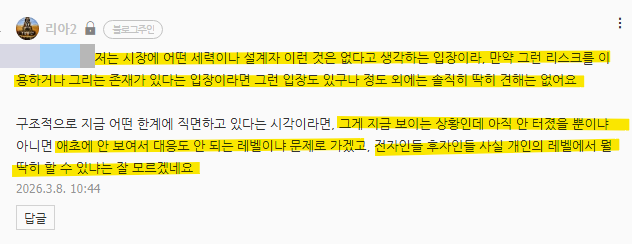](#)

​

2-1) 진짜 리스크는 보이지 않는 곳에 있다

​

**\* 나심 탈레브 인용으로 추정**

​

**→ 비동의**

​

2-2) 보이지 않을 뿐이지, 리스크가 있다

그게 뭔지 찾아내야 된다

​

2-3) 어차피 보이지 않으니 대응할 수 없다

​

문장에 주어진 논리적인 조건이

**'보이지 않는 곳에 진짜 리스크'** 가 있다

​

그럼 보이면 리스크가 아닌 것이고,

리스크 자체가 **보이지 않는다는** 전제라

​

실익이 없다는 결론 밖에 안 나옴

​

[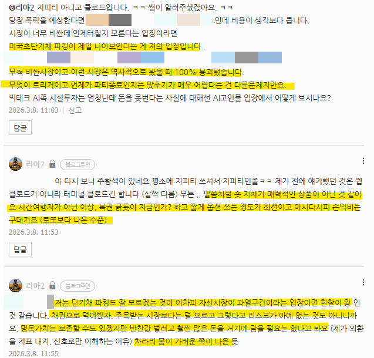](#)

​

3) 미국 초단기채 파킹이 지금 제일 좋다

​

이유는, 현재 시장이 과열된 상태다

타이밍은 어렵지만 **방향성만** 놓고 본다면

지속되기 어렵다고 보는 것이 정배다

​

→ 타이밍을 잡기 어렵다

→ 옵션 사봤자 복권 긁기 밖에 안 됨

​

선물로 숏을 계속 끌고 간다면?

성공하면 대박인데 목숨 걸어야 됨

​

그리고 그렇게 딴들, **차피 결국 죽음**

​

**또한, 단기채 파킹이**

**왜 매력적인지 이해 어렵다**

​

→ 자산시장이 과열 구간이다

→ 그럼 언제인진 모르는데, 아무튼

방향은 나중에는 꺾일 것이라 보는 입장

​

→ 그럼 꺾일 때 잡으면 되는데?

→ 꺾일 때 잡았다고, 그 꺾인 것이

다시 버블이 끼느냐는 다른 문제

​

→ 그러므로 새 시대의 새 파도를

준비하는 것이 가장 좋은 선택지

​

→ 채권으로 먹어봤자, 자산 특성상

위험자산보다 상방이 닫혀있고

​

**'수익성'** 측면에선 이도저도 아닌 자산

유동성을 보존해서 기회를 봄이 더 낫다

​

**3. 내용이 복잡하니까 중간 정리!**

​

리아2 = 주담대 비율 올라가면 천장이다

신용이 신용을 부르면 시장은 필시 터진다

​

게스트 = 주담대 만으로 단순화 할 수 없다

리아2 = 동의한다, 내가 일반화 했다

​

**→ 논점 끝**

​

게스트 = 측정 가능한 리스크는

가격에 반영된 상태다

​

그러므로 여기는 이미 알파 최적화

그래서 보이지 않는 리스크가 **중요**

​

리아2 = 보이지 않는 리스크는

**'수사적인 레토릭'** 에 불과하다

​

​

1) 보이면 리스크가 아닌 것이고

​

**\* 측정 가능한 리스크니까 노알파**

​

2) 안 보이면 애초에

안 보이는데 어떻게 대응?

​

보이지 않는 리스크가 있다는 것은

흥미롭게 탐구할 수 있는 주제지만,

**​**

**근본적으로 딱 거기까지 밖에 안 된다**

​

**→ (내 생각에는) 논점 끝**

**​**

[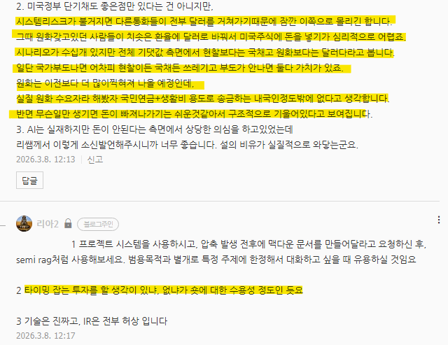](#)

**​**

**4. 전환**

​

게스트 = 미단기채가 옵티멀이다

​

근거는 다음과 같다

​

1) 시스템 리스크가 불거지면,

다른 통화들이 달러를 거쳐간다

그 과정에서 수요가 증가 한다

​

**→ 거의 팩트**

​

2) 원화를 갖고 있던 사람들은

환율이 치솟은 상태이기 때문에

뒤늦게 달러로 바꿔서 미국 주식에

돈을 넣기가 심리적으로 위축된다

​

→ 시스템 리스크 발생

→ 환율 폭등

​

→ 뒤늦게 달러가 매력적인

자산의 지위를 얻지만 지각비를

내고 들어갈 엄두를 내기 어렵다

​

**→ 타당한 논리구조**

**​**

3) 기대값 측면에서 현찰보다는

국채고, 원화보다는 달러다

​

→ 현찰은 가만히 놔두면 인플레

근데 국채는 **현찰보다는 보존이 가능**

**​**

→ 시스템 리스크가 불거지면,

달러의 위상이 높아지므로

원화보다는 달러가 더 가치있다

**​**

**\* 수요처는 편향적인 의견일 수 있는데,**

**​**

**전체적인 맥락에서는 원화 자산이**

**빠져나가기 좋은 자산이란 주장이므로**

**주장의 고리가 헐겁다고 볼 수는 없음**

​

**→ 마찬가지로 타당한 논리**

​

리아2 = 타이밍 잡는 투자에 대해서

내가 수용성이 높냐, 낮냐 문제 같다

​

결국 그 전제 조건은, **'숏'** 이란 의미다

​

[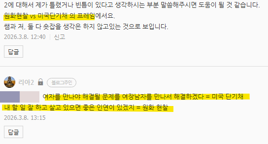](#)

​

**5. 원화 보유 vs 미국 단기채 프레임**

​

[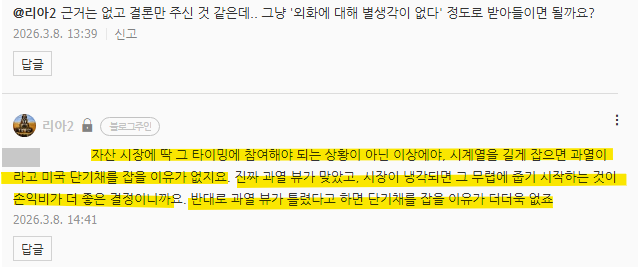](#)

​

리아2 = 시나리오 접근을 해보자

​

**시나리오 1)**

**진짜 과열뷰가 맞았다**

**​**

즉, 버블이 터지는 때가 왔다

​

그럼 채권(대안)을 살 것이 아니라

그냥 가격 빠진 주식을 사면 된다

​

**시나리오 2)**

**진짜 과열뷰가 틀렸다**

​

즉, 버블이 아니라 혁신이었다

​

그럼 뒤늦게라도 주식을 사야 맞고,

채권을 사봤자 도움이 안 된다

​

[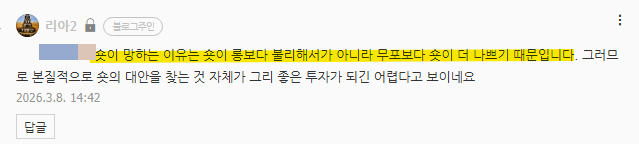](#)

​

롱 vs 숏이 아니라,

​

무포 ↔ 포

포 = (롱, 숏) 인데,

​

**미단기채 투자는 저 분류에서**

**숏포를 잡는 것과 구조가 같다**

​

그래서 숏을 잡을 생각이 없는데,

​

미단기채를 산다는 것은

투자 아이디어와 행동이

불일치 한다고 봐야 합당하다

​

**6. 반박**

​

[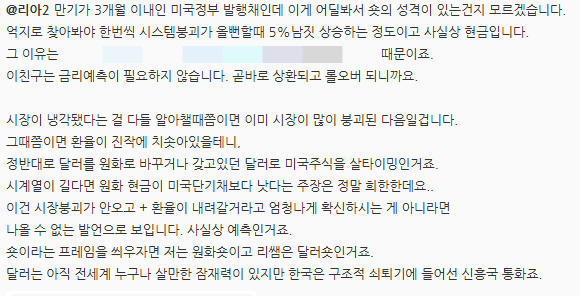](#)

​

**게스트 = 미단기채가 옵티멀이다**

​

근거1)

​

미단기채는 **'안전자산'** 이다

일단 손해가 없는데 왜 숏?

​

**\* 망하지가 않는데?**

**즉, 현찰의 상위호환이다**

**​**

근거2)

​

시장이 냉각되었다는 것을

참여자들이 인식한 시점은

시장이 붕괴된 시점이기 때문에,

​

기존에 미단기채를 투자한 사람들은

수월하게 대응할 수 있지만,

​

[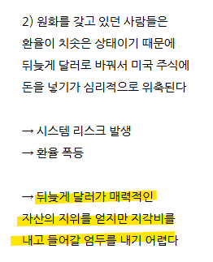](#)

​

원화 자산만 들고 있는 경우에는

위에 말했던 대로, 대응이 안 된다

​

근거3)

​

시계열이 길다면, 원화 현금이

미단기채보다 낫다는 것은

​

단기채 투자가 현찰의 상위호환이라는 것을

인정하지 않으니까 할 수 있는 말이다

​

현찰이 단기채의 상위호환이라고 보는 시각은,

시장이 앞으로도 계속 상승해서

​

**'상승장 안에서의 투자기회'** 가 있거나,

**환율 자체가 내려간다고** 강하게

확신해야 할 수 있는 판단이다

​

**→ 구성된 논리 자체만 보면 맞는 말**

​

[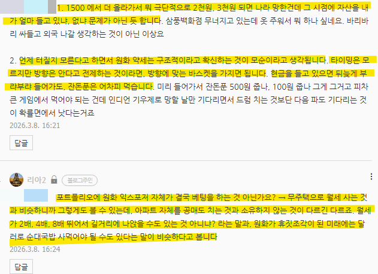](#)

​

**7. 재반박**

​

1) 그렇게 보면, 마찬가지로

환율이 내려가면 미단기채 투자해서

얻는 이자로 **'달러'** 는 남아도,

​

**'원화'** 로 바꿀 때 손실이 생기니까

나중에 원화로 바꿀 때 손해가 발생

​

달러가 역대급 고점이었어서,

롤오버 아무리 해도 안 돌아오면?

​

그 달러는 꽤 오래 원화로 못 바꾸게 됨

​

**즉, 원화 자체의 벨류가**

**낮아져야 전제가 맞는 투자**

​

2) 대화에서 서로가 **'숏'** 잡을 이유는

없다, 를 동의하고 있는 상황인데

​

그럼에도 **'과열된 시장'** 이다

라는 점에도 동의하고 있는 상황임

​

즉, 둘 다 **'방향'** 은 알겠지만

**'타이밍'** 을 모른다는 전제인데

​

단기채 투자가 **'타이밍'** 투자 임

​

**조만간 터진다는 전제지,**

**만약 방향 안 맞으면 어찌됨?**

​

**무한 롤오버 잡다가**

**달러 쥐고 살아야 됨**

​

3) 현찰 들고 있으면?

​

**'다 끝난 다음에 패잔병 처리'** 만 해도

롤오버 안 잡아도, **국채 이자 쯤은 먹음**

​

**즉, 리턴은 거의 유사한데**

**리스크가 더 높은데 그걸 왜?**

​

게스트 = 단기채가 숏이라는 프레임이면,

포폴에 원화 자산만 들고 있는 것도

달러 숏을 잡고 있는 것과 같은 것 아닌가?

​

리아2 = 지금 원/달이 1500원인데

여기서 극단적으로 더 올라간다고 치자

​

**나라 망했는데, 투자를 해서 뭐함?**

​

달러를 벌어다가 원화로 바꿔온다 쳐도,

기본 생활물가 자체로 생활이 안 될건데?

​

**8. 중간 정리**

​

상호 동의 = 시장 과열 상태다

이게 아마 지속되진 않을 것이다

​

즉, 방향은 아무튼 내려간다 쪽인데

그게 그래서 언제일 것이다는 모른다

​

1) 주장

​

**게스트** = 그러니까, 미단기채를 잡고

원화 자산 헷징을 걸어놓고 판단해야 함

​

**리아2** = 그러니까, 현찰 들고 판단해야 됨

​

2) 근거

​

게스트 = 미단기채 홀딩 잡으면

달러 이자 먹으면서 버티면 된다

​

그럼 **손해 보지 않는 투자** 다

​

→ 운용 중심 관점

​

리아2 = 미단기채 홀딩 잡으면

원화 자산의 일부가 달러로 종속,

​

손해보지 않는 투자가 아니구,

**기회비용을 지불하는 헷징** 이다

​

→ 유동성 중심 관점

​

**3) 핵심 주장**

​

게스트 = 시장이 붕괴함?

​

**달러가 주목받는 자산이 됨**

**원화가 휴지 쓰레기가 됨**

​

리아2 = 시장이 붕괴함?

​

**원화가 휴지 쓰레기가 되면**

**일상이 박살났는데 뭔 의미?**

​

4) 대응 방식

​

게스트 = 원화가 크게 꺾이면

달러 자산으로 원화 자산 사면 됨

​

리아2 = 원화가 크게 꺾이면

들고 있던 현찰로 자산 사면 됨

​

[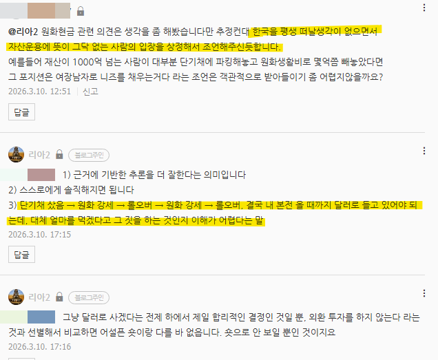](#)

​

**9. 정리**

​

게스트 = 계속 한국에 살 생각이고,

자산 운용에 뜻이 없으면 그럴 수 있네

​

리아2 = 계속 한국에 살 생각은 동의,

근데 현찰 전략이 더 옵티멀

​

미단기채로 5% 먹었다고 치겠음,

원화가 5%만 올라가도 손해인데?

​

**\* 결국 본질은 환차익/손**

**​**

달러 자산으로 10억, 100억 있어봤자

결국 **'원화'** 로 바꿔야 돈을 쓸 수 있는데?

​

**10. 차이**

​

게스트 = 통화 리스크 감수

→ 대신 시장 타이밍 대응

​

**\* 이게 더 이익이다**

​

**이게 위기를 대응하는 옵티멀이다**

​

리아2 = 통화 리스크 회피

→ 대신 기회비용 감수

​

**\* 기회는 언제든지,**

**어디서든지 있다**

**​**

**이게 기회를 포착하는 옵티멀이다**